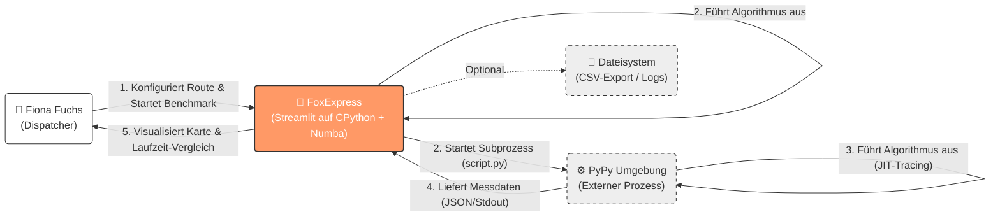
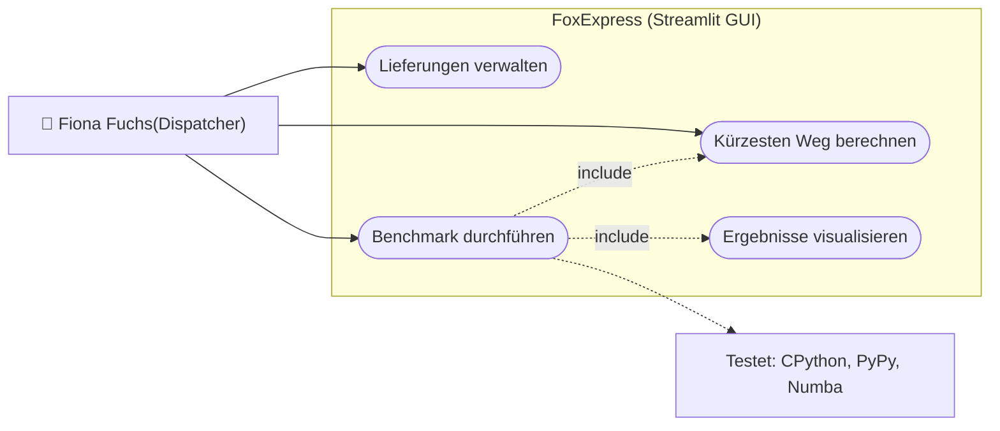
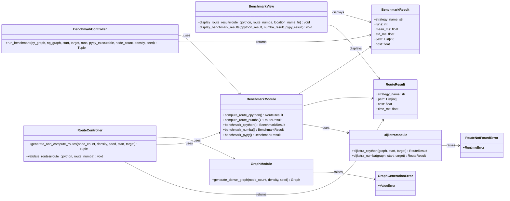
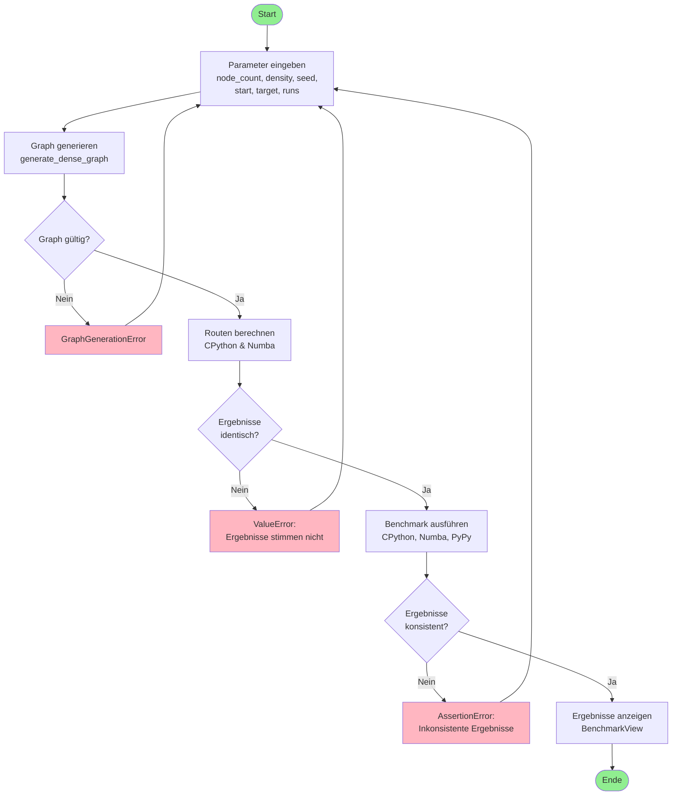
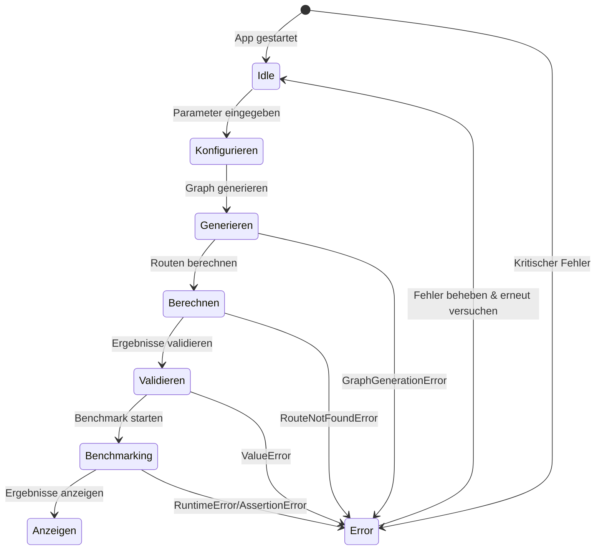
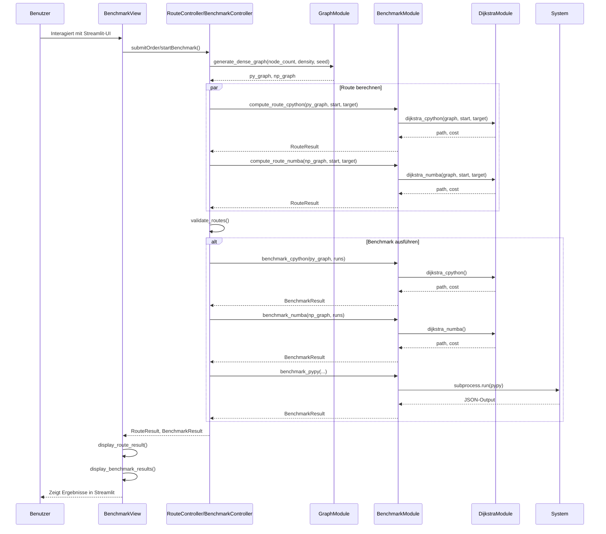

### DLBDSIPWP01 - Einführung in die Programmierung mit Python (Projekt)

---

# Project Abschlussbericht: Fox Express

## 1. Einleitung und Vision

### 1.1 Projektvision und Ziele

FoxExpress ist eine vereinfachte Logistik-Software, die für die fiktive Auftraggeberin „Fiona Fuchs“ entwickelt wird.
Als Dispatcherin eines Wald-Kurierdienstes plant sie Lieferungen zwischen den Bauen der Waldtiere und ist auf effiziente Routenoptimierung angewiesen.
Das Wegenetz des Waldes wird dabei als Graph abstrahiert, in dem unterschiedliche Weglängen und Gefahrenzonen (z. B. Wolfsgebiet-Passagen) berücksichtigt werden können.

### 1.2 Wissenschaftliche Herausforderung / Python-Spezifischer Aspekt

Dynamisch typisierte und interpretierte Sprachen wie CPython bieten eine hohe Entwicklerproduktivität, weisen jedoch bei rechenintensiven algorithmischen Workloads messbare Performance-Nachteile auf. In der Literatur werden insbesondere wiederholte Boxing- und Unboxing-Operationen sowie dynamische Funktionsauflösung (Late Binding) als relevante Quellen interpretativen Overheads beschrieben (Barany, 2014; Tuominen, 2025).

Darüber hinaus führen mehrstufige Indirektionen beim Zugriff auf Python-Objekte zu zusätzlichem Laufzeitaufwand, insbesondere bei schleifenbasierten numerischen Operationen (Lam, Pitrou, & Seibert, 2015). Diese Eigenschaften sind insbesondere bei graphbasierten Algorithmen wie Dijkstra relevant, da sie stark iterativ geprägt sind.

Zur Reduktion dieses Overheads kommen Just-in-Time-Kompilierungsstrategien (JIT) zum Einsatz. JIT-Kompilierung bezeichnet die Übersetzung von Code zur Laufzeit in maschinennahen Code, wodurch interpretative Zwischenschritte reduziert werden können (Genchev et al., 2025).

In diesem Projekt werden zwei unterschiedliche JIT-Ansätze untersucht:

Tracing-basierte JIT-Kompilierung (PyPy):
Häufig ausgeführte Codepfade („Hot Paths“) werden während der Laufzeit identifiziert und optimiert.

Methodenbasierte JIT-Kompilierung (Numba):
Einzelne annotierte Funktionen werden mittels LLVM in optimierten Maschinencode übersetzt (Lam et al., 2015).

Ziel ist es, die Effizienz dieser beiden Strategien im Kontext algorithmischer Workloads systematisch zu vergleichen.

### 1.3 Arbeitshypothese

Numba ist etwa 25x und PyPy etwa 4x schneller als CPython beim Dijkstra Algorithmus.

---

## 2. Requirements Engineering

### 2.1 Kontextdiagramm

### 2.2 Funktionale Anforderungen als Katalog

| ID | Priorität | Status | Anforderung (Titel & Beschreibung) | Abnahmekriterien (Akzeptanztest) |
| :--- | :--- | :--- | :--- | :--- |
| **F-01** | 🟥 Must | [x] | **Kürzesten Weg berechnen (Dijkstra)** Das System muss den kürzesten Pfad und die Gesamtkosten zwischen zwei gewählten Knoten berechnen. | 1. Eingabe von Start- und Zielknoten ist möglich. 2. Algorithmus gibt die korrekte Sequenz der Knoten und die Gesamtdistanz zurück. 3. Ergebnis stimmt mit Referenzwert überein. |
| **F-02** | 🟥 Must | [x] | **Benchmark-Funktion (Multi-Environment)** Das System führt identische Routenberechnungen unter CPython, PyPy und Numba aus. | 1. Der Prozess startet und läuft auf allen drei Umgebungen fehlerfrei durch. 2. PyPy wird (da extern) erfolgreich über einen Subprozess angesprochen. 3. Numba nutzt den @jit(nopython=True) Modus. |
| **F-03** | 🟥 Must | [x] | **Zeitmessung & Vergleich** Die Ausführungszeiten müssen gemessen, gespeichert und vergleichend dargestellt werden. | 1. Messung erfolgt präzise (z. B. mittels timeit). 2. Ein Balkendiagramm zeigt alle drei Werte (CPython, Numba, PyPy) nebeneinander. 3. Die schnellste Variante ist optisch erkennbar. |
| **F-04** | 🟧 Should | [] | **Lieferungen verwalten** Benutzer können Lieferaufträge mit Start- und Zielknoten anlegen und bearbeiten. | 1. Über ein Formular kann eine neue Lieferung erstellt werden. 2. Die Lieferung erscheint in einer Listenansicht/Tabelle in der GUI. |
| **F-05** | 🟧 Should | [] | **Auswahl der Ausführungsumgebung** Benutzer sollen auswählen können, ob ein Benchmark unter CPython, PyPy oder Numba ausgeführt wird. | 1. Checkboxen oder Dropdown ermöglichen die Auswahl (z. B. „Nur CPython vs. Numba“). 2. Der Benchmark führt nur die ausgewählten Umgebungen aus. |
| **F-06** | 🟨 Could | [] | **Paketstatus-Tracking** Verwaltung von Status wie Eingegangen, Unterwegs, Zugestellt. | 1. Der Status einer Lieferung kann in der GUI geändert werden. 2. Der aktuelle Status wird visuell angezeigt (z. B. durch Farben). |
| **F-07** | 🟨 Could | [] | **Express-Zuschläge berechnen** Berechnung zusätzlicher Kosten abhängig von der Gefährlichkeit der Route. | 1. Kanten im Graphen besitzen ein Attribut (z. B. danger_level). 2. Der Endpreis ist bei gefährlichen Routen höher als bei sicheren (Formel-Check). |
| **F-08** | 🟨 Could | [] | **Empfänger-Präferenzen speichern** Speicherung, ob Pakete versteckt oder persönlich übergeben werden sollen. | 1. Ein Datenfeld „Zustellart“ wird pro Lieferung gespeichert. 2. Die Information wird in der Lieferübersicht angezeigt. |
| **F-09** | 🟨 Could | [] | **Interaktive Graph-Eingabe** Benutzer können eigene Graphen definieren. | 1. Benutzer kann Knoten/Kanten hinzufügen (z. B. per Text-Input oder Klick). 2. Der Dijkstra-Algorithmus funktioniert auf dem neu erstellten Graphen korrekt. |
| **F-10** | 🟨 Could | [] | **Export der Ergebnisse** Export der Benchmark-Ergebnisse als Datei (z. B. CSV). | 1. Ein Button „Download CSV“ ist verfügbar. 2. Die Datei enthält die korrekten Messwerte und Spaltenüberschriften. |

### 2.3 Nicht-funktionale Anforderungen (Qualitätsanforderungen)

| ID | Kategorie | Anforderung | Abnahmekriterien |
| :--- | :--- | :--- | :--- |
| **NFA-01** | Performance | **Reaktivität der GUI** | Die Streamlit-Oberfläche friert während der Benchmark-Berechnung nicht dauerhaft ein (Nutzer erhält visuelles Feedback, z. B. Ladebalken). |
| **NFA-02** | Interoperabilität | **PyPy Integration** | Die Hauptanwendung (CPython) kann erfolgreich einen externen Subprozess für PyPy starten und dessen Rückgabewert lesen. |
| **NFA-03** | Usability | **Verständlichkeit** | Die Ergebnisse (Diagramme) sind klar beschriftet (Achsen, Einheiten in ms/s), sodass sie ohne Erklärung verständlich sind. |
| **NFA-04** | Reproduzierbarkeit | **Reproduzierbarkeit** | Gleiche Eingaben sollen zu vergleichbaren Messergebnissen führen. |

### 2.4 Use-Case Modellierung

---

## 3. Architektur und Tech-Stack

### 3.1 Auswahl der Plattform (Begründung)

Streamlit wurde gewählt, weil es mit wenigen Zeilen Python eine moderne Weboberfläche mit interaktiven Widgets und Visualisierungen ermöglicht – deutlich schneller als klassische GUIs wie Tkinter oder PyQt. Ein Jupyter Notebook wäre ungeeignet, da Benutzer den Code manuell ausführen müssten und keine professionelle App entsteht.

### 3.2 Modularer Kern und Open-Closed Principle

Die Geschäftslogik der Anwendung ist vollständig von der Benutzeroberfläche getrennt und folgt einem MVC-ähnlichen Schichtenmodell. Die Models-Schicht enthält die reinen Algorithmen wie Dijkstra-Implementierungen und Graph-Generierung – losgelöst von jeglicher UI-Technologie, lediglich auf numpy und Standard-Python basierend. Die Controller-Schicht orchestriert die Models und gibt ausschließlich reine Python-Datentypen zurück, während die Views-Schicht für die Streamlit-Darstellung verantwortlich ist. Entscheidend ist dabei die eine Richtung der Abhängigkeiten: Views importieren Models, aber Models kennen keine Views, wodurch die Geschäftslogik jederzeit ohne Änderungen an der UI wiederverwendet oder getestet werden kann.

### 3.3 Technologie-Stack

Zur Umsetzung der Anforderungen wurden folgende technische Entscheidungen getroffen:

### NumPy

NumPy dient als primäre Datenstruktur für die interne Repräsentation des Graphen.

**Begründung:**  
Numba fokussiert sich auf ein Python-Subset, das stark auf `ndarray`-Strukturen und numerischen Skalaren basiert (Lam et al., 2015). Durch die homogene Speicherstruktur von NumPy-Arrays kann Numba direkten Zugriff auf Datenpuffer ermöglichen und Indirektionskosten reduzieren. Standard-Python-Listen bieten diese Eigenschaften nicht.

---

### Numba (JIT)

Numba wird zur methodenbasierten Beschleunigung des Routing-Algorithmus eingesetzt.

**Begründung:**  
Numba analysiert CPython-Bytecode, führt Typinferenz durch und generiert daraus LLVM Intermediate Representation (LLVM IR), die anschließend in Maschinencode übersetzt wird (Lam et al., 2015). Im sogenannten „nopython mode“ erfolgt die Ausführung ohne Rückgriff auf die Python C-API, wodurch interpretativer Overhead reduziert werden kann.

---

### PyPy

PyPy wird als tracingbasierter JIT-Interpreter verwendet.

**Begründung:**  
Tracing-basierte JIT-Systeme identifizieren zur Laufzeit häufig ausgeführte Codepfade und optimieren diese dynamisch. Dieser Ansatz unterscheidet sich grundlegend von der funktionsbasierten Kompilierung durch Numba und erlaubt einen konzeptionell unterschiedlichen Optimierungsansatz.

---

### Subprocess (Standardbibliothek)

Der Vergleich mit PyPy erfolgt durch den Start eines separaten Interpreterprozesses.

**Begründung:**  
Die Prozessisolierung stellt sicher, dass jede Laufzeitumgebung unabhängig initialisiert wird. Dadurch wird eine konsistente Vergleichsbasis geschaffen und unbeabsichtigte Interferenzen zwischen den Laufzeitumgebungen vermieden.

---

### Pandas

Zur Visualisierung der Benchmark-Ergebnisse werden integrierte Diagrammwerkzeuge verwendet.

**Begründung:**  
Pandas ermöglicht eine hinreichend präzise Darstellung der Messergebnisse bei gleichzeitig reduzierter technischer Komplexität.

### 3.4 Logging und Fehlerbehandlung

Das Error Handling ist an drei zentralen Stellen implementiert und folgt dem Prinzip, Fehler früh und verständlich abzufangen. In der Graph-Generierung wird ein spezifischer GraphGenerationError geworfen, wenn ungültige Parameter wie eine zu niedrige Knotenanzahl, eine falsche Dichte oder ein ungültiger Gewichtsbereich übergeben werden. Dies verhindert, dass teure Berechnungen mit fehlerhaften Konfigurationen gestartet werden. Die Dijkstra-Algorithmen werfen einen RouteNotFoundError, falls kein Pfad zwischen Start und Ziel existiert, sowie ValueError bei ungültigen Knotenindizes oder nicht-quadratischen Matrizen. Im Benchmarking-Bereich wird ein RuntimeError ausgelöst, wenn der externe PyPy-Prozess fehlschlägt, und ein AssertionError stellt sicher, dass die Ergebnisse zwischen CPython, Numba und PyPy konsistent sind. Die Entscheidung für domänenspezifische Fehlerklassen wie RouteNotFoundError und GraphGenerationError statt generischer Python-Fehler ermöglicht der View-Schicht eine gezielte und benutzerfreundliche Fehlerbehandlung.

---

## 4. Design und Modellierung (Die "Story")

### 4.1 Domänenmodell und UML-Klassendiagramm

### 4.2 Verhaltensdiagramme: Activity- & State-Diagram

Aktivitätsdiagramm:

Zustandsdiagramm:

### 4.3 Interaktionsdiagramm: Sequence-Diagram

### 4.4 Design Patterns und Prinzipien

Das Projekt implementiert das MVC-Pattern mit einer klaren Trennung zwischen Models für die Geschäftslogik in Dateien wie dijkstra.py, graph.py und benchmark.py, Views für die Präsentation in benchmark_view.py sowie Controllers in route_controller.py zur Orchestrierung. Bezüglich der SOLID-Prinzipien wird Single Responsibility erfüllt, da jede Datei eine klare, eigene Aufgabe hat, und Dependency Inversion wird beachtet, da Controller von konkreten Implementierungen abstrahiert werden. Das KISS-Prinzip ist durch den bewusst einfachen Code ohne unnötige Komplexität umgesetzt. Das DRY-Prinzip ist teilweise erfüllt, da die Route-Rekonstruktion nur einmalig in dijkstra.py vorkommt, jedoch weisen die Benchmark-Funktionen eine ähnliche Struktur auf. Das ürsprünglich geplante State Pattern wurde nicht umgesetzt.

---

## 5. Wissenschaftliche Problemstellung (Jupyter Notebook)

### 5.1 Methodik der Untersuchung

Der zu testende Algorithmus ist der Dijkstra-Algorithmus in seiner klassischen O(n²)-Implementierung ohne Priority Queue, der auf einem zufällig generierten Graphen ausgeführt wird. Die Graph-Generierung erfolgt deterministisch über einen Seed, sodass alle Runtimes mit exakt denselben Eingabedaten arbeiten. Die Parameter umfassen die Knotenanzahl, die Dichte des Graphen und den Start- sowie Zielknoten.  
Die erste Runtime ist CPython, die Standard-Python-Implementierung ohne Optimierungen. Die zweite Runtime ist Numba mit JIT-Kompilierung, die den Algorithmus in nativen Maschinencode übersetzt. Die dritte Runtime ist PyPy, eine alternative Python-Implementierung mit eigenem JIT-Compiler.  
Der Benchmark misst für jede Runtime die durchschnittliche Ausführungszeit über mehrere Durchläufe sowie die Standardabweichung. Zusätzlich wird verifiziert, dass alle drei Implementierungen exakt denselben Pfad und dieselben Kosten berechnen, um die Korrektheit zu gewährleisten.  
Die Ergebnisse werden über eine Streamlit-Weboberfläche visualisiert, die einen direkten Vergleich der Laufzeiten in Form von Tabellen und Balkendiagrammen ermöglicht.

### 5.2 Analyse und Demonstration

siehe Screenshot [Benchmark Ergebnisse](BenchmarkErgebnisseFoxExpress.png)

Wie man dem Screenshot entnehmen kann, ist die Hypothese, welche zu beginn aufgestellt wurde deutich bestätigt, da Numba und PyPy bei der Berechnung des küzesten Pfades deutlich schneller sind als der Standard CPython Interpreter.

---

## 6. Implementierung und Qualitätssicherung

### 6.1 Code-Struktur und Dokumentation

foxexpress_project/  
├── app.py                          # Streamlit Einstiegspunkt  
├── pypy_benchmark.py              # Externes PyPy-Benchmark-Skript  
├── pyproject.toml                  # Projekt-Konfiguration  
├── requirements.txt                # Abhängigkeiten  
├── README.md                       # Dokumentation  
│  
├── src/foxexpress/  
│   ├── __init__.py  
│   │  
│   ├── models/                    # Geschäftslogik (MVC: Model)  
│   │   ├── data_types.py          # RouteResult, BenchmarkResult  
│   │   ├── dijkstra.py            # Algorithmen (CPython, Numba)  
│   │   ├── graph.py                # Graph-Generierung  
│   │   └── benchmark.py           # Benchmarking-Logik  
│   │  
│   ├── controllers/               # Orchestrierung (MVC: Controller)  
│   │   └── route_controller.py    # Route & Benchmark Controller  
│   │  
│   └── views/                     # Präsentation (MVC: View)  
│       └── benchmark_view.py       # Streamlit UI  
│  
└── tests/  
    ├── conftest.py                # Pytest Fixtures  
    └── test_routing.py            # Unit Tests  
    
Begründung: siehe 3.2

### 6.2 Test-Konzept: Unit-Tests

Der Test test_small_graph_shortest_path überprüft die Kernfunktionalität des Dijkstra-Algorithmus anhand eines einfachen Graphen mit vier Knoten. Der Test bestätigt, dass der kürzeste Pfad von Knoten 0 zu Knoten 3 über die Knoten 1 und 2 verläuft und die Gesamtkosten genau 4,0 betragen. Dies stellt sicher, dass der Algorithmus grundlegend korrekt arbeitet.

Der Test test_numba_matches_cpython validiert die Konsistenz zwischen der CPython- und der Numba-Implementierung, indem er beide auf einem zufällig generierten Graphen ausführt und die Ergebnisse vergleicht. Da beide Implementierungen dieselbe Logik verfolgen, müssen Pfad und Kosten exakt übereinstimmen – ein Fehler in einer der beiden Implementierungen würde sofort auffallen.

Der Test test_graph_has_path_between_all_nodes stellt sicher, dass die Graph-Generierung einen zusammenhängenden Graphen erzeugt, in dem alle Knoten erreichbar sind. Der Test iteriert über alle Knotenpaare und verifiziert, dass der Dijkstra-Algorithmus für jedes Paar einen gültigen Pfad mit endlichen Kosten findet. Dies ist essenziell, da ein nicht-zusammenhängender Graph die Benchmark-Ergebnisse verfälschen würde.

### 6.3 Integration-Tests und Traceability

Es wurden keine Integrationstests implementiert.

### 6.4 CI-Pipeline

Für dieses Projekt bietet sich eine CI/CD-Automatisierung über GitHub Actions an, die bei jedem Commit und Pull Request automatisch die Codequalität sicherstellt und die Tests ausführt. Der typische Workflow würde aus mehreren Stufen bestehen: Zunächst wird die Python-Umgebung eingerichtet, wobei die Abhängigkeiten aus der requirements.txt installiert werden. Anschließend folgen Linting-Prüfungen mit Ruff, um Code-Stil und Syntaxfehler zu erkennen. Der zentrale Schritt ist das Ausführen der Unit Tests mittels pytest, wobei die Konfiguration in der pyproject.toml festgelegt ist. Abschließend könnte bei erfolgreichem Durchlauf ein Deployment auf Streamlit Cloud erfolgen.

---

## 7. Software-Qualität nach [ISO 25010](https://iso25000.com/index.php/en/iso-25000-standards/iso-25010)

Zuverlässigkeit: 9/10  
Das Error Handling ist an drei zentralen Stellen implementiert und nutzt domänenspezifische Ausnahmen wie RouteNotFoundError und GraphGenerationError. Die Unit Tests in test_routing.py decken kritische Pfade ab, darunter Fehlerfälle und Konsistenzprüfungen zwischen CPython und Numba. Die Validierung der Benchmark-Ergebnisse stellt sicher, dass alle drei Runtimes konsistente Ergebnisse liefern.

Wartbarkeit: 7/10  
Die klare MVC-Trennung mit dedizierten Verzeichnissen für Models, Controllers und Views gewährleistet eine gute Wartbarkeit. Die Geschäftslogik ist von der UI entkoppelt, und der Code ist gut lesbar mit aussagekräftigen Namen. Ein Punktabzug erfolgt, da die Modelle als reine Funktionen ohne Kapselung in Klassen strukturiert sind.

Erweiterbarkeit: 6/10  
Die fehlende Abstraktion durch Interfaces erschwert das Hinzufügen neuer Algorithmen oder Runtimes. Um eine weitere Implementierung hinzuzufügen, müssen mehrere Stellen im Code angepasst werden. Das Open/Closed Principle ist nur teilweise erfüllt.

Maßnahmen zur Qualitätsverbesserung:  
Kurzfristig sollten Integrationstests für Controller ergänzt sowie eine CI/CD-Pipeline mit GitHub Actions eingerichtet werden. Mittelfristig wäre die Einführung des Strategy Patterns sinnvoll, um die Erweiterbarkeit zu verbessern.

---

## 8. Projektabschluss und Reflexion

### 8.1 Methodik und Anpassungen

Im Rahmen des Projekts wurde ein phasenorientierter Ansatz verfolgt, der sich in drei zentrale Abschnitte gliedert: Konzeptionsphase, Erarbeitungsphase und Finalisierungsphase.  
In der Konzeptionsphase lag der Fokus zunächst auf dem Verständnis der Aufgabenstellung sowie der Definition der Zielsetzung der Anwendung. Es wurde erarbeitet, welche Funktionalitäten das System bereitstellen soll und welchem Zweck es dient. Darauf aufbauend wurden funktionale und nicht-funktionale Anforderungen definiert und mittels MoSCoW priorisiert. Zusätzlich wurde ein grundlegendes Softwaredesign erstellt, unter anderem in Form eines Use-Case-Diagramms. Außerdem wurden notwendige Ressourcen für die Umsetzung identifiziert, beispielsweise benötigte Bibliotheken und Datenstrukturen.  
In der anschließenden Erarbeitungsphase wurde das Python-Projekt technisch aufgesetzt, inklusive grundlegender Projektstruktur und Dokumentation. Ziel war es, möglichst früh eine minimal lauffähige Anwendung zu entwickeln, um eine Basis für weitere Iterationen zu schaffen. Bereits in dieser Phase wurden erste zentrale Anforderungen umgesetzt, insbesondere die Kernfunktionalität zur Berechnung des kürzesten Pfades sowie grundlegende Benchmark-Strukturen. Parallel dazu wurde die Konzeption weiter dokumentiert, beispielsweise durch Diagramme und Beschreibungen.  
In der Finalisierungsphase erfolgte die gezielte Umsetzung der priorisierten Anforderungen. Dabei lag der Fokus bewusst auf den Must-Anforderungen (F-01 bis F-03), um die Kernfunktionalität des Projekts vollständig und stabil bereitzustellen. Weitere Anforderungen wurden aufgrund von Zeit- und Prioritätsgründen nicht umgesetzt. Zusätzlich wurde die Projektdokumentation vervollständigt, einschließlich README und Beschreibung der implementierten Funktionen.  
Während der Entwicklung waren mehrere Anpassungen erforderlich. Beispielsweise stellte sich heraus, dass die Integration von PyPy nicht direkt innerhalb der Hauptanwendung möglich ist, weshalb eine Lösung über Subprozesse implementiert werden musste. Darüber hinaus wurde die Benchmark-Logik angepasst, um reproduzierbare und vergleichbare Messergebnisse zu erzielen, beispielsweise durch wiederholte Ausführungen.  
Insgesamt zeigte sich, dass die initiale Planung eine gute Orientierung bot, jedoch im Verlauf flexibel angepasst werden musste, insbesondere im Hinblick auf technische Einschränkungen und Priorisierungsentscheidungen.

### 8.2 Selbstreflexion

#### Arbeitsprozess

Der Arbeitsprozess war eine Kombination aus strukturierter Planung und iterativer Umsetzung. Das Requirements Engineering hat insbesondere zu Beginn geholfen, die Zielsetzung klar zu definieren und die wichtigsten Anforderungen zu priorisieren. Durch die Fokussierung auf die Must-Anforderungen konnte sichergestellt werden, dass die Kernfunktionalitäten vollständig umgesetzt wurden.  
Während der Erarbeitungsphase wurde teilweise auch explorativ gearbeitet („Drauflos-Programmieren“), insbesondere bei der Integration von Numba und PyPy. Dies führte dazu, dass einige Ansätze überarbeitet werden mussten, hat aber gleichzeitig das Verständnis für die Technologien verbessert.  
Insgesamt hat die strukturierte Planung bei der Orientierung geholfen, während der experimentelle Ansatz bei technischen Herausforderungen notwendig war. Die Entscheidung, sich auf die Must-Anforderungen zu konzentrieren, erwies sich als sinnvoll, um eine stabile und funktionierende Anwendung zu gewährleisten.

#### Einsatz von KI

Im Rahmen dieses Projekts wurden KI-Tools, insbesondere ChatGPT, unterstützend eingesetzt. Der Einsatz erfolgte dabei gezielt in Situationen, in denen Unklarheiten bei der Umsetzung bestanden oder alternative Lösungsansätze benötigt wurden.  
Konkret wurde die KI genutzt, um Vorschläge für mögliche Code-Strukturen zu erhalten sowie zur Unterstützung bei der Planung einzelner Implementierungsschritte. Die generierten Inhalte dienten dabei ausschließlich als Orientierungshilfe und wurden nicht ungeprüft übernommen.  
Alle durch die KI vorgeschlagenen Lösungen wurden eigenständig analysiert, nachvollzogen und gegebenenfalls angepasst. Ein besonderer Fokus lag darauf, die Funktionsweise der vorgeschlagenen Ansätze vollständig zu verstehen, bevor sie in das Projekt integriert wurden.  
Durch den Einsatz der KI konnten neue Perspektiven auf Problemstellungen gewonnen und alternative Lösungswege kennengelernt werden. Gleichzeitig wurde deutlich, dass die Vorschläge der KI nicht immer optimal oder direkt anwendbar waren, sodass eine kritische Bewertung und eigenständige Weiterentwicklung notwendig blieb.  
Insgesamt diente die KI somit als unterstützendes Werkzeug zur Ideenfindung und Strukturierung, während die eigentliche Umsetzung und Bewertung der Lösungen eigenständig erfolgte.

### 8.3 Nutzungsanweisung (How-to-use)

siehe [README.md](http://github.com/sebastianbichler/IU_2026_EF_LE_BER_VC_Python/blob/g01/src/student_projects/g01/README.md)

### 8.4 Pitch-Video

Erstellen Sie ein kurzes Video (max. 3-5 Minuten), in dem Sie die App vorstellen, die wichtigsten Funktionen
demonstrieren
und die wissenschaftliche Fragestellung sowie die Ergebnisse präsentieren.

Erstellt dazu bspw. einen Screencast mit einem Tool wie OBS Studio, Camtasia oder der System-eigenen Bildschirmaufnahme.

Examples:

- https://dl.acm.org/doi/10.1145/3411764.3445651
- https://dl.acm.org/doi/10.1145/2992154.2992174
- https://dl.acm.org/conference/chi

---

## Literaturverzeichnis

Barany, G. (2014). *Analysis of performance overhead in CPython interpreter*.  

Genchev, E., Rangelov, D., Waanders, K., & Waanders, S. (2025). Utilizing JIT Python runtime and parameter optimization for CPU-based Gaussian Splatting thumbnailer. *Array, 28*, 100611.  

Lam, S. K., Pitrou, A., & Seibert, S. (2015). Numba: A LLVM-based Python JIT compiler. In *Proceedings of the Second Workshop on the LLVM Compiler Infrastructure in HPC* (pp. 1–6). ACM.  

Tuominen, J. (2025). *JIT Compiling CPython with Numba & JAX* (Bachelor’s Thesis). Tampere University.

---

## Anhang

- **[README.md (Inhalt)](http://github.com/sebastianbichler/IU_2026_EF_LE_BER_VC_Python/blob/g01/src/student_projects/g01/README.md):** Setup-Anleitung, Python-Umgebung, Paketliste.

- **Glossar:** Definition der fachlichen Begriffe der "Story".

---
