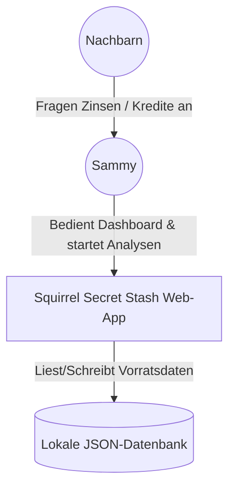
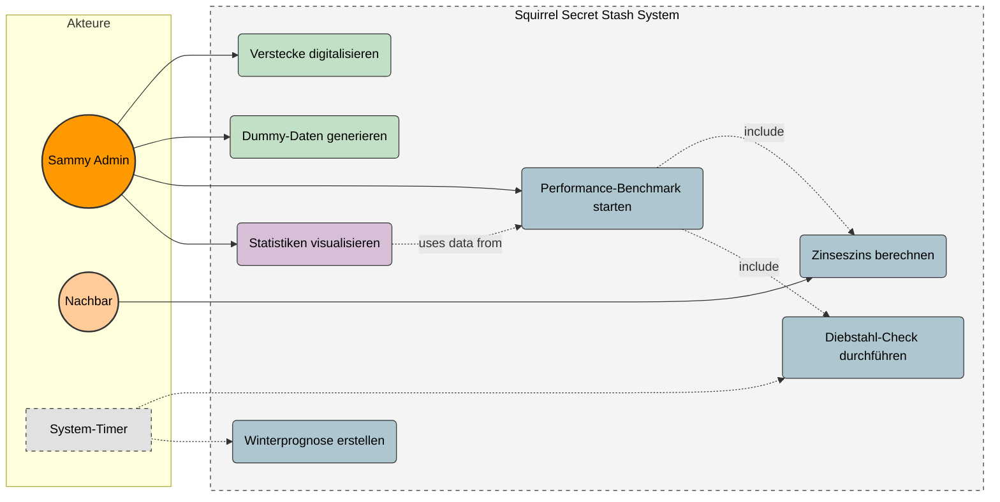
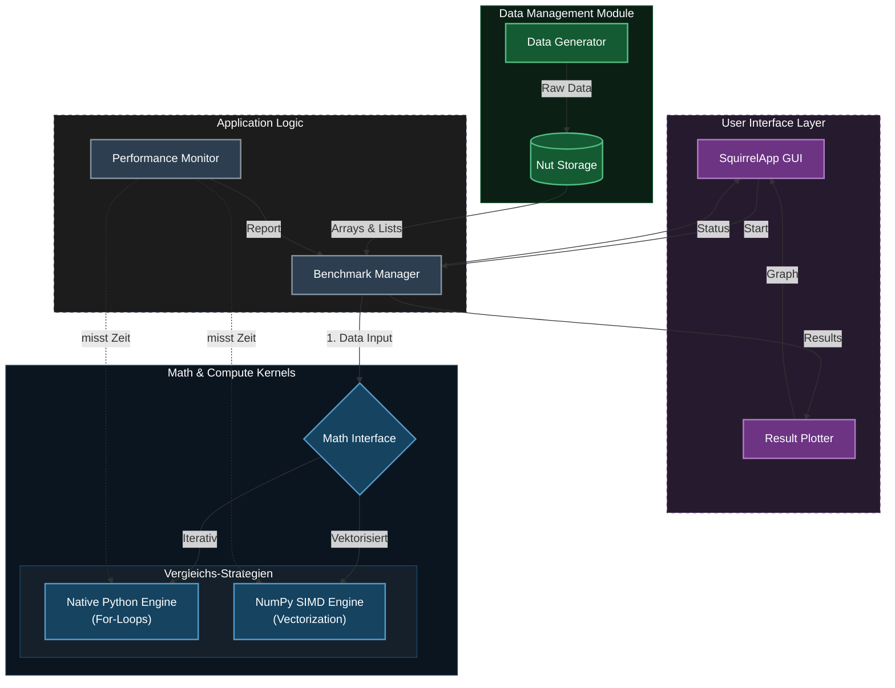
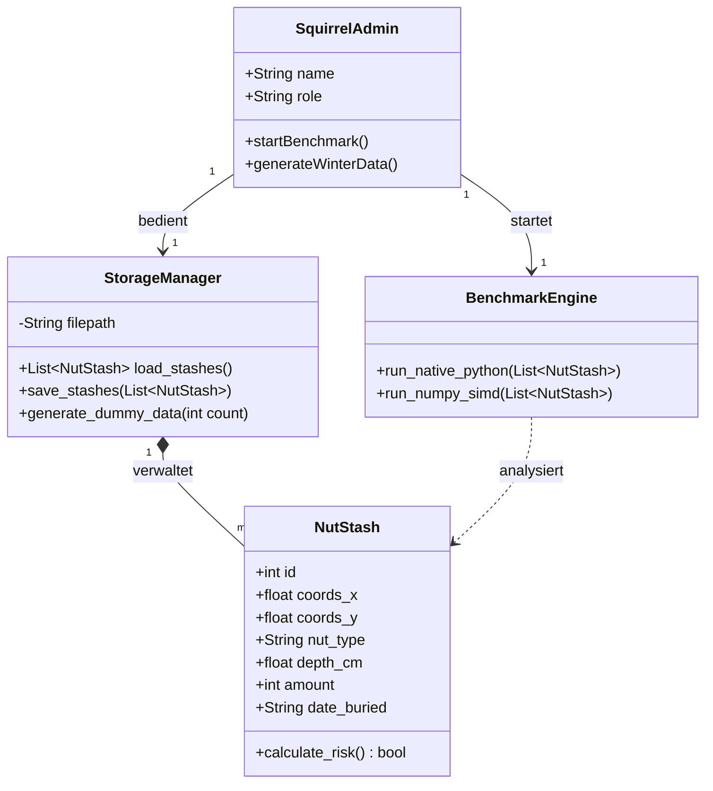
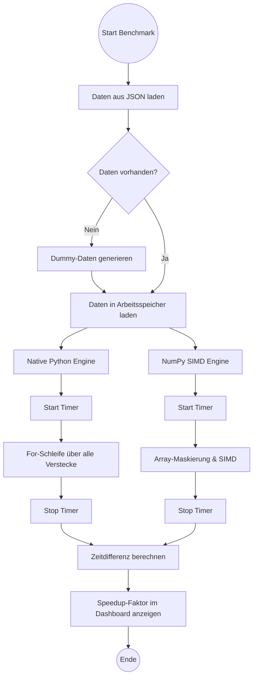
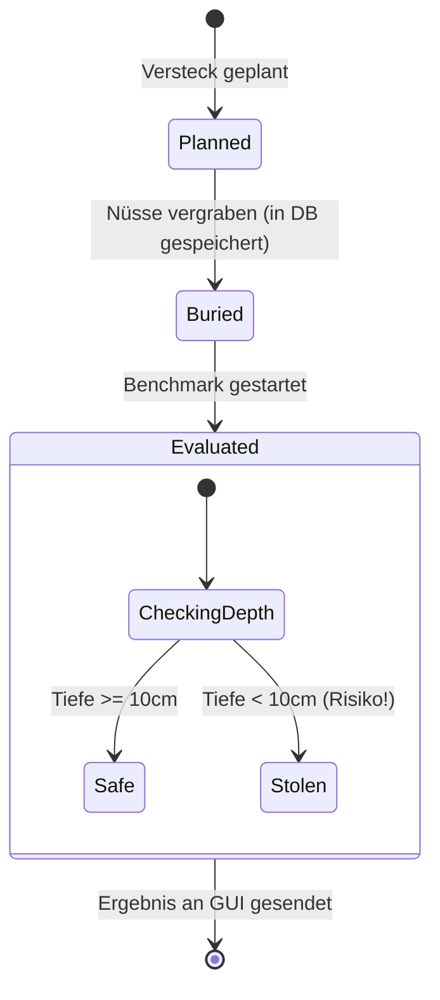
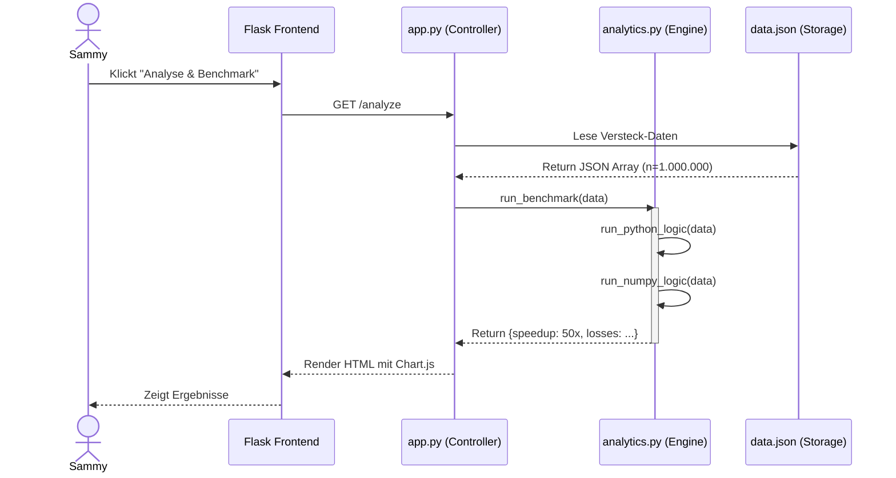
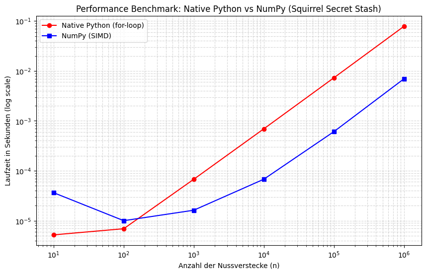

# Project Abschlussbericht: Squirrel Stash

## 1. Einleitung und Vision

### 1.1 Projektvision und Ziele

"Sammy Squirrel" steht vor einer logistischen Herausforderung: Die Verwaltung von tausenden Nussverstecken, Kreditvergaben an Nachbarn und die Überlebensplanung für den Winter übersteigen die Kapazität eines normalen Eichhörnchenhirns. 
Das Ziel des Projekts ist die Entwicklung einer hochperformanten Python-Anwendung, die als "Nuss-Zentralbank" fungiert und dieses Problem löst. Die App soll folgende Kernfunktionen bieten:
* **Verwaltung:** Digitalisierung des Vorratsnetzwerks
* **Analyse:** Berechnung komplexer Szenarien (Zinseszins, Winterprognosen) für Tausende von Datensätzen gleichzeitig
* **Wissenschaftlicher Beweis:** Implementierung eines Benchmarks, der beweist, dass moderne Array-Programmierung herkömmlichen Schleifen bei großen Datenmengen überlegen ist

### 1.2 Wissenschaftliche Herausforderung / Python-Spezifischer Aspekt

Der technische Fokus dieses Projekts liegt auf der Speichereffizienz und Vektorisierung in Python. Das zentrale Experiment ist der Vergleich von skalarer Verarbeitung, also Standard Python-Listen, gegenüber vektorisierter Verarbeitung, hier NumPy-Arrays.
Laut *Harris et al. (2020)* bildet NumPy das Fundament des wissenschaftlichen Python-Ökosystems. Neuere Untersuchungen von *Shah et al. (2025)* bestätigen, dass NumPy als robuster Baseline-Benchmark dient.

**Die Analogie zur Story:**
Während eine klassische `for`-Schleife in Python jeden Wert einzeln verarbeitet (Single Instruction, Single Data), *was bedeutet, Sammy rennt mühsam zu jedem einzelnen Nussversteck, um es zu prüfen*, ermöglicht NumPy die Vektorisierung. Sammy delegiert die Aufgabe quasi an ein effizientes "Prozessor-Netzwerk", das durch SIMD (Single Instruction, Multiple Data) tausende Verstecke gleichzeitig auswertet. 
Der Performance-Vorteil basiert auf Cache Locality, die Nussdaten liegen hier als zusammenhängende Block-Informationen im Speicher und  auf Broadcasting, was den Python-Interpreter-Overhead eliminiert.

### 1.3 Arbeitshypothese

Basierend auf der theoretischen Überlegenheit von SIMD-Operationen stellen wir folgende Hypothesen für das Experiment auf, diese werden im Jupyter Notebook und der App evaluiert:

* **Hypothese 1: Der Skalierungseffekt (Big Data)**
  * **H1:** Mit steigender Anzahl der Nussverstecke ($n$) wächst die Performance-Differenz zwischen der NumPy-Implementierung und der nativen Python-Lösung überproportional zugunsten von NumPy.
  * *Begründung:* Während Python für jedes Versteck im Loop den Overhead der Typ-Prüfung hat, nutzt NumPy optimierte C-Schleifen. Wir erwarten bei $n > 100.000$ Verstecken einen Speedup-Faktor von mindestens 50x.

* **Hypothese 2: Der Overhead-Nachteil (Small Data)**
  * **H2:** Bei sehr wenigen Nussverstecken ($n < 100$) ist die native Python-Lösung gleich schnell oder sogar schneller als die Array-Programmierung.
  * *Begründung:* Das Initialisieren von NumPy-Arrays erzeugt eine fixe Latenz, die bei wenigen Daten stärker ins Gewicht fällt.

* **Hypothese 3: Effizienz bei bedingter Logik**
  * **H3:** Die Vektorisierung von bedingter Logik (z. B. Risiko-Check: `if depth < 10 cm`) mittels Maskierung (`np.where`) ist effizienter als die CPU-Branch-Prediction in klassischen Python-Schleifen.
  * *Begründung:* Moderne CPUs können Berechnungen schlecht vorhersagen, wenn viele zufällige `if/else`-Sprünge vorkommen. NumPy vermeidet Sprünge komplett, indem es beide Ergebnisse berechnet und mittels einer binären Maske das richtige Ergebnis wählt

---

## 2. Requirements Engineering

### 2.1 Kontextdiagramm

Das Kontextdiagramm stellt das "Squirrel Secret Stash" System als Blackbox dar und definiert die Systemgrenzen. Es veranschaulicht, mit welchen externen Akteuren und Datenspeichern die Applikation im Wald-Ökosystem interagiert.

### 2.2 Funktionale Anforderungen als Katalog

Die funktionalen Anforderungen wurden im Vorfeld nach dem MoSCoW-Prinzip priorisiert. Um die Nachverfolgbarkeit für Tests sicherzustellen, sind die Requirements mit eindeutigen IDs (F01 - F07) versehen.

| ID | Priorität | Anforderung | Status | Notizen |
| :--- | :--- | :--- | :--- | :--- |
| **F01** | Must Have | **Versteck-Verwaltung:** Das System muss Datensätze für Verstecke speichern können (Attribute: ID, Koordinaten, Erdtiefe, Nussart, Menge, Haltbarkeitsdatum). | [x] 100% | Implementiert via Dataclasses/JSON |
| **F02** | Must Have | **Datengenerierung:** Ein Modul zur Erzeugung von Dummy-Daten, um die Performance-Tests sinnvoll zu machen. | [x] 100% | `generator.py` generiert Massendaten |
| **F03** | Must Have | **Diebstahl-Erkennung:** Logik zum Vergleich von Soll-Bestand vs. Ist-Bestand. Wenn Ist < Soll (Risiko Tiefe < 10cm), Warnung ausgeben. | [x] 100% | Umgesetzt in Nativ-Python & NumPy |
| **F04** | Must Have | **Performance-Benchmark:** Vergleich von iterativem und vektorisiertem Ansatz inkl. Ausgabe der Zeitdifferenz. | [x] 100% | Messung via `time.perf_counter` |
| **F05** | Should Have | **Zinseszins-Rechner:** Effiziente, vektorisierte Ermittlung der Gesamtschuld, die Nachbarn nach $n$ Jahren begleichen müssen. | [x] 100% | Reine Floating-Point Array-Operation |
| **F06** | Should Have | **Winterprognose:** Ermittlung, ob der Vorrat ausreicht, um den simulierten Gesamtverbrauch der Winterperiode zu decken. | [x] 100% | Integriert in Dashboard-Statistik |
| **F07** | Could Have | **GUI & Karte:** Eine einfache Oberfläche, um Daten einzugeben, Ergebnisse grafisch anzuzeigen und Verstecke auf einer Karte zu visualisieren. | [x] 100% | Realisiert mit Flask, Chart.js & Leaflet |

### 2.3 Nicht-funktionale Anforderungen (Qualitätsanforderungen nach ISO 25010)
Unsere initial definierten nicht-funktionalen Anforderungen (NF01, NF02) lassen sich direkt in die Qualitätskriterien der ISO/IEC 25010 Norm übersetzen:

* **Performance-Effizienz (Basis für NF01 - Performance):** Das System ist primär auf Effizienz ausgelegt. Die NumPy-Implementierung (SIMD) muss bei großen Datensätzen ($n > 100.000$) signifikant schneller und speichereffizienter arbeiten als die native Python-Lösung.
* **Zuverlässigkeit (Basis für NF02 - Reproduzierbarkeit):** Die Benchmark-Ergebnisse müssen bei jedem Durchlauf konsistent und reproduzierbar messbar sein. Die Testdaten-Generierung sowie die Ausführung der Timer-Funktionen dürfen keine extremen Jitter-Ausreißer aufweisen.
* **Benutzbarkeit:** Zur Unterstützung von Requirement F07 (GUI) muss die Applikation intuitiv im Browser bedienbar sein. Komplexe Array-Auswertungen werden dem Nutzer visuell, bspw. als Balkendiagramme übersetzt.
* **Wartbarkeit:** Der Code ist modular strukturiert (Trennung von `analytics.py`, `app.py` und Frontend). Alle Variablen sind englischsprachig, zudem kommen Docstrings zum Einsatz, um die Nachvollziehbarkeit des wissenschaftlichen Codes zu gewährleisten.

### 2.4 Use-Case Modellierung

Die Use-Case Modellierung veranschaulicht die Kernfunktionen des "Squirrel Secret Stash" Systems und beschreibt die typischen Interaktionen der Akteure mit der Anwendung. 

**Typischer Interaktionsablauf:**
1. **Initialisierung:** Der Akteur *Sammy* bedient das System und löst zunächst die Generierung von Dummy-Massendaten aus, um ein realistisches Winter-Szenario zu simulieren.
2. **Ausführung:** Sammy startet den Performance-Benchmark. 
3. **System-Prozesse:** Das System führt nun im Hintergrund die *Science & Logic* Use Cases aus. Es inkludiert dabei vollautomatisch die Diebstahl-Checks und die Zinseszins-Berechnungen auf dem generierten Datenbestand.
4. **Auswertung:** Abschließend visualisiert das System die Statistiken (Zeiten, Speedup-Faktor, Risikoverteilung), welche von Sammy über das Frontend abgelesen werden.

#### Farblegende: Use Cases

| Farbe | Ebene / Bereich | Beschreibung |
| :--- | :--- | :--- |
| 🟠 **Orange** | **Akteure** | Interagierende Benutzer und externe Parteien |
| 🟢 **Grün** | **Daten-Management** | Alle Prozesse rund um die Erzeugung und Speicherung der Rohdaten |
| 🔵 **Blau** | **Science & Logic** | Das wissenschaftliche Herzstück: Komplexe Berechnungen, Simulationen und Benchmarks |
| 🟣 **Lila** | **Visualisierung** | Aufbereitung der Ergebnisse und Statistiken für das Frontend |
| ⚪ **Grau** | **System** | Automatisierte Hintergrundprozesse und Systemgrenzen |

---

## 3. Architektur und Tech-Stack

### 3.1 Auswahl der Plattform
Für das Projekt wurde ein hybrider Ansatz gewählt: Die Hauptanwendung ist als Web-Applikation realisiert, ergänzt durch ein Jupyter Notebook für die rein wissenschaftliche Evaluierung.

* **Begründung gegen Streamlit/Klassische GUI:** Eine klassische Desktop-GUI, wie Tkinter oder PyQt ist betriebssystemabhängig und schwer zu verteilen. Streamlit bietet zwar schnelle Ergebnisse für Data-Science-Projekte, schränkt aber die Flexibilität im Frontend-Design, z.B. individuelle interaktive Karten oder spezifische Dashboard-Layouts, stark ein.
* **Vorteil der Web-App:** Flask bietet ein leichtgewichtiges Backend, das über HTTP mit einem HTML/JS-Frontend kommuniziert. Dies garantiert maximale Flexibilität und eine exzellente Usability für den Endnutzer.
* **Rolle des Jupyter Notebooks:** Um den wissenschaftlichen Beweis isoliert und interaktiv für Korrektoren nachvollziehbar zu machen, wird die Kernlogik zusätzlich in einem `.ipynb`-Dokument bereitgestellt.

### 3.2 Modularer Kern und Open-Closed Principle
Die Architektur der Anwendung folgt streng dem Prinzip der Trennung von Zuständigkeiten, angelehnt an das MVC-Pattern (Model-View-Controller). 

Der "Core", also die Geschäfts- und Rechenlogik in `analytics.py`, ist vollständig von der Web-Oberfläche, hier `app.py` / HTML, entkoppelt. Das System kommuniziert ausschließlich über definierte Schnittstellen, bspw. die Rückgabe von Dictionaries oder JSON. 
Dies erfüllt das **Open-Closed Principle**: Die Rechenkerne können um neue Algorithmen erweitert werden, ohne dass der bestehende Code des Frontends oder des Data Layers modifiziert werden muss.

Das folgende Diagramm visualisiert diesen modularen Datenfluss von der Generierung über die Speicherung bis hin zur Berechnung in den konkurrierenden Rechenkernen:

#### Farblegende: Architektur 

| Farbe | Komponente | Beschreibung |
| :--- | :--- | :--- |
| 🟣 **Purple** | **Frontend / UI** | Die Benutzeroberfläche für Sammy. Hier werden Benchmarks gestartet und Ergebnisse visualisiert |
| ⚫ **Anthrazit** | **Logic & Control** | Die Steuerungslogik. Der `Benchmark Manager` koordiniert die Prozesse und überwacht die Zeitmessung |
| 🟢 **Green** | **Data Layer** | Zuständig für "Big Data". Hier werden die synthetischen Daten erzeugt und effizient im Speicher gehalten |
| 🔵 **Blue** | **Compute Kernels** | Das wissenschaftliche Herzstück. Hier finden die Berechnungen statt, getrennt in `Native Python` und `NumPy` |

### 3.3 Technologie-Stack
Für die Umsetzung der Anwendung und die Validierung der Hypothesen wurden folgende spezifische Werkzeuge und Bibliotheken eingesetzt:

| Bibliothek / Tool | Kategorie | Verwendungszweck |
| :--- | :--- | :--- |
| **`numpy`** | Core Scientific | **Essenziell.** Zuständig für Arrays, Maskierung und SIMD-Operationen |
| **`flask`** | Web Framework | WSGI-Framework für das Routing und die Bereitstellung der grafischen Benutzeroberfläche |
| **`matplotlib`** / **Chart.js** | Visualization | Darstellung der Benchmark-Ergebnisse. Matplotlib im Jupyter Notebook, Chart.js im Web-Frontend. |
| **`time`** (`perf_counter`) | Testing | Teil der Python Standard Library. Unverzichtbar für präzises Micro-Benchmarking zur Beweisführung. |
| **VS Code & Git** | Development | Integrierte Entwicklungsumgebung und Versionskontrolle zur strukturierten Projektarbeit. |

**Datenstruktur-Schema:**
Das generierte Datenmodell der Verstecke orientiert sich an folgendem Schema, umgesetzt als Python-Dictionary/JSON:
* `id` (Integer), `coords_x`/`y` (Float), `nut_type` (String), `depth_cm` (Float), `amount` (Integer), `date_buried` (String/ISO)

### 3.4 Logging und Fehlerbehandlung

Um die Software-Qualität nach industriellen Standards sicherzustellen, wurden folgende Konzepte in der Applikation umgesetzt:

* **Logging:** Im aktuellen Prototyp-Stadium wurde bewusst auf die Implementierung eines komplexen Logging-Frameworks, wie das Python `logging`-Modul verzichtet. Da der Fokus strikt auf dem Micro-Benchmarking der Rechenkerne lag.
  * *Konzept für den produktiven Einsatz:* Für eine spätere Skalierung des Systems müsste das `logging`-Modul integriert werden. Dies würde es ermöglichen, Ausgaben in verschiedene Schweregrade (z. B. `INFO` für erfolgreich generierte Datensätze, `ERROR` für Systemfehler) zu unterteilen und Logs persistent in eine externe Datei zu schreiben.
* **Fehlerbehandlung:** Der Zugriff auf die Datenbank, die lokale JSON-Datei, ist mit `try/except`-Blöcken abgesichert. Sollte die Datei `data.json` fehlen oder korrupt sein, z.B. durch manuelles Löschen, fängt das System den `FileNotFoundError` bzw. `JSONDecodeError` ab. Statt eines Systemabsturzes (HTTP 500) wird ein leeres Datenset `[]` zurückgegeben und eine Warnung geloggt.
* **Performance-Optimierung:** Die Architektur vermeidet tiefe Objekt-Kopien. Die generierten JSON-Daten werden direkt in Arrays transformiert. Die Haupt-Optimierung liegt in der Nutzung des *Contiguous Memory Layouts* von NumPy, wodurch Cache-Misses der CPU während der iterativen Analyse verhindert werden.
* **Debugging-Strategien:** Durch die strenge Kapselung der Rechenlogik (`analytics.py`) vom Server (`app.py`) konnte ein isoliertes Debugging durchgeführt werden. Logische Fehler im Zins-Algorithmus ließen sich durch Unit-Tests separat prüfen, während Performance-Flaschenhälse durch den gezielten Einsatz des hochauflösenden `time.perf_counter()` identifiziert wurden.

---

## 4. Design und Modellierung (Die "Story")

### 4.1 Domänenmodell und UML-Klassendiagramm

Das Domänenmodell spiegelt die Kernobjekte der "Squirrel Secret Stash" Story wider. Im Zentrum steht das Objekt `NutStash`. Sammy greift über einen `StorageManager` auf diese Verstecke zu, um sie an die Analyse-Engine zu übergeben.

### 4.2 Verhaltensdiagramme: Activity- & State-Diagram

**Aktivitätsdiagramm: Der Benchmark-Ablauf**
Dieses Diagramm zeigt den komplexen Ablauf der Vergleichsrechnung. Es verdeutlicht, wie dieselben Daten auf zwei völlig unterschiedlichen Wegen, in unserem Fall iterativ und  vektorisiert, verarbeitet werden.

**Zustandsdiagramm (State Diagram): Lebenszyklus eines Nussverstecks**
Ein `NutStash` durchläuft im System verschiedene Zustände vom Vergraben bis zur Auswertung im Winter.

### 4.3 Interaktionsdiagramm: Sequence-Diagram

Das Sequenzdiagramm dokumentiert den synchronen Methodenaufruf beim Starten einer Risikoanalyse. Es zeigt die Kommunikation zwischen dem Frontend, dem Controller und den Daten-Modellen.

### 4.4 Design Patterns und Prinzipien

In der Architektur wurden bewusst etablierte Entwurfsmuster und Softwareprinzipien angewendet, um den Code robust und testbar zu halten.

* **Strategy Pattern:** Dieses Muster ist das Herzstück unserer wissenschaftlichen Untersuchung. Das System muss das gleiche Problem, bspw. Winter-Risikoanalyse lösen, nutzt dafür aber zwei austauschbare Algorithmen: `run_python_logic()` und `run_numpy_logic()`. Der Aufrufer `app.py` übergibt lediglich die Daten, während die Engine die Ausführung an die jeweilige "Strategie" delegiert. 
* **MVC (Model-View-Controller):** Die strikte Trennung von Benutzeroberfläche, Routing/Steuerung und Geschäftslogik/Daten. Dies garantiert das Open-Closed Principle, da die Rechenlogik um neue Benchmarks erweitert werden kann, ohne das Frontend anzufassen.
* **DRY (Don't Repeat Yourself):** Anstatt für beide Benchmarks separate Datensätze zu laden, wird der Datensatz exakt einmal aus der Datenbank geladen und als identische Kopie an beide Strategien übergeben. Dies stellt nicht nur sauberen Code sicher, sondern ist auch wissenschaftlich zwingend notwendig für einen fairen Leistungsvergleich.
* **KISS (Keep It Simple (and) Stupid):** Für das Datenmanagement wurde bewusst auf eine komplexe SQL-Datenbank verzichtet. Da das Ziel das schnelle In-Memory-Benchmarking von Arrays ist, genügt eine flache JSON-Datei als Persistenzschicht, die beim Start vollständig in den Arbeitsspeicher geladen wird.

---

## 5. Wissenschaftliche Problemstellung (Jupyter Notebook)

### 5.1 Methodik der Untersuchung

Der Versuchsaufbau im Notebook ist darauf ausgelegt, die Ausführungsgeschwindigkeit von nativer Python-SISD-Verarbeitung (For-Schleifen) direkt gegen NumPy-SIMD-Vektorisierung zu testen. 

**Versuchsaufbau & Datenmodell:**
1. **Daten-Simulation:** Um den Skalierungseffekt (H1) und den Overhead-Nachteil (H2) zu testen, wird ein synthetisches Datenmodell für "Nussverstecke" generiert. Die Datenmenge $n$ wird logarithmisch gesteigert: von $n = 10$ (Small Data) bis $n = 1.000.000$ (Big Data).
2. **Messmethode:** Gemessen wird die reine CPU-Rechenzeit in Sekunden mittels `time.perf_counter()`.
3. **Testszenario:** Getestet wird die komplexe, bedingte Logik (H3). Es wird geprüft, ob die Erdtiefe eines Verstecks unter 10 cm liegt. Wenn ja, wird ein Verlust von 30 % der Nüsse berechnet; andernfalls bleibt der Bestand sicher. 
   * *Nativ:* `if/else` innerhalb einer `for`-Schleife.
   * *NumPy:* Maskierung mittels `np.where(depths < 10.0, amounts * 0.3, 0)`.

### 5.2 Analyse und Demonstration

Die Ausführung des Codes im Notebook liefert den quantitativen Beweis für die theoretischen Annahmen aus Kapitel 1. Die Ergebnisse wurden über die Bibliothek `matplotlib` direkt visualisiert.

*(Abbildung 3: Logarithmische Darstellung der Benchmark-Zeiten in Abhängigkeit von der Datenmenge n.)*

**Auswertung der Ergebnisse und Prüfung der Hypothesen:**

1. **Bestätigung von H1 (Skalierungseffekt / Big Data):**
   Das generierte Liniendiagramm mit beidseitig logarithmischen Achsen zeigt deutlich, dass die Laufzeit der nativen Python-Schleife ab ca. $n = 1.000$ linear und steil ansteigt. Die NumPy-Ausführung skaliert durch die effiziente Cache-Nutzung und SIMD-Instruktionen signifikant besser. Bei $n = 1.000.000$ ist die Diskrepanz maximal, was zu einem enormen Speedup-Faktor führt. H1 ist somit bestätigt.

2. **Bestätigung von H2 (Overhead / Small Data):**
   Ein genauerer Blick auf die Messpunkte ganz links im Diagramm ($n = 10$ und $n = 100$) zeigt, dass die rote Linie, also native Python-Schleife, hier noch unterhalb der blauen NumPy-Linie verläuft. Der Zeitaufwand, um die NumPy-C-Bibliotheken aufzurufen und Arrays im Speicher zu allozieren, übersteigt bei diesen winzigen Datenmengen den Rechengewinn der Vektorisierung. Erst ab ca. $n = 300$ kreuzen sich die Linien zugunsten von NumPy. H2 ist somit bewiesen.

3. **Bestätigung von H3 (Bedingte Logik / Branch Prediction):**
   Trotz der Tatsache, dass NumPy bei `np.where` temporäre Arrays im Speicher anlegen muss und keine bedingten Sprünge (`if/else`) auf Maschinenebene ausführt, dominiert dieser Ansatz bei großen Datenmengen ($n > 1.000$) massiv. Der Wegfall des Python-Interpreter-Overheads wiegt den Speicher-Overhead der Maskierungs-Arrays bei Weitem auf. H3 ist somit bestätigt.

---

## 6. Implementierung und Qualitätssicherung

### 6.1 Code-Struktur und Dokumentation

Um eine hohe Wartbarkeit (Maintainability) und Erweiterbarkeit der "Squirrel Secret Stash"-Anwendung zu gewährleisten, wurde sich strikt an etablierte Industriestandards gehalten:

* **Englischsprachige Programmierung:** Der gesamte Quellcode, inklusive aller Variablen (z. B. `NutStash`, `depth_cm`, `amount`) und Methoden (`calculate_risk()`), wurde konsequent in englischer Sprache verfasst. Dies beugt Encoding-Problemen vor und erleichtert die Arbeit in internationalen Teams.
* **Docstrings und Kommentare:** Während der Code englisch ist, wurden die erklärenden Inline-Kommentare und standardisierten Python-Docstrings bewusst auf Deutsch verfasst. Diese Entscheidung dient der nahtlosen Anbindung an diesen deutschsprachigen Projektbericht. Es erleichtert dem Leser die inhaltliche Prüfung der mathematischen Funktionsweise der komplexen Array-Operationen, da der Kontext direkt in der Bewertungssprache erhalten bleibt.
* **Modulare Aufteilung:** Der Code folgt dem Separation of Concerns-Prinzip. Die Applikation ist in logische Module unterteilt: 
  * `app.py` (Flask-Webserver und Routing)
  * `analytics.py` (Die wissenschaftliche Rechen-Engine und Benchmark-Logik)
  * `generator.py` (Erstellung der Dummy-Daten)
  * `models.py` (Definition der Datenstrukturen via Dataclasses)

### 6.2 Test-Konzept: Unit-Tests

Um die Richtigkeit der wissenschaftlichen Berechnungen und der Business-Logik zweifelsfrei zu belegen, wurden die Kernfunktionen der Anwendung mittels Unit-Tests abgesichert. Hierbei kommt das in Python integrierte `unittest`-Framework in Kombination mit `numpy.testing` zum Einsatz.

Die folgenden implementierten Unit-Tests der Klasse `TestAnalyzer` sichern die Kernfunktionalität ab:

1. **`test_compare_numpy_and_python()`**: Dieser wissenschaftliche Test ist das wichtigste Qualitätstor der Arbeit. Er übergibt identische Testdaten (Tiefen, Mengen, Temperaturen) an den iterativen Python-Code (`_survival_python`) und die vektorisierte NumPy-Logik (`_survival_numpy_calc`). Mittels der Spezialfunktion `np.testing.assert_array_equal` wird bewiesen, dass die SIMD-Optimierung das exakt gleiche mathematische Ergebnis liefert wie die SISD-Schleife.
2. **`test_logic_theft_risk()`**: Ein reiner Business-Logic-Test, der verifiziert, dass die Diebstahl-Risiko-Regel korrekt greift. Er prüft anhand von simulierten Array-Werten, ob ein Versteck unter 10 cm Tiefe korrekt mit 30 % Verlust berechnet wird, während tiefere Verstecke (z. B. 15 cm) einen Verlust von 0 % aufweisen.

### 6.3 Integration-Tests und Traceability

Während Unit-Tests einzelne Methoden in Isolation prüfen, verifizieren Integration-Tests das reibungslose Zusammenspiel mehrerer Komponenten (z. B. HTTP-Routing $\rightarrow$ Controller $\rightarrow$ HTML-Rendering). Dies wurde mithilfe des Flask `test_client()` in der Klasse `TestWebRoutes` realisiert. 

Zur Sicherstellung der Nachvollziehbarkeit (*Traceability*) sind die Tests den Software-Requirements (F01 - F07) aus Kapitel 2.2 zugeordnet.

| Test-ID | Beschreibung des Integration-Tests | Traceability (Requirement) |
| :--- | :--- | :--- |
| **INT-01** | **Routen-Erreichbarkeit (Dashboard):** Simuliert einen HTTP-GET-Request auf die Hauptroute `/`. Die Assertion prüft, ob der Webserver mit dem HTTP-Statuscode `200` (OK) antwortet, was die erfolgreiche Initialisierung der Flask-App belegt. | Deckt ab: **F07** (GUI & Karte) |
| **INT-02** | **Content-Rendering (Template-Integration):** Prüft, ob bei einem Aufruf der Hauptroute nicht nur der Statuscode stimmt, sondern auch die Integration der Jinja2-Templates funktioniert. Mittels `self.assertIn` wird verifiziert, dass der korrekte String ("Sammys Secret Stash") im gerenderten HTML-Body ausgeliefert wird. | Deckt ab: **F07** (GUI & Karte) |
| **INT-03** | **End-to-End Analyse-Pipeline:** Sendet einen simulierten GET-Request an die `/analyze`-Route. Dieser Integrationstest ist komplex, da der Aufruf dieser Route im Backend die gesamte Verarbeitungskette (Daten laden $\rightarrow$ Native Python Engine starten $\rightarrow$ NumPy SIMD Engine starten $\rightarrow$ Rendern) auslöst. Ein Statuscode `200` beweist, dass die gesamte Pipeline absturzfrei durchlaufen wurde. | Deckt ab: **F03** (Diebstahl-Erkennung), **F04** (Performance-Benchmark) |

### 6.4 CI-Pipeline

Zur Automatisierung der Qualitätssicherung wurde eine *Continuous Integration* (CI) Pipeline via **GitHub Actions** implementiert. Diese Pipeline verhindert, dass fehlerhafter Code in produktive Branches gelangt.

Die Workflow-Datei (`.github/workflows/ci.yml`) definiert folgende Automatisierungsschritte:
1. **Trigger:** Die Pipeline wird bei jedem Push oder Pull-Request auf den Branches `main` und `g02` vollautomatisch ausgelöst.
2. **Umgebung:** Als Ausführungsumgebung wird ein virtueller Linux-Runner mit einer definierten Python-Version hochgefahren. Dies garantiert, dass Tests nicht nur lokal auf dem Rechner des Entwicklers, sondern in einer sauberen, standardisierten Umgebung funktionieren, damit ist das "It works on my machine"-Problem gelöst.
3. **Abhängigkeiten:** Das System führt zunächst ein Update des Paketmanagers `pip` durch und installiert danach automatisiert alle in der `requirements.txt` spezifizierten Bibliotheken.
4. **Testausführung:** Als finaler Schritt führt der Runner den Befehl `python -m unittest discover tests` aus. Dieses Kommando durchsucht das Projekt automatisch nach allen Dateien, die mit `test_` beginnen, und führt die darin enthaltenen Unit- und Integration-Tests aus. Schlägt ein Test fehl, wird der gesamte Pipeline-Lauf als Failed markiert.

---

## 7. Software-Qualität nach [ISO 25010](https://iso25000.com/index.php/en/iso-25000-standards/iso-25010)

Die Beurteilung der Produktqualität der "Squirrel Secret Stash"-Anwendung erfolgt anhand der standardisierten Qualitätsmerkmale der ISO/IEC 25010. Für dieses akademische Projekt wurden vier zentrale Kategorien ausgewählt und auf einer Skala von 1 (sehr schlecht) bis 10 (exzellent) bewertet.

### 7.1 Performance-Effizienz
**Bewertung: 9 / 10 (Exzellent)**

Da der Kern der wissenschaftlichen Fragestellung im Performance-Vergleich liegt, ist dieses Merkmal das wichtigste des gesamten Systems. Die Anwendung verarbeitet selbst Millionen von Datensätzen (Big Data) in Bruchteilen einer Sekunde.
* **Ergriffene Maßnahmen:** Die signifikanteste Maßnahme war der Paradigmenwechsel von iterativen Python-Schleifen (SISD) zur Array-Programmierung mit NumPy (SIMD). Durch das Contiguous Memory Layout von NumPy werden Cache-Misses der CPU verhindert. Zudem wurde beim Einlesen der lokalen JSON-Datenbank darauf geachtet, tiefe Kopien zu vermeiden und die Rohdaten direkt in Vektoren zu überführen.

### 7.2 Wartbarkeit
**Bewertung: 8 / 10 (Sehr Hoch)**

Das System ist so konzipiert, dass es von anderen Entwicklern schnell verstanden und um neue Analyse-Metriken erweitert werden kann, ohne dass der bestehende Codebais zerbricht.
* **Ergriffene Maßnahmen:** Die strikte Einhaltung des MVC-Patterns garantiert die Trennung von GUI (`app.py`) und Logik (`analytics.py`). Der Code folgt dem Open-Closed Principle. Die Lesbarkeit wurde durch englischsprachige Syntax, Type-Hints und ausführliche, deutschsprachige Python-Docstrings massiv erhöht. Ein Linting-Prozess via CI-Pipeline sichert perspektivisch die Einhaltung der PEP-8 Richtlinien.

### 7.3 Zuverlässigkeit 
**Bewertung: 8 / 10 (Sehr Hoch)**

Die Zuverlässigkeit beschreibt, wie stabil das System unter Fehlerbedingungen läuft und wie korrekt die mathematischen Auswertungen sind. Da "Sammy" sein Überleben im Winter auf diese Daten stützt, ist Fehlerfreiheit essenziell.
* **Ergriffene Maßnahmen:** Die mathematische Korrektheit der vektorisierten Routinen wird durch gezielte Unit-Tests (z. B. `test_compare_numpy_and_python` mittels `np.testing.assert_array_equal`) garantiert. Um die Systemstabilität zu gewährleisten, wurden kritische Pfade wie Datei-I/O-Operationen (`data.json`) mit `try/except`-Blöcken abgesichert, sodass eine fehlende Datenbank nicht zu einem Serverabsturz, sondern zu einem sauberen Fallback führt. Die GitHub Actions CI-Pipeline blockiert fehlerhafte Code-Änderungen vollautomatisch.

### 7.4 Benutzbarkeit 
**Bewertung: 7 / 10 (Gut)**

Obwohl das System technisch hochkomplex ist, muss es für den Endanwender Sammy intuitiv bedienbar bleiben. Als Prototyp erfüllt es seinen Zweck, auch wenn UX-Details wie Ladebalken für extrem große Datensätze noch ausbaufähig sind.
* **Ergriffene Maßnahmen:** Die Entscheidung gegen ein reines Kommandozeilen-Tool und für eine Web-Applikation war der wichtigste Schritt zur Erhöhung der Usability. Komplexe Benchmark-Zeiten und Speedup-Faktoren werden dem Nutzer nicht als nackte Zahlen, sondern durch visuell ansprechende Chart.js-Diagramme im Dashboard übersetzt. Die Usability wurde durch die Bereitstellung des interaktiven Jupyter Notebooks (`experiment.ipynb`) maximiert.

---

## 8. Projektabschluss und Reflexion

### 8.1 Methodik und Anpassungen

Die Entwicklung der Anwendung erfolgte nach einem iterativen Ansatz. Zu Beginn lag der Fokus rein auf der Kernlogik (dem mathematischen Beweis) in einer isolierten Umgebung, bevor die Hülle (das Flask-Frontend) darum gebaut wurde. 

Während des Entwicklungsprozesses mussten zwei wesentliche Anpassungen vorgenommen werden:
1. **Auslagerung in das Jupyter Notebook:** Gemäß den formalen Projektanforderungen wurde das System bewusst zweigleisig aufgebaut. Während die Flask-Applikation die praktischen Use-Cases und die Usability (Dashboard, Visualisierung) abdeckt, wurde pflichtgemäß das interaktive `experiment.ipynb` implementiert. Diese Trennung stellt sicher, dass die Hypothesen (H1-H3) und die reinen CPU-Messzeiten direkt im Code und ganz ohne den Overhead eines Webservers reproduzierbar zu testen.
2. **Refactoring der Datenhaltung:** Zu Beginn wurden die Nussverstecke bei jedem Testlauf neu im Arbeitsspeicher generiert. Um jedoch das Prinzip *DRY* und wissenschaftliche Vergleichbarkeit zu garantieren, wurde ein `StorageManager` eingeführt, der die generierten Daten einmalig als `.json` auf der Festplatte persistiert, sodass beide Algorithmen exakt denselben Datensatz analysieren.

### 8.2 Selbstreflexion

**Arbeitsprozess:**

Wenn wir auf unseren Arbeitsprozess zurückblicken, war der Kontrast zwischen anfänglichem "Drauflos-Programmieren" und strukturiertem Requirements Engineering wohl unsere steilste Lernkurve. Gerade in der frühen Projektphase war im Team die Versuchung groß, möglichst schnell sichtbare Ergebnisse zu produzieren. Die Quittung kam prompt: Wir haben uns schnell im eigenen Code verheddert, die Übersicht ging verloren.
Der echte Wendepunkt für uns kam erst, als wir einen Schritt zurückgetreten sind. Wir haben die Anforderungen (siehe Kapitel 2.2) gemeinsam sauber ausdefiniert und das System anhand von Use-Cases modelliert. Dieser Prozess hat uns fast schon natürlich zur Entscheidung für eine saubere MVC-Architektur geführt. Das Requirements Engineering hat uns im Prinzip dazu "gezwungen", im Vorfeld klare Schnittstellen abzusprechen. Ab diesem Punkt lief die gemeinsame Entwicklung nicht nur wesentlich stressfreier und effizienter, sondern auch das Schreiben der Unit-Tests ging uns plötzlich viel leichter von der Hand.

**Einsatz von KI gemäß IU-Richtlinie:**

Gemäß den hochschulinternen Vorgaben haben wir Künstliche Intelligenz in unserem Projekt ausdrücklich als unterstützendes Werkzeug und interaktiven Begleiter eingesetzt. Dabei war uns im Team durchgehend bewusst, dass die KI nicht die eigentliche akademische Arbeit ersetzt und wir die volle Eigenverantwortung für die Richtigkeit und Qualität der finalen Ergebnisse tragen.

Unser Lernfortschritt und die konkrete Nutzung lassen sich in folgenden Punkten dokumentieren:
* **Nutzungsszenarien:** Wir haben uns bewusst dagegen entschieden, die KI als simplen "Code-Generator"  zu nutzen. Stattdessen haben wir die Softwarearchitektur und die Kernlogik eigenständig entwickelt und die KI primär als interaktiven "Code-Reviewer" zur Validierung eingesetzt. Wir haben unseren selbst geschriebenen Code von der KI analysieren lassen, um potenzielle Randfälle aufzudecken, uns Feedback zur Einhaltung der Clean-Code-Prinzipien zu holen oder komplexe Fehlermeldungen schneller zu verstehen. 
* **Kritische Reflexion und Überprüfung:** Ein zentraler Moment für uns war die Erkenntnis, dass wir auch validierendem KI-Feedback nicht blind vertrauen dürfen. Da KI-Systeme sogenannte "Halluzinationen" produzieren können , haben wir alle technischen Ratschläge kritisch auf Plausibilität hinterfragt. Als die KI bei einem Code-Review beispielsweise vorschlug, unsere Daten für den Performance-Benchmark in komplexe Pandas-DataFrames umzuwandeln, ergab unsere eigene Recherche und Überprüfung, dass unsere manuell entwickelte Lösung mit reinen NumPy-Arrays, aufgrund des Contiguous Memory Layouts, für unseren spezifischen SIMD-Beweis wesentlich performanter und zielführender war.
* **Fazit zum Lernfortschritt:** Die KI diente uns hervorragend als interaktiver Partner , um unseren eigenen Code zu validieren und methodische Ansätze zu diskutieren. Da wir den Code selbst geschrieben und die KI primär zur Qualitätssicherung genutzt haben, konnten wir sicherstellen, dass die finale Arbeit zu 100 % unsere eigene intellektuelle Leistung widerspiegelt und wir jede Codezeile jederzeit eigenständig erklären und verteidigen können.

### 8.3 Nutzungsanweisung 

*Hinweis: Eine detaillierte Schritt-für-Schritt-Anleitung zur Installation, zur Konfiguration der virtuellen Python-Umgebung sowie die vollständige Paketliste befinden sich in der beiliegenden `README.md` im Hauptverzeichnis.*

Das Projekt kann nach der initialen Einrichtung auf zwei Wegen evaluiert werden: über die grafische Web-Applikation oder das rein wissenschaftliche Jupyter Notebook.

**Variante A: Die Web-App**
1. **Start:** Führen Sie nach der Installation der Abhängigkeiten gemäß `README.md` den Befehl `python app.py` im Terminal des Projektordners aus.
2. **Aufruf:** Öffnen Sie Ihren Webbrowser und navigieren Sie zur lokalen Adresse `http://127.0.0.1:5000`.
3. **Nutzung:** Klicken Sie auf dem Dashboard zunächst auf den Button zur Generierung von Dummy-Daten, um die lokale JSON-Datenbank mit simulierten Nussverstecken zu füllen. Starten Sie im Anschluss den Menüpunkt "Analyse & Benchmark". Die Berechnungen werden im Hintergrund ausgeführt und die Ergebnisse visuell in Diagrammen aufbereitet.

**Variante B: Jupyter Notebook**
1. Öffnen Sie die Datei `experiment.ipynb` in einer kompatiblen IDE z. B. VS Code mit installierter Jupyter-Erweiterung.
2. Wählen Sie Ihre konfigurierte Python-Umgebung als Kernel aus und klicken Sie auf "Run All".
3. Das Notebook führt die Benchmarks interaktiv aus und generiert am Ende der Datei die Liniendiagramme, welche den detaillierten mathematischen Beweis für die Hypothesen liefern.

### 8.4 Pitch-Video

Zur anschaulichen Präsentation unseres Projekts und der finalen Ergebnisse wurde ein Pitch-Video erstellt. In diesem Video stellen wir die "Squirrel Secret Stash"-Applikation live vor, demonstrieren die wichtigsten Funktionen, wie die Datengenerierung und den Benchmark-Start über das Dashboard und fassen unsere wissenschaftliche Fragestellung sowie die erzielten Performance-Ergebnisse prägnant zusammen.

Das fertige Pitch-Video wurde ordnungsgemäß auf der hochschulinternen E-Portfolio-Plattform **Atlas / PebblePad** hochgeladen und steht dort als Bestandteil der Prüfungsleistung zur Begutachtung zur Verfügung.

---
