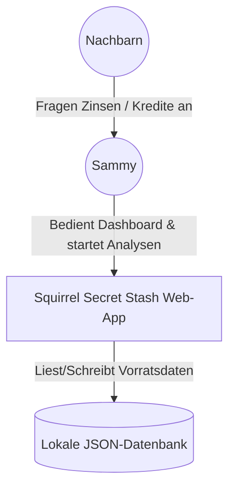
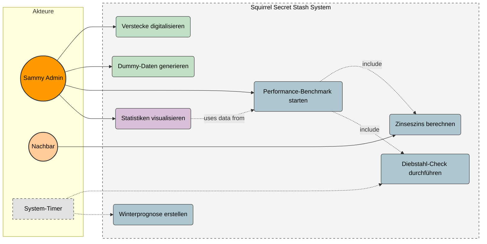
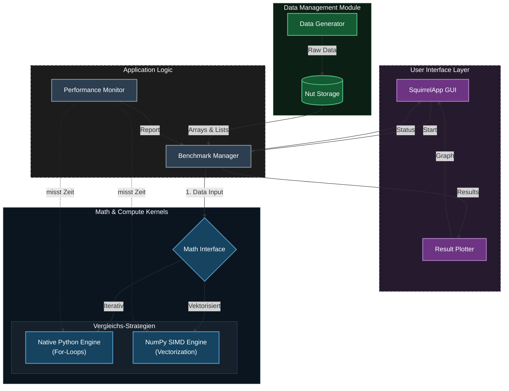
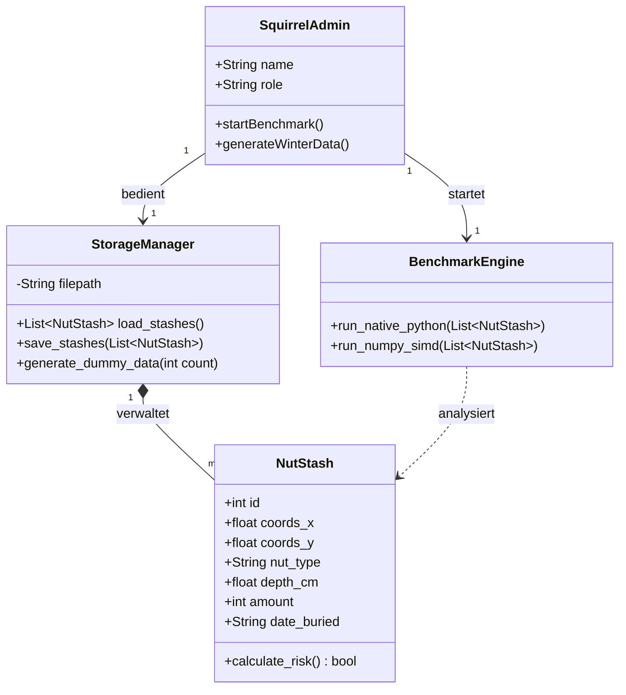
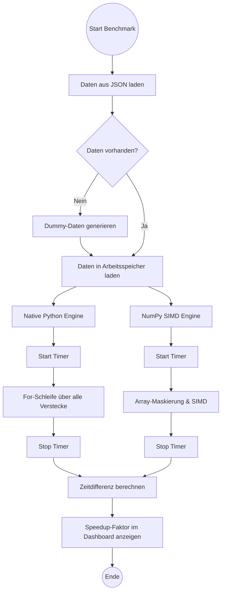
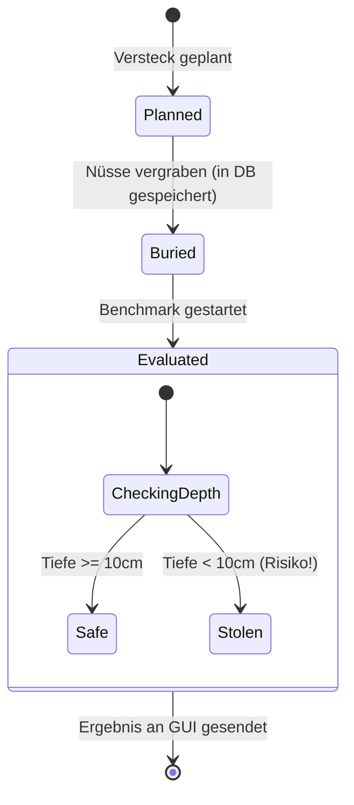
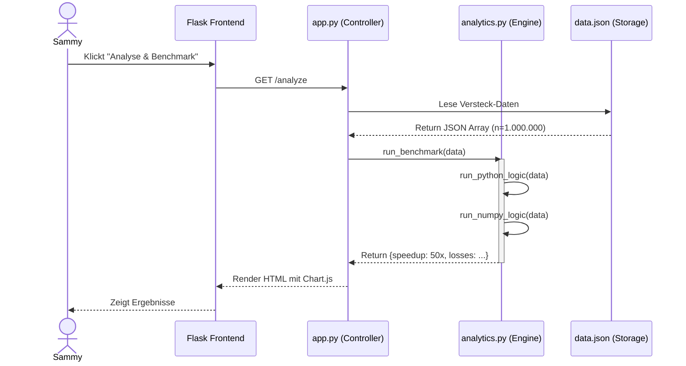

# Project Abschlussbericht: Squirrel Stash

## 1. Einleitung und Vision

### 1.1 Projektvision und Ziele

"Sammy Squirrel" steht vor einer logistischen Herausforderung: Die Verwaltung von tausenden Nussverstecken, Kreditvergaben an Nachbarn und die Überlebensplanung für den Winter übersteigen die Kapazität eines normalen Eichhörnchenhirns. 
Das Ziel des Projekts ist die Entwicklung einer hochperformanten Python-Anwendung, die als "Nuss-Zentralbank" fungiert und dieses Problem löst. Die App soll folgende Kernfunktionen bieten:
* **Verwaltung:** Digitalisierung des Vorratsnetzwerks.
* **Analyse:** Berechnung komplexer Szenarien (Zinseszins, Winterprognosen) für Tausende von Datensätzen gleichzeitig.
* **Wissenschaftlicher Beweis:** Implementierung eines Benchmarks, der beweist, dass moderne Array-Programmierung herkömmlichen Schleifen bei großen Datenmengen überlegen ist.

### 1.2 Wissenschaftliche Herausforderung / Python-Spezifischer Aspekt

Der technische Fokus dieses Projekts liegt auf der **Speichereffizienz und Vektorisierung** in Python. Das zentrale Experiment ist der Vergleich von skalarer Verarbeitung (Standard Python-Listen) gegenüber vektorisierter Verarbeitung (NumPy-Arrays).
Laut *Harris et al. (2020)* bildet NumPy das Fundament des wissenschaftlichen Python-Ökosystems. Neuere Untersuchungen von *Shah et al. (2025)* bestätigen, dass NumPy als robuster Baseline-Benchmark dient.

**Die Analogie zur Story:**
Während eine klassische `for`-Schleife in Python jeden Wert einzeln verarbeitet (SISD), *was bedeutet, Sammy rennt mühsam zu jedem einzelnen Nussversteck, um es zu prüfen*, ermöglicht NumPy die Vektorisierung. Sammy delegiert die Aufgabe quasi an ein effizientes "Prozessor-Netzwerk", das durch SIMD (Single Instruction, Multiple Data) tausende Verstecke gleichzeitig auswertet. 
Der Performance-Vorteil basiert auf Cache Locality (Nussdaten liegen als zusammenhängende Block-Informationen im Speicher) und Broadcasting, was den Python-Interpreter-Overhead eliminiert.

### 1.3 Arbeitshypothese

Basierend auf der theoretischen Überlegenheit von SIMD-Operationen stellen wir folgende Hypothesen für das Experiment auf, diese werden im Jupyter Notebook und der App evaluiert:

* **Hypothese 1: Der Skalierungseffekt (Big Data)**
  * **H1:** Mit steigender Anzahl der Nussverstecke ($n$) wächst die Performance-Differenz zwischen der NumPy-Implementierung und der nativen Python-Lösung überproportional zugunsten von NumPy.
  * *Begründung:* Während Python für jedes Versteck im Loop den Overhead der Typ-Prüfung hat, nutzt NumPy optimierte C-Schleifen. Wir erwarten bei $n > 100.000$ Verstecken einen Speedup-Faktor von mindestens 50x.

* **Hypothese 2: Der Overhead-Nachteil (Small Data)**
  * **H2:** Bei sehr wenigen Nussverstecken ($n < 100$) ist die native Python-Lösung gleich schnell oder sogar schneller als die Array-Programmierung.
  * *Begründung:* Das Initialisieren von NumPy-Arrays erzeugt eine fixe Latenz, die bei wenigen Daten stärker ins Gewicht fällt.

* **Hypothese 3: Effizienz bei bedingter Logik**
  * **H3:** Die Vektorisierung von bedingter Logik (z. B. Risiko-Check: `if depth < 10 cm`) mittels Maskierung (`np.where`) ist effizienter als die CPU-Branch-Prediction in klassischen Python-Schleifen.
  * *Begründung:* Moderne CPUs können Berechnungen schlecht vorhersagen, wenn viele zufällige `if/else`-Sprünge (Branches) vorkommen. NumPy vermeidet Sprünge komplett, indem es beide Ergebnisse berechnet und mittels einer binären Maske das richtige Ergebnis wählt

---

## 2. Requirements Engineering

### 2.1 Kontextdiagramm

Das Kontextdiagramm stellt das "Squirrel Secret Stash" System als Blackbox dar und definiert die Systemgrenzen. Es veranschaulicht, mit welchen externen Akteuren und Datenspeichern die Applikation im Wald-Ökosystem interagiert.

### 2.2 Funktionale Anforderungen als Katalog

Die funktionalen Anforderungen wurden im Vorfeld nach dem MoSCoW-Prinzip priorisiert. Um die Nachverfolgbarkeit für Tests sicherzustellen, sind die Requirements mit eindeutigen IDs (F01 - F07) versehen.

| ID | Priorität | Anforderung (Feature) | Status | Notizen |
| :--- | :--- | :--- | :--- | :--- |
| **F01** | Must Have | **Versteck-Verwaltung:** Das System muss Datensätze für Verstecke speichern können (Attribute: ID, Koordinaten, Erdtiefe, Nussart, Menge, Haltbarkeitsdatum). | [x] 100 % | Implementiert via Dataclasses/JSON |
| **F02** | Must Have | **Datengenerierung:** Ein Modul zur Erzeugung von Dummy-Daten, um die Performance-Tests überhaupt sinnvoll zu machen. | [x] 100 % | `generator.py` generiert Massendaten |
| **F03** | Must Have | **Diebstahl-Erkennung:** Logik zum Vergleich von Soll-Bestand vs. Ist-Bestand. Wenn Ist < Soll (Risiko Tiefe < 10cm), Warnung ausgeben. | [x] 100 % | Umgesetzt in Nativ-Python & NumPy |
| **F04** | Must Have | **Performance-Benchmark:** Vergleich von iterativem (for-Schleifen) und vektorisiertem (SIMD) Ansatz inkl. Ausgabe der Zeitdifferenz. | [x] 100 % | Messung via `time.perf_counter` |
| **F05** | Should Have | **Zinseszins-Rechner:** Effiziente, vektorisierte Ermittlung der Gesamtschuld, die Nachbarn nach $n$ Jahren begleichen müssen. | [x] 100 % | Reine Floating-Point Array-Operation |
| **F06** | Should Have | **Winterprognose:** Ermittlung, ob der Vorrat ausreicht, um den simulierten Gesamtverbrauch der Winterperiode zu decken. | [x] 100 % | Integriert in Dashboard-Statistik |
| **F07** | Could Have | **GUI & Karte:** Eine einfache Oberfläche, um Daten einzugeben, Ergebnisse grafisch anzuzeigen und Verstecke auf einer Karte zu visualisieren. | [x] 100 % | Realisiert mit Flask, Chart.js & Leaflet |

### 2.3 Nicht-funktionale Anforderungen (Qualitätsanforderungen nach ISO 25010)
Unsere initial definierten nicht-funktionalen Anforderungen (NF01, NF02) lassen sich direkt in die Qualitätskriterien der ISO/IEC 25010 Norm übersetzen:

* **Performance-Effizienz (Basis für NF01 - Performance):** Das System ist primär auf Effizienz ausgelegt. Die NumPy-Implementierung (SIMD) muss bei großen Datensätzen ($n > 100.000$) signifikant schneller und speichereffizienter arbeiten als die native Python-Lösung.
* **Zuverlässigkeit (Basis für NF02 - Reproduzierbarkeit):** Die Benchmark-Ergebnisse müssen bei jedem Durchlauf konsistent und reproduzierbar messbar sein. Die Testdaten-Generierung sowie die Ausführung der Timer-Funktionen dürfen keine extremen Jitter-Ausreißer aufweisen.
* **Benutzbarkeit (Usability):** Zur Unterstützung von Requirement F07 (GUI) muss die Applikation intuitiv im Browser bedienbar sein. Komplexe Array-Auswertungen werden dem Nutzer visuell (als Balkendiagramme) übersetzt.
* **Wartbarkeit (Maintainability):** Der Code ist modular strukturiert (Trennung von `analytics.py`, `app.py` und Frontend). Alle Variablen sind englischsprachig, zudem kommen Docstrings zum Einsatz, um die Nachvollziehbarkeit des wissenschaftlichen Codes zu gewährleisten.

### 2.4 Use-Case Modellierung

Die Use-Case Modellierung veranschaulicht die Kernfunktionen des "Squirrel Secret Stash" Systems und beschreibt die typischen Interaktionen der Akteure mit der Anwendung. 

**Typischer Interaktionsablauf:**
1. **Initialisierung:** Der Akteur *Sammy* bedient das System und löst zunächst die Generierung von Dummy-Massendaten aus, um ein realistisches Winter-Szenario zu simulieren.
2. **Ausführung:** Sammy startet den Performance-Benchmark. 
3. **System-Prozesse:** Das System führt nun im Hintergrund die *Science & Logic* Use Cases aus. Es inkludiert dabei vollautomatisch die Diebstahl-Checks und die Zinseszins-Berechnungen auf dem generierten Datenbestand.
4. **Auswertung:** Abschließend visualisiert das System die Statistiken (Zeiten, Speedup-Faktor, Risikoverteilung), welche von Sammy über das Frontend abgelesen werden.

#### Farblegende: Use Cases

| Farbe | Ebene / Bereich | Beschreibung |
| :--- | :--- | :--- |
| 🟠 **Orange** | **Akteure** | Interagierende Benutzer (Sammy) und externe Parteien (Nachbarn). |
| 🟢 **Grün** | **Daten-Management** | Alle Prozesse rund um die Erzeugung und Speicherung der Rohdaten (CRUD, Dummy-Daten). |
| 🔵 **Blau** | **Science & Logic** | Das wissenschaftliche Herzstück: Komplexe Berechnungen, Simulationen und Benchmarks (NumPy vs. Python). |
| 🟣 **Lila** | **Visualisierung** | Aufbereitung der Ergebnisse und Statistiken für das Frontend. |
| ⚪ **Grau** | **System** | Automatisierte Hintergrundprozesse (z.B. Timer) und Systemgrenzen. |

---

## 3. Architektur und Tech-Stack

### 3.1 Auswahl der Plattform
Für das Projekt wurde ein hybrider Ansatz gewählt: Die Hauptanwendung ist als **Web-Applikation (Flask)** realisiert, ergänzt durch ein **Jupyter Notebook** für die rein wissenschaftliche Evaluierung.

* **Begründung gegen Streamlit/Klassische GUI:** Eine klassische Desktop-GUI (wie Tkinter oder PyQt) ist betriebssystemabhängig und schwer zu verteilen. Streamlit bietet zwar schnelle Ergebnisse für Data-Science-Projekte, schränkt aber die Flexibilität im Frontend-Design (z.B. individuelle interaktive Karten oder spezifische Dashboard-Layouts) stark ein.
* **Vorteil der Web-App:** Flask bietet ein leichtgewichtiges Backend, das über HTTP mit einem HTML/JS-Frontend kommuniziert. Dies garantiert maximale Flexibilität und eine exzellente *Usability* für den Endnutzer (Sammy).
* **Rolle des Jupyter Notebooks:** Um den wissenschaftlichen Beweis (NumPy vs. Native Python) isoliert und interaktiv für Korrektoren nachvollziehbar zu machen, wird die Kernlogik zusätzlich in einem `.ipynb`-Dokument bereitgestellt.

### 3.2 Modularer Kern und Open-Closed Principle
Die Architektur der Anwendung folgt streng dem Prinzip der *Separation of Concerns* (Trennung von Zuständigkeiten), angelehnt an das MVC-Pattern (Model-View-Controller). 

Der "Core" (die Geschäfts- und Rechenlogik in `analytics.py`) ist vollständig von der Web-Oberfläche (`app.py` / HTML) entkoppelt. Das System kommuniziert ausschließlich über definierte Schnittstellen (Rückgabe von Dictionaries/JSON). 
Dies erfüllt das **Open-Closed Principle**: Die Rechenkerne (Compute Kernels) können um neue Algorithmen (z.B. Multiprocessing) erweitert werden, ohne dass der bestehende Code des Frontends oder des Data Layers modifiziert werden muss.

Das folgende Diagramm visualisiert diesen modularen Datenfluss – von der Generierung über die Speicherung bis hin zur Berechnung in den konkurrierenden Rechenkernen:

#### Farblegende: Architektur 

| Farbe | Komponente | Beschreibung |
| :--- | :--- | :--- |
| 🟣 **Purple** | **Frontend / UI** | Die Benutzeroberfläche für Sammy. Hier werden Benchmarks gestartet und Ergebnisse visualisiert. |
| ⚫ **Anthrazit** | **Logic & Control** | Die Steuerungslogik. Der `Benchmark Manager` koordiniert die Prozesse und überwacht die Zeitmessung (`Timer`). |
| 🟢 **Green** | **Data Layer** | Zuständig für "Big Data". Hier werden die synthetischen Daten erzeugt (`Generator`) und effizient im Speicher gehalten (`Store`). |
| 🔵 **Blue** | **Compute Kernels** | Das wissenschaftliche Herzstück. Hier finden die Berechnungen statt – getrennt in `Native Python` (Schleifen) und `NumPy` (SIMD). |

### 3.3 Technologie-Stack
Für die Umsetzung der Anwendung und die Validierung der Hypothesen wurden folgende spezifische Werkzeuge und Bibliotheken eingesetzt:

| Bibliothek / Tool | Kategorie | Verwendungszweck |
| :--- | :--- | :--- |
| **`numpy`** | Core Scientific | **Essenziell.** Zuständig für Arrays, Maskierung (Branchless Programming) und SIMD-Operationen. |
| **`flask`** | Web Framework | Leichtgewichtiges WSGI-Framework für das Routing und die Bereitstellung der grafischen Benutzeroberfläche (HTML/CSS/JS). |
| **`matplotlib`** / **Chart.js** | Visualization | Darstellung der Benchmark-Ergebnisse (Speedup-Faktoren). Matplotlib im Jupyter Notebook, Chart.js im Web-Frontend. |
| **`time`** (`perf_counter`) | Testing | Teil der Python Standard Library. Unverzichtbar für präzises Micro-Benchmarking zur Beweisführung. |
| **VS Code & Git** | Development | Integrierte Entwicklungsumgebung und Versionskontrolle (GitHub) zur strukturierten Projektarbeit. |

**Datenstruktur-Schema (Domain Entity):**
Das generierte Datenmodell der Verstecke orientiert sich an folgendem Schema (umgesetzt als Python-Dictionary/JSON):
* `id` (Integer), `coords_x`/`y` (Float), `nut_type` (String), `depth_cm` (Float), `amount` (Integer), `date_buried` (String/ISO).

### 3.4 Logging und Fehlerbehandlung

Um die Software-Qualität nach industriellen Standards sicherzustellen, wurden folgende Konzepte in der Applikation umgesetzt:

* **Logging:** Im aktuellen Prototyp-Stadium wurde bewusst auf die Implementierung eines komplexen Logging-Frameworks (wie das Python `logging`-Modul) verzichtet. Da der Fokus strikt auf dem Micro-Benchmarking der Rechenkerne lag, waren Standard-Konsolenausgaben (`print`) für die Ausgabe der gemessenen Zeiten und den Debugging-Prozess ausreichend. 
  * *Konzept für den produktiven Einsatz:* Für eine spätere Skalierung des Systems müsste das `logging`-Modul integriert werden. Dies würde es ermöglichen, Ausgaben in verschiedene Schweregrade (z. B. `INFO` für erfolgreich generierte Datensätze, `ERROR` für Systemfehler) zu unterteilen und Logs persistent in eine externe Datei (statt nur in die flüchtige Konsole) zu schreiben.
* **Fehlerbehandlung (Error Handling):** Der Zugriff auf die Datenbank (die lokale JSON-Datei) ist mit `try/except`-Blöcken abgesichert. Sollte die Datei `data.json` fehlen oder korrupt sein (z.B. durch manuelles Löschen), fängt das System den `FileNotFoundError` bzw. `JSONDecodeError` ab. Statt eines Systemabsturzes (HTTP 500) wird ein leeres Datenset `[]` zurückgegeben und eine Warnung geloggt.
* **Performance-Optimierung:** Die Architektur vermeidet tiefe Objekt-Kopien (Deep Copies). Die generierten JSON-Daten werden direkt in Arrays transformiert. Die Haupt-Optimierung liegt in der Nutzung des *Contiguous Memory Layouts* von NumPy, wodurch Cache-Misses der CPU während der iterativen Analyse verhindert werden.
* **Debugging-Strategien:** Durch die strenge Kapselung der Rechenlogik (`analytics.py`) vom Server (`app.py`) konnte ein isoliertes Debugging durchgeführt werden. Logische Fehler im Zins-Algorithmus ließen sich durch Unit-Tests separat prüfen, während Performance-Flaschenhälse durch den gezielten Einsatz des hochauflösenden `time.perf_counter()` identifiziert wurden.

---

## 4. Design und Modellierung (Die "Story")

### 4.1 Domänenmodell und UML-Klassendiagramm

Das Domänenmodell spiegelt die Kernobjekte der "Squirrel Secret Stash" Story wider. Im Zentrum steht das Objekt `NutStash` (das Nussversteck). Sammy (`SquirrelAdmin`) greift über einen `StorageManager` auf diese Verstecke zu, um sie an die Analyse-Engine (`BenchmarkEngine`) zu übergeben.

### 4.2 Verhaltensdiagramme: Activity- & State-Diagram

**Aktivitätsdiagramm: Der Benchmark-Ablauf**
Dieses Diagramm zeigt den komplexen Ablauf der Vergleichsrechnung. Es verdeutlicht, wie dieselben Daten auf zwei völlig unterschiedlichen Wegen (iterativ vs. vektorisiert) verarbeitet werden.

**Zustandsdiagramm (State Diagram): Lebenszyklus eines Nussverstecks**
Ein `NutStash` durchläuft im System verschiedene Zustände – vom Vergraben bis zur Auswertung im Winter.

### 4.3 Interaktionsdiagramm: Sequence-Diagram

Das Sequenzdiagramm dokumentiert den synchronen Methodenaufruf beim Starten einer Risikoanalyse. Es zeigt die Kommunikation zwischen dem Frontend, dem Controller und den Daten-Modellen.

### 4.4 Design Patterns und Prinzipien

In der Architektur wurden bewusst etablierte Entwurfsmuster und Softwareprinzipien angewendet, um den Code robust und testbar zu halten.

* **Strategy Pattern:** Dieses Muster ist das Herzstück unserer wissenschaftlichen Untersuchung. Das System muss das gleiche Problem (Winter-Risikoanalyse) lösen, nutzt dafür aber zwei austauschbare Algorithmen (Strategien): `run_python_logic()` und `run_numpy_logic()`. Der Aufrufer (`app.py`) übergibt lediglich die Daten, während die Engine die Ausführung an die jeweilige "Strategie" delegiert. 
* **MVC (Model-View-Controller):** Die strikte Trennung von Benutzeroberfläche (View: HTML/Jinja2), Routing/Steuerung (Controller: Flask `app.py`) und Geschäftslogik/Daten (Model: `analytics.py` und JSON). Dies garantiert das **Open-Closed Principle**, da die Rechenlogik um neue Benchmarks erweitert werden kann, ohne das Frontend anzufassen.
* **DRY (Don't Repeat Yourself):** Anstatt für beide Benchmarks separate Datensätze zu laden, wird der Datensatz exakt einmal aus der Datenbank geladen und als identische Kopie an beide Strategien übergeben. Dies stellt nicht nur sauberen Code sicher, sondern ist auch wissenschaftlich zwingend notwendig für einen fairen Leistungsvergleich.
* **KISS (Keep It Simple (and) Stupid):** Für das Datenmanagement wurde bewusst auf eine komplexe SQL-Datenbank (wie PostgreSQL) verzichtet. Da das Ziel das schnelle *In-Memory-Benchmarking* von Arrays ist, genügt eine flache JSON-Datei als Persistenzschicht, die beim Start vollständig in den Arbeitsspeicher (RAM) geladen wird.

---

## 5. Wissenschaftliche Problemstellung (Jupyter Notebook)

### 5.1 Methodik der Untersuchung

Beschreiben Sie den Aufbau Ihres Versuchs im Notebook.(Forschungsfrage beantworten, Datenmodell)

### 5.2 Analyse und Demonstration

Dokumentieren Sie die Ausführung des Codes und die Visualisierung der Ergebnisse zur Bestätigung/Widerlegung der
Hypothese. Hinterlegen Sie im Notebook aussagekräftige Plots.

---

## 6. Implementierung und Qualitätssicherung

### 6.1 Code-Struktur und Dokumentation

Hinweise zur englischsprachigen Programmierung, Docstrings und der modularen Aufteilung.

### 6.2 Test-Konzept: Unit-Tests

Listen Sie beispielhafte Unit-Tests auf, die die Kernfunktionalität absichern.

### 6.3 Integration-Tests und Traceability

Dokumentieren Sie mindestens 3 Integration-Tests. Ordnen Sie diese explizit den Software-Requirements (aus Kap. 2.2) zu.

### 6.4 CI-Pipeline

Beschreiben Sie die (mögliche) Automatisierung (GitHub Actions, Befehlsreihenfolge, Prüfung der `requirements.txt`,
project.toml).

---

## 7. Software-Qualität nach [ISO 25010](https://iso25000.com/index.php/en/iso-25000-standards/iso-25010)

Beurteilung der Produktqualität: Skalieren und bewerten Sie Ihre Software in Kategorien wie Wartbarkeit, Zuverlässigkeit
und Benutzbarkeit.
Wählen Sie 3-5 Kategorien aus und begründen Sie die Bewertung. Welche Maßnahmen wurden ergriffen, um die Qualität zu
verbessern?

---

## 8. Projektabschluss und Reflexion

### 8.1 Methodik und Anpassungen

Wie sind Sie vorgegangen? Welche Anpassungen mussten während der Entwicklung vorgenommen werden und warum?

### 8.2 Selbstreflexion

#### Arbeitsprozess

Analysieren Sie den Arbeitsprozess. Wo hat das Requirements Engineering geholfen, wo gab es bspw. durch "
Drauflos-Programmieren" Probleme?

#### Einsatz von KI

Bitte denkt daran, dass ihr eine schriftliche Reflektion zu eurer KI-Nutzung im Projekt mit abgeben müsst. Da alle
höchstwahrscheinlich KI-Tools verwenden werden, ist die Dokumentation des Lernfortschritts erforderlich (siehe IU
Richtlinie zur Nutzung von KI im Studium (S. 13) https://mycampus-classic.iu.org/mod/resource/view.php?id=357067)

### 8.3 Nutzungsanweisung (How-to-use)

Kurze Anleitung für den Nutzer oder den Korrektor: Wie wird die App gestartet und welche Features sind wie zu nutzen?

### 8.4 Pitch-Video

Erstellen Sie ein kurzes Video (max. 3-5 Minuten), in dem Sie die App vorstellen, die wichtigsten Funktionen
demonstrieren
und die wissenschaftliche Fragestellung sowie die Ergebnisse präsentieren.

Erstellt dazu bspw. einen Screencast mit einem Tool wie OBS Studio, Camtasia oder der System-eigenen Bildschirmaufnahme.

Examples:

- https://dl.acm.org/doi/10.1145/3411764.3445651
- https://dl.acm.org/doi/10.1145/2992154.2992174
- https://dl.acm.org/conference/chi

---

## Anhang

- **README.md (Inhalt):** Setup-Anleitung, Python-Umgebung, Paketliste.

- **Glossar:** Definition der fachlichen Begriffe der "Story".

---
