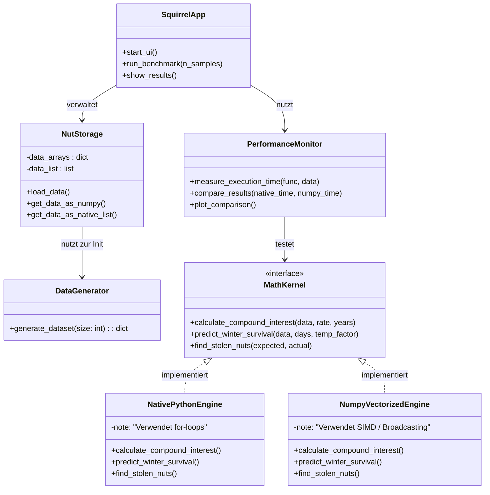

# Projektkonzept: Squirrel Secret Stash – Die Nuss-Zentralbank

## 1. Projektübersicht & Zielsetzung

### Was ist der Zweck der Anwendung?
"Sammy Squirrel" steht vor einer logistischen Herausforderung: Die Verwaltung von tausenden Nussverstecken, Kreditvergaben an Nachbarn und die Überlebensplanung für den Winter übersteigen die Kapazität eines normalen Eichhörnchenhirns.

Das Ziel ist die Entwicklung einer **hochperformanten Python-Anwendung**, die als "Nuss-Zentralbank" fungiert. Sie soll nicht nur Bestände verwalten, sondern durch wissenschaftliche Methoden (Vektorisierung) beweisen, dass moderne Array-Programmierung (NumPy) herkömmlichen Schleifen bei großen Datenmengen (Big Data) überlegen ist.

### Was soll die Anwendung können?
1.  **Verwaltung:** Digitalisierung des Vorratsnetzwerks (CRUD-Operationen für Verstecke).
2.  **Analyse:** Berechnung komplexer Szenarien (Zinseszins, Winterprognosen) für Tausende von Datensätzen gleichzeitig.
3.  **Wissenschaftlicher Beweis:** Implementierung eines Benchmarks, der die Rechenzeit von nativem Python (`for`-loops) gegen NumPy (SIMD/Vectorization) vergleicht.

---

## 2. Requirements (Anforderungen)

Wir priorisieren die Anforderungen nach **MoSCoW** (Must have, Should have, Could have, Won't have).

### 2.1 Funktionale Anforderungen (Functional Requirements)

#### **Priorität 1: Must Have (Kernfunktionalität)**
* **F01 – Versteck-Verwaltung:** Das System muss Datensätze für Verstecke speichern können.
    * Attribute: ID, Koordinaten $(x, y)$, Baumart, Erdtiefe (cm), Nussart (Hasel, Walnuss, Eichel), Menge, Haltbarkeitsdatum.
* **F02 – Datengenerierung:** Ein Modul zur Erzeugung von Dummy-Daten (mindestens 10.000 bis 1.000.000 Verstecke), um die Performance-Tests überhaupt sinnvoll zu machen.
* **F03 – Diebstahl-Erkennung:** Logik zum Vergleich von `Soll-Bestand` vs. `Ist-Bestand`. Wenn `Ist < Soll`, muss eine Warnung ausgegeben werden (Simulation von Eichelhäher-Angriffen).
* **F04 – Performance-Benchmark (Das wissenschaftliche Herzstück):**
    * Es müssen zwei Implementierungen für rechenintensive Aufgaben vorliegen:
        1.  **Iterativ:** Klassische Python `for`-Schleifen.
        2.  **Vektorisiert:** NumPy Arrays unter Nutzung von SIMD (Single Instruction, Multiple Data).
    * Die Zeitdifferenz muss gemessen und ausgegeben werden.

#### **Priorität 2: Should Have (Komplexe Logik)**
* **F05 – Zinseszins-Rechner:** Berechnung der schuldbaren Nüsse von Nachbarn über $n$ Jahre.
    * Formel: $A = P(1 + \frac{r}{n})^{nt}$
    * Dies muss massenhaft für tausende "Kreditverträge" gleichzeitig berechnet werden (Vektorisierung!).
* **F06 – Winterprognose:** Berechnung, ob der aktuelle Gesamtbestand basierend auf einer simulierten Kältewelle (Kalorienverbrauch pro Tag * Tage) ausreicht.

#### **Priorität 3: Could Have (Optionale UI)**
* **F07 – Grafische Benutzeroberfläche (GUI):**
    * Eine einfache Oberfläche (z.B. mit `Tkinter` oder `CustomTkinter`), um Daten einzugeben und die Benchmark-Ergebnisse grafisch anzuzeigen.
    * Visualisierung der Verstecke auf einer "Karte" (Scatterplot).

### 2.2 Nicht-funktionale Anforderungen (Non-Functional Requirements)

* **NF01 – Performance:** Die NumPy-Implementierung muss bei großen Datensätzen ($N > 100.000$) signifikant schneller sein (Faktor 10x - 100x) als die native Python-Lösung.
* **NF02 – Reproduzierbarkeit:** Die Benchmark-Ergebnisse müssen bei jedem Durchlauf konsistent messbar sein.

---

## 3. Software Design & Architektur
Das System folgt einer modularen Architektur mit einer strikten Trennung zwischen Datenerzeugung, Datenhaltung und den Rechenkernen (Math Kernels), um einen fairen Vergleich zu gewährleisten.

## 4. Ressourcenplanung & Tech Stack

Für die Umsetzung der "Squirrel Secret Stash" Anwendung benötigen wir spezifische Werkzeuge. Da der Fokus auf dem wissenschaftlichen Vergleich (Benchmarking) liegt, ist die Wahl der Bibliotheken entscheidend.

### 4.1 Benötigte Bibliotheken (Libraries)

Diese Pakete müssen in der Python-Umgebung installiert werden (z.B. via `requirements.txt`).

| Bibliothek | Kategorie | Verwendungszweck |
| :--- | :--- | :--- |
| **`numpy`** | **Core Scientific** | **Essenziell.** Zuständig für Arrays, Vektorisierung, SIMD-Operationen und die Generierung von Zufallszahlen (`numpy.random`). Dies ist der "Gegenspieler" zu den Standard-Python-Schleifen. |
| **`pandas`** | Data Handling | Optional, aber empfohlen für die `NutStorage`-Klasse. Erleichtert das Speichern/Laden von CSVs und bietet eine saubere Tabellen-Repräsentation, bevor die Daten in Rechen-Arrays umgewandelt werden. |
| **`matplotlib`** | Visualization | Dient der Visualisierung der Benchmark-Ergebnisse. Wir benötigen Plots (z.B. Balkendiagramme), die zeigen, wie viel schneller NumPy gegenüber Native Python ist. |
| **`timeit`** / `time` | Testing | Teil der Python Standard Library. Unverzichtbar für präzise Zeitmessungen (Micro-Benchmarking) der Algorithmen. |
| **`customtkinter`** | GUI (Optional) | Falls Anforderung F07 umgesetzt wird: Eine moderne Erweiterung für `tkinter`, um eine ansprechende Benutzeroberfläche für Sammy Squirrel zu bauen. |

### 4.2 Datensätze (Datasets)

Wir verwenden **keine** externen Downloads, da wir "Big Nut Data" simulieren müssen, um messbare Performance-Unterschiede zu erhalten. Stattdessen implementieren wir einen **Data Generator**.

**Warum synthetische Daten?**
Echte Eichhörnchen-Datensätze sind meist zu klein (< 1.000 Einträge). Um den Vorteil von SIMD (Single Instruction, Multiple Data) zu beweisen, benötigen wir Arrays mit $N > 1.000.000$.

**Schema der zu generierenden Daten:**

| Attribut | Datentyp | Beschreibung |
| :--- | :--- | :--- |
| `id` | Integer | Eindeutige ID des Verstecks. |
| `coords_x` | Float | GPS-Koordinate oder relative Position (0.0 - 1000.0). |
| `coords_y` | Float | GPS-Koordinate oder relative Position (0.0 - 1000.0). |
| `nut_type` | Integer/Cat | Art der Nuss (0=Hasel, 1=Walnuss, 2=Eichel). |
| `depth_cm` | Float | Grabtiefe (Normalverteilung um 15cm). |
| `amount` | Integer | Anzahl der Nüsse (1 bis 50). |
| `date_buried` | Timestamp | Datum des Versteckens (für Haltbarkeitsberechnung). |

### 4.3 Entwicklungsumgebung & Tools

* **IDE:** VS Code oder PyCharm (empfohlen mit Jupyter Notebook Support für schnelles Prototyping).
* **Version Control:** Git & GitHub (für Code-Versionierung und Mermaid-Diagramme).
* **Python Version:** 3.10 oder neuer (für besseres Type Hinting).
