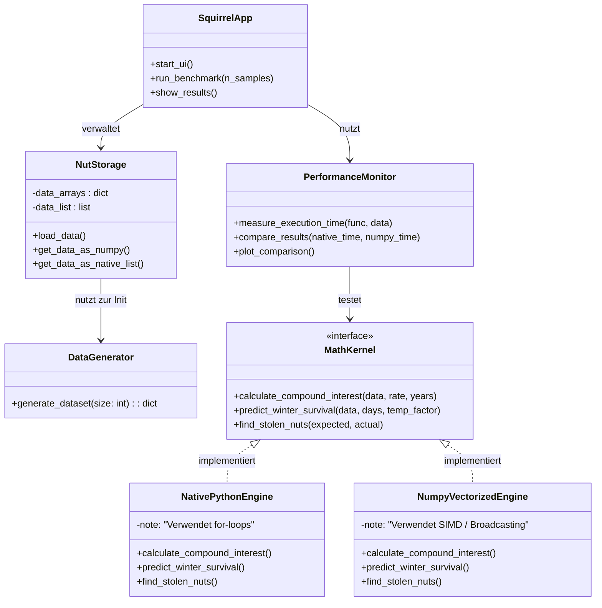

# Projektkonzept: Squirrel Secret Stash – Die Nuss-Zentralbank

## 1. Projektübersicht & Zielsetzung

### Was ist der Zweck der Anwendung?
"Sammy Squirrel" steht vor einer logistischen Herausforderung: Die Verwaltung von tausenden Nussverstecken, Kreditvergaben an Nachbarn und die Überlebensplanung für den Winter übersteigen die Kapazität eines normalen Eichhörnchenhirns.

Das Ziel ist die Entwicklung einer **hochperformanten Python-Anwendung**, die als "Nuss-Zentralbank" fungiert. Sie soll nicht nur Bestände verwalten, sondern durch wissenschaftliche Methoden beweisen, dass moderne Array-Programmierung herkömmlichen Schleifen bei großen Datenmengen überlegen ist.

### Was soll die Anwendung können?
1.  **Verwaltung:** Digitalisierung des Vorratsnetzwerks
2.  **Analyse:** Berechnung komplexer Szenarien (Zinseszins, Winterprognosen) für Tausende von Datensätzen gleichzeitig
3.  **Wissenschaftlicher Beweis:** Implementierung eines Benchmarks, der die Rechenzeit von nativem Python (`for`-loops) gegen NumPy (SIMD/Vectorization) vergleicht

---

## 2. Requirements (Anforderungen)

Wir priorisieren die Anforderungen nach MoSCoW

### 2.1 Funktionale Anforderungen

#### **Priorität 1: Must Have**
* **F01 – Versteck-Verwaltung:** Das System muss Datensätze für Verstecke speichern können
    * Attribute: ID, Koordinaten, Erdtiefe, Nussart, Menge, Haltbarkeitsdatum
* **F02 – Datengenerierung:** Ein Modul zur Erzeugung von Dummy-Daten, um die Performance-Tests überhaupt sinnvoll zu machen
* **F03 – Diebstahl-Erkennung:** Logik zum Vergleich von `Soll-Bestand` vs. `Ist-Bestand`. Wenn `Ist < Soll`, muss eine Warnung ausgegeben werden
* **F04 – Performance-Benchmark:**
        1.  **Iterativ:** Klassische Python `for`-Schleifen
        2.  **Vektorisiert:** NumPy Arrays unter Nutzung von SIMD
    * Die Zeitdifferenz muss gemessen und ausgegeben werden

#### **Priorität 2: Should Have**
* **F05 – Zinseszins-Rechner:** Ermittlung der Gesamtschuld, die Nachbarn nach $n$ Jahren inklusive angefallener Zinsen begleichen müssen
    * Diese Operation muss mittels Vektorisierung effizient auf tausende Datensätze parallel angewendet werden
* **F06 – Winterprognose:** Ermittlung, ob der Vorrat ausreicht, um den simulierten Gesamtverbrauch der gesamten Winterperiode zu decken

#### **Priorität 3: Could Have**
* **F07 – Grafische Benutzeroberfläche:**
    * Eine einfache Oberfläche, um Daten einzugeben und die Benchmark-Ergebnisse grafisch anzuzeigen.
    * Visualisierung der Verstecke auf einer "Karte".

### 2.2 Nicht-funktionale Anforderungen

* **NF01 – Performance:** Die NumPy-Implementierung muss bei großen Datensätzen signifikant schneller sein als die native Python-Lösung.
* **NF02 – Reproduzierbarkeit:** Die Benchmark-Ergebnisse müssen bei jedem Durchlauf konsistent messbar sein.

---

## 3. Software Design & Architektur
Das System folgt einer modularen Architektur mit einer strikten Trennung zwischen Datenerzeugung, Datenhaltung und den Rechenkernen, um einen Vergleich zu gewährleisten.

## 4. Ressourcenplanung & Tech Stack

Für die Umsetzung der "Squirrel Secret Stash" Anwendung benötigen wir spezifische Werkzeuge. Da der Fokus auf dem wissenschaftlichen Vergleich liegt, ist die Wahl der Bibliotheken entscheidend

### 4.1 Benötigte Bibliotheken

Diese Pakete müssen in der Python-Umgebung installiert werden.

| Bibliothek | Kategorie | Verwendungszweck |
| :--- | :--- | :--- |
| **`numpy`** | **Core Scientific** | **Essenziell.** Zuständig für Arrays, Vektorisierung, SIMD-Operationen und die Generierung von Zufallszahlen (`numpy.random`). Dies ist der "Gegenspieler" zu den Standard-Python-Schleifen. |
| **`pandas`** | Data Handling | Optional, aber empfohlen für die `NutStorage`-Klasse. Erleichtert das Speichern/Laden von CSVs und bietet eine saubere Tabellen-Repräsentation, bevor die Daten in Rechen-Arrays umgewandelt werden. |
| **`matplotlib`** | Visualization | Dient der Visualisierung der Benchmark-Ergebnisse. Wir benötigen Plots (z.B. Balkendiagramme), die zeigen, wie viel schneller NumPy gegenüber Native Python ist. |
| **`timeit`** / `time` | Testing | Teil der Python Standard Library. Unverzichtbar für präzise Zeitmessungen (Micro-Benchmarking) der Algorithmen. |

### 4.2 Datensätze

**Schema der zu generierenden Daten:**

| Attribut | Datentyp | Beschreibung |
| :--- | :--- | :--- |
| `id` | Integer | Eindeutige ID des Verstecks. |
| `coords_x` | Float | GPS-Koordinate oder relative Position  |
| `coords_y` | Float | GPS-Koordinate oder relative Position |
| `nut_type` | Integer/Cat | Art der Nuss |
| `depth_cm` | Float | Erdtiefe |
| `amount` | Integer | Anzahl der Nüsse  |
| `date_buried` | Timestamp | Datum des Versteckens (für Haltbarkeitsberechnung). |

### 4.3 Entwicklungsumgebung & Tools

* **IDE:** VS Code
* **Version Control:** Git & GitHub

---

## 5. Use Case Diagramm
Das Use Case Diagramm zeigt die funktionalen Anforderungen aus Sicht des Hauptakteurs Sammy Squirrel
usecaseDiagram
    actor "Sammy Squirrel" as User
    actor "System" as System

    User --> (Verstecke verwalten)
    User --> (Dummy-Daten generieren)
    User --> (Diebstahl erkennen)
    User --> (Performance-Benchmark ausführen)
    User --> (Zinseszins berechnen)
    User --> (Winterüberleben prognostizieren)
    User --> (Ergebnisse visualisieren)

    (Performance-Benchmark ausführen) --> (Native Python Berechnung)
    (Performance-Benchmark ausführen) --> (NumPy SIMD Berechnung)

    (Winterüberleben prognostizieren) --> System
    (Performance-Benchmark ausführen) --> System
