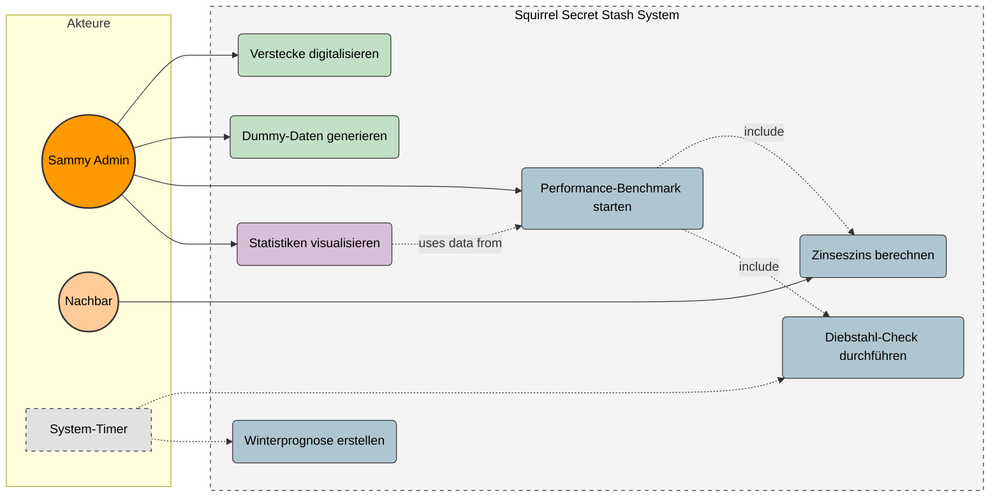

# Projektkonzept: Squirrel Secret Stash – Die Nuss-Zentralbank

## 1. Projektübersicht & Zielsetzung

### Was ist der Zweck der Anwendung?
"Sammy Squirrel" steht vor einer logistischen Herausforderung: Die Verwaltung von tausenden Nussverstecken, Kreditvergaben an Nachbarn und die Überlebensplanung für den Winter übersteigen die Kapazität eines normalen Eichhörnchenhirns.

Das Ziel ist die Entwicklung einer **hochperformanten Python-Anwendung**, die als "Nuss-Zentralbank" fungiert. Sie soll nicht nur Bestände verwalten, sondern durch wissenschaftliche Methoden beweisen, dass moderne Array-Programmierung herkömmlichen Schleifen bei großen Datenmengen überlegen ist.

### Was soll die Anwendung können?
1.  **Verwaltung:** Digitalisierung des Vorratsnetzwerks
2.  **Analyse:** Berechnung komplexer Szenarien (Zinseszins, Winterprognosen) für Tausende von Datensätzen gleichzeitig
3.  **Wissenschaftlicher Beweis:** Implementierung eines Benchmarks, der die Rechenzeit von nativem Python (`for`-loops) gegen NumPy (SIMD/Vectorization) vergleicht

---

## 1.1 Wissenschaftlicher Hintergrund: Warum NumPy?

Das zentrale Experiment dieses Projekts ist der Vergleich von **skalarer Verarbeitung** (Standard Python Listen) gegenüber **vektorisierter Verarbeitung** (NumPy Arrays). 

Laut *Harris et al. (2020)* bildet NumPy das Fundament des gesamten wissenschaftlichen Python-Ökosystems, da es eine effiziente Speicherverwaltung mit hochperformantem Code verbindet. Neuere Untersuchungen von *Shah et al. (2025)* bestätigen zudem, dass NumPy unter den Python-Bibliotheken die höchste Speichereffizienz aufweist und als robuster Baseline-Benchmark für wissenschaftliche Berechnungen dient.

Der Performance-Vorteil von NumPy gegenüber nativen Python-Schleifen basiert auf drei technischen Säulen:

### A. Vektorisierung & SIMD 
Während eine klassische `for`-Schleife in Python jeden Wert einzeln verarbeitet (SISD), ermöglicht NumPy die Vektorisierung. Hierbei werden Operationen auf ganze Arrays angewendet, anstatt auf einzelne Elemente.
* **Technik:** NumPy delegiert die Berechnung an optimierten C-Code, der moderne CPU-Befehlssätze (SIMD) nutzt.
* **Effekt:** Die CPU kann mehrere Gleitkommazahlen (z.B. 4 oder 8) in einem einzigen Taktzyklus verarbeiten, was den Durchsatz massiv erhöht.

### B. Speichereffizienz & Cache Locality
Python-Listen sind Arrays von Zeigern auf Objekte, die verstreut im Speicher liegen. NumPy-Arrays hingegen sind dichte, zusammenhängende Speicherblöcke (Contiguous Memory).
* **Strides:** NumPy nutzt "Strides", um effizient durch diesen linearen Speicher zu navigieren, ohne Daten kopieren zu müssen.
* **Cache:** Diese Linearität erlaubt der CPU, Daten effizienter in den Cache zu laden (Pre-Fetching), was Latenzzeiten drastisch reduziert. Shah et al. zeigten, dass NumPy hierdurch signifikant speichereffizienter ist als komplexe Frameworks wie TensorFlow oder PyTorch.

### C. Broadcasting
Für die Simulation der Zinsen und Wintervorräte nutzen wir Broadcasting. Dies ist der Mechanismus, mit dem NumPy arithmetische Operationen auf Arrays unterschiedlicher Form anwendet (z.B. Skalar auf Matrix).
* Dies geschieht virtuell, ohne die Daten im Speicher zu duplizieren.
* Shah et al. heben hervor, dass Broadcasting essenziell ist, um Schleifen in C-Geschwindigkeit auszuführen, statt langsame Python-Loops zu nutzen.

---

## 2. Requirements (Anforderungen)

Wir priorisieren die Anforderungen nach MoSCoW

### 2.1 Funktionale Anforderungen

#### **Priorität 1: Must Have**
* **F01 – Versteck-Verwaltung:** Das System muss Datensätze für Verstecke speichern können
    * Attribute: ID, Koordinaten, Erdtiefe, Nussart, Menge, Haltbarkeitsdatum
* **F02 – Datengenerierung:** Ein Modul zur Erzeugung von Dummy-Daten, um die Performance-Tests überhaupt sinnvoll zu machen
* **F03 – Diebstahl-Erkennung:** Logik zum Vergleich von `Soll-Bestand` vs. `Ist-Bestand`. Wenn `Ist < Soll`, muss eine Warnung ausgegeben werden
* **F04 – Performance-Benchmark:**
        1.  **Iterativ:** Klassische Python `for`-Schleifen
        2.  **Vektorisiert:** NumPy Arrays unter Nutzung von SIMD
    * Die Zeitdifferenz muss gemessen und ausgegeben werden

#### **Priorität 2: Should Have**
* **F05 – Zinseszins-Rechner:** Ermittlung der Gesamtschuld, die Nachbarn nach $n$ Jahren inklusive angefallener Zinsen begleichen müssen
    * Diese Operation muss mittels Vektorisierung effizient auf tausende Datensätze parallel angewendet werden
* **F06 – Winterprognose:** Ermittlung, ob der Vorrat ausreicht, um den simulierten Gesamtverbrauch der gesamten Winterperiode zu decken

#### **Priorität 3: Could Have**
* **F07 – Grafische Benutzeroberfläche:**
    * Eine einfache Oberfläche, um Daten einzugeben und die Benchmark-Ergebnisse grafisch anzuzeigen.
    * Visualisierung der Verstecke auf einer "Karte".

### 2.2 Nicht-funktionale Anforderungen

* **NF01 – Performance:** Die NumPy-Implementierung muss bei großen Datensätzen signifikant schneller sein als die native Python-Lösung.
* **NF02 – Reproduzierbarkeit:** Die Benchmark-Ergebnisse müssen bei jedem Durchlauf konsistent messbar sein.

---

## 3. Software Design & Architektur
Das System folgt einer modularen Architektur mit einer strikten Trennung zwischen Datenerzeugung, Datenhaltung und den Rechenkernen, um einen Vergleich zu gewährleisten.

## 3.1 Anwendungsfälle & Akteure (Use Case Diagram)
Das folgende Diagramm zeigt die Interaktionspunkte von "Sammy" (User), dem System-Timer und den Nachbarn mit der Anwendung. Es verdeutlicht, welche Funktionen manuell ausgelöst werden und welche Prozesse automatisiert im Hintergrund laufen.

####  Farblegende: Use Cases

| Farbe | Ebene / Bereich | Beschreibung |
| :--- | :--- | :--- |
| 🟠 **Orange** | **Akteure** | Interagierende Benutzer (Sammy) und externe Parteien (Nachbarn). |
| 🟢 **Grün** | **Daten-Management** | Alle Prozesse rund um die Erzeugung und Speicherung der Rohdaten (CRUD, Dummy-Daten). |
| 🔵 **Blau** | **Science & Logic** | Das wissenschaftliche Herzstück: Komplexe Berechnungen, Simulationen und Benchmarks (NumPy vs. Python). |
| 🟣 **Lila** | **Visualisierung** | Aufbereitung der Ergebnisse und Statistiken für das Frontend. |
| ⚪ **Grau** | **System** | Automatisierte Hintergrundprozesse (z.B. Timer) und Systemgrenzen. |

### 3.2 System-Architektur & Komponenten

Das folgende Diagramm visualisiert den technischen Aufbau der Anwendung. Es zeigt den Datenfluss von der Generierung über die Speicherung bis hin zur Berechnung in den konkurrierenden Rechenkernen.

####  Farblegende: Architektur 

| Farbe | Komponente | Beschreibung |
| :--- | :--- | :--- |
| 🟣 **Purple** | **Frontend / UI** | Die Benutzeroberfläche für Sammy. Hier werden Benchmarks gestartet und Ergebnisse visualisiert. |
| ⚫ **Anthrazit** | **Logic & Control** | Die Steuerungslogik. Der `Benchmark Manager` koordiniert die Prozesse und überwacht die Zeitmessung (`Timer`). |
| 🟢 **Green** | **Data Layer** | Zuständig für "Big Data". Hier werden die synthetischen Daten erzeugt (`Generator`) und effizient im Speicher gehalten (`Store`). |
| 🔵 **Blue** | **Compute Kernels** | Das wissenschaftliche Herzstück. Hier finden die Berechnungen statt – getrennt in `Native Python` (Schleifen) und `NumPy` (SIMD). |

```mermaid
graph TD
    %% --- Style Definitionen (Deep Dark Mode) ---
    
    %% UI: Lila Boxen
    classDef uiStyle fill:#6C3483,stroke:#AF7AC5,stroke-width:2px,color:white;
    
    %% Logic: Anthrazit Boxen
    classDef logicStyle fill:#2C3E50,stroke:#85929E,stroke-width:2px,color:white;
    
    %% Data: Grüne Boxen
    classDef dataStyle fill:#145A32,stroke:#52BE80,stroke-width:2px,color:white;
    
    %% Science: Blaue Boxen
    classDef scienceStyle fill:#154360,stroke:#5499C7,stroke-width:2px,color:white;
    
    %% --- Hauptanwendung ---
    subgraph Frontend ["User Interface Layer"]
        UI[SquirrelApp GUI]:::uiStyle
        Plot[Result Plotter]:::uiStyle
    end

    %% --- Steuerungslogik ---
    subgraph Logic ["Application Logic"]
        Manager[Benchmark Manager]:::logicStyle
        Timer[Performance Monitor]:::logicStyle
    end

    %% --- Datenhaltung ---
    subgraph DataLayer ["Data Management Module"]
        direction TB
        Gen[Data Generator]:::dataStyle
        Store[(Nut Storage)]:::dataStyle
    end

    %% --- Rechenkern (Das Herzstück) ---
    subgraph ComputeLayer ["Math & Compute Kernels"]
        direction TB
        Interface{Math Interface}:::scienceStyle
        
        subgraph Strategies ["Vergleichs-Strategien"]
            direction LR
            Native["Native Python Engine<br/>(For-Loops)"]:::scienceStyle
            Numpy["NumPy SIMD Engine<br/>(Vectorization)"]:::scienceStyle
        end
    end

    %% --- Beziehungen / Datenfluss ---
    %% UI Interaktion
    UI -->|Start| Manager
    Manager -->|Status| UI
    Manager -->|Results| Plot
    Plot -->|Graph| UI

    %% Datenfluss
    Gen -->|Raw Data| Store
    Store -->|Arrays & Lists| Manager

    %% Benchmark Prozess
    Manager -- 1. Data Input --> Interface
    Interface -->|Iterativ| Native
    Interface -->|Vektorisiert| Numpy
    
    %% Messung
    Timer -.->|misst Zeit| Native
    Timer -.->|misst Zeit| Numpy
    Timer -->|Report| Manager

    %% --- KORRIGIERTE STYLE SECTION (Dunkle Hintergründe) ---
    %% Hintergrund: Sehr dunkles Lila, Schrift: Weiß
    style Frontend fill:#261B2E,stroke:#5B2C6F,stroke-dasharray: 5 5,color:white
    
    %% Hintergrund: Sehr dunkles Grau, Schrift: Weiß
    style Logic fill:#1C1C1C,stroke:#2C3E50,stroke-dasharray: 5 5,color:white
    
    %% Hintergrund: Sehr dunkles Grün (fast Schwarz), Schrift: Weiß
    style DataLayer fill:#0B1F15,stroke:#145A32,stroke-width:1px,color:white
    
    %% Hintergrund: Sehr dunkles Blau (fast Schwarz), Schrift: Weiß
    style ComputeLayer fill:#0B1520,stroke:#1B4F72,stroke-width:1px,color:white
    
    %% Strategie-Box: Transparent oder sehr dunkel
    style Strategies fill:#15202B,stroke:#1B4F72,stroke-
```

---

## 4. Ressourcenplanung & Tech Stack

Für die Umsetzung der "Squirrel Secret Stash" Anwendung benötigen wir spezifische Werkzeuge. Da der Fokus auf dem wissenschaftlichen Vergleich liegt, ist die Wahl der Bibliotheken entscheidend

### 4.1 Benötigte Bibliotheken

Diese Pakete müssen in der Python-Umgebung installiert werden.

| Bibliothek | Kategorie | Verwendungszweck |
| :--- | :--- | :--- |
| **`numpy`** | **Core Scientific** | **Essenziell.** Zuständig für Arrays, Vektorisierung, SIMD-Operationen und die Generierung von Zufallszahlen (`numpy.random`). Dies ist der "Gegenspieler" zu den Standard-Python-Schleifen. |
| **`pandas`** | Data Handling | Optional, aber empfohlen für die `NutStorage`-Klasse. Erleichtert das Speichern/Laden von CSVs und bietet eine saubere Tabellen-Repräsentation, bevor die Daten in Rechen-Arrays umgewandelt werden. |
| **`matplotlib`** | Visualization | Dient der Visualisierung der Benchmark-Ergebnisse. Wir benötigen Plots (z.B. Balkendiagramme), die zeigen, wie viel schneller NumPy gegenüber Native Python ist. |
| **`timeit`** / `time` | Testing | Teil der Python Standard Library. Unverzichtbar für präzise Zeitmessungen (Micro-Benchmarking) der Algorithmen. |

### 4.2 Datensätze

**Schema der zu generierenden Daten:**

| Attribut | Datentyp | Beschreibung |
| :--- | :--- | :--- |
| `id` | Integer | Eindeutige ID des Verstecks. |
| `coords_x` | Float | GPS-Koordinate oder relative Position  |
| `coords_y` | Float | GPS-Koordinate oder relative Position |
| `nut_type` | Integer/Cat | Art der Nuss |
| `depth_cm` | Float | Erdtiefe |
| `amount` | Integer | Anzahl der Nüsse  |
| `date_buried` | Timestamp | Datum des Versteckens (für Haltbarkeitsberechnung). |

### 4.3 Entwicklungsumgebung & Tools

* **IDE:** VS Code
* **Version Control:** Git & GitHub
    User --> (Ergebnisse visualisieren)

    (Performance-Benchmark ausführen) --> (Native Python Berechnung)
    (Performance-Benchmark ausführen) --> (NumPy SIMD Berechnung)

    (Winterüberleben prognostizieren) --> System
    (Performance-Benchmark ausführen) --> System

---

## 5. Literaturverzeichnis & Wissenschaftliche Quellen

Dieses Projekt stützt sich auf aktuelle Forschungsergebnisse im Bereich High Performance Computing (HPC) mit Python. Die Architekturentscheidung für NumPy basiert auf folgenden Quellen:

**[1] Harris, C. R., Millman, K. J., van der Walt, S. J., et al. (2020). Array programming with NumPy. *Nature*, 585, 357–362.**
* **Quelle:** [DOI: 10.1038/s41586-020-2649-2](https://doi.org/10.1038/s41586-020-2649-2)
* **Relevanz für das Projekt:** Dieser Artikel definiert NumPy als das fundamentale Framework für wissenschaftliches Rechnen in Python. Er liefert die theoretische Erklärung für die Performance-Gewinne durch *Vektorisierung* und *Contiguous Memory Layouts* (zusammenhängende Speicherblöcke), die in unserem Benchmark gegen native Python-Listen getestet werden.

**[2] Shah, N., Chuang, P., Sathre, P., & Feng, W. (2025). On the Landscape of Scientific Computing Libraries in Python. *2025 IEEE High Performance Extreme Computing Conference (HPEC)*.**
* **Quelle:** [DOI: 10.1109/HPEC67600.2025.11196385](https://doi.org/10.1109/HPEC67600.2025.11196385)
* **Relevanz für das Projekt:** Diese aktuelle Studie vergleicht NumPy mit modernen Bibliotheken wie PyTorch, TensorFlow und JAX. Sie bestätigt NumPy als die effizienteste Lösung für serielle und speichersensitive Berechnungen, die keine GPU-Beschleunigung oder automatisches Differenzieren erfordern. Dies untermauert unsere Entscheidung, für die Verwaltung der Nuss-Vorräte ("Sammy's Stash") auf den Overhead großer ML-Frameworks zu verzichten und stattdessen NumPy zu nutzen.
