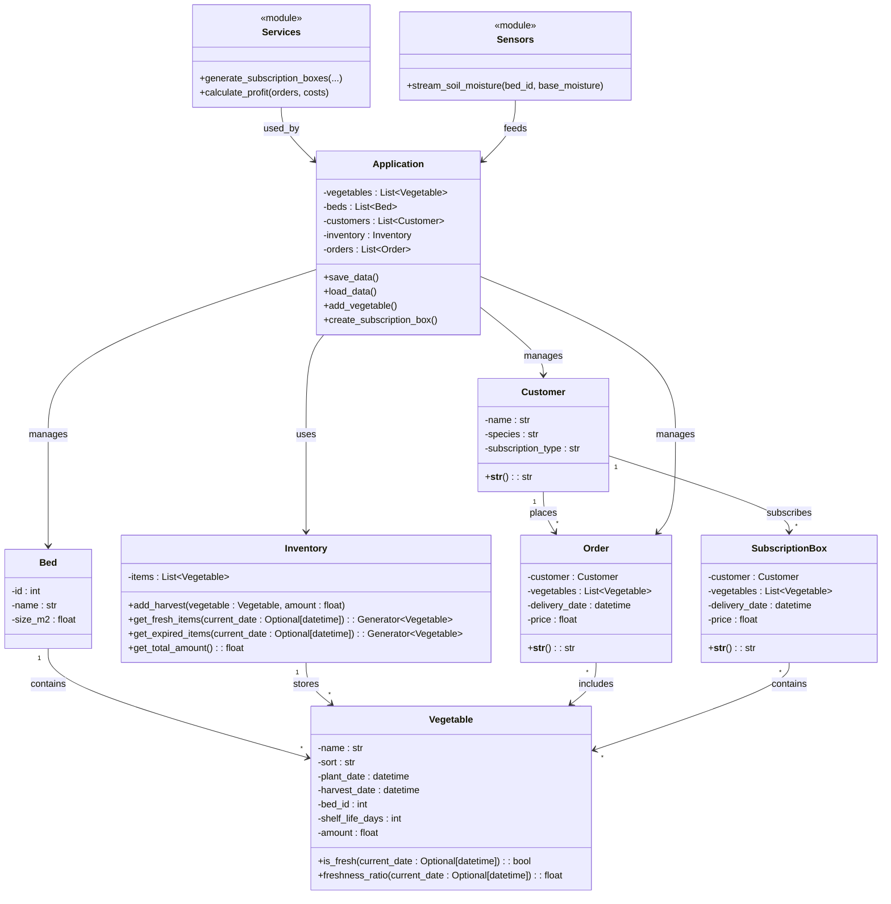

# Titel des Projekts

## 1. Einleitung
- Kontext des Projekts
- Zielsetzung
- Motivation

## 2. Wissenschaftliche Fragestellung
- Formulierte Forschungsfrage
- ggf. Hypothesen/Ausgangsannahmen

## 3. Theoretischer Hintergrund
- Relevante Konzepte (kurz)
- bisheriger Stand (Literatur, Methoden)
- begriffliche Abgrenzung

## 4. Methodik
- Beschreibung, wie der Code genutzt wird, um die Frage zu beantworten
- Datenbasis (synthetisch, real, generiert)
- Experimente / Testaufbau
- Messgrößen (Zeit, Speicher)

## 5. Implementierung
- Architekturüberblick
- Komponenten/Module
- Relevante Funktionen
- Besonderheiten (z. B. Lazy Evaluation vs. Eager)

## 6. Experimentelle Ausführung
- Beschreibung der durchgeführten Experimente
- Reproduzierbarkeit (auf macOs u. Windows ausführbar machen)
- Testfälle
- Kontrollgruppe für eager vs lazy - Stimmen die Daten? Daten mehrmals Testen

## 7. Ergebnisse
- Darstellung der erhobenen Daten
- Tabellen/Diagramme
- direkte Beobachtungen

## 8. Analyse & Diskussion
- Interpretation der Ergebnisse
- Rückbezug auf die Forschungsfrage
- Erklärung von Effekten
- Grenzen der Methode

## 9. Schlussfolgerung
- explizite Beantwortung der Frage
- Implikationen
- Ausblick / mögliche Weiterarbeit

## 10. Reflexion
- technisches & methodisches Learning
- Schwierigkeiten
- alternative Ansätze (nicht sicher)

## 11. Literaturverzeichnis
- Literatur
- Primärquellen
- Webquellen

## 12. Anhang

- Codeauszüge
- Testprotokolle
- Screenshots
