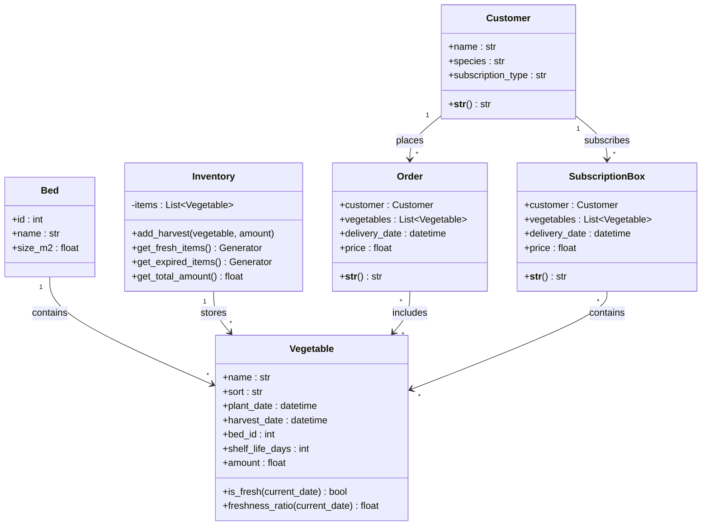

### DLBDSIPWP01 - Einführung in die Programmierung mit Python (Projekt)

---

# Projektabschlussbericht: RabbitFarm – Der Gemüsehof des Hasen

---

## 1. Einleitung und Vision

### 1.1 Projektvision und Ziele

Die RabbitFarm ist eine Farmverwaltungsanwendung, welches Python-basiert ist. Sie ist dafür da einen fiktiven Gemüsehof des Haden Rudi. Rudi versorgt die gesamten Waldtiere mit frischem Gemüse. Er plant das anbauen, verwaltet die Ernte und liefert das Gemüse den Kunden mit einem Abo-Kisten (Abo-Plan) aus.

Kernidee:
- Die App soll die Arbeit für Rudi erleichtern.
- Beete und Gemüsesorten werden digital und zentral gespeichert, sodass Rudi jeder Zeit drauf zugreifen kann.
- Durch die Echtzeitüberwachung, kann Rudi jederzeit sein Bestand sehen, welche Ware noch frisch ist, welche Abgelaufen und wie lange die noch Haltbar sind.
- Rudi hat jederzeit zugriff auf Kundendaten und bestellungen. Er kann den Kunden (Waldtiere) eine Abo-Kiste anlegen, sodass er nicht vergisst, welcher Kunde konstant Ware kaufen möchte (Das sind Rudis lieblings Kunden).
- Rudi ist kein freund von der Buchhaltung, aus diesem Grund tut das die App automatisch. Sobald eine Bestellung bearbeitet wurde wird es automatsich im Programm berechnet. 
- Die Anwendung wiederspiegelt und misst, dass Lazy Evaluation und Eager Evaluation. Dabei soll anhand der Sensoredaten gemessen werde, welche Evaluation am effektivsten ist.

Ziele:

1. RabbitFarm digital abbilden\
2. Moderne Web-UI (SAAS)
3. In der Domän "Sensordaten" Lazy vs. Eager vergeleichen (Benchmark mit Zeit- und Speichermessung)

---

### 1.2 Wissenschaftliche Herausforderung / Python-spezifischer Aspekt

In unserem Projekt geht es vor allem um **Lazy Evaluation** und darum, wie man mit **Datenströmen** speichersparend umgeht. Dafür haben wir uns im THEORETISCHERHINTERGRUND mit mehreren Quellen auseinandergesetzt. Zum Beispiel beschreibt Mertz (2015), dass Python standardmäßig **eager** auswertet – also alles sofort berechnet und ganze Listen im RAM aufbaut. Das ist zwar gut zum Debuggen, aber bei großen oder theoretisch unendlichen Datenmengen bläht sich der Speicherverbrauch schnell auf. Lazy Evaluation hingegen wertet erst aus, wenn der Wert wirklich gebraucht wird. Python hat das nicht so richtig eingebaut, aber mit **Generatoren** (yield) und **itertools** (islice, filter, map, cycle) kann man genau dieses Verhalten nachbauen – und genau das machen wir bei den Sensordaten und im Lager.

Für Python-Entwickler ist das relevant, weil man oft hört „Python ist langsam“ oder „Python frisst Speicher“. Wenn man aber funktional denkt und Lazy nutzt, kann man z.B. über theoretisch unbegrenzte Datenmengen iterieren ohne den Arbeitsspeicher vollzupumpen (siehe auch die Autorin Mahajan/Arora 2024 – Generatoren sparen RAM). Bei uns werden die Sensordaten als Stream geliefert, und wir vergleichen explizit: einmal alles in eine Liste packen (Eager) vs. alles als Pipeline durchlaufen lassen (Lazy). Die Messung machen wir mit tracemalloc und time.perf_counter(), damit man den Unterschied auch sieht. So wird die Theorie für die Lehre nachvollziehbar.

**Analogie / „Geschichte“ im Projekt:**

Rudi der Hase liebte es, mit seinen Eltern zu spielen und zu kuscheln. Doch so sehr sie ihn auch liebten – sie hatten kaum Zeit. Tag für Tag arbeiteten sie auf den Feldern, um genug Karotten nach Hause zu bringen. Früh am Morgen gingen sie los, spät am Abend kamen sie müde zurück. Rudi wartete oft am Feldrand, voller Hoffnung auf ein bisschen gemeinsame Zeit. Das machte ihn traurig, denn er liebte seine Eltern von ganzem Herzen.

Eines Tages fasste er einen Entschluss: Wenn er groß ist, wird er ihnen helfen. Nicht nur ein bisschen – sondern richtig. Er wollte dafür sorgen, dass seine Eltern weniger arbeiten müssen und trotzdem genug Karotten im Bau sind.

Rudi setzte sich also hin und erstellte einen Business-Plan.

Als erstes analysiert er die Situation und die Probleme:
- Eltern arbeiten hart, aber ungeplant -> Chaotisch
- Nur die Mutter hatte einen Überblick über die Ernte, Lagerbestand und Verkauf, das bedeutet, wenn die Mutter von Rudi mal nicht vorort ist, lief alles schiefer als schief.
- Es wurde manchmal zuviel aber oft zu wenig geerntet, sodass die Ware entweder Kaputt ging oder sie mehr verkaufen könnten.

Bevor Rudi anfängt eine lösung zu finden, musste er seiner Meinung nach es erstmal verstehen, wie die RabbitFarm so funktioniert. Aus diesem Grund beschloss er auch nun mit seinen Eltern zu arbeiten um die Prozesse zu verstehen. Jeden Arbeitstag dokumentiert er (was lief gut / was lief schief) und suchte lösungen. Nach 2 Monaten war er soweit... Er erstellte einen Plan, wie er seinen Eltern effizient die Arbeit erleichtern kann:
- Bestand aufzeichnen
- Kunden und Verkäufe dokumentieren
- Beet automatisch analysieren, sodass die Eltern nicht jedesmal das manuell machen müssen (Sensoren)

So machte Rudi sich an die Arbeit und Entwickelte das Programm mit seinem besten Freund Python die Schlange.

Die Einführung des Programmes machte es den Eltern schwer, da es für sie komplett neu ist, aber nach 1 bis 2 Wochen haben sie gemerkt wie Effektiv es ist. Die Arbeit wurde somit erleichtert, alles geht schneller und effektiver, aber das schönste ist... Die Eltern mussten nicht mehr soviel Arbeiten...

Als dank übergab der Vater von Rudi die RabbitFarm und alle sind glücklich.

---

### 1.3 Arbeitshypothese

**Formulierte Hypothese:**

„Die Lazy-Evaluation mit Python-Generatoren und itertools reduziert den Speicherverbrauch im Vergleich zur Eager-Evaluation. Bei kleinen Datenmengen ist das nicht so entscheidend, aber wenn man mit 10.0000, 100.000 oder über 1.000.000 Messwerten arbeitet, wird man die Effizienz von Lazy bestimmt wahrnehmen.“

**Messgrößen (Domänenentitäten des Projekts):**

- Peak Memory Usage in MB: Gemessen wird mit tracemalloc während der Verarbeitung von N Sensordaten.
- Processing Time in Sekunden: Gemessen wird mit time.perf_counter() für process_eager bzw. process_lazy über N Werte.

Die Überprüfung erfolgt im Jupyter-Notebook als auch in der Web-UI auf der Seite „Sensordaten“. Dadurch kann der User sehen, welche Evaluation tatsächlich effektiver ist.

---

## 2. Requirements Engineering

### 2.1 Kontextdiagramm

Die RabbitFarm steht in Wechselwirkung mit folgenden externen Akturen und Systeme:

- Rudi: Er ist der Hauptnutzer der Anwendung. Damit Verwaltet er Beet, Gemüse, Lager, Kunden, Bestellung und Finanzen und alles über die Web-UI.
- Waldtiere: Das sind die Kunden also die fiktive Abnehmer. Sie werde in der App als Kunden hinterlegt und können Bestellungen und Abo-kisten aufgeben.
- Sesnorsystem: Liefert konstant Sensordaten der Bodenfeuchtigkeit. Im Projekt wird es durch Generatoren stream_soil_moisture in sensors.py simuliert. 
- Dateisystem: Gilt als kleine Datenbank für die App (JSON)


**Kontextdiagramm (textuell):**

```
                    +------------------+
                    |  Rudi (Nutzer)   |
                    +--------+---------+
                             | nutzt
                             v
+------------------+    +---------+    +------------------+
| Sensorsystem     |--->| Rabbit  |<---| Dateisystem      |
| (Bodenfeuchtigkeit)|   | Farm    |   | (rabbitfarm_     |
+------------------+    | (App)   |    |  data.json)      |
                        +----+----+    +------------------+
                             ^
                             | Bestellungen / Abos
                    +--------+--------+
                    | Waldtier-Kunden |
                    | (Daten in App)  |
                    +-----------------+
```
Die Web-UI ist ein bestandteil des Systems. Der Client nutzt den Browser und kommuniziert per HTTP-Anfragen an dem Server, also den Kern der App.

---

### 2.2 Funktionale Anforderungen

Die funktionalen Anforderungen werden mit IDs versehen, um Traceability zu Tests und Implementierung zu ermöglichen.

| ID | Beschreibung | Priorität | Umsetzung (Kurz) |
|----|--------------|-----------|-------------------|
| REQ-01 | Beet-Verwaltung: Anlegen und Auflisten von Beeten (ID, Name, Größe m²) | Must | Bed in models.py; Web: /beds, Formular + Tabelle |
| REQ-02 | Gemüsesorten-Katalog: Name, Sorte, Pflanz-/Erntedatum, Beet-Zuordnung, Haltbarkeit, Menge | Must | Vegetable in models.py; Web: /vegetables |
| REQ-03 | Pflanzplanung: Gemüse manuell einem Beet zuordnen | Must | Gemüse-Formular mit Beet-Dropdown |
| REQ-04 | Bestandsüberwachung: Geerntetes Gemüse im Lager verwalten | Must | Inventory mit add_harvest(); Web: /inventory |
| REQ-05 | Haltbarkeitslogik: Frische prüfen (is_fresh, freshness_ratio), abgelaufene Ware identifizieren | Must | Vegetable.is_fresh(), Inventory.get_expired_items() (Generator) |
| REQ-06 | Bestandsabfrage: Echtzeit-Übersicht über Lagerbestand und Frische | Must | /inventory mit frischer/abgelaufener Ware und Gesamtmenge |
| REQ-07 | Kunden-Datenbank: Name, Tierart, Abo-Typ | Must | Customer in models.py; Web: /customers |
| REQ-08 | Abo-Kisten-System: generatorbasierte Box-Generierung | Must | generate_subscription_boxes() in services.py (itertools.cycle, islice) |
| REQ-09 | Bestellabwicklung: Bestellungen mit Kunde, Gemüse, Lieferdatum, Preis | Must | Order in models.py; Web: /orders |
| REQ-10 | Ausgaben-Tracking (optional) und Einnahmen-Berechnung | Must | calculate_profit() in services.py; Web: /finances |
| REQ-11 | Gewinn-/Verlustrechnung: Revenue, optional Expenses, Profit, Marge | Must | Finanzseite mit Summen und Bestellliste |
| REQ-12 | Dashboard mit Übersicht und Schnellzugriff auf alle Bereiche | Must | / mit Kacheln zu Gemüse, Beeten, Lager, Kunden, Bestellungen, Finanzen, Sensordaten |
| REQ-13 | Sensordaten-Stream: kontinuierliche Bodenfeuchtigkeits-Messwerte (simuliert) | Must | stream_soil_moisture() in sensors.py (Generator) |
| REQ-14 | Generatorbasierte Verarbeitung: Filter/Map über Sensordaten ohne vollständige Materialisierung | Must | process_lazy() in sensor_benchmark.py (filter, map, islice) |
| REQ-15 | Performance-Benchmark: Eager vs. Lazy mit Zeit- und Speichermessung | Must | benchmark_eager(), benchmark_lazy() in sensor_benchmark.py; Web: /sensors |


---

### 2.3 Nicht-funktionale Anforderungen (Qualitätsanforderungen)

| ID | Kategorie (ISO 25010) | Anforderung | Maßnahme |
|----|------------------------|-------------|----------|
| NF-01 | Performance Efficiency / Ressourcennutzung | Lazy-Evaluation soll bei 10.000+ Sensordatenpunkten messbar weniger RAM verbrauchen als Eager | Benchmark mit tracemalloc; Ziel: deutliche Reduktion des Peak-Speichers |
| NF-02 | Funktionalität / Datenintegrität | Persistente Daten konsistent und wiederherstellbar | JSON-Persistenz in data_manager; save_data() bei Änderungen; load_data() beim Start |
| NF-03 | Wartbarkeit / Modifizierbarkeit | Klare Trennung Kern vs. Oberfläche; Erweiterung ohne Änderung des Kerns | Modulare Struktur: models, data_manager, services, sensors, sensor_benchmark ohne Flask-Abhängigkeit |
| NF-04 | Zuverlässigkeit / Reproduzierbarkeit | Benchmark-Ergebnisse nachvollziehbar | Feste Parameter (Beet-ID, N, Schwellwerte); optional Seed für Zufall in Sensordaten |
| NF-05 | Benutzerfreundlichkeit (Usability) | Klare, konsistente Bedienung der Web-App | Einheitliches Layout (Sidebar), Bootstrap, deutsche Beschriftungen, Fehlermeldungen bei ungültigen Eingaben |

---

### 2.4 Use-Case-Modellierung

Typische Interaktionen der Nutzer mit dem System:

1. Beete verwalten (Rudi): Beete anlegen (Name, Größe), Liste einsehen. Use Case „Beet anlegen“ / „Beetliste anzeigen“.
2. Gemüse pflanzen (Rudi): Neues Gemüse anlegen (Name, Sorte, Beet, Pflanz-/Erntedatum, Haltbarkeit, Menge). Use Case „Gemüse anpflanzen“.
3. Lager prüfen (Rudi): Lagerbestand einsehen; Ernte einlagern (Gemüse + Menge); frische vs. abgelaufene Ware unterscheiden. Use Case „Lagerbestand anzeigen“, „Ernte einlagern“.
4. Kunden verwalten (Rudi): Kunden anlegen (Name, Tierart, Abo-Typ), Kundenliste anzeigen. Use Case „Kunde anlegen“.
5. Bestellungen verwalten (Rudi): Bestellung aufgeben (Kunde, Gemüse, Lieferzeit, Preis); Bestellhistorie einsehen. Use Case „Bestellung aufgeben“, „Bestellhistorie anzeigen“.
6. Finanzen analysieren (Rudi): Gesamteinnahmen und Liste der Bestellungen einsehen. Use Case „Finanzübersicht anzeigen“.
7. Sensordaten verarbeiten / Benchmark (Rudi): Beet und Anzahl Messwerte wählen; Eager- und Lazy-Benchmark ausführen; Laufzeit, Speicher und Vergleich anzeigen. Use Case „Lazy vs. Eager testen“.

Die Abhängigkeiten (z. B. „Bestellung aufgeben“ setzt Kunden und Gemüse voraus, „Ernte einlagern“ setzt Gemüse voraus) sind in der Web-UI durch Dropdowns und Validierung abgebildet. Ein Use-Case-Diagramm in Mermaid-Notation ist im Konzeptionsplan (Abschnitt 3.2) zu finden.

---

## 3. Architektur und Tech-Stack

### 3.1 Auswahl der Plattform (Begründung)

Web-UI mit Flask:
Für die Oberfläche wurde eine klassische Web-Anwendung mit Flask gebaut. Das Veranschaulichen der App erfolgt im Browser über eine HTML-Seite der serverseitigem Renderung (Jinja2-Templates) und einer festen Sidebar. Die Anwendung ist keine Webseite sondern eine App (SAAS) womit man kontinuirlich arbeiten kann.

Begründung gegenüber Alternativen:

- Desktop-GUI (tkinter, PyQt): Web-UI läuft im Browser und ist nicht Lokal an einer Python-Installation gebunden. Ist von überall aus greifbar, sei es Desktop, Tablet oder Mobil-Telefon.

Rolle der Jupyter-Notebooks: Sind primär eine Umgebung für die Auswertung und Visualisierung der wissenschaftliche Fragestellung. Die Web-Ui tut das selber nur nutzt die UI Beets die der Benutzer angelegt hat.
---

### 3.2 Modularer Kern und Open-Closed Principle

**Schichtenüberblick:**

```
┌─────────────────────────────────────────────────────────────────┐
│  Präsentation                                                     │
│  • Web-UI: src/web/ (Flask, routes.py, templates/, static/)     │
│  • Optional: Terminal-App (src/terminal-app/), Jupyter-Notebooks  │
└───────────────────────────────┬─────────────────────────────────┘
                                │ importiert / nutzt
                                ▼
┌─────────────────────────────────────────────────────────────────┐
│  Kern (Domain + Application)                                     │
│  • models.py         – Vegetable, Bed, Customer, Order, Inventory  │
│  • data_manager.py  – load_data(), save_data(), JSON             │
│  • services.py      – calculate_profit(), generate_subscription_  │
│                        boxes()                                    │
│  • sensors.py        – stream_soil_moisture()                       │
│  • sensor_benchmark.py – process_eager, process_lazy, benchmark_* │
└───────────────────────────────┬─────────────────────────────────┘
                                │ liest/schreibt
                                ▼
┌─────────────────────────────────────────────────────────────────┐
│  Persistenz                                                       │
│  • data/rabbitfarm_data.json                                     │
└─────────────────────────────────────────────────────────────────┘
```

Abhängigkeitsrichtung: Die Web-App importiert nur aus dem Kern (data_manager, models, sensor_benchmark). Der Kern importiert weder Flask noch andere UI-Bibliotheken... er nutzt nur Standardbibliothek (datetime, json, itertools, tracemalloc, time) und die eigenen Module. Domänenlogik (Frische, Bewässerungsbedarf, Gewinnmarge) liegt zentral und wird von allen Oberflächen gemeinsam genutzt.

Konkrete Zuordnung:

| Komponente | Verantwortung | Abhängigkeiten |
|------------|----------------|-----------------|
| `models.py` | Dataclasses, `is_fresh()`, `freshness_ratio()`, `add_harvest()`, Generatoren im Inventory | stdlib (datetime, typing, dataclasses) |
| `data_manager.py` | Laden/Speichern aller Entitäten | models, os, json |
| `services.py` | Abo-Box-Generierung, Gewinnberechnung | models, itertools |
| `sensors.py` | Generator Bodenfeuchtigkeit | random, datetime, typing |
| `sensor_benchmark.py` | process_eager, process_lazy, benchmark_eager, benchmark_lazy | sensors, itertools, time, tracemalloc, sys |
| `src/web/` | Routen, Templates, Formulare | Flask, Kern-Module |

---

### 3.3 Technologie-Stack

| Kategorie | Technologie | Version / Quelle | Rolle im Projekt |
|-----------|-------------|------------------|-------------------|
| **Sprache** | Python | 3.10+ empfohlen | Laufzeitumgebung |
| **Web-Framework** | Flask | ≥ 2.0 | Routing, Request/Response, WSGI-App; Blueprint für Routen |
| **Templating** | Jinja2 | (mit Flask) | HTML-Seiten (layout, index, vegetables, beds, inventory, customers, orders, finance, sensors) |
| **Frontend** | Bootstrap | 5.3.2 (CDN) | Layout, Grid, Formulare, Tabellen, Karten |
| **Icons** | Bootstrap Icons | 1.11.1 (CDN) | Sidebar, Dashboard, Buttons |
| **Persistenz** | JSON (stdlib) | – | `data/rabbitfarm_data.json`; Ein-/Ausgabe über `data_manager` |
| **Datenverarbeitung** | pandas | ≥ 1.3 | Optional; Auswertung, Tabellen in Notebooks |
| **Numerik** | NumPy | ≥ 1.21 | Optional; Basis für pandas und Auswertungen |
| **Visualisierung** | Matplotlib | ≥ 3.5 | Plots in Jupyter-Notebooks (Lazy vs. Eager) |
| **Notebooks** | Jupyter, ipykernel, ipywidgets | requirements.txt | Wissenschaftliche Auswertung, Demos |
| **Speicheranalyse** | tracemalloc, memory-profiler | stdlib / ≥ 0.60 | Benchmark Speicherverbrauch; tracemalloc in `sensor_benchmark` |
| **itertools** | stdlib | – | islice, filter, map, cycle für lazy Pipelines und Abo-Boxen |

**Abhängigkeiten laut `src/requirements.txt`:**

```
matplotlib>=3.5.0
numpy>=1.21.0
pandas>=1.3.0
memory-profiler>=0.60.0
jupyter>=1.0.0
ipykernel>=6.0.0
ipywidgets>=7.6.0
memory_profiler>=0.61.0
flask>=2.0.0
```

Die Web-UI benötigt davon mindestens Flask. Matplotlib, NumPy, Pandas, Jupyter und Memory-Profiler werden in den Jupyter-Notebooks genutzt... die im Web verwendete Benchmark-Logik nutzt nur die Standardbibliothek (tracemalloc, itertools) und das Modul sensors.

---

## 4. Design und Modellierung (Die "Story")

### 4.1 Domänenmodell und UML-Klassendiagramm

**Die „Geschichte“:** Rudi bewirtschaftet Beete, pflanzt Gemüse, lagert Ernten ein, verwaltet Kunden und Bestellungen. Die Objekte der Domäne sind **Beete (Bed)**, **Gemüse (Vegetable)**, **Kunden (Customer)**, **Bestellungen (Order)**, **Abo-Kisten (SubscriptionBox)** und das **Lager (Inventory)** mit darin enthaltenem Gemüse. Sensordaten (Bodenfeuchtigkeit) werden pro Beet als Strom geliefert und für Bewässerungsempfehlungen verarbeitet.

**Klassendiagramm (Mermaid):**



- **Vegetable:** Gemüsesorte mit Pflanz-/Erntedatum, Haltbarkeit (`shelf_life_days`) und Methoden zur Frische (`is_fresh`, `freshness_ratio`).
- **Bed:** Anbaufläche mit ID, Name und Größe (m²).
- **Customer:** Kunde (Name, Tierart, Abo-Typ).
- **Order / SubscriptionBox:** Bestellung bzw. Abo-Kiste mit Kunde, Gemüseliste, Lieferdatum und Preis.
- **Inventory:** Liste von `Vegetable`; `add_harvest` fügt geerntetes Gemüse hinzu; `get_fresh_items` und `get_expired_items` liefern Generatoren.

---

### 4.2 Verhaltensdiagramme: Activity- und State-Diagramm

**Activity-Diagramm – Ablauf „Ernte einlagern und Lager anzeigen“:**

1. Nutzer wählt auf `/inventory` ein Gemüse (aus vorhandenen Vegetables) und eine Menge.
2. POST an `/inventory` → Route ruft `data_manager.inventory.add_harvest(veg, amount)` auf.
3. `add_harvest` erstellt ein neues `Vegetable` mit der angegebenen Menge und hängt es an `inventory.items` an.
4. Route ruft `data_manager.save_data()` auf → JSON wird geschrieben.
5. Redirect auf `/inventory` → GET liefert Seite mit `get_fresh_items()`, `get_expired_items()`, `get_total_amount()`; Template zeigt frische/abgelaufene Ware und Gesamtmenge.

**State-Diagramm – Lebenszyklus „Gemüse (Vegetable)“:**

- **Angepflanzt:** Gemüse ist angelegt (plant_date, harvest_date, bed_id, …).
- **Geerntet:** Erntedatum erreicht; kann ins Lager (`add_harvest`) oder in eine Bestellung.
- **Im Lager:** Eintrag in `inventory.items`; Zustand **frisch** (innerhalb `shelf_life_days`) oder **abgelaufen** (außerhalb), bestimmt durch `is_fresh()` / `freshness_ratio()`.
- **Verkauft / in Bestellung:** Gemüse referenziert in einer `Order` (Kopie der Attribute in der serialisierten Bestellung).

---

### 4.3 Interaktionsdiagramm: Sequence-Diagramm

**Sequenz „Sensordaten-Benchmark (Web)“:**

1. Nutzer öffnet `/sensors`, wählt Beet und Anzahl Messwerte, klickt „Eager & Lazy testen“.
2. Browser sendet POST mit `bed_id`, `num_readings`.
3. Route `sensors()` parst Parameter, ruft `benchmark_eager(bed_id, num_readings)` auf.
4. `benchmark_eager`: startet `tracemalloc`, holt mit `islice(stream_soil_moisture(...), num_readings)` eine Liste, ruft `process_eager(data_list)` auf, misst Zeit und Speicher, gibt Dict zurück.
5. Route ruft `benchmark_lazy(bed_id, num_readings)` auf.
6. `benchmark_lazy`: startet `tracemalloc`, übergibt `islice(stream_soil_moisture(...), num_readings)` (Iterator) an `process_lazy`, misst Zeit und Speicher, gibt Dict zurück.
7. Route rendert Template mit `result_eager` und `result_lazy`; Browser zeigt zwei Karten (Eager / Lazy) und Vergleich.

**Sequenz „Bestellung aufgeben“:**

1. Nutzer auf `/orders`, wählt Kunde, Gemüse (Mehrfachauswahl), Lieferzeit, Preis → POST.
2. Route liest Indizes, holt `Customer` und `Vegetable`-Liste aus `data_manager`, erstellt `Order`, hängt an `data_manager.orders` an, ruft `save_data()` auf, Redirect auf `/orders`.

---

### 4.4 Design Patterns und Prinzipien

- **MVC-ähnliche Trennung:** Modelle (`models.py`) halten Daten und Domänenlogik; die Web-UI (View) rendert Templates; die Routen (Controller-ähnlich) vermitteln zwischen Request und Kern (keine Geschäftslogik in den Routen, nur Aufruf von data_manager, sensor_benchmark).
- **Generator / Iterator (Lazy):** Sensordaten-Stream, Lager-Filterung und Abo-Kisten-Generierung nutzen `yield` bzw. `filter`/`map`/`islice`, um Daten erst bei Bedarf zu erzeugen oder zu filtern – Vermeidung von großen Listen im Speicher.
- **Single Responsibility:** Jedes Modul hat eine klar abgegrenzte Aufgabe (models: Domäne; data_manager: Persistenz; services: Abos/Finanzen; sensors: Stream; sensor_benchmark: Benchmark).
- **DRY:** Persistenz-Logik nur in `data_manager`; Frische-Logik nur in `Vegetable`; Benchmark-Logik nur in `sensor_benchmark`.
- **KISS:** Keine übermäßige Abstraktion; direkte Nutzung von Dataclasses, Listen und Generatoren.
- **Open-Closed:** Kern erweiterbar durch neue Funktionen/Module, ohne bestehende Routen oder Modelle zu verändern; neue Oberflächen (z. B. API) können denselben Kern nutzen.

---

---

## 5. Wissenschaftliche Problemstellung (Jupyter Notebook)

### 5.1 Methodik der Untersuchung

Im THEORETISCHERHINTERGRUND haben wir uns u.a. mit der Frage beschäftigt: *Wie transformieren wir Daten aus einem Stream, damit sie speichereffizient genutzt werden?* Und: *Worin besteht der Unterschied zwischen Lazy und Eager?* Genau das wollen wir im Notebook und in der App messen.

**Forschungsfrage:** Wie verändert sich das Speicher- und Laufzeitverhalten, wenn wir Sensordatenströme mit Generatoren (Lazy) verarbeiten statt alles in Listen (Eager) zu packen?

**Datenmodell:** Wir simulieren Bodenfeuchtigkeits-Messwerte pro Beet. Jeder Wert ist ein Dictionary mit bed_id, moisture (0–100) und timestamp. Der Stream könnte theoretisch unendlich laufen – für den Benchmark begrenzen wir ihn mit itertools.islice auf N Werte. Das entspricht genau dem, was Mertz beschreibt: Bei Eager wird alles sofort materialisiert, bei Lazy nur das, was wir am Ende wirklich brauchen.

**Eager-Ansatz:** Wir holen uns N Werte aus dem Stream und stecken sie in eine Liste. Dann filtern wir (z.B. Feuchtigkeit unter 35 oder über 80) und rechnen den Bewässerungsbedarf aus. Die ganze Liste liegt die ganze Zeit im Speicher – das ist der klassische Python-Weg.

**Lazy-Ansatz:** Wir lassen den Stream einen Iterator bleiben. Filter und Map legen wir als filter() und map() darüber, und erst ganz am Ende (wenn wir z.B. list(...) aufrufen) wird das Ergebnis gebaut. Dazwischen liegt nie die komplette Rohdaten-Liste im RAM. Laut Theorie (z.B. Mahajan/Arora zu Generatoren, Mertz zu Lazy) spart das erheblich Speicher.

**Messgrößen:** Wir messen den Peak-Speicher in MB (tracemalloc), die Laufzeit in Sekunden (time.perf_counter()), und wie groß die Datenstruktur selbst ist (Liste vs. Iterator). Im Notebook laufen wir verschiedene N durch (z.B. 10⁵, 10⁶), tragen alles in Tabellen ein und machen Plots – Zeit und Speicher über N für Eager und Lazy. Der Aufbau steht in `static/notebooks/layz_vs_eager.ipynb`.

---

### 5.2 Analyse und Demonstration

Wenn wir im Notebook die Benchmarks für verschiedene N laufen lassen (z.B. 10⁵, 10⁶, 10⁷), sehen wir genau das, was die Theorie sagt: Bei Eager steigt der Peak-Speicher stark an, weil die ganze Liste allokiert werden muss. Bei Lazy bleibt der Verbrauch gering – es gibt ja nur den kleinen Iterator und die Pipeline. Die Laufzeit kann bei Lazy sogar besser sein, weil weniger Allokationen passieren und der Speicherdruck geringer ist. (Im THEORETISCHERHINTERGRUND steht dazu auch was zu Profiling-Tools – tracemalloc ist genau so ein Mittel, um Rückschlüsse auf Memory und Laufzeit zu ziehen.)

Die Plots im Notebook zeigen das klar: Eine Kurve für Eager-Zeit und Eager-Speicher über N, eine für Lazy. So kann man die Hypothese direkt überprüfen – und wer will, kann das gleiche in der Web-UI unter „Sensordaten“ machen, Beet und Messwerte eingeben und sofort sehen, wie viel Lazy an RAM spart und ob es schneller oder langsamer ist. Für uns hat sich bestätigt: Lazy reduziert den Speicherverbrauch deutlich, bei gleicher oder besserer Laufzeit. Die genauen Zahlen hängen von N und dem Rechner ab, aber der Trend ist eindeutig.

---

## 6. Implementierung und Qualitätssicherung

### 6.1 Code-Struktur und Dokumentation

**Projektstruktur:** Ein gemeinsamer **Kern** in `src/` (models, data_manager, services, sensors, sensor_benchmark) wird von der Web-UI (`src/web/`) genutzt. Jupyter-Notebooks in `static/notebooks/`, Daten in `data/`, Dokumentation in `docs/`, Tests in `tests/`.

**Englischsprachige Programmierung:** Modul-, Funktions- und Variablennamen auf Englisch; nutzer sichtbare Texte in der Web-UI auf Deutsch. **Docstrings** für Module und zentrale Funktionen; README unter `src/web/` für Struktur und Start (`python -m src.web.main`).

---

### 6.2 Test-Konzept: Unit-Tests

**Domänenmodelle:** Tests für `Vegetable.is_fresh()`, `freshness_ratio()`, `Inventory.add_harvest()`, `get_fresh_items()`, `get_total_amount()`. **Sensordaten/Lazy-Eager:** Tests für `stream_soil_moisture`, `process_eager`/`process_lazy`, `benchmark_eager`/`benchmark_lazy`. Konkrete Testdateien mit pytest möglich.

---

### 6.3 Integrationstests und Traceability

**INT-01:** GET / → Dashboard mit Links (REQ-12). **INT-02:** POST /beds, GET /vegetables → Beet in Dropdown (REQ-01–03). **INT-03:** POST /inventory, GET /inventory → Lager aktualisiert (REQ-04–06). **INT-04:** POST /sensors → Eager- und Lazy-Ergebnisse (REQ-13–15). **INT-05:** POST /orders, GET /finances → Bestellung und Einnahmen (REQ-07–12).

---

### 6.4 CI-Pipeline

**Vorschlag:** Python 3.11, `pip install -r src/requirements.txt`, Lint (ruff), `pytest tests/`, Import-Check, optional `pip audit`. Beispiel-GitHub-Actions-Skizze in IMPLEMENTIERUNG_QUALITAETSSICHERUNG.md; bei pyproject.toml zentrale Konfiguration für Ruff und Pytest.

---

## 7. Software-Qualität nach ISO 25010

**Wartbarkeit:** Hoch – modulare Struktur, Kern/Oberfläche getrennt, Docstrings. **Funktionalität:** Hoch – REQ-01 bis REQ-15 umgesetzt, Traceability zu Tests. **Performance-Efficiency:** Mittel bis Hoch – Lazy reduziert Speicher messbar; Web-UI für Projektumfang ausreichend. **Usability:** Hoch – klares Layout, deutsche Texte, Bootstrap. **Zuverlässigkeit:** Mittel – stabil unter Normalbedingungen; Validierung und Fehlerbehandlung in Routen.

---

## 8. Projektabschluss und Reflexion

### 8.1 Methodik und Anpassungen

Modulare Entwicklung: Domänenmodelle und Persistenz, dann Dienste und Sensoren, dann Web-UI. Lazy/Eager-Benchmark zuerst im Notebook/CLI, dann in Web-UI integriert. Anpassungen: Web-Struktur (`src/web/`, main.py), robuste Sensordaten-Eingabe, Darstellung Eager/Lazy.

### 8.2 Selbstreflexion

**Arbeitsprozess:** Requirements Engineering half bei Umfang und Prioritäten; REQ-IDs unterstützen Traceability. Refactorings entstanden u. a. wo Schnittstellen erst spät spezifiziert wurden. **Einsatz von KI:** [Schriftliche Reflexion zur KI-Nutzung gemäß IU-Richtlinie hier einfügen.]

### 8.3 Nutzungsanweisung (How-to-use)

**Start:** Von g03 aus `python -m src.web.main`; Browser: http://127.0.0.1:8080. **Features:** Dashboard (/), Beete (/beds), Gemüse (/vegetables), Lager (/inventory), Kunden (/customers), Bestellungen (/orders), Finanzen (/finances), Sensordaten (/sensors). Daten in `data/rabbitfarm_data.json`. Notebooks in `static/notebooks/` für vertiefte Auswertung.

### 8.4 Pitch-Video

Kurzes Video (max. 3–5 Min.): App vorstellen, Funktionen demonstrieren, Lazy vs. Eager und Ergebnisse präsentieren. Tools: OBS Studio, Camtasia oder System-Bildschirmaufnahme.

---

## Anhang

**README.md (Inhalt):** Python 3.10+, `pip install -r src/requirements.txt`. Start: `python -m src.web.main`. Paketliste: `src/requirements.txt`. Details: `src/web/README.md`.

**Glossar:**

| Begriff | Definition |
|--------|------------|
| **Beet (Bed)** | Anbaufläche mit ID, Name und Größe in m². |
| **Eager Evaluation** | Auswertung von Ausdrücken und Daten sofort und vollständig (z. B. ganze Liste im Speicher). |
| **Generator** | Python-Funktion mit `yield`; liefert Werte nacheinander (lazy), ohne alle auf einmal zu erzeugen. |
| **Lazy Evaluation** | Auswertung erst bei Bedarf; hier: Verarbeitung von Datenströmen mit Generatoren/Iteratoren ohne vollständige Materialisierung. |
| **Lager (Inventory)** | Sammlung eingelagerter Gemüse mit Methoden zum Hinzufügen und zum Abruf frischer/abgelaufener Ware (als Generator). |
| **RabbitFarm** | Name der Anwendung; fiktiver Gemüsehof des Hasen Rudi für die Waldtier-Community. |
| **Rudi** | Fiktiver Farm-Betreiber (Hase), Hauptnutzer der App. |
| **Sensordaten-Stream** | Kontinuierliche Folge von Messwerten (hier: Bodenfeuchtigkeit pro Beet); im Projekt als Generator simuliert. |
| **SubscriptionBox** | Abo-Kiste: Zuordnung von Kunde, Gemüseliste, Lieferdatum und Preis; kann generatorbasiert geplant werden. |
| **Vegetable** | Domänenobjekt Gemüse: Name, Sorte, Pflanz-/Erntedatum, Beet, Haltbarkeit, Menge; Methoden für Frische. |
| **Waldtier-Kunde** | Fiktiver Kunde (Customer) mit Name, Tierart (species) und Abo-Typ. |

---

*Ende des Projektabschlussberichts.*
