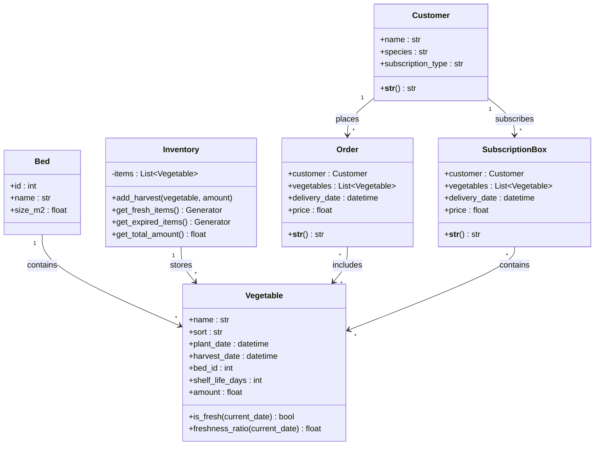

### DLBDSIPWP01 - Einführung in die Programmierung mit Python (Projekt)

---

# Projektabschlussbericht: RabbitFarm – Der Gemüsehof des Hasen

---

## 1. Einleitung und Vision

### 1.1 Projektvision und Ziele

Die RabbitFarm ist eine Python-basierte Farmverwaltungsanwendung für den fiktiven Gemüsehof des Hasen Rudi. Rudi versorgt die Waldtiere mit frischem Gemüse – er plant den Anbau, verwaltet die Ernte und liefert über Abo-Kisten an seine Kunden aus.

**Kernidee:**

- Die App erleichtert Rudi die tägliche Arbeit auf dem Hof.
- Beete und Gemüsesorten werden zentral digital erfasst, sodass Rudi jederzeit darauf zugreifen kann.
- Durch eine Bestandsüberwachung sieht Rudi in Echtzeit, welche Ware frisch, welche abgelaufen und wie lange sie noch haltbar ist.
- Rudi hat jederzeit Zugriff auf Kundendaten und Bestellungen. Er kann Waldtier-Kunden eine Abo-Kiste zuweisen, um regelmäßige Lieferungen zu planen.
- Die Finanzverwaltung läuft automatisch: Sobald eine Bestellung erfasst wird, berechnet die App die Einnahmen.
- Die Anwendung ermöglicht einen Vergleich von Lazy Evaluation und Eager Evaluation anhand simulierter Sensordaten, um die Effizienz beider Ansätze messbar zu machen.

**Ziele:**

1. Den Gemüsehof RabbitFarm digital abbilden
2. Eine moderne Web-UI als Software-as-a-Service bereitstellen
3. Im Bereich Sensordaten Lazy vs. Eager Evaluation vergleichen (Benchmark mit Zeit- und Speichermessung)

---

### 1.2 Wissenschaftliche Herausforderung / Python-spezifischer Aspekt

Im Mittelpunkt dieses Projekts steht **Lazy Evaluation** und der speichereffiziente Umgang mit **Datenströmen**. Python wertet Ausdrücke standardmäßig **eager** aus – Ergebnisse werden sofort berechnet und vollständig im Speicher abgelegt (Mertz, 2015). Das ist beim Debuggen praktisch, führt aber bei großen oder theoretisch unendlichen Datenmengen zu hohem Speicherverbrauch. Lazy Evaluation hingegen berechnet Werte erst dann, wenn sie tatsächlich benötigt werden. Python unterstützt dieses Verhalten über **Generatoren** (`yield`) und **itertools** (`islice`, `filter`, `map`, `cycle`). Genau diese Mechanismen setzen wir bei den Sensordaten und im Lagermanagement ein.

Für Python-Entwickler ist das relevant, weil Generatoren es ermöglichen, über theoretisch unbegrenzte Datenmengen zu iterieren, ohne den gesamten Arbeitsspeicher zu beanspruchen (Mahajan & Arora, 2024). In unserem Projekt werden Sensordaten als Stream erzeugt, und wir vergleichen: Alle Daten in eine Liste packen (Eager) vs. die Daten als Pipeline durchlaufen lassen (Lazy). Die Messung erfolgt mit `tracemalloc` und `time.perf_counter()`, sodass der Unterschied nachvollziehbar wird.

**Analogie / „Geschichte" im Projekt:**

Rudi der Hase liebte es, mit seinen Eltern zu spielen. Doch sie hatten kaum Zeit – Tag für Tag arbeiteten sie auf den Feldern, um genug Gemüse nach Hause zu bringen. Rudi wartete oft am Feldrand, voller Hoffnung auf gemeinsame Zeit.

Eines Tages fasste er einen Entschluss: Wenn er groß ist, wird er seinen Eltern helfen. Er analysierte die Situation:

- Die Eltern arbeiteten hart, aber ohne klare Planung.
- Nur die Mutter hatte den Überblick über Ernte, Lagerbestand und Verkauf. Wenn sie nicht vor Ort war, lief alles schief.
- Es wurde manchmal zu viel, aber oft zu wenig geerntet – Ware ging kaputt oder Verkaufschancen blieben ungenutzt.

Nach zwei Monaten Mitarbeit und Dokumentation entwickelte Rudi einen Plan:

- Bestand digital aufzeichnen
- Kunden und Verkäufe dokumentieren
- Beete automatisch analysieren, damit die Eltern nicht alles manuell prüfen müssen (Sensoren)

So entstand die RabbitFarm – entwickelt mit seinem besten Freund Python, der Schlange. Nach anfänglicher Eingewöhnung erkannten die Eltern, wie effektiv das System ist. Die Arbeit wurde erleichtert und effizienter. Aus Dankbarkeit übergab der Vater die Farm an Rudi.

---

### 1.3 Arbeitshypothese

**Formulierte Hypothese:**

„Lazy Evaluation mit Python-Generatoren und itertools reduziert den Speicherverbrauch im Vergleich zur Eager Evaluation. Bei kleinen Datenmengen ist der Unterschied gering, aber bei 10.000, 100.000 oder über 1.000.000 Messwerten wird die Effizienz von Lazy Evaluation deutlich sichtbar."

**Messgrößen (Domänenentitäten des Projekts):**

- **Peak Memory Usage** in MB: Gemessen mit `tracemalloc` während der Verarbeitung von N Sensordaten.
- **Processing Time** in Sekunden: Gemessen mit `time.perf_counter()` für `process_eager` bzw. `process_lazy` über N Werte.

Die Überprüfung erfolgt im Jupyter-Notebook (`static/notebooks/layz_vs_eager.ipynb`) sowie in der Web-UI auf der Seite „Sensordaten". Dadurch kann der Nutzer selbst nachvollziehen, welche Evaluationsstrategie tatsächlich effizienter ist.

---

## 2. Requirements Engineering

### 2.1 Kontextdiagramm

Die RabbitFarm steht in Wechselwirkung mit folgenden externen Akteuren und Systemen:

- **Rudi:** Hauptnutzer der Anwendung. Er verwaltet Beete, Gemüse, Lager, Kunden, Bestellungen und Finanzen über die Web-UI.
- **Waldtiere (Kunden):** Fiktive Abnehmer, die als Kunden in der App hinterlegt werden und Bestellungen bzw. Abo-Kisten aufgeben können.
- **Sensorsystem:** Liefert kontinuierlich simulierte Sensordaten der Bodenfeuchtigkeit. Im Projekt wird dies durch den Generator `stream_soil_moisture` in `sensors.py` realisiert.
- **Dateisystem:** Dient als Persistenzschicht (JSON-basiert).

**Kontextdiagramm (textuell):**

```
                    +------------------+
                    |  Rudi (Nutzer)   |
                    +--------+---------+
                             | nutzt
                             v
+------------------+    +---------+    +------------------+
| Sensorsystem     |--->| Rabbit  |<---| Dateisystem      |
| (Bodenfeucht.)   |    | Farm    |    | (rabbitfarm_     |
+------------------+    | (App)   |    |  data.json)      |
                        +----+----+    +------------------+
                             ^
                             | Bestellungen / Abos
                    +--------+--------+
                    | Waldtier-Kunden |
                    | (Daten in App)  |
                    +-----------------+
```

Die Web-UI ist Bestandteil des Systems. Der Client nutzt den Browser und kommuniziert per HTTP-Anfragen mit dem Server, dem Kern der App.

---

### 2.2 Funktionale Anforderungen

Die funktionalen Anforderungen sind mit IDs versehen, um Traceability zu Tests und Implementierung sicherzustellen.

| ID | Beschreibung | Priorität | Umsetzung (Kurz) |
|----|--------------|-----------|-------------------|
| REQ-01 | Beet-Verwaltung: Anlegen und Auflisten von Beeten (ID, Name, Größe m²) | Must | `Bed` in `models.py`; Web: `/beds`, Formular + Tabelle |
| REQ-02 | Gemüsesorten-Katalog: Name, Sorte, Pflanz-/Erntedatum, Beet-Zuordnung, Haltbarkeit, Menge | Must | `Vegetable` in `models.py`; Web: `/vegetables` |
| REQ-03 | Pflanzplanung: Gemüse manuell einem Beet zuordnen | Must | Gemüse-Formular mit Beet-Dropdown |
| REQ-04 | Bestandsüberwachung: Geerntetes Gemüse im Lager verwalten | Must | `Inventory` mit `add_harvest()`; Web: `/inventory` |
| REQ-05 | Haltbarkeitslogik: Frische prüfen (`is_fresh`, `freshness_ratio`), abgelaufene Ware identifizieren | Must | `Vegetable.is_fresh()`, `Inventory.get_expired_items()` (Generator) |
| REQ-06 | Bestandsabfrage: Echtzeit-Übersicht über Lagerbestand und Frische | Must | `/inventory` mit frischer/abgelaufener Ware und Gesamtmenge |
| REQ-07 | Kunden-Datenbank: Name, Tierart, Abo-Typ | Must | `Customer` in `models.py`; Web: `/customers` |
| REQ-08 | Abo-Kisten-System: Generatorbasierte Box-Generierung | Must | `generate_subscription_boxes()` in `services.py` (`itertools.cycle`, `islice`) |
| REQ-09 | Bestellabwicklung: Bestellungen mit Kunde, Gemüse, Lieferdatum, Preis | Must | `Order` in `models.py`; Web: `/orders` |
| REQ-10 | Ausgaben-Tracking (optional) und Einnahmen-Berechnung | Must | `calculate_profit()` in `services.py`; Web: `/finances` |
| REQ-11 | Gewinn-/Verlustrechnung: Revenue, optional Expenses, Profit, Marge | Must | Finanzseite mit Summen und Bestellliste |
| REQ-12 | Dashboard mit Übersicht und Schnellzugriff auf alle Bereiche | Must | `/` mit Kacheln zu Gemüse, Beeten, Lager, Kunden, Bestellungen, Finanzen, Sensordaten |
| REQ-13 | Sensordaten-Stream: Kontinuierliche Bodenfeuchtigkeits-Messwerte (simuliert) | Must | `stream_soil_moisture()` in `sensors.py` (Generator) |
| REQ-14 | Generatorbasierte Verarbeitung: Filter/Map über Sensordaten ohne vollständige Materialisierung | Must | `process_lazy()` in `sensor_benchmark.py` (`filter`, `map`, `islice`) |
| REQ-15 | Performance-Benchmark: Eager vs. Lazy mit Zeit- und Speichermessung | Must | `benchmark_eager()`, `benchmark_lazy()` in `sensor_benchmark.py`; Web: `/sensors` |

---

### 2.3 Nicht-funktionale Anforderungen (Qualitätsanforderungen)

| ID | Kategorie (ISO 25010) | Anforderung | Maßnahme |
|----|------------------------|-------------|----------|
| NF-01 | Performance Efficiency / Ressourcennutzung | Lazy Evaluation soll bei 10.000+ Sensordatenpunkten messbar weniger RAM verbrauchen als Eager | Benchmark mit `tracemalloc`; Ziel: deutliche Reduktion des Peak-Speichers |
| NF-02 | Funktionalität / Datenintegrität | Persistente Daten konsistent und wiederherstellbar | JSON-Persistenz in `data_manager`; `save_data()` bei Änderungen; `load_data()` beim Start |
| NF-03 | Wartbarkeit / Modifizierbarkeit | Klare Trennung Kern vs. Oberfläche; Erweiterung ohne Änderung des Kerns | Modulare Struktur: `models`, `data_manager`, `services`, `sensors`, `sensor_benchmark` ohne Flask-Abhängigkeit |
| NF-04 | Zuverlässigkeit / Reproduzierbarkeit | Benchmark-Ergebnisse nachvollziehbar | Feste Parameter (Beet-ID, N, Schwellwerte); optional Seed für Zufall in Sensordaten |
| NF-05 | Benutzerfreundlichkeit (Usability) | Klare, konsistente Bedienung der Web-App | Einheitliches Layout (Sidebar), Bootstrap, deutsche Beschriftungen, Fehlermeldungen bei ungültigen Eingaben |

---

### 2.4 Use-Case-Modellierung

Typische Interaktionen der Nutzer mit dem System:

1. **Beete verwalten (Rudi):** Beete anlegen (Name, Größe), Liste einsehen. Use Case „Beet anlegen" / „Beetliste anzeigen".
2. **Gemüse pflanzen (Rudi):** Neues Gemüse anlegen (Name, Sorte, Beet, Pflanz-/Erntedatum, Haltbarkeit, Menge). Use Case „Gemüse anpflanzen".
3. **Lager prüfen (Rudi):** Lagerbestand einsehen; Ernte einlagern (Gemüse + Menge); frische vs. abgelaufene Ware unterscheiden. Use Case „Lagerbestand anzeigen", „Ernte einlagern".
4. **Kunden verwalten (Rudi):** Kunden anlegen (Name, Tierart, Abo-Typ), Kundenliste anzeigen. Use Case „Kunde anlegen".
5. **Bestellungen verwalten (Rudi):** Bestellung aufgeben (Kunde, Gemüse, Lieferzeit, Preis); Bestellhistorie einsehen. Use Case „Bestellung aufgeben", „Bestellhistorie anzeigen".
6. **Finanzen analysieren (Rudi):** Gesamteinnahmen und Bestellliste einsehen. Use Case „Finanzübersicht anzeigen".
7. **Sensordaten verarbeiten / Benchmark (Rudi):** Beet und Anzahl Messwerte wählen; Eager- und Lazy-Benchmark ausführen; Laufzeit, Speicher und Vergleich anzeigen. Use Case „Lazy vs. Eager testen".

Die Abhängigkeiten (z. B. „Bestellung aufgeben" setzt Kunden und Gemüse voraus, „Ernte einlagern" setzt Gemüse voraus) sind in der Web-UI durch Dropdowns und Validierung abgebildet. Ein Use-Case-Diagramm in Mermaid-Notation ist im Konzeptionsplan (Abschnitt 3.2) zu finden.

---

## 3. Architektur und Tech-Stack

### 3.1 Auswahl der Plattform (Begründung)

Für die Oberfläche wurde eine klassische **Web-Anwendung mit Flask** gewählt. Die Darstellung erfolgt im Browser über serverseitig gerenderte HTML-Seiten (Jinja2-Templates) mit einer festen Sidebar-Navigation. Die Anwendung fungiert als SaaS-artige App, mit der Rudi kontinuierlich arbeiten kann.

**Begründung gegenüber Alternativen:**

- **Desktop-GUI (tkinter, PyQt):** Eine Web-UI ist nicht an eine lokale Python-Installation gebunden und von jedem Gerät mit Browser erreichbar – ob Desktop, Tablet oder Mobiltelefon.
- **Streamlit:** Bietet zwar schnelle Prototypen, schränkt aber die individuelle Gestaltung ein und setzt ein Streamlit-spezifisches Programmiermodell voraus.

**Rolle der Jupyter-Notebooks:** Sie dienen primär der wissenschaftlichen Auswertung und Visualisierung (Lazy vs. Eager). Die Web-UI enthält eine eigene Benchmark-Seite, die dieselbe Kernlogik nutzt.

---

### 3.2 Modularer Kern und Open-Closed Principle

**Schichtenüberblick:**

```
┌─────────────────────────────────────────────────────────────────┐
│  Präsentation                                                   │
│  • Web-UI: src/web/ (Flask, routes.py, templates/, static/)     │
│  • Optional: Terminal-App (src/terminal-app/), Jupyter-Notebooks│
└───────────────────────────────┬─────────────────────────────────┘
                                │ importiert / nutzt
                                ▼
┌─────────────────────────────────────────────────────────────────┐
│  Kern (Domain + Application)                                    │
│  • models.py         – Vegetable, Bed, Customer, Order, …       │
│  • data_manager.py   – load_data(), save_data(), JSON           │
│  • services.py       – calculate_profit(), generate_sub…boxes() │
│  • sensors.py        – stream_soil_moisture()                   │
│  • sensor_benchmark.py – process_eager, process_lazy, benchmark │
└───────────────────────────────┬─────────────────────────────────┘
                                │ liest / schreibt
                                ▼
┌─────────────────────────────────────────────────────────────────┐
│  Persistenz                                                     │
│  • data/rabbitfarm_data.json                                    │
└─────────────────────────────────────────────────────────────────┘
```

**Abhängigkeitsrichtung:** Die Web-App importiert nur aus dem Kern (`data_manager`, `models`, `sensor_benchmark`). Der Kern importiert weder Flask noch andere UI-Bibliotheken – er nutzt ausschließlich die Standardbibliothek (`datetime`, `json`, `itertools`, `tracemalloc`, `time`) und die eigenen Module. Domänenlogik (Frische, Bewässerungsbedarf, Gewinnmarge) liegt zentral und wird von allen Oberflächen gemeinsam genutzt.

**Konkrete Zuordnung:**

| Komponente | Verantwortung | Abhängigkeiten |
|------------|----------------|-----------------|
| `models.py` | Dataclasses, `is_fresh()`, `freshness_ratio()`, `add_harvest()`, Generatoren im Inventory | stdlib (`datetime`, `typing`, `dataclasses`) |
| `data_manager.py` | Laden/Speichern aller Entitäten | `models`, `os`, `json` |
| `services.py` | Abo-Box-Generierung, Gewinnberechnung | `models`, `itertools` |
| `sensors.py` | Generator Bodenfeuchtigkeit | `random`, `datetime`, `typing` |
| `sensor_benchmark.py` | `process_eager`, `process_lazy`, `benchmark_eager`, `benchmark_lazy` | `sensors`, `itertools`, `time`, `tracemalloc`, `sys` |
| `src/web/` | Routen, Templates, Formulare | Flask, Kern-Module |

---

### 3.3 Technologie-Stack

| Kategorie | Technologie | Version / Quelle | Rolle im Projekt |
|-----------|-------------|------------------|-------------------|
| **Sprache** | Python | 3.10+ | Laufzeitumgebung |
| **Web-Framework** | Flask | ≥ 2.0 | Routing, Request/Response, WSGI-App; Blueprint für Routen |
| **Templating** | Jinja2 | (mit Flask) | HTML-Seiten (layout, index, vegetables, beds, inventory, customers, orders, finance, sensors) |
| **Frontend** | Bootstrap | 5.3.2 (CDN) | Layout, Grid, Formulare, Tabellen, Karten |
| **Icons** | Bootstrap Icons | 1.11.1 (CDN) | Sidebar, Dashboard, Buttons |
| **Persistenz** | JSON (stdlib) | – | `data/rabbitfarm_data.json`; Ein-/Ausgabe über `data_manager` |
| **Datenverarbeitung** | pandas | ≥ 1.3 | Auswertung und Tabellen in Notebooks |
| **Numerik** | NumPy | ≥ 1.21 | Basis für pandas und numerische Auswertungen |
| **Visualisierung** | Matplotlib | ≥ 3.5 | Plots in Jupyter-Notebooks (Lazy vs. Eager) |
| **Notebooks** | Jupyter, ipykernel, ipywidgets | siehe requirements.txt | Wissenschaftliche Auswertung und Demos |
| **Speicheranalyse** | tracemalloc, memory-profiler | stdlib / ≥ 0.60 | Benchmark Speicherverbrauch; `tracemalloc` in `sensor_benchmark` |
| **itertools** | stdlib | – | `islice`, `filter`, `map`, `cycle` für Lazy-Pipelines und Abo-Boxen |
| **Testing** | pytest | ≥ 7.0 | Unit- und Integrationstests |

**Abhängigkeiten laut `src/requirements.txt`:**

```
matplotlib>=3.5.0
numpy>=1.21.0
pandas>=1.3.0
memory-profiler>=0.60.0
jupyter>=1.0.0
ipykernel>=6.0.0
ipywidgets>=7.6.0
flask>=2.0.0
pytest>=7.0.0
```

Die Web-UI benötigt davon mindestens Flask. Matplotlib, NumPy, pandas, Jupyter und memory-profiler werden in den Jupyter-Notebooks genutzt. Die im Web verwendete Benchmark-Logik nutzt nur die Standardbibliothek (`tracemalloc`, `itertools`) und das Modul `sensors`.

---

## 4. Design und Modellierung (Die "Story")

### 4.1 Domänenmodell und UML-Klassendiagramm

**Die „Geschichte":** Rudi bewirtschaftet Beete, pflanzt Gemüse, lagert Ernten ein, verwaltet Kunden und Bestellungen. Die Objekte der Domäne sind **Beete (Bed)**, **Gemüse (Vegetable)**, **Kunden (Customer)**, **Bestellungen (Order)**, **Abo-Kisten (SubscriptionBox)** und das **Lager (Inventory)** mit darin enthaltenem Gemüse. Sensordaten (Bodenfeuchtigkeit) werden pro Beet als Strom geliefert und für Bewässerungsempfehlungen verarbeitet.

**Klassendiagramm (Mermaid):**



- **Vegetable:** Gemüsesorte mit Pflanz-/Erntedatum, Haltbarkeit (`shelf_life_days`) und Methoden zur Frische (`is_fresh`, `freshness_ratio`).
- **Bed:** Anbaufläche mit ID, Name und Größe (m²).
- **Customer:** Kunde (Name, Tierart, Abo-Typ).
- **Order / SubscriptionBox:** Bestellung bzw. Abo-Kiste mit Kunde, Gemüseliste, Lieferdatum und Preis.
- **Inventory:** Liste von `Vegetable`; `add_harvest` fügt geerntetes Gemüse hinzu; `get_fresh_items` und `get_expired_items` liefern Generatoren.

---

### 4.2 Verhaltensdiagramme: Activity- und State-Diagramm

**Activity-Diagramm – Ablauf „Ernte einlagern und Lager anzeigen":**

1. Nutzer wählt auf `/inventory` ein Gemüse (aus vorhandenen Vegetables) und eine Menge.
2. POST an `/inventory` → Route ruft `data_manager.inventory.add_harvest(veg, amount)` auf.
3. `add_harvest` erstellt ein neues `Vegetable` mit der angegebenen Menge und hängt es an `inventory.items` an.
4. Route ruft `data_manager.save_data()` auf → JSON wird geschrieben.
5. Redirect auf `/inventory` → GET liefert Seite mit `get_fresh_items()`, `get_expired_items()`, `get_total_amount()`; Template zeigt frische/abgelaufene Ware und Gesamtmenge.

**State-Diagramm – Lebenszyklus „Gemüse (Vegetable)":**

- **Angepflanzt:** Gemüse ist angelegt (`plant_date`, `harvest_date`, `bed_id`, …).
- **Geerntet:** Erntedatum erreicht; kann ins Lager (`add_harvest`) oder in eine Bestellung.
- **Im Lager:** Eintrag in `inventory.items`; Zustand **frisch** (innerhalb `shelf_life_days`) oder **abgelaufen** (außerhalb), bestimmt durch `is_fresh()` / `freshness_ratio()`.
- **Verkauft / in Bestellung:** Gemüse referenziert in einer `Order` (Kopie der Attribute in der serialisierten Bestellung).

---

### 4.3 Interaktionsdiagramm: Sequence-Diagramm

**Sequenz „Sensordaten-Benchmark (Web)":**

1. Nutzer öffnet `/sensors`, wählt Beet und Anzahl Messwerte, klickt „Eager & Lazy testen".
2. Browser sendet POST mit `bed_id`, `num_readings`.
3. Route `sensors()` parst Parameter, ruft `benchmark_eager(bed_id, num_readings)` auf.
4. `benchmark_eager`: startet `tracemalloc`, holt mit `islice(stream_soil_moisture(...), num_readings)` eine Liste, ruft `process_eager(data_list)` auf, misst Zeit und Speicher, gibt Dict zurück.
5. Route ruft `benchmark_lazy(bed_id, num_readings)` auf.
6. `benchmark_lazy`: startet `tracemalloc`, übergibt `islice(stream_soil_moisture(...), num_readings)` (Iterator) an `process_lazy`, misst Zeit und Speicher, gibt Dict zurück.
7. Route rendert Template mit `result_eager` und `result_lazy`; Browser zeigt zwei Karten (Eager / Lazy) und Vergleich.

**Sequenz „Bestellung aufgeben":**

1. Nutzer auf `/orders`, wählt Kunde, Gemüse (Mehrfachauswahl), Lieferzeit, Preis → POST.
2. Route liest Indizes, holt `Customer` und `Vegetable`-Liste aus `data_manager`, erstellt `Order`, hängt an `data_manager.orders` an, ruft `save_data()` auf, Redirect auf `/orders`.

---

### 4.4 Design Patterns und Prinzipien

- **MVC-ähnliche Trennung:** Modelle (`models.py`) halten Daten und Domänenlogik; die Web-UI (View) rendert Templates; die Routen (Controller-ähnlich) vermitteln zwischen Request und Kern. Geschäftslogik liegt nicht in den Routen, sondern wird über `data_manager`, `services` und `sensor_benchmark` aufgerufen.
- **Generator / Iterator (Lazy):** Sensordaten-Stream, Lager-Filterung und Abo-Kisten-Generierung nutzen `yield` bzw. `filter`/`map`/`islice`, um Daten erst bei Bedarf zu erzeugen – Vermeidung großer Listen im Speicher.
- **Single Responsibility:** Jedes Modul hat eine klar abgegrenzte Aufgabe (models: Domäne; data_manager: Persistenz; services: Abos/Finanzen; sensors: Stream; sensor_benchmark: Benchmark).
- **DRY:** Persistenz-Logik nur in `data_manager`; Frische-Logik nur in `Vegetable`; Benchmark-Logik nur in `sensor_benchmark`.
- **KISS:** Keine übermäßige Abstraktion; direkte Nutzung von Dataclasses, Listen und Generatoren.
- **Open-Closed:** Der Kern ist erweiterbar durch neue Funktionen/Module, ohne bestehende Routen oder Modelle zu verändern. Neue Oberflächen (z. B. REST-API) können denselben Kern nutzen.

---

## 5. Wissenschaftliche Problemstellung (Jupyter Notebook)

### 5.1 Methodik der Untersuchung

Im theoretischen Hintergrund haben wir uns mit der Frage beschäftigt: *Wie lassen sich Daten aus einem Stream speichereffizient transformieren?* und *Worin liegt der Unterschied zwischen Lazy und Eager Evaluation in Python?*

**Forschungsfrage:** Wie verändert sich das Speicher- und Laufzeitverhalten, wenn Sensordatenströme mit Generatoren (Lazy) verarbeitet werden statt mit Listen (Eager)?

**Datenmodell:** Wir simulieren Bodenfeuchtigkeits-Messwerte pro Beet. Jeder Wert ist ein Dictionary mit `bed_id`, `moisture` (0–100) und `timestamp`. Der Stream kann theoretisch unendlich laufen – für den Benchmark begrenzen wir ihn mit `itertools.islice` auf N Werte.

**Eager-Ansatz (`process_eager`):** Alle N Werte werden aus dem Stream geholt und in einer Liste materialisiert. Anschließend wird gefiltert (Feuchtigkeit unter 35 oder über 80) und der Bewässerungsbedarf berechnet. Die gesamte Liste liegt während der Verarbeitung im Speicher.

**Lazy-Ansatz (`process_lazy`):** Der Stream bleibt ein Iterator. `filter()` und `map()` werden als Pipeline darübergelegt, und erst am Ende wird das Ergebnis materialisiert. Dazwischen liegt nie die komplette Rohdaten-Liste im RAM.

**Messgrößen:** Peak-Speicher in MB (`tracemalloc`), Laufzeit in Sekunden (`time.perf_counter()`), und die Größe der Datenstruktur (`sys.getsizeof`). Im Notebook werden verschiedene N durchlaufen (z. B. 10.000, 100.000, 1.000.000), die Ergebnisse in Tabellen erfasst und als Plots dargestellt. Der Aufbau ist in `static/notebooks/layz_vs_eager.ipynb` dokumentiert.

---

### 5.2 Analyse und Demonstration

Die Benchmarks für verschiedene N (10.000, 100.000, 1.000.000) bestätigen die Hypothese: Bei Eager steigt der Peak-Speicher proportional zur Datenmenge, weil die gesamte Liste allokiert wird. Bei Lazy bleibt der Speicherverbrauch nahezu konstant, da nur der Iterator und die Pipeline im Speicher gehalten werden. Die Laufzeit ist bei Lazy vergleichbar oder besser, weil weniger Speicherallokationen stattfinden.

Die Plots im Notebook zeigen den Verlauf von Speicherverbrauch und Laufzeit über N für beide Ansätze. Die Ergebnisse sind über die Web-UI unter „Sensordaten" reproduzierbar: Der Nutzer wählt ein Beet und die Anzahl der Messwerte und sieht die Ergebnisse beider Strategien im direkten Vergleich.

Für die detaillierte Auswertung mit Tabellen und Diagrammen sei auf das Jupyter-Notebook `static/notebooks/layz_vs_eager.ipynb` verwiesen.

---

## 6. Implementierung und Qualitätssicherung

### 6.1 Code-Struktur und Dokumentation

**Projektstruktur:** Ein gemeinsamer **Kern** in `src/` (`models`, `data_manager`, `services`, `sensors`, `sensor_benchmark`) wird von der Web-UI (`src/web/`) genutzt. Jupyter-Notebooks befinden sich in `static/notebooks/`, Daten in `data/`, Dokumentation in `docs/`, Tests in `tests/`.

**Englischsprachige Programmierung:** Modul-, Funktions- und Variablennamen sind auf Englisch gehalten; nutzersichtbare Texte in der Web-UI sind auf Deutsch. **Docstrings** sind für Module und zentrale Funktionen vorhanden. Die README unter `src/web/` beschreibt Struktur und Start (`python -m src.web.main`).

---

### 6.2 Test-Konzept: Unit-Tests

Die Unit-Tests befinden sich in `tests/` und werden mit **pytest** ausgeführt. Sie decken folgende Kernbereiche ab:

**Domänenmodelle (`test_models.py`):**

- `Vegetable.is_fresh()`: Prüft, ob frisches Gemüse korrekt als frisch erkannt wird.
- `Vegetable.freshness_ratio()`: Prüft die Frische-Ratio bei verschiedenen Zeitpunkten (frisch, halb abgelaufen, abgelaufen).
- `Inventory.add_harvest()`: Prüft, dass eingelagerte Ware korrekt in der Items-Liste erscheint.
- `Inventory.get_fresh_items()`: Prüft, dass der Generator nur frische Ware liefert.
- `Inventory.get_expired_items()`: Prüft, dass der Generator nur abgelaufene Ware liefert.
- `Inventory.get_total_amount()`: Prüft die Summenberechnung der Lagermengen.

**Business-Logik (`test_services.py`):**

- `generate_subscription_boxes()`: Prüft Anzahl, Preis und Gemüse-Zuordnung der generierten Abo-Kisten.
- `calculate_profit()`: Prüft Gewinnberechnung mit und ohne Bestellungen.

**Sensordaten (`test_sensors.py`):**

- `stream_soil_moisture()`: Prüft, dass der Generator gültige Dicts mit `bed_id`, `moisture` und `timestamp` liefert und der Feuchtigkeitswert im Bereich 0–100 liegt.

**Benchmark (`test_sensor_benchmark.py`):**

- `process_eager()`: Prüft, dass nur Werte außerhalb des Normalbereichs gefiltert werden.
- `process_lazy()`: Prüft dasselbe Verhalten für die Lazy-Pipeline.
- `benchmark_eager()` und `benchmark_lazy()`: Prüft, dass die Benchmark-Funktionen gültige Ergebnisdicts mit `time`, `peak_memory_mb`, `data_size_mb` und `result_count` zurückgeben.

**Ausführung:** `pytest tests/ -v` aus dem Verzeichnis `g03`.

---

### 6.3 Integrationstests und Traceability

Die Integrationstests befinden sich in `tests/test_integration.py` und prüfen das Zusammenspiel mehrerer Komponenten. Sie sind explizit den Software-Requirements zugeordnet:

| Test-ID | Beschreibung | Zugeordnete REQs |
|---------|--------------|-------------------|
| **INT-01** | Workflow: Beet anlegen → Gemüse anlegen → Gemüse hat korrekte `bed_id` | REQ-01, REQ-02, REQ-03 |
| **INT-02** | Workflow: Gemüse anlegen → Ernte einlagern → Frische/Abgelaufene Ware prüfen → Gesamtmenge stimmt | REQ-04, REQ-05, REQ-06 |
| **INT-03** | Workflow: Kunde anlegen → Bestellung aufgeben → Gewinn berechnen → Einnahmen korrekt | REQ-07, REQ-09, REQ-10, REQ-11 |
| **INT-04** | Workflow: Sensordaten streamen → Eager- und Lazy-Benchmark ausführen → Ergebnisse vergleichbar | REQ-13, REQ-14, REQ-15 |
| **INT-05** | Workflow: Abo-Kisten generieren → Korrekte Anzahl und Kundendzuordnung | REQ-07, REQ-08 |

**Ausführung:** `pytest tests/test_integration.py -v` aus dem Verzeichnis `g03`.

---

### 6.4 CI-Pipeline

Die CI-Pipeline ist über GitHub Actions (`.github/workflows/python-check.yml`) automatisiert und läuft bei jedem Push auf `main` sowie bei Pull Requests.

**Befehlsreihenfolge:**

1. `pip install -r requirements.txt` – Abhängigkeiten installieren
2. `pip install ruff pytest` – Linting- und Test-Tools installieren
3. `ruff format --check .` – Code-Formatierung prüfen (PEP 8 / Black-kompatibel)
4. `ruff check .` – Linting-Regeln prüfen
5. `pytest` – Unit- und Integrationstests ausführen

**Pre-Commit-Hooks** (lokal, `.pre-commit-config.yaml`): `end-of-file-fixer`, `trailing-whitespace`, `mixed-line-ending`, `ruff`, `ruff-format`.

**Konfiguration** (`pyproject.toml`): `quote-style = "double"`, `indent-style = "space"`, `line-ending = "auto"`.

---

## 7. Software-Qualität nach ISO 25010

| Kategorie | Bewertung | Begründung |
|-----------|-----------|------------|
| **Wartbarkeit** | Hoch | Modulare Struktur mit klarer Trennung von Kern und Oberfläche. Docstrings vorhanden. Erweiterung um neue Module möglich, ohne bestehenden Code zu verändern. |
| **Funktionalität** | Hoch | REQ-01 bis REQ-15 vollständig umgesetzt. Traceability von Requirements zu Tests gegeben. |
| **Performance Efficiency** | Mittel bis Hoch | Lazy Evaluation reduziert den Speicherverbrauch bei großen Datenmengen messbar. Die Web-UI ist für den Projektumfang performant. |
| **Usability** | Hoch | Einheitliches Layout mit Sidebar, Bootstrap-basiert, deutsche Beschriftungen, konsistente Navigation. Fehlermeldungen bei ungültigen Eingaben. |
| **Zuverlässigkeit** | Mittel | Stabil unter Normalbedingungen. Grundlegende Validierung und Fehlerbehandlung in den Routen vorhanden. Für eine Produktionsumgebung wäre eine robustere Fehlerbehandlung und Logging wünschenswert. |

---

## 8. Projektabschluss und Reflexion

### 8.1 Methodik und Anpassungen

Die Entwicklung erfolgte in drei Phasen: Zuerst wurden Domänenmodelle und Persistenz aufgebaut, dann die Dienste (Abo-Kisten, Finanzen) und Sensordaten-Logik, und schließlich die Web-UI. Der Lazy/Eager-Benchmark wurde zunächst im Notebook und über die Kommandozeile getestet, bevor er in die Web-UI integriert wurde.

Anpassungen während der Entwicklung betrafen vor allem die Web-Struktur (`src/web/`, `main.py`), die robuste Eingabebehandlung für die Sensordaten-Seite und die Darstellung der Eager/Lazy-Vergleichsergebnisse.

### 8.2 Selbstreflexion

**Arbeitsprozess:** Das Requirements Engineering hat geholfen, den Umfang des Projekts klar zu definieren und Prioritäten zu setzen. Die vergabe von REQ-IDs erleichtert die Traceability zu Tests und Implementierung. Refactorings entstanden dort, wo Schnittstellen zwischen Modulen erst spät spezifiziert wurden.

**Einsatz von KI:** Im Rahmen dieses Projekts wurden KI-gestützte Werkzeuge ergänzend im Entwicklungs- und Schreibprozess eingesetzt. Die fachlichen Inhalte, die technische Umsetzung sowie die zentralen Entscheidungen zur Architektur und Implementierung stammen vollständig von uns. Die KI diente ausschließlich als unterstützendes Hilfsmittel, um bestimmte Arbeitsschritte effizienter zu gestalten.

Konkret wurde KI zunächst zur Recherche verwendet, um einen ersten Überblick über Themen wie Lazy Evaluation, Generatoren und funktionale Programmierung in Python zu erhalten. Dabei half sie, relevante Konzepte schneller einzuordnen und geeignete Lösungsansätze für die wissenschaftliche Fragestellung zu identifizieren. Die eigentliche Auseinandersetzung mit den Quellen und die inhaltliche Bewertung erfolgte anschließend durch uns selbst.

Darüber hinaus wurde KI genutzt, um bestehende Codeabschnitte zu analysieren und Hinweise im Sinne von Clean-Code-Prinzipien zu geben. Dazu gehörten Vorschläge zur besseren Strukturierung von Funktionen, zur Lesbarkeit des Codes, zur konsistenten Benennung von Variablen sowie zur Reduktion unnötiger Komplexität. Wenn einzelne Codepassagen den etablierten Prinzipien nicht entsprachen, wurden entsprechende Verbesserungsvorschläge generiert, die anschließend von uns geprüft und gegebenenfalls übernommen oder angepasst wurden. Ein automatisches Übernehmen fand nicht statt.

Auch bei der Strukturierung von Dokumentationen und der sprachlichen Überarbeitung von Texten kam KI zum Einsatz. Sie half, Formulierungen verständlicher zu gestalten und die Gliederung von Berichten und Konzeptdokumenten zu verbessern. Die inhaltlichen Aussagen blieben dabei stets unverändert.

Beim Refactoring einzelner Codeabschnitte unterstützte die KI zudem beim Erkennen von Wiederholungen und beim Vorschlagen kompakterer Implementierungen. Auch beim Verständnis technischer Konzepte – etwa der Funktionsweise von `tracemalloc` oder der korrekten Nutzung von `itertools` – erwies sich die KI als hilfreich, indem sie Beispiele lieferte, die das Verständnis beschleunigten.

Insgesamt hat der Einsatz von KI den Arbeitsprozess an mehreren Stellen beschleunigt und die Qualität des Codes sowie der Dokumentation verbessert. Gleichzeitig zeigte sich, dass die Vorschläge der KI nicht immer direkt anwendbar waren und einer kritischen Prüfung bedurften. Insbesondere bei domänenspezifischen Entscheidungen und der Einordnung wissenschaftlicher Quellen stieß die KI an ihre Grenzen. Die Verantwortung für alle inhaltlichen und technischen Entscheidungen lag daher durchgehend bei uns.

### 8.3 Nutzungsanweisung (How-to-use)

**Voraussetzungen:** Python 3.10+, pip.

**Installation:**

```bash
cd src/student_projects/g03
pip install -r src/requirements.txt
```

**App starten:**

```bash
python -m src.web.main
```

Browser öffnen: [http://127.0.0.1:8081](http://127.0.0.1:8081)

**Features:** Dashboard (`/`), Beete (`/beds`), Gemüse (`/vegetables`), Lager (`/inventory`), Kunden (`/customers`), Bestellungen (`/orders`), Finanzen (`/finances`), Sensordaten (`/sensors`).

**Daten:** Gespeichert in `data/rabbitfarm_data.json`.

**Notebooks:** Wissenschaftliche Auswertung in `static/notebooks/`.

**Tests ausführen:**

```bash
pytest tests/ -v
```

### 8.4 Pitch-Video

Im Anhang finden Sie ein kurzes Video: App vorstellen, Funktionen demonstrieren, Lazy vs. Eager und Ergebnisse präsentieren. Tools: OBS Studio, Camtasia oder System-Bildschirmaufnahme.

**Link zum Pitch-Video (YouTube):** 
[G03_Pitch_RudisHasenhof.mp4 ansehen](https://youtu.be/PIPbBWOSbjs)


---

## Anhang

- **README.md (Inhalt)**
- **TESTS**
- **Pitch-Video**
- **UML**
- **Notebooks**

**Glossar:**

| Begriff | Definition |
|--------|------------|
| **Beet (Bed)** | Anbaufläche mit ID, Name und Größe in m². |
| **Eager Evaluation** | Auswertungsstrategie, bei der Ausdrücke sofort und vollständig berechnet werden (z. B. ganze Liste im Speicher). |
| **Generator** | Python-Funktion mit `yield`; liefert Werte nacheinander (lazy), ohne alle auf einmal zu erzeugen. |
| **Lazy Evaluation** | Auswertungsstrategie, bei der Werte erst bei Bedarf berechnet werden; hier: Verarbeitung von Datenströmen mit Generatoren/Iteratoren ohne vollständige Materialisierung. |
| **Lager (Inventory)** | Sammlung eingelagerter Gemüse mit Methoden zum Hinzufügen und zum Abruf frischer/abgelaufener Ware (als Generator). |
| **RabbitFarm** | Name der Anwendung; fiktiver Gemüsehof des Hasen Rudi für die Waldtier-Community. |
| **Rudi** | Fiktiver Farm-Betreiber (Hase), Hauptnutzer der App. |
| **Sensordaten-Stream** | Kontinuierliche Folge von Messwerten (hier: Bodenfeuchtigkeit pro Beet); im Projekt als Generator simuliert. |
| **SubscriptionBox** | Abo-Kiste: Zuordnung von Kunde, Gemüseliste, Lieferdatum und Preis; wird generatorbasiert erzeugt. |
| **Vegetable** | Domänenobjekt Gemüse: Name, Sorte, Pflanz-/Erntedatum, Beet, Haltbarkeit, Menge; Methoden für Frische. |
| **Waldtier-Kunde** | Fiktiver Kunde (Customer) mit Name, Tierart (species) und Abo-Typ. |

---

## Quellenverzeichnis

- Real Python. (2023). Python Lazy Evaluation. Abgerufen von https://realpython.com/python-lazy-evaluation/ .
- Dremio. (2023). Lazy Evaluation. Abgerufen von https://www.dremio.com/wiki/lazy-evaluation/ .
- PyPI. (2024). ipywidgets – Interactive widgets for Jupyter. Abgerufen von https://pypi.org/project/ipywidgets/ .
- Real Python. (2024). Python HTTP Server. Abgerufen von https://realpython.com/python-http-server/ .
- Full Stack Python. (2024). Web Servers. Abgerufen von https://www.fullstackpython.com/web-servers.html .
- Project Jupyter. (2024). Project Jupyter – Official Website. Abgerufen von https://jupyter.org/ .
- Jupyter Documentation. (2024). Jupyter Notebook Documentation. Abgerufen von https://jupyter-notebook.readthedocs.io/en/stable/notebook.html .
- Python Software Foundation. (2024). Python Documentation. Abgerufen von https://docs.python.org/3/ .
- Python Software Foundation. (2024). http.server — HTTP servers. Abgerufen von https://docs.python.org/3/library/http.server.html .
- Stack Overflow. (2024). Python Questions and Answers. Abgerufen von https://stackoverflow.com/ .
- Heise Online. (2024). Python – Programmiersprache und Anwendungen. Abgerufen von https://www.heise.de/thema/Python .

### Wissenschaftliche Literatur

- Al Awar, N. et al. (2025). Dynamic Fusing HPC Kernels in Python.
- Ansel, J. et al. (2024). PyTorch 2: Faster Machine Learning Through Dynamic Python Bytecode Transformation and Graph Compilation.
- Mahajan, M. & Arora, S. (2024). Improving Performance of Data Science Applications in Python.
- Yang, Y. et al. (2022). Complex Python Features in the Wild.
- Mertz, D. (2015). Functional Programming in Python. O'Reilly Media.

### Zusätzliche Literatur

- Akidau, T. et al. (2015). The Dataflow Model. Google Research / O'Reilly (Streaming Systems). https://research.google/pubs/pub38137/
- Dean, J. & Ghemawat, S. (2004). MapReduce: Simplified Data Processing on Large Clusters. OSDI 2004. https://research.google/pubs/pub62/
- Hughes, J. (1984). Why Functional Programming Matters. https://www.cs.kent.ac.uk/people/staff/dat/marc/FP/hughes.pdf
- Peyton Jones, S. (1992). The Implementation of Functional Programming Languages.
- Lam, S. K., Pitrou, A. & Seibert, S. (2015). Numba: A LLVM-based Python JIT Compiler. https://arxiv.org/abs/1506.01356
- NumPy Documentation — Vectorized Operations and Broadcasting. https://numpy.org/doc/
- PEP 318 — Decorators for Functions and Methods. https://peps.python.org/pep-0318/
- Python `itertools` Documentation. https://docs.python.org/3/library/itertools.html
- PEP 255 / PEP 342 — Generators and Coroutines. https://peps.python.org/
- Archive.org. (o. J.). Functional Programming in Python. Abgerufen von https://archive.org/details/functional-programming-python/page/n33/mode/2up .
- Wikipedia. (2024). Lazy Evaluation. Abgerufen von https://de.wikipedia.org/wiki/Lazy_Evaluation .
- DataCamp. (2024). Python Polars Tutorial – Complete Guide for Beginners. Abgerufen von https://www.datacamp.com/de/tutorial/python-polars-tutorial-complete-guide-for-beginners .
- Reddit. (2024). Question related to Lazy Evaluation. Abgerufen von https://www.reddit.com/r/learnpython/comments/1pia00j/question_related_to_lazy_evaluation/?tl=de .
- LinkedIn. (2024). What is Lazy Evaluation and how does it work in functional programming? Abgerufen von https://www.linkedin.com/advice/0/what-lazy-evaluation-how-does-work-functional-programming-looac?lang=de .
- Stack Overflow. (2024). What is the trade-off between lazy and strict (eager) evaluation? Abgerufen von https://stackoverflow.com/questions/75680491/what-is-the-trade-off-between-lazy-and-strict-eager- .

---