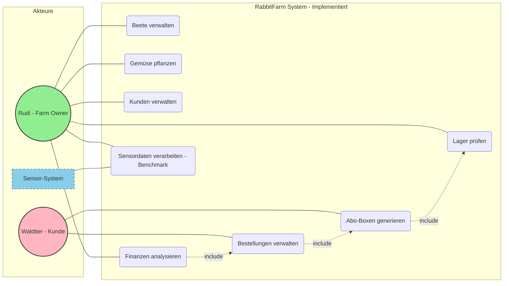
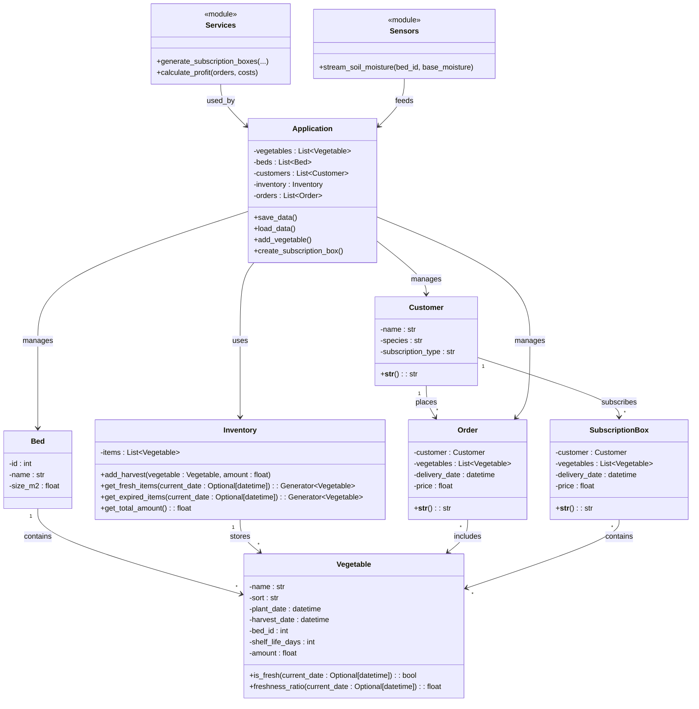

# Projektkonzept: RabbitFarm – Der Gemüsehof des Hasen

## 1. Projektübersicht & Zielsetzung

### Was ist der Zweck der Anwendung?
Rudi, der Hase, steht vor einer komplexen Herausforderung: Die Verwaltung eines nachhaltigen Gemüsehofs, der die gesamte Waldtier-Community mit frischem Gemüse versorgt. Von der Anbauplanung über die Ernteverwaltung bis hin zur Auslieferung von Abo-Kisten – die Komplexität übersteigt die Kapazität traditioneller Verwaltungsmethoden.

Das Ziel ist die Entwicklung einer **Python-basierten Farmverwaltungsanwendung**, die nicht nur den operativen Betrieb optimiert, sondern durch wissenschaftliche Methoden beweist, dass **Lazy Evaluation** und funktionale Programmierung bei der Verarbeitung kontinuierlicher Sensordatenströme speichereffizienter ist als klassische Eager-Verarbeitung.

### Was soll die Anwendung können?
1. **Farmverwaltung:** Digitalisierung aller Anbauflächen, Gemüsesorten und Ernteprozesse
2. **Lagerwirtschaft:** Echtzeitüberwachung von Beständen, Frische und Haltbarkeit
3. **Kundenmanagement:** Verwaltung von Abo-Kisten und Lieferungen an Waldtiere
4. **Finanzcontrolling:** Erfassung und Analyse von Gewinnen, Ausgaben und Investitionen
5. **Datenvisualisierung:** Grafische Darstellung von Ernteerträgen über mehrere Saisons
6. **Wissenschaftlicher Beweis:** Demonstration der Speichereffizienz von Lazy Evaluation bei der Verarbeitung von Sensor-Datenströmen (Bodenfeuchtigkeit, Temperatur, Wachstumsdaten)

---

## 2. Requirements (Anforderungen)

### 2.1 Funktionale Anforderungen

#### **Priorität 1: Must Have**

**Anbauflächen-Management:**
* **F01 – Beet-Verwaltung:** (Klasse `Bed` in `models.py`)
    * Beet-ID, Größe (m²), Name
    * Funktionen: `add_bed()`, `list_beds()`, `manage_beds()` in `main.py`
* **F02 – Gemüsesorten-Katalog:** (Klasse `Vegetable` in `models.py`)
    * Name, Sorte, Wachstumsdauer, Haltbarkeit, Menge
    * Pflanzzeit, Erntezeit, Beet-Zuordnung
* **F03 – Pflanzplanung:**
    * Manuelle Zuordnung von Gemüse zu Beeten funktioniert

**Lagerverwaltung:**
* **F04 – Bestandsüberwachung:** (Klasse `Inventory` in `models.py`)
    * Verwaltung geernteter Gemüse mit allen Attributen
    * Funktionen: `add_harvest()`, `get_fresh_items()`, `get_expired_items()`
* **F05 – Haltbarkeits-Alarm:**
    * `is_fresh()` und `freshness_ratio()` Methoden in `Vegetable`
    * `get_expired_items()` Generator in `Inventory`
* **F06 – Bestandsabfrage:**
    * `show_inventory()` in `main.py`
    * Echtzeit-Übersicht über verfügbare Mengen

**Kundenbestellungen:**
* **F07 – Kunden-Datenbank:** (Klasse `Customer` in `models.py`)
    * Kunden-Name, Tierart (species), Abo-Typ (subscription_type)
* **F08 – Abo-Kisten-System:** (Klasse `SubscriptionBox` in `models.py`)
    * Generator-basierte Box-Generierung in `services.py`
    * `generate_subscription_boxes()` mit `itertools.cycle` und `islice`
* **F09 – Bestellabwicklung:**
    * `Order`-Klasse und Bestellverwaltung
    * Automatische Zusammenstellung basierend auf Kundenpräferenzen

**Finanzmanagement:**
* **F10 – Ausgaben-Tracking:**
    * `calculate_profit()` in `services.py` mit Kosten-Dictionary
* **F11 – Einnahmen-Berechnung:**
    * Automatische Berechnung der Erlöse aus Bestellungen
    * `sum(map(lambda order: order.price, orders))`
* **F12 – Gewinn-/Verlustrechnung:**
    * `show_finances()` in `main.py`
    * Dashboard mit Revenue, Expenses, Profit, Profit Margin

**Sensor-Datenverarbeitung (Lazy Evaluation):**
* **F13 – Sensordaten-Stream:** (`sensors.py`)
    * `stream_soil_moisture()` Generator für kontinuierliche Bodenfeuchtigkeit
    * Unendlicher Datenstrom mit `while True` und `yield`
* **F14 – Generator-basierte Verarbeitung:**
    * `process_lazy()` in `main.py` mit Generator-Pipelines
    * Nutzung von `filter()`, `map()`, `islice()`
* **F15 – Performance-Benchmark:**
    1. **Eager-Ansatz:** `benchmark_eager()` mit Listen
    2. **Lazy-Ansatz:** `benchmark_lazy()` mit Generatoren
    * Speicherverbrauch-Messung mit `tracemalloc`
    * Zeitmessung mit `time.perf_counter()`

#### **Priorität 2: Should have**

* **F16 – Ertragsvisualisierung:**
    * Matplotlib ist installiert (`requirements.txt`)
    * Diagramme für Erntemenge pro Gemüsesorte über mehrere Saisons
    * Vergleich Soll vs. Ist-Ertrag
    * Umsatzentwicklung über Zeit

* **F17 – Bewässerungsplan:**
    * Sensordaten liefern Bodenfeuchtigkeit
    * Automatische Berechnung des täglichen Wasserbedarfs
    * Lazy-Evaluation für 365-Tage-Planung ohne Speicherüberlauf

* **F18 – Saisonale Angebote:**
    * Dynamische Rabatt-Aktionen für überschüssiges Gemüse
    * Anbindung an `get_expired_items()` Generator

#### **Priorität 3: Could Have**

* **F19 – Rezeptvorschläge:**
    * Kreative Rezeptideen basierend auf verfügbarem Gemüse
    * Nutzung von Generatoren für dynamische Rezept-Kombinationen

* **F20 – Web-Dashboard:**
    * Interaktive Benutzeroberfläche (Flask/Streamlit)
    * Visualisierung aller Daten
    
* **F21 – Wetterintegration:**
    * Einbindung echter Wetter-APIs für präzisere Anbauplanung
    
* **F22 – Lieferrouten-Optimierung:**
    * Algorithmus zur effizienten Auslieferung der Abo-Kisten
    
* **F23 – Export-Funktionen:**
    * CSV/PDF-Berichte für Buchhaltung und Saisonanalysen

### 2.2 Nicht-funktionale Anforderungen

* **NF01 – Speichereffizienz:**
    * Die Lazy-Evaluation-Implementierung wird mit `tracemalloc` gemessen
    * Ziel: 70%+ RAM-Einsparung bei 10.000+ Sensordatenpunkten

**Sensor-Datenverarbeitung (Lazy Evaluation):**
* **F13 – Sensordaten-Stream:** (`sensors.py`)
    * `stream_soil_moisture()` Generator für kontinuierliche Bodenfeuchtigkeit
    * Unendlicher Datenstrom mit `while True` und `yield`
* **F14 – Generator-basierte Verarbeitung:**
    * `process_lazy()` in `main.py` mit Generator-Pipelines
    * Nutzung von `filter()`, `map()`, `islice()`
* **F15 – Performance-Benchmark:**
    1. **Eager-Ansatz:** `benchmark_eager()` mit Listen
    2. **Lazy-Ansatz:** `benchmark_lazy()` mit Generatoren
    * Speicherverbrauch-Messung mit `tracemalloc`
    * Zeitmessung mit `time.perf_counter()`

#### **Priorität 2: Should Have**

* **F16 – Ertragsvisualisierung:**
    * Matplotlib ist installiert (`requirements.txt`)
    * Diagramme für Erntemenge pro Gemüsesorte über mehrere Saisons
    * Vergleich Soll vs. Ist-Ertrag
    * Umsatzentwicklung über Zeit

* **F17 – Bewässerungsplan:**
    * Sensordaten liefern Bodenfeuchtigkeit
    * Automatische Berechnung des täglichen Wasserbedarfs
    * Lazy-Evaluation für 365-Tage-Planung ohne Speicherüberlauf

* **F18 – Saisonale Angebote:**
    * Dynamische Rabatt-Aktionen für überschüssiges Gemüse
    * Anbindung an `get_expired_items()` Generator

#### **Priorität 3: Could Have**

* **F19 – Rezeptvorschläge:**
    * Kreative Rezeptideen basierend auf verfügbarem Gemüse
    * Nutzung von Generatoren für dynamische Rezept-Kombinationen

* **F20 – Web-Dashboard:**
    * Interaktive Benutzeroberfläche (Flask/Streamlit)
    * Visualisierung aller Daten
    
* **F21 – Wetterintegration:**
    * Einbindung echter Wetter-APIs für präzisere Anbauplanung
    
* **F22 – Lieferrouten-Optimierung:**
    * Algorithmus zur effizienten Auslieferung der Abo-Kisten
    
* **F23 – Export-Funktionen:**
    * CSV/PDF-Berichte für Buchhaltung und Saisonanalysen

### 2.2 Nicht-funktionale Anforderungen

* **NF01 – Speichereffizienz:**
    * Die Lazy-Evaluation-Implementierung wird mit `tracemalloc` gemessen
    * Ziel: 70%+ RAM-Einsparung bei 10.000+ Sensordatenpunkten
    
* **NF02 – Datenintegrität:**
    * Alle persistenten Daten in JSON (`rabbitfarm_data.json`)
    * `save_data()` und `load_data()` Funktionen
    
* **NF03 – Erweiterbarkeit:**
    * Modulares Design mit `dataclasses`
    * Klare Trennung: `models.py`, `services.py`, `sensors.py`
    
* **NF04 – Reproduzierbarkeit:**
    * Benchmark-Funktionen liefern konsistente Ergebnisse
    * Feste Seed-Werte möglich für deterministische Tests
    
* **NF05 – Benutzerfreundlichkeit:**
    * CLI-Interface mit klarem Menü in `main.py`
    * `menu_map` Dictionary für saubere Navigation

---

## 3. Software Design & Architektur

### 3.1 Implementierung

#### **Dateistruktur:**
```
gr03/
├── models.py          # Datenklassen: Vegetable, Bed, Customer, Inventory, Order, SubscriptionBox
├── services.py        # Business-Logik: generate_subscription_boxes, calculate_profit
├── sensors.py         # Sensordaten-Generator: stream_soil_moisture
├── main.py            # CLI-Interface, Menüs, Benchmark, Datenpersistenz
├── requirements.txt   # Dependencies
└── data/
    └── rabbitfarm_data.json  # Persistente Daten
```

#### **Klassen:**
**`models.py`:**
- `Vegetable` - Gemüsesorte mit Haltbarkeit und Frische-Logik
- `Bed` - Anbaufläche (Beet)
- `Customer` - Waldtier-Kunde
- `SubscriptionBox` - Abo-Kiste für Lieferung
- `Order` - Bestellung
- `Inventory` - Lagerbestand mit Generatoren (`get_fresh_items`, `get_expired_items`)

**`services.py`:**
- `generate_subscription_boxes()` - Generator mit `itertools.cycle` und `islice`
- `calculate_profit()` - Finanzkalkulation mit `map()` und `reduce()`-ähnlicher Logik

**`sensors.py`:**
- `stream_soil_moisture()` - Unendlicher Generator für Sensordaten

**`main.py`:**
- CLI-Menü mit funktionaler Programmierung (`map()`, `filter()`, `lambda`)
- JSON-Persistenz (`save_data()`, `load_data()`)
- Benchmark-Funktionen (`benchmark_eager()`, `benchmark_lazy()`)
- `process_eager()` und `process_lazy()` - Kern der wissenschaftlichen Auswertung

### 3.2 Use-Case-Diagramm (angepasst an Implementierung)



### 3.3 Klassen-Diagramm (UML)



**Vorteile:** Einfach, menschenlesbar, für Prototyp ausreichend

**Mögliche Erweiterung:** SQLite für bessere Skalierung

## 5. Wissenschaftlicher Hintergrund: Lazy Evaluation

### 5.1 Theoretische Grundlagen

**Was ist Lazy Evaluation?**
Lazy Evaluation (auch "Call-by-Need") ist ein Auswertungsparadigma, bei dem Ausdrücke erst dann berechnet werden, wenn ihr Wert tatsächlich benötigt wird. Im Gegensatz zur **Eager Evaluation** (sofortige Auswertung) werden Berechnungen aufgeschoben.

**Vorteile:**
1. **Speichereffizienz:** Nur die aktuell benötigten Daten werden im RAM gehalten
2. **Performance:** Unnötige Berechnungen werden vermieden
3. **Unendliche Datenstrukturen:** Ermöglicht Arbeit mit theoretisch unendlichen Sequenzen
4. **Composability:** Funktionen können elegant verkettet werden

### 5.2 Implementierung in RabbitFarm

**Unsere Implementierung nutzt Lazy Evaluation in:**

#### **1. Sensordaten-Stream (`sensors.py`):**
```python
def stream_soil_moisture(bed_id: int, base_moisture: float = 50.0) -> Generator[Dict, None, None]:
    while True:  # ← Unendlicher Stream!
        moisture = base_moisture + random.uniform(-10, 10)
        moisture = max(0, min(100, moisture))
        yield {  # ← Lazy: Nur auf Anfrage
            "bed_id": bed_id,
            "moisture": round(moisture, 2),
            "timestamp": datetime.now()
        }
```

#### **2. Abo-Kisten-Generierung (`services.py`):**
```python
def generate_subscription_boxes(...) -> Generator[SubscriptionBox, None, None]:
    veg_cycle = cycle(available_vegetables)  # ← itertools.cycle
    for week in range(weeks):
        delivery_date = start_date + timedelta(weeks=week)
        num_vegetables = 3 + (week % 3)
        box_vegetables = list(islice(veg_cycle, num_vegetables))  # ← itertools.islice
        yield SubscriptionBox(...)  # ← Lazy Generierung
```

#### **3. Inventory-Filterung (`models.py`):**
```python
def get_fresh_items(self, current_date: Optional[datetime] = None) -> Generator[Vegetable, None, None]:
    for item in self.items:
        if item.is_fresh(current_date):
            yield item  # ← Lazy: Nur frische Items bei Bedarf
```

#### **4. Lazy Processing Pipeline (`main.py`):**
```python
def process_lazy(moisture_stream, max_items=None):
    # Keine Listen! Alles Generatoren
    filtered = filter(lambda d: d["moisture"] < 30, moisture_stream)
    irrigation = map(lambda d: {
        "bed_id": d["bed_id"],
        "moisture": d["moisture"],
        "irrigation_need": max(0, min(100, 100 - d["moisture"]))
    }, filtered)
    if max_items:
        irrigation = islice(irrigation, max_items)  # ← Lazy limit
    return list(irrigation)  # Erst hier materialisiert!
```

### 5.3 Wissenschaftliche Fragestellung

**Hypothese:**
*"Die Lazy-Evaluation-Implementierung mit Python-Generatoren und `itertools` reduziert den Speicherverbrauch bei der Verarbeitung von 100.000+ Sensordatenpunkten um mindestens 70% im Vergleich zur Eager-Variante, bei gleichzeitiger oder besserer Laufzeit-Performance."*

**Messgrößen:**
1. **Peak Memory Usage** (MB) – via `tracemalloc`
2. **Processing Time** (Sekunden) – via `time.perf_counter()`
3. **Data Size** (MB) – via `sys.getsizeof()`

**Implementierung in `main.py`:**
```python
def benchmark_eager(bed_id, num_readings, base_moisture=50.0):
    tracemalloc.start()
    start_time = time.perf_counter()
    
    moisture_stream = stream_soil_moisture(bed_id=bed_id, base_moisture=base_moisture)
    data_list = list(islice(moisture_stream, num_readings))  # ← EAGER: Alle Daten in Liste!
    result = process_eager(data_list)
    
    elapsed_time = time.perf_counter() - start_time
    _, peak = tracemalloc.get_traced_memory()
    tracemalloc.stop()
    
    return {
        "time": elapsed_time,
        "peak_memory_mb": peak / 1024 / 1024,
        "data_size_mb": data_size / 1024 / 1024,
        "result_count": len(result)
    }

def benchmark_lazy(bed_id, num_readings, base_moisture=50.0):
    tracemalloc.start()
    start_time = time.perf_counter()
    
    moisture_stream = stream_soil_moisture(bed_id=bed_id, base_moisture=base_moisture)
    limited_stream = islice(moisture_stream, num_readings)  # ← LAZY: Nur Iterator!
    result = process_lazy(limited_stream)
    
    elapsed_time = time.perf_counter() - start_time
    _, peak = tracemalloc.get_traced_memory()
    tracemalloc.stop()
    
    return {
        "time": elapsed_time,
        "peak_memory_mb": peak / 1024 / 1024,
        "data_size_mb": gen_size / 1024 / 1024,
        "result_count": len(result)
    }
```

### 5.4 Literatur

* **[1]** 
    * 
* **[2]**
    * 

### 6.1 Projektphasen

#### **Phase 1: Setup & Grundstruktur**
- Repository-Struktur aufgesetzt
- Dependencies installiert (`requirements.txt`)
- Basis-Klassen definiert (`Vegetable`, `Field`, `Storage`)
- JSON-Persistenz implementiert

#### **Phase 2: Kernfunktionalität**
- Farm-Management (Beete, Gemüse)
- Lager-System mit Haltbarkeitsprüfung
- Kundenbestellungs-System
- Finanz-Tracker
- CLI-Menü mit funktionaler Programmierung

#### **Phase 3: Lazy Evaluation & Benchmark**
- Sensordaten-Generator implementiert
- Eager-Processor entwickelt
- Lazy-Processor mit `itertools` entwickelt
- Performance-Benchmark programmiert
- Memory-Profiling mit `tracemalloc` durchgeführt

#### **Phase 4: Visualisierung & Extras**
- **Ertragsdiagramme mit Matplotlib**
    - Erntemenge pro Gemüsesorte über Zeit plotten
    - Soll-Ist-Vergleich visualisieren
- **Finanzübersichten grafisch darstellen**
    - Umsatzentwicklung über Saisons
    - Kostenverteilung (Pie-Chart)
- **Rezeptgenerator**
    - Basierend auf verfügbarem Gemüse
- **Saisonale Angebote**
    - Rabatte für bald ablaufendes Gemüse
- Optional: Web-Dashboard (Streamlit/Flask)

#### **Phase 5: Testing & Dokumentation**
- **Unit-Tests schreiben**
    - `pytest` Setup
    - Tests für `models.py`
    - Tests für `services.py`
    - Tests für Lazy vs. Eager Verhalten
- **Code-Review**
    - Refactoring nach Bedarf
    - Docstrings ergänzen
- **Wissenschaftlicher Artikel**
    - Benchmark-Ergebnisse analysieren
    - Hypothese validieren
    - Artikel schreiben (Markdown/LaTeX)
- **Finale Dokumentation**
    - README.md erweitern
    - User Guide erstellen
- **Präsentation vorbereiten**
    - Slides erstellen
    - Live-Demo testen

## 7. Erfolgskriterien (für uns Gruppenmitglieder)

### 7.1 Funktionale Kriterien

- **Alle Must-Have-Features implementiert und funktionsfähig**
- **System kann mindestens 20 Gemüsesorten, 10 Beete, 50 Kunden verwalten**
- **Abo-Kisten werden korrekt basierend auf Lagerbestand zusammengestellt**
- **Finanzübersicht zeigt korrekten Gewinn/Verlust**

### 7.2 Wissenschaftliche Kriterien

- **Lazy Evaluation reduziert Speicherverbrauch**
    - Benchmark implementieren
    - Großer Testlauf mit 100.000+ Datenpunkten
- **Benchmark läuft reproduzierbar**
- **Wissenschaftlicher Artikel erklärt Ergebnisse fundiert**

### 7.3 Code-Qualität

- **Modularer, wartbarer Code**
- **Sinnvolle Klassen-Hierarchie**

### 7.4 Präsentation

- **Live-Demo funktioniert fehlerfrei**
- **Wissenschaftlicher Teil wird verständlich erklärt**

---

### 11.2 Wichtige Links

* Python `itertools` Dokumentation: https://docs.python.org/3/library/itertools.html
* Memory Profiler: https://pypi.org/project/memory-profiler/
* Functional Programming HOWTO: https://docs.python.org/3/howto/functional.html


