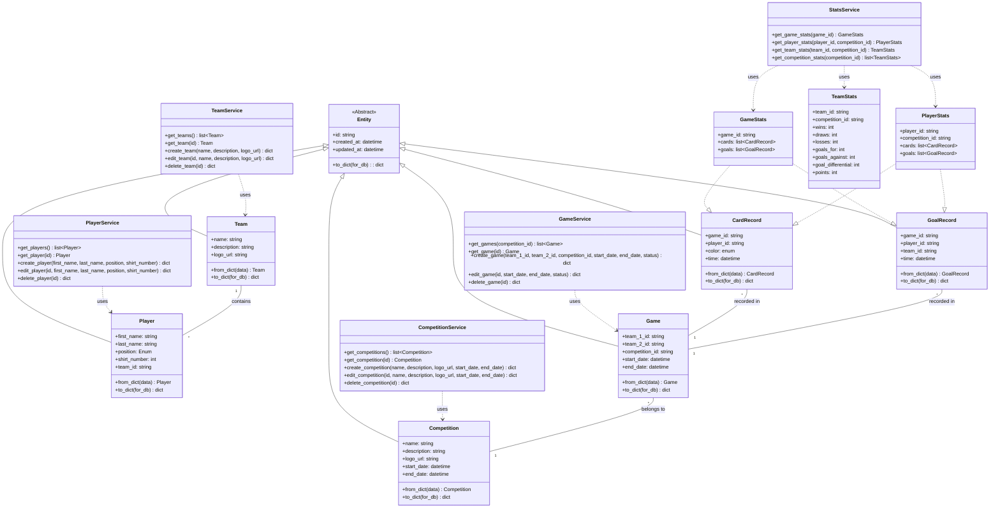

```mermaid

classDiagram
    class Entity {
        <<Abstract>>
        +id: string
        +created_at: datetime
        +updated_at: datetime
        +to_dict(for_db): dict
    }

    class Player {
        +first_name: string
        +last_name: string
        +position: Enum
        +shirt_number: int
        +team_id: string
        +from_dict(data) Player
        +to_dict(for_db) dict
    }

    class Team {
        +name: string
        +description: string
        +logo_url: string
        +from_dict(data) Team
        +to_dict(for_db) dict
    }

    class Game {
        +team_1_id: string
        +team_2_id: string
        +competition_id: string
        +start_date: datetime
        +end_date: datetime
        +from_dict(data) Game
        +to_dict(for_db) dict
    }

    class Competition {
        +name: string
        +description: string
        +logo_url: string
        +start_date: datetime
        +end_date: datetime
        +from_dict(data) Competition
        +to_dict(for_db) dict
    }

    class CardRecord {
        +game_id: string
        +player_id: string
        +color: enum
        +time: datetime
        +from_dict(data) CardRecord
        +to_dict(for_db) dict
    }

    class GoalRecord {
        +game_id: string
        +player_id: string
        +team_id: string
        +time: datetime
        +from_dict(data) GoalRecord
        +to_dict(for_db) dict
    }

    class GameStats {
        +game_id: string
        +cards: list~CardRecord~
        +goals: list~GoalRecord~
    }

    class PlayerStats {
        +player_id: string
        +competition_id: string
        +cards: list~CardRecord~
        +goals: list~GoalRecord~
    }

    class TeamStats {
        +team_id: string
        +competition_id: string
        +wins: int
        +draws: int
        +losses: int
        +goals_for: int
        +goals_against: int
        +goal_differential: int
        +points: int
    }

    class PlayerService {
        +get_players() list~Player~
        +get_player(id) Player
        +create_player(first_name, last_name, position, shirt_number) dict
        +edit_player(id, first_name, last_name, position, shirt_number) dict
        +delete_player(id) dict
    }

    class TeamService {
        +get_teams() list~Team~
        +get_team(id) Team
        +create_team(name, description, logo_url) dict
        +edit_team(id, name, description, logo_url) dict
        +delete_team(id) dict
    }

    class GameService {
        +get_games(competition_id) list~Game~
        +get_game(id) Game
        +create_game(team_1_id, team_2_id, competition_id, start_date, end_date, status) dict
        +edit_game(id, start_date, end_date, status) dict
        +delete_game(id) dict
    }

    class CompetitionService {
        +get_competitions() list~Competition~
        +get_competition(id) Competition
        +create_competition(name, description, logo_url, start_date, end_date) dict
        +edit_competition(id, name, description, logo_url, start_date, end_date) dict
        +delete_competition(id) dict
    }

    class StatsService {
        +get_game_stats(game_id) GameStats
        +get_player_stats(player_id, competition_id) PlayerStats
        +get_team_stats(team_id, competition_id) TeamStats
        +get_competition_stats(competition_id) list~TeamStats~
    }

    Entity <|-- Player
    Entity <|-- Team
    Entity <|-- Game
    Entity <|-- Competition
    Entity <|-- CardRecord
    Entity <|-- GoalRecord

    PlayerService ..> Player : uses
    TeamService ..> Team : uses
    GameService ..> Game : uses
    CompetitionService ..> Competition : uses
    StatsService ..> GameStats : uses
    StatsService ..> PlayerStats : uses
    StatsService ..> TeamStats : uses

    Team "1" -- "*" Player : contains
    Game "*" -- "1" Competition : belongs to
    CardRecord "*" -- "1" Game : recorded in
    GoalRecord "*" -- "1" Game : recorded in
    
    GameStats ..|> CardRecord
    GameStats ..|> GoalRecord
    PlayerStats ..|> CardRecord
    PlayerStats ..|> GoalRecord

```