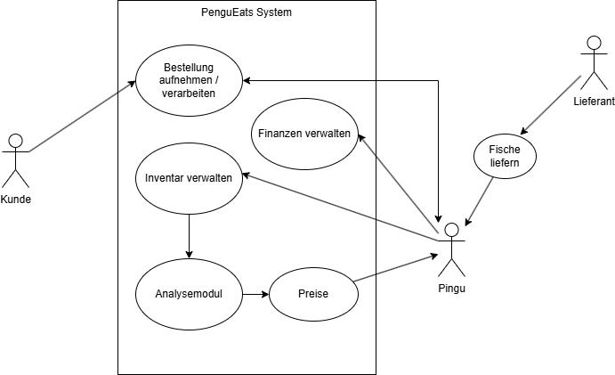
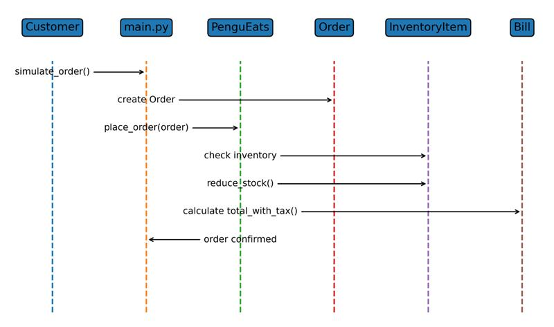

### DLBDSIPWP01 - Einführung in die Programmierung mit Python (Projekt)

---

# Project Abschlussbericht: [PenguEats]

## 1. Einleitung und Vision

### 1.1 Projektvision und Ziele

PenguEats ist eine Python-basierte Anwendung zur Unterstützung des Betriebs eines Fischrestaurants, das von Pinguinen betrieben wird und sich auf Fischgerichte spezialisiert hat.
Das zentrale Problem, das die Anwendung adressiert, ist die Unsicherheit in der Fischlieferkette. In realen Lieferketten können Lieferungen aufgrund verschiedener Faktoren ausfallen oder verspätet eintreffen. Dazu zählen beispielsweise:
- Wetterbedingungen
- schwankende Fangquoten
- Transportprobleme
- unzuverlässige Lieferanten

Diese Unsicherheiten erschweren eine zuverlässige Planung von Lagerbeständen, Preisen und Speisekarte.

PenguEats unterstützt den Restaurantbetreiber dabei, einen Überblick über folgende Aspekte zu behalten:
- Fischinventar
- Kundenbestellungen
- Einnahmen und Umsätze
- zukünftige Lieferwahrscheinlichkeiten

Die Anwendung simuliert den operativen Betrieb eines Restaurants und kombiniert diesen mit statistischer Analyse, um datenbasierte Entscheidungen zu ermöglichen.
Ein langfristiges Ziel der Anwendung besteht darin, mithilfe probabilistischer Modelle Prognosen über zukünftige Lieferungen zu erstellen und daraus strategische Entscheidungen abzuleiten. Dazu gehören beispielsweise:
- dynamische Preisgestaltung
- Anpassung der Speisekarte
- Risikobewertung der Lieferkette

Dadurch sollen sowohl Lieferengpässe als auch wirtschaftliche Risiken reduziert werden.

### 1.2 Wissenschaftliche Herausforderung / Python-Spezifischer Aspekt

Viele reale Systeme sind nicht vollständig deterministisch. Besonders in Lieferketten treten Unsicherheiten auf, die nicht exakt vorhergesagt werden können.
Traditionelle Softwaremodelle arbeiten häufig mit festen Werten und deterministischen Regeln. In der Realität sind jedoch viele Prozesse stochastisch. Um diese Unsicherheit mathematisch zu modellieren, werden probabilistische Modelle verwendet.
Im Rahmen dieses Projekts wird ein Ansatz der probabilistischen Programmierung genutzt.
Dabei werden statistische Modelle direkt im Code formuliert und mithilfe von Sampling-Verfahren geschätzt.

Für die Umsetzung wird die Python-Bibliothek PyMC verwendet. PyMC ermöglicht die Formulierung komplexer probabilistischer Modelle und deren Auswertung mithilfe von Markov-Chain-Monte-Carlo-Verfahren (MCMC).
Im Projekt werden zwei zentrale probabilistische Modelle verwendet:
#### 1. Demand Modell (Poisson-Gamma Modell)
Prognose der erwarteten Liefermenge einer Fischart.

#### 2. Supplier Reliability Modell (Beta-Binomial Modell)
Schätzung der Zuverlässigkeit eines Lieferanten.

Die Unsicherheiten werden dabei explizit modelliert und in Form von Wahrscheinlichkeitsverteilungen dargestellt.
Das Projekt basiert konzeptionell insbesondere auf dem wissenschaftlichen Artikel zur probabilistischen Programmierung "Probabilistic programming in Python using PyMC3" von Salvatier et al. (2016).

Die theoretischen Konzepte werden in einer spielerischen Domäne umgesetzt: Ein von Pinguinen betriebenes Fischrestaurant.
Diese Story-Domain ermöglicht eine anschauliche Darstellung komplexer statistischer Konzepte.

### 1.3 Arbeitshypothese

Die zentrale Hypothese des wissenschaftlichen Teils lautet:
Durch die Analyse historischer Lieferdaten mithilfe eines bayesianischen Modells kann die zukünftige Verfügbarkeit von Fischarten realistisch prognostiziert werden.

Diese Prognose ermöglicht eine datenbasierte Anpassung der Verkaufspreise.

Konkret wird untersucht, wie folgende Faktoren die Prognose beeinflussen:
- historische Liefermengen
- Unsicherheit in der Lieferkette
- statistische Schwankungen

Das Modell berechnet für jede Fischart eine Wahrscheinlichkeitsverteilung der erwarteten Liefermenge.
Aus dieser Verteilung werden folgende Kennzahlen abgeleitet:
- erwartete Liefermenge
- Konfidenzintervall (HDI)
- Risiko einer Knappheit

Auf Basis dieses Risikos wird ein Preisfaktor berechnet, der zur dynamischen Anpassung der Menüpreise verwendet wird.

---

## 2. Requirements Engineering

### 2.1 Kontextdiagramm



Das System interagiert mit verschiedenen Akteuren und externen Systemkomponenten.

Die wichtigsten Akteure sind:

Restaurantbetreiber (Pingu)
→ verwaltet Inventar, Lieferungen und Preise

Kunde
→ bestellt Gerichte aus dem Menü

Lieferant
→ liefert Fisch an das Restaurant

Analysemodul
→ berechnet statistische Prognosen für Liefermengen

Das System fungiert als zentrale Verwaltungs- und Analyseplattform.

### 2.2 Funktionale Anforderungen als Katalog

| ID     | Anforderung                                   | Status              | Notizen |
|--------|-----------------------------------------------|---------------------|---------|
| REQ-01 | Verwalten des Fischinventars                  | erfüllt             | Implementiert über `InventoryItem` und `restaurant.inventory` |
| REQ-02 | Reduktion des Bestands bei Bestellung         | erfüllt             | Über Bestandsverbrauch in `place_order()` |
| REQ-03 | Erstellung und Verwaltung von Bestellungen    | erfüllt             | Über `Order`, `OrderItem`, `Bill` |
| REQ-04 | Prüfung der Lagerverfügbarkeit vor Bestellung | erfüllt             | Fehler bei unzureichendem Inventar |
| REQ-05 | Verwaltung von Einnahmen und Ausgaben         | teilweise erfüllt   | Einnahmen implementiert, Ausgaben bisher nur teilweise (z. B. Miete, aber keine vollständige Lieferkostenlogik) |
| REQ-06 | Berechnung der Lieferwahrscheinlichkeit       | erfüllt             | Bayesianisches Modell mit PyMC / MCMC |
| REQ-07 | Warnung bei niedrigem Bestand                 | teilweise erfüllt   | Bisher nur indirekt über Inventarprüfung und Fehlerbehandlung |
| REQ-08 | Simulation von Bestellungen                   | erfüllt             | Über `main.py` und Flask-Frontend |
| REQ-09 | Preisstrategie basierend auf Risiko           | erfüllt             | Dynamische Preisfaktoren basierend auf MCMC-Risikoanalyse |


### 2.3 Nicht-funktionale Anforderungen (Qualitätsanforderungen)

Basierend auf der ISO 25010 werden folgende Qualitätsanforderungen definiert:

#### Performance
Die Berechnung der statistischen Modelle erfolgt über MCMC-Sampling. Durch die Verwendung des NUTS-Samplers mit der numpyro-Implementierung wird eine effiziente Berechnung erreicht.

#### Usability
Die Anwendung verwendet eine einfache Konsolenoberfläche. Dadurch ist die Bedienung leicht verständlich und benötigt keine zusätzliche Software.

#### Wartbarkeit
Der Code ist modular strukturiert:
- core
- models
- utils

Diese Struktur ermöglicht eine klare Trennung der Verantwortlichkeiten.

#### Zuverlässigkeit
Fehlerhafte Zustände werden durch Exception Handling verhindert.

Beispiele:
- Bestellung ohne ausreichenden Bestand
- ungültige Eingabewerte

### 2.4 Use-Case Modellierung

Wichtige Use-Cases des Systems sind:

#### UC-01 Inventar verwalten
Der Betreiber kann neue Fischlieferungen registrieren und den Lagerbestand verwalten.

#### UC-02 Bestellung aufnehmen
Ein Kunde bestellt ein Gericht aus der Speisekarte.

Der Ablauf:
1. Kunde wählt Menüpunkt
2. System prüft Inventar
3. Bestand wird reduziert
4.Bestellung wird gespeichert

#### UC-03 Finanzdaten verwalten
Das System berechnet den Umsatz anhand der erstellten Rechnungen.

#### UC-04 Lieferwahrscheinlichkeit berechnen
Historische Lieferdaten werden analysiert und statistisch ausgewertet.

#### UC-05 Preisstrategie berechnen
Auf Basis der Risikoanalyse wird ein Preisfaktor bestimmt.

---

## 3. Architektur und Tech-Stack

### 3.1 Auswahl der Plattform

Python wurde als Programmiersprache für dieses Projekt vorgegeben. Sie bietet eine ausgezeichnete Unterstützung für Datenanalyse und statistische Modellierung.
Zudem existieren leistungsfähige Bibliotheken für probabilistische Programmierung.

### 3.2 Modularer Kern und Open-Closed Principle

Die Anwendung ist in mehrere Module aufgeteilt.

#### core
Beinhaltet die zentrale Geschäftslogik des Restaurants.

#### models
Definiert die Domänenobjekte.
Beispiele:
- Fish
- Order
- Recipe
- Supplier

#### utils
Beinhaltet analytische und statistische Funktionen.
Beispiele:
- Bayesian Modelle
- statistische Auswertungen

Diese Struktur folgt dem Single Responsibility Principle.

### 3.3 Technologie-Stack

- Python:  	        Hauptprogrammiersprache
- PyMC3:            probabilistische Modellierung
- NumPy:   	        numerische Berechnungen
- ArviZ:	          Analyse von MCMC-Ergebnissen
- Flask:	          mögliche Visualisierung
- dataclasses:      strukturierte Datenmodelle


### 3.4 Logging und Fehlerbehandlung

Demonstieren Sie, wie wichtige Aspekte wie Logging, Fehlerbehandlung, Performance-Optimierung und Debugging-Strategien in
der App umgesetzt wurden.

```
[Phase 3] Operatives Tagesgeschäft und Auftragsabwicklung:

[Kritischer Fehler] Systemabbruch während der Verarbeitung: Order.__init__() takes from 2 to 3 positional arguments but 4 were given
```

```
[Kritischer Fehler] Systemabbruch während der Verarbeitung: Nicht genug Lachs im Inventar
```
#### Logging

Wichtige Ereignisse werden ausgegeben:
- Bestellungen
- Preisberechnungen
- Analyseergebnisse

#### Fehlerbehandlung

Fehler werden mit Exception Handling abgefangen.
Beispiele:
InventoryItem:

if amount > self.amount_kg:
    raise ValueError

Restaurant:

raise Exception("Nicht genug Fisch im Inventar")

#### Debugging

Zur Analyse von Problemen werden Logs verwendet.

---

## 4. Design und Modellierung (Die "Story")

### 4.1 Domänenmodell und UML-Klassendiagramm

Zentrale Klassen:
- Fish
- Recipe
- MenuItem
- InventoryItem
- Order
- OrderItem
- Bill
- Supplier
- Delivery
- Restaurant

Beziehungen:

- Fish → Bestandteil eines Rezepts
- Recipe → Bestandteil eines Menüpunktes
- MenuItem → Bestandteil einer Bestellung
- Order → enthält OrderItems
- Bill → berechnet Rechnungsbetrag


### 4.2 Verhaltensdiagramme: Activity- & State-Diagram

Bestellprozess:

1. Kunde bestellt Gericht
2. System prüft Inventar
3. Bestand wird reduziert
4. Bestellung wird gespeichert
5. Rechnung wird erstellt
6. Umsatz wird aktualisiert


### 4.3 Interaktionsdiagramm: Sequence-Diagram

Wer ruft welche Methode bei wem auf? Dokumentieren Sie hier die Kommunikation zwischen den Objekten.

Kunde → Restaurant → Order → Inventory → Bill

Ablauf:

1. Bestellung wird erstellt
2. Inventar wird geprüft
3. Bestand wird reduziert
4. Rechnung wird berechnet



### 4.4 Design Patterns und Prinzipien

Welche Muster (z. B. Factory, Strategy, MVC) wurden implementiert? Begründen Sie den Einsatz von SOLID, DRY und
KISS, ... Verwenden Sie UML-Diagramme, um die Umsetzung zu verdeutlichen.

#### Domain Model

Die Anwendung basiert auf einem Domain Model mit klaren Entitäten.

#### Separation of Concerns

- Domänenmodelle
- Geschäftslogik
- Analyse

werden getrennt implementiert.

#### SOLID Prinzipien

Single Responsibility
→ jede Klasse erfüllt eine spezifische Aufgabe.

Open Closed Principle
→ neue Modelle können hinzugefügt werden ohne bestehenden Code zu verändern.

---

## 5. Wissenschaftliche Problemstellung

### 5.1 Methodik der Untersuchung

Historische Lieferdaten werden analysiert.
Die Liefermengen werden als Poisson-verteilte Ereignisse modelliert.

Prior:
Gamma Verteilung

Likelihood:
Poisson Verteilung

Die Parameter werden über MCMC Sampling geschätzt.

### 5.2 Analyse und Demonstration

Dokumentieren Sie die Ausführung des Codes und die Visualisierung der Ergebnisse zur Bestätigung/Widerlegung der
Hypothese. Hinterlegen Sie im Notebook aussagekräftige Plots.

Aus der Posteriorverteilung werden folgende Kennzahlen berechnet:
- erwartete Liefermenge
- 95 % HDI
- Risiko einer Knappheit

Beispiel:
- mean_rate
- risk_percent
- hdi

Diese Werte werden zur Preisstrategie verwendet.

---

## 6. Implementierung und Qualitätssicherung

### 6.1 Code-Struktur und Dokumentation

Der Code ist modular aufgebaut und folgt einer klaren Trennung der Verantwortlichkeiten. Die einzelnen Komponenten sind in logisch getrennten Modulen organisiert, um Wartbarkeit, Erweiterbarkeit und Testbarkeit zu gewährleisten.

Die Struktur gliedert sich in folgende Hauptbereiche:

- **core** → Enthält die zentrale Geschäftslogik des Systems, insbesondere die Klasse `PenguEats`, welche Bestellungen verarbeitet, Inventar verwaltet und Umsätze berechnet.
- **models** → Beinhaltet alle Domänenmodelle wie `Fish`, `Recipe`, `MenuItem`, `Order`, `OrderItem`, `InventoryItem` und `Bill`. Diese Klassen definieren die Datenstruktur des Systems.
- **utils** → Enthält Analyse- und Statistikmodelle, insbesondere das bayesianische MCMC-Modell zur Berechnung von Lieferwahrscheinlichkeiten und Versorgungsrisiken.
- **templates** → Beinhaltet die Flask-Frontend-Komponenten zur Visualisierung von Inventar, Bestellungen, Lieferungen und Analyseergebnissen.
- **tests** → Enthält Unit-Tests und Integrationstests zur Sicherstellung der korrekten Funktionalität.

Durch diese modulare Struktur wird eine klare Trennung zwischen Datenmodell, Geschäftslogik, Analysekomponenten und Benutzeroberfläche erreicht.

Zusätzlich wurde besonderer Wert auf Codequalität gelegt:

- Verwendung von **Dataclasses** für kompakte und lesbare Datenmodelle  
- Einsatz von **Typannotationen** zur besseren Nachvollziehbarkeit der Datenflüsse  
- Nutzung von **Docstrings** zur Dokumentation von Klassen und Methoden  
- Konsistente **Namenskonventionen** für Klassen, Variablen und Funktionen  
- Klare Trennung zwischen Domain-Logik und Analyse-Logik  

Diese Maßnahmen verbessern die Lesbarkeit, Wartbarkeit und Erweiterbarkeit des Systems und unterstützen eine strukturierte Weiterentwicklung des Projekts.

### 6.2 Test-Konzept: Unit-Tests

Zur Sicherstellung der korrekten Funktionsweise der einzelnen Softwarekomponenten wurden Unit-Tests für zentrale Klassen und Methoden des Systems implementiert. Ziel der Unit-Tests ist es, einzelne Einheiten isoliert zu prüfen und Fehler frühzeitig zu erkennen. Die Tests wurden insbesondere für die Domänenklassen des Fischrestaurants erstellt, da diese die Grundlage für Bestandsverwaltung, Bestellabwicklung und Abrechnung bilden.

Die Unit-Tests konzentrieren sich auf drei zentrale Bereiche:

#### Test 1: Inventory Reduction

Dieser Test überprüft, ob der Fischbestand nach einer Bestellung korrekt reduziert wird. Dazu wird ein Inventareintrag mit definierter Menge angelegt und anschließend eine Bestellung verarbeitet. Nach der Bestellung wird kontrolliert, ob die verbleibende Menge im Inventar korrekt angepasst wurde.

#### Test 2: Bill Calculation

Dieser Test prüft, ob der Rechnungsbetrag inklusive Steuer korrekt berechnet wird. Hierfür werden ein Menüeintrag, ein Bestellposten und eine Rechnung erstellt. Anschließend wird der berechnete Gesamtbetrag mit dem erwarteten Wert verglichen.

#### Test 3: Fish Validation

Dieser Test überprüft die Validierungslogik der Klasse `Fish`. Es wird getestet, ob ungültige Eingaben, beispielsweise ein negativer Preis pro Kilogramm oder eine negative Preisvarianz, korrekt erkannt und durch eine Exception abgefangen werden.

Insgesamt stellen die Unit-Tests sicher, dass die Grundlogik des Systems zuverlässig funktioniert und einzelne Komponenten unabhängig voneinander korrekt arbeiten.

### 6.3 Integration-Tests und Traceability

Neben den Unit-Tests wurden Integrationstests durchgeführt, um das Zusammenspiel mehrerer Komponenten des Systems zu überprüfen. Dabei lag der Fokus auf der Verbindung zwischen Inventarverwaltung, Bestellverarbeitung, Abrechnung und Geschäftslogik. Die Integrationstests wurden explizit den in Kapitel 2.2 definierten Anforderungen zugeordnet, um die Nachvollziehbarkeit der Implementierung sicherzustellen.

| Test-ID | Zugeordnete Anforderung | Beschreibung |
|---------|-------------------------|--------------|
| IT-01   | REQ-02                  | Eine Bestellung reduziert den vorhandenen Bestand des entsprechenden Fisches korrekt. |
| IT-02   | REQ-04                  | Eine Bestellung schlägt fehl, wenn nicht genügend Bestand im Inventar vorhanden ist. |
| IT-03   | REQ-05                  | Nach erfolgreicher Bestellverarbeitung wird der Umsatz korrekt im Restaurant erfasst. |

#### Integrationstest 1: Bestellung reduziert Inventar

Dieser Test überprüft das Zusammenspiel von `Order`, `OrderItem`, `Recipe`, `MenuItem`, `InventoryItem` und `PenguEats`. Nach dem Anlegen eines Anfangsbestands wird eine Bestellung ausgeführt. Anschließend wird geprüft, ob die korrekte Fischmenge aus dem Inventar entfernt wurde. Dieser Test deckt die Anforderung **REQ-02** ab.

#### Integrationstest 2: Bestellung schlägt fehl bei fehlendem Bestand

Dieser Test überprüft, ob das System Bestellungen korrekt ablehnt, wenn die vorhandene Menge eines Fisches nicht ausreicht. Dazu wird bewusst ein zu kleiner Bestand angelegt und anschließend eine Bestellung mit höherem Verbrauch ausgelöst. Das erwartete Verhalten ist eine Exception bzw. Fehlermeldung. Dieser Test deckt die Anforderung **REQ-04** ab.

#### Integrationstest 3: Umsatz wird korrekt berechnet

Dieser Test betrachtet das Zusammenspiel von Bestelllogik und Abrechnung. Nach dem Anlegen eines Menüeintrags und einer erfolgreichen Bestellung wird überprüft, ob der berechnete Rechnungsbetrag korrekt zum Umsatz des Restaurants addiert wurde. Damit wird die Anforderung **REQ-05** validiert.

Durch die Kombination aus Unit-Tests und Integrationstests wird sowohl die Korrektheit einzelner Komponenten als auch die Konsistenz des Gesamtsystems sichergestellt.

### 6.4 CI-Pipeline

Beschreiben Sie die (mögliche) Automatisierung (GitHub Actions, Befehlsreihenfolge, Prüfung der `requirements.txt`,
project.toml).

Eine mögliche CI Pipeline besteht aus:
1. Installation der Abhängigkeiten
2. Ausführen der Unit Tests
3. Linting
4. Build

Tools:
GitHub Actions

---

## 7. Software-Qualität nach [ISO 25010](https://iso25000.com/index.php/en/iso-25000-standards/iso-25010)

Beurteilung der Produktqualität: Skalieren und bewerten Sie Ihre Software in Kategorien wie Wartbarkeit, Zuverlässigkeit
und Benutzbarkeit.
Wählen Sie 3-5 Kategorien aus und begründen Sie die Bewertung. Welche Maßnahmen wurden ergriffen, um die Qualität zu
verbessern?

Bewertete Kategorien:

#### Wartbarkeit

Die modulare Architektur erleichtert Erweiterungen.

#### Zuverlässigkeit

Fehler werden abgefangen und verhindern inkonsistente Zustände.

#### Benutzbarkeit

Die Konsolenoberfläche ist leicht verständlich.

#### Performance

MCMC Sampling wird mit numpyro beschleunigt.

---

## 8. Projektabschluss und Reflexion

### 8.1 Methodik und Anpassungen

Wie sind Sie vorgegangen? Welche Anpassungen mussten während der Entwicklung vorgenommen werden und warum?

Die Entwicklung erfolgte iterativ. Zunächst wurden Domänenmodelle entwickelt. Danach wurden die Analysemodelle integriert.

### 8.2 Selbstreflexion

#### Arbeitsprozess

Analysieren Sie den Arbeitsprozess. Wo hat das Requirements Engineering geholfen, wo gab es bspw. durch "
Drauflos-Programmieren" Probleme?

Requirements Engineering half dabei, die Struktur des Systems zu definieren.

Einige Änderungen waren während der Implementierung notwendig, beispielsweise bei der Modellierung der Lieferkettenanalyse.

#### Einsatz von KI

Bitte denkt daran, dass ihr eine schriftliche Reflektion zu eurer KI-Nutzung im Projekt mit abgeben müsst. Da alle
höchstwahrscheinlich KI-Tools verwenden werden, ist die Dokumentation des Lernfortschritts erforderlich (siehe IU
Richtlinie zur Nutzung von KI im Studium (S. 13) https://mycampus-classic.iu.org/mod/resource/view.php?id=357067)

### 8.3 Nutzungsanweisung (How-to-use)

Kurze Anleitung für den Nutzer oder den Korrektor: Wie wird die App gestartet und welche Features sind wie zu nutzen?

1. Python Umgebung erstellen
2. Abhängigkeiten installieren

pip install pymc numpy arviz

3. Programm starten

python main.py

Das Programm führt anschließend eine Simulation des Restaurantbetriebs durch.


### 8.4 Pitch-Video

Erstellen Sie ein kurzes Video (max. 3-5 Minuten), in dem Sie die App vorstellen, die wichtigsten Funktionen
demonstrieren
und die wissenschaftliche Fragestellung sowie die Ergebnisse präsentieren.

Erstellt dazu bspw. einen Screencast mit einem Tool wie OBS Studio, Camtasia oder der System-eigenen Bildschirmaufnahme.

Examples:

- https://dl.acm.org/doi/10.1145/3411764.3445651
- https://dl.acm.org/doi/10.1145/2992154.2992174
- https://dl.acm.org/conference/chi

---

## Anhang

- **README.md (Inhalt):** Setup-Anleitung, Python-Umgebung, Paketliste.

- **Glossar:** Definition der fachlichen Begriffe der "Story".

---
