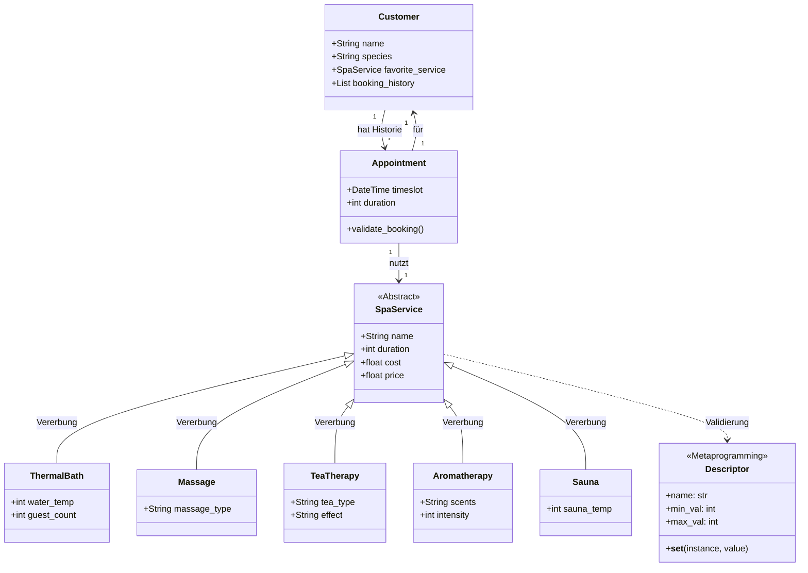

```mermaid

classDiagram
    class Descriptor {
        <<Metaprogramming>>
        +name: str
        +min_val: int
        +max_val: int
        +__set__(instance, value)
    }

    class Customer {
        +String name
        +String species
        +SpaService favorite_service
        +List booking_history
    }

    class SpaService {
        <<Abstract>>
        +String name
        +int duration
        +float cost
        +float price
    }

    class ThermalBath {
        +int water_temp
        +int guest_count
    }

    class Massage {
        +String massage_type
    }

    class TeaTherapy {
        +String tea_type
        +String effect
    }

    class Aromatherapy {
        +String scents
        +int intensity
    }

    class Sauna {
        +int sauna_temp
    }

    class Appointment {
        +DateTime timeslot
        +int duration
        +validate_booking()
    }

    %% Beziehungen
    SpaService <|-- ThermalBath : Vererbung
    SpaService <|-- Massage : Vererbung
    SpaService <|-- TeaTherapy : Vererbung
    SpaService <|-- Aromatherapy : Vererbung
    SpaService <|-- Sauna : Vererbung

    SpaService ..> Descriptor : Validierung
    Appointment "1" --> "1" Customer : für
    Appointment "1" --> "1" SpaService : nutzt
    Customer "1" --> "*" Appointment : hat Historie

```
