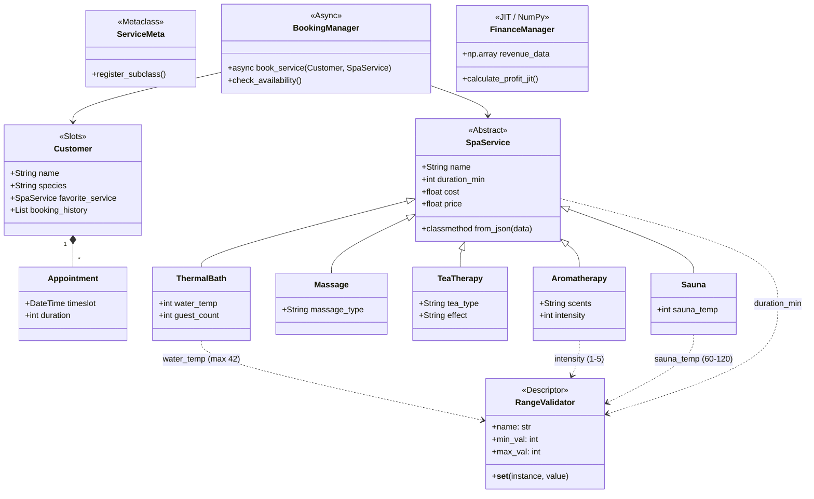

```mermaid

classDiagram
    %% Wissenschaftlicher Fokus: Metaprogrammierung & Validierung (Topic 5)
    class ServiceMeta {
        <<Metaclass>>
        +register_subclass()
    }

    class RangeValidator {
        <<Descriptor>>
        +name: str
        +min_val: int
        +max_val: int
        +__set__(instance, value)
    }

    %% Datenmodelle: Speicheroptimierung (Topic 2)
    class Customer {
        <<Slots>>
        +String name
        +String species
        +SpaService favorite_service
        +List booking_history
    }

    class SpaService {
        <<Abstract>>
        <<metaclass: ServiceMeta>>
        +String name
        +int duration_min
        +float cost
        +float price
        +classmethod from_json(data)
    }

    %% Spezialisierte Dienstleistungen (Deine Vorgaben)
    class ThermalBath {
        +int water_temp
        +int guest_count
    }

    class Massage {
        +String massage_type
    }

    class TeaTherapy {
        +String tea_type
        +String effect
    }

    class Aromatherapy {
        +String scents
        +int intensity
    }

    class Sauna {
        +int sauna_temp
    }

    %% Logik & Performance (Topic 3, 4, 6)
    class BookingManager {
        <<Async>>
        +async book_service(Customer, SpaService)
        +check_availability()
    }

    class FinanceManager {
        <<JIT / NumPy>>
        +np.array revenue_data
        +calculate_profit_jit()
    }

    class Appointment {
        +DateTime timeslot
        +int duration
    }

    %% Beziehungen & Hierarchie
    SpaService <|-- ThermalBath
    SpaService <|-- Massage
    SpaService <|-- TeaTherapy
    SpaService <|-- Aromatherapy
    SpaService <|-- Sauna

    %% Validierungs-Beziehungen
    ThermalBath ..> RangeValidator : water_temp (max 42)
    Aromatherapy ..> RangeValidator : intensity (1-5)
    Sauna ..> RangeValidator : sauna_temp (60-120)
    SpaService ..> RangeValidator : duration_min

    BookingManager --> Customer
    BookingManager --> SpaService
    Customer "1" *-- "*" Appointment

```
