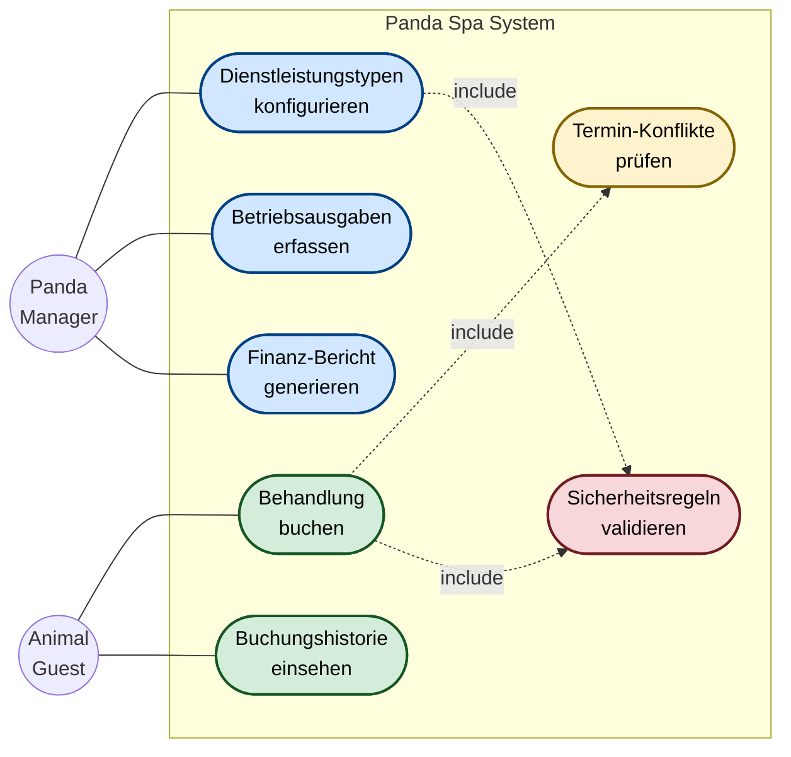

```mermaid

graph LR
    %% Akteure
    Panda((Panda <br/> Manager))
    Guest((Animal <br/> Guest))

    subgraph "Panda Spa System"
        %% Management Use Cases
        UC1([Dienstleistungstypen <br/> konfigurieren])
        UC_FIN_1([Betriebsausgaben <br/> erfassen])
        UC_FIN_2([Finanz-Bericht <br/> generieren])

        %% Guest Use Cases
        UC2([Behandlung <br/> buchen])
        UC_HIST([Buchungshistorie <br/> einsehen])

        %% Systeminterne Prozesse (Included)
        UC3([Termin-Konflikte <br/> prüfen])
        UC4([Sicherheitsregeln <br/> validieren])
    end

    %% Panda Interaktionen
    Panda --- UC1
    Panda --- UC_FIN_1
    Panda --- UC_FIN_2

    %% Gast Interaktionen
    Guest --- UC2
    Guest --- UC_HIST

    %% Abhängigkeiten (Include Beziehungen)
    UC2 -.->|include| UC3
    UC2 -.->|include| UC4
    UC1 -.->|include| UC4

    %% Farbschema & Kontrast (GitHub-optimiert)
    %% Dunkler Text auf Pastellfarben für maximale Lesbarkeit
    style UC1 fill:#d1e7ff,stroke:#004085,stroke-width:2px,color:#000
    style UC_FIN_1 fill:#d1e7ff,stroke:#004085,stroke-width:2px,color:#000
    style UC_FIN_2 fill:#d1e7ff,stroke:#004085,stroke-width:2px,color:#000

    style UC2 fill:#d4edda,stroke:#155724,stroke-width:2px,color:#000
    style UC_HIST fill:#d4edda,stroke:#155724,stroke-width:2px,color:#000

    style UC3 fill:#fff3cd,stroke:#856404,stroke-width:2px,color:#000
    style UC4 fill:#f8d7da,stroke:#721c24,stroke-width:2px,color:#000
```
