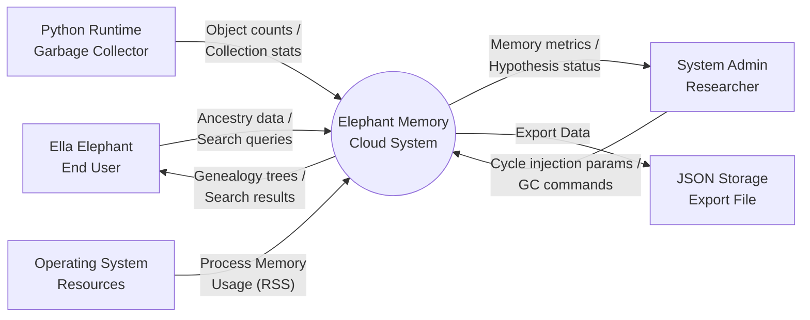
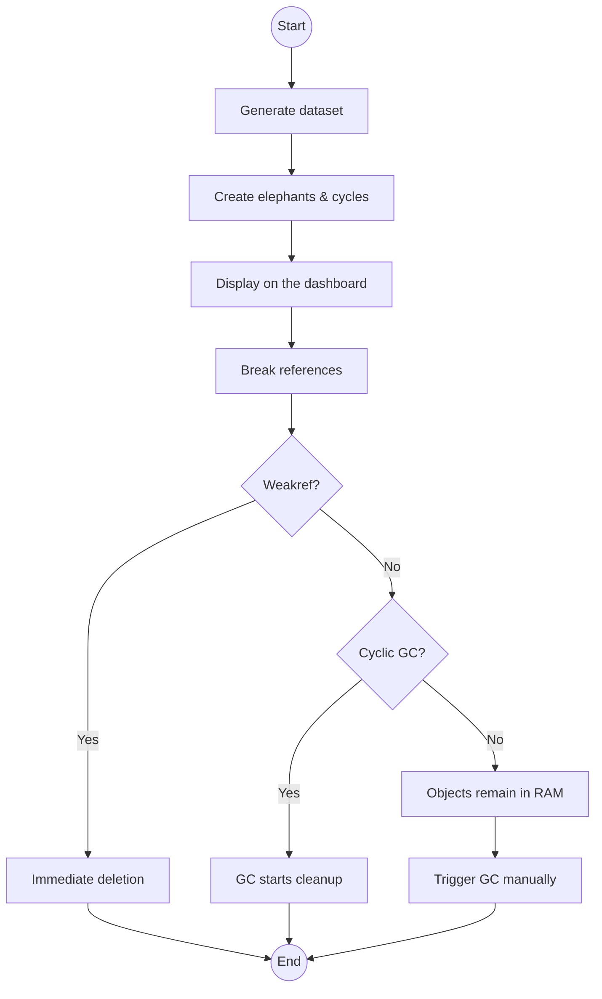
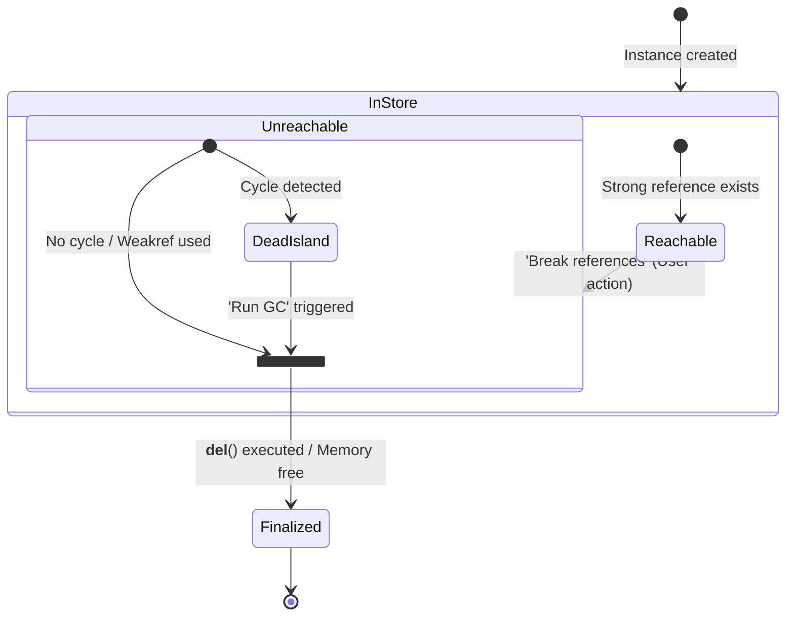

### DLBDSIPWP01 - Einführung in die Programmierung mit Python (Projekt)

---

# Project Abschlussbericht: Elephant Memory Cloud

## 1. Einleitung und Vision

### 1.1 Projektvision und Ziele

Die *Elephant Memory Cloud* ist ein Python-basierter Prototyp für ein „digitales Gedächtnis“ von **Ella Elefant**. Fachlich wird ein Archiv modelliert, das Ereignisse (Jahr, Ort/Wasserstelle, beteiligte Elefanten/Herden) sowie genealogische Beziehungen (Eltern/Kinder, Herd-Zugehörigkeit) abbildet.

Das Projektziel ist **nicht** ein produktionsreifes Cloud-System, sondern ein didaktisch nachvollziehbarer Demonstrator, der:

- komplexe Objektbeziehungen in einem Domain Model modelliert,
- absichtlich **zirkuläre Referenzen** (Parent ↔ Child, Herd ↔ Member) erzeugt,
- und deren Auswirkungen auf Speicherbereinigung in Python sichtbar macht.

Die Anwendung stellt dafür ein Streamlit-Dashboard bereit (Daten generieren, suchen, Genealogie visualisieren) und ermöglicht eine reproduzierbare GC-Demonstration über UI-Schritte.

### 1.2 Wissenschaftliche Herausforderung / Python-Spezifischer Aspekt

Der wissenschaftliche Schwerpunkt liegt auf **Memory Management in Python**, konkret:

- **Reference Counting** als primärer Mechanismus zur Speicherfreigabe,
- **zyklische Garbage Collection** als Ergänzung, um unreachable Zyklen („Dead Islands“) zu bereinigen.

Relevanz: In objektorientierten Python-Programmen entstehen Zyklen leicht (z. B. bidirektionale Beziehungen). Diese führen dazu, dass reine Referenzzählung Objekte nicht freigibt, obwohl sie aus Sicht der Anwendung nicht mehr erreichbar sind.

Analogie/Story: Die Savannen-Domäne (Elefanten, Herden, Wasserstellen, Ereignisse) wird als „natürliche“ Quelle komplexer Objektgraphen genutzt. Das Projekt erzeugt bewusst Zyklen im „Stammbaum“-Kontext, um das Verhalten von Python bei der Speicherbereinigung anschaulich zu demonstrieren.

### 1.3 Arbeitshypothese

Die Konzeptionsphase definiert zwei überprüfbare Hypothesen:

- **H1:** Ohne zyklische GC steigt die Anzahl nicht freigegebener Objekte mit der Größe des zyklischen Objektgraphen.
- **H2:** Mit aktivierter GC werden zyklische Referenzen nach Entfernen externer Referenzen aufgelöst (Objekte werden freigegeben).

Untersucht wird dies an Domain-Entities wie `Elephant` (Parent/Child-Zyklus) und `Herd` (Herd ↔ Member), die absichtlich starke bidirektionale Referenzen bilden.

---

## 2. Requirements Engineering

### 2.1 Kontextdiagramm

### 2.2 Funktionale Anforderungen

Die folgenden funktionalen Anforderungen wurden in der Konzeptionsphase festgelegt (MoSCoW: **[m] must**, **[s] should**, **[c] could**) und in der Umsetzungsphase gegen den Implementationsstand abgeglichen.

- **REQ-01 (F01)** – Ereignisse erfassen: Ereignisse mit Jahr, Ort/Wasserstelle, beteiligten Elefanten/Herden speichern.
- **REQ-02 (F02) [m]** – Ereignisse indexieren: effiziente Suche nach Jahr und Ort.
- **REQ-03 (F03) [m]** – Elefanten modellieren: Elefanten als Objekte abbilden.
- **REQ-04 (F04) [m]** – Verwandtschaft modellieren: Eltern-/Kind- und Herdbeziehungen.
- **REQ-05 (F05) [m]** – Zirkuläre Referenzen erzeugen: absichtliche Zyklen im Objektgraphen.
- **REQ-06 (F06) [s]** – Stammbäume visualisieren: genealogische Graphen darstellen.
- **REQ-07 (F07) [s]** – Wasserstellen-Suche: Suche auf Basis historischer Ereignisse/Koordinaten.
- **REQ-08 (F08) [c]** – Erinnerungs-Bot: zeitbasierte Erinnerungen (z. B. Jubiläen von Migrationen).
- **REQ-09 (F09) [m]** – Speicherverhalten messen: RAM/Objektanzahl während der Laufzeit erfassen.
- **REQ-10 (F10) [m]** – GC-Vergleich ermöglichen: identische Szenarien mit GC aktiv/deaktiviert demonstrieren.

### 2.3 Nicht-funktionale Anforderungen (Qualitätsanforderungen)

Die nicht-funktionalen Anforderungen wurden in der Konzeptionsphase wie folgt definiert:

- **NFR-01 (NF01) [s] – Nachvollziehbarkeit:** didaktisch nachvollziehbarer, dokumentierter Code.
- **NFR-02 (NF02) [m] – Reproduzierbarkeit:** Experimente als reproduzierbare Abfolge dokumentieren.
- **NFR-03 (NF03) [m] – Messbarkeit:** Speicherverhalten quantitativ erfassen.
- **NFR-04 (NF04) [s] – Begrenzter Scope:** keine DB/Cloud-Architektur, keine KI/ML.
- **NFR-05 (NF05) [m] – Performance-Abgrenzung:** Rendering-Limits des Browsers sind nicht als Memory-Problem zu interpretieren.
- **NFR-06 (NF06) [m] – Plattformunabhängigkeit:** lokal auf Standard-Rechnern lauffähig.

### 2.4 Use-Case Modellierung

Die Use-Cases gliedern sich in eine funktionale Nutzungsebene und eine Forschungsebene.

- Diagramm: [concept_phase/diagrams/UseCaseDiagram.md](concept_phase/diagrams/UseCaseDiagram.md)

**Primäre Akteure**

- *Ella Elephant (End User):* sucht und visualisiert Ereignisse und Genealogie.
- *Researcher/Admin:* erzeugt Zyklen, misst Memory/GC-Effekte und validiert Hypothesen.

**Kern-Use-Cases (Auszug)**

- Ereignisse indexieren & suchen (REQ-01/02)
- Stammbaum/Genealogie visualisieren (REQ-04/06)
- Zyklen erzeugen und „orphaned cycles“ demonstrieren (REQ-05/10)
- Speicher messen und Effekte vergleichbar machen (REQ-09/10)

---

## 3. Architektur und Tech-Stack

### 3.1 Auswahl der Plattform (Begründung)

Als Plattform wurde **Streamlit** gewählt, um die Kombination aus (a) interaktiver Bedienung, (b) Visualisierung und (c) reproduzierbaren Demo-Schritten in einer einzigen Oberfläche umzusetzen.

- UI-Einstiegspunkt: [app.py](../app.py)

Begründung (aus Projektzielen abgeleitet):

- schnelle Iteration für einen didaktischen Prototyp (kein Overhead einer Desktop-GUI)
- direkte Visualisierung von Metriken (Memory, Objektanzahl, Beziehungen) und Suchergebnissen
- geeignet, um den GC-Vergleich als klaren, wiederholbaren Ablauf zu demonstrieren

### 3.2 Modularer Kern und Open-Closed Principle

Die Kernlogik ist in UI-unabhängige Module ausgelagert und wird durch das Streamlit-Dashboard lediglich orchestriert:

- **Domain Models:** [models/](../models/) (u. a. [models/elephant.py](../models/elephant.py), [models/herd.py](../models/herd.py), [models/event.py](../models/event.py), [models/water_source.py](../models/water_source.py))
- **In-Memory Store:** [memory/store.py](../memory/store.py) (zentraler Objektcontainer; bewusst zyklusfreundlich)
- **Services:**
	- Datengenerierung: [data/generator.py](../data/generator.py)
	- Suche/Indexing: [search/engine.py](../search/engine.py)
	- Monitoring: [memory/monitor.py](../memory/monitor.py)

Damit bleiben Domain-Objekte und Services unabhängig von Streamlit nutzbar (z. B. für Tests), während die UI lediglich die Bedienlogik, Visualisierung und Demo-Schritte kapselt.

### 3.3 Technologie-Stack

**Implementierter Stack (siehe [requirements.txt](../requirements.txt))**

- **streamlit:** Web-UI (Dashboard, Tabs, Interaktion)
- **plotly:** interaktive Visualisierung (Charts/Genealogie-Auswertungen)
- **psutil:** Prozessspeicher (RSS) als Monitoring-Metrik
- **pytest:** Unit-Tests

**Konzeptionsphase (thematisch/Standardbibliothek, Auszug)**

- `gc`, `sys`, `datetime` als Grundlage für Experimente/Introspektion und Domain-Timestamps

Hinweis: Ein Weakref-basierter Ansatz zur Vermeidung zyklischer Referenzen wurde konzeptionell diskutiert (u. a. in Diagrammen/Notizen), im Projekt jedoch nicht vollständig umgesetzt.

---

## 4. Design und Modellierung (Die "Story")

### 4.1 Domänenmodell und UML-Klassendiagramm

Die Story wird durch ein Domain Model umgesetzt, das absichtlich komplexe Beziehungen abbildet:

- **Elephant:** Eltern/Kind-Beziehungen als bidirektionale Referenzen (Zyklen)
- **Herd:** Mitgliederliste plus Rückreferenz vom `Elephant` auf `Herd` (Zyklus)
- **Event / EventType:** verbindet Elefanten/Herden mit Zeit und Ort
- **WaterSource:** Wasserstellen mit historischer Verfügbarkeit und Besuchshistorie

Diagramme:

- UML-Klassendiagramm: [dev_phase/diagrams/ClassDiagram.md](dev_phase/diagrams/ClassDiagram.md)
- Objekt-/Hypothesen-Diagramme (Dead Island / Resolution): [concept_phase/diagrams/ObjectDiagram.md](concept_phase/diagrams/ObjectDiagram.md)

### 4.2 Verhaltensdiagramme: Activity- & State-Diagram

#### Activity-Diagram:

#### State-Diagram:

### 4.3 Interaktionsdiagramm: Sequence-Diagram

Die Abfolge der Speicherbereinigung in Python wird über Sequence-Diagramme dokumentiert:

- Deterministische Bereinigung ohne Zyklus (Reference Counting)
- Leak-ähnlicher Zustand bei Zyklen (H1)
- Eingriff der zyklischen GC (H2)

Diagramm: [dev_phase/diagrams/SequenceDiagrams.md](dev_phase/diagrams/SequenceDiagrams.md)

### 4.4 Design Patterns und Prinzipien

Die Codebasis nutzt gezielt wenige, leichtgewichtige Strukturmuster, passend zum didaktischen Scope:

- **Domain Model (OO):** reichhaltige Objekte mit Beziehungen in [models/](../models/)
- **Repository-ähnlicher In-Memory Store:** `MemoryStore` kapselt das „Persistenz“-Äquivalent im RAM ([memory/store.py](../memory/store.py))
- **Singleton-Store:** globaler Store über `get_store()` für einen konsistenten Objektgraphen innerhalb der App
- **Service Layer:** `DataGenerator`, `ElephantSearchEngine`, `MemoryMonitor` als Services mit klarer Verantwortung
- **Indexing als Performance-Technik:** Dictionary-Indizes für schnelle Abfragen (O(1)-Lookups) in [search/engine.py](../search/engine.py)

---

## 5. Wissenschaftliche Problemstellung (Jupyter Notebook)

### 5.1 Methodik der Untersuchung

t.b.d.

### 5.2 Analyse und Demonstration

t.b.d.

---

## 6. Implementierung und Qualitätssicherung

### 6.1 Code-Struktur und Dokumentation

Die Implementierung ist modular aufgebaut (UI, Domain Models, Services) und nutzt überwiegend englische Bezeichner in Code und Docstrings.

- UI/Orchestrierung: [app.py](../app.py)
- Domain Models: [models/](../models/)
- Services: [data/generator.py](../data/generator.py), [search/engine.py](../search/engine.py), [memory/monitor.py](../memory/monitor.py)
- Storage: [memory/store.py](../memory/store.py)

### 6.2 Test-Konzept: Unit-Tests

Es existieren zwei fokussierte Unit-Tests, die Kernlogik unabhängig von Streamlit absichern:

- [tests/test_search_and_store.py](../tests/test_search_and_store.py)
	- `test_search_engine_indexes_and_queries()`: prüft Indexing & Queries der `ElephantSearchEngine` (Jahr, Elefant, Location-Grid)
	- `test_memory_store_clear_and_cleanup_breaks_relationships()`: prüft, dass `MemoryStore.clear_and_cleanup()` Beziehungen bricht und Tracking bereinigt (relevant für reproduzierbare Cleanup-Szenarien)

### 6.3 Integration-Tests und Traceability

| Nr. | Ziel                                                                                                               | Erwartetes Ergebnis                                                                                                 | REQs                   |
|-----|--------------------------------------------------------------------------------------------------------------------|---------------------------------------------------------------------------------------------------------------------|------------------------|
| 01  | Validierung der korrekten Erzeugung und Speicherung komplexer Verwandtschaftsverhältnisse mit Zyklen               | Elefanten-Objekte sind im Store vorhanden; Kinder referenzieren Eltern und umgekehrt (bestätigte Zirkularität)      | REQ-03, REQ-04, REQ-05 |
| 02  | Nachweis der Messbarkeit von Speicherlecks durch deaktivierten GC bei vorhandenen Zyklen                           | Trotz geleertem Store bleibt die Objektanzahl im RAM konstant hoch                                                  | REQ-09, REQ-10         |
| 03  | Sicherstellung, dass generierte Ereignisse korrekt indexiert und über räumliche/zeitliche Abfragen gefunden werden | Die Suchmaschine liefert das korrekte Objekt zurück, das sowohl zeitlich als auch räumlich den Kriterien entspricht | REQ-01, REQ-02, REQ-07 |

### 6.4 CI-Pipeline

1. **Automatisierte Abhängigkeitsprüfung:** 
   Sicherstellen, dass alle installierten Pakete keine Sicherheitslücken aufweisen.

2. **Statische Code-Analyse & Linting:** 
   Automatisierter Einsatz von Tools bei jedem Push, um Syntaxfehler zu finden und die Einhaltung von Richtlinien zu erzwingen, bevor der Code in den main-Branch gelangt.

3. **Automatisierte Integrationstests:** 
   Sicherstellen, dass die Kernlogik der Datenverarbeitung und die Suchalgorithmen auch nach Code-Änderungen konsistente Ergebnisse liefern.

4. **Automatisierte Dokumentationsprüfung:** 
   Validierung, ob Änderungen am Code auch eine Aktualisierung der Metadaten erfordern oder ob Docstrings in den Modellen vorhanden sind, um die Wartbarkeit des Systems zu garantieren.

---

## 7. Software-Qualität nach [ISO 25010](https://iso25000.com/index.php/en/iso-25000-standards/iso-25010)

Diese Qualitätsbewertung orientiert sich am ISO‑25010‑Modell (Produktqualität), wird jedoch **bewusst auf den Scope eines lokalen Lehr-/Demo‑Prototyps** zugeschnitten. Einige ISO‑Kriterien sind in diesem Projekt nur eingeschränkt sinnvoll bewertbar (z. B. Security im Sinne von Authentifizierung/Schutz vor Angriffen), weil keine Mehrbenutzer‑/Server‑/Produktiv‑Umgebung implementiert wird.

### 7.1 Bewertungsansatz (Scope & Skala)

**Artefakte als Evidenz (Auszug):**
- Architektur/Modularisierung: [app.py](../app.py), [models/](../models/), [memory/store.py](../memory/store.py), [search/engine.py](../search/engine.py), [data/generator.py](../data/generator.py)
- Tests: [tests/test_search_and_store.py](../tests/test_search_and_store.py)
- Abhängigkeiten: [requirements.txt](../requirements.txt)

**Bewertungsskala (qualitativ):**
- 5 = sehr gut / gut abgesichert
- 3 = ausreichend / für Prototyp passend, mit klaren Verbesserungsoptionen
- 1 = schwach / für Einsatz über Demo-Charakter hinaus nicht ausreichend
- „n/a“ = nicht sinnvoll bewertbar bzw. außerhalb des Projekt‑Scopes

### 7.2 Kurzbewertung nach ISO‑25010 (relativiert)

| ISO‑Merkmal | Relevanz für g07 | Einschätzung | Kurze Begründung / Evidenz |
|---|---:|---:|---|
| **Functional suitability** | hoch | 4/5 | Kernfeatures umgesetzt: Daten erzeugen, Objektgraph mit Zyklen, GC‑Demo, Suche, Genealogie. Orchestrierung in [app.py](../app.py), Kernlogik in Services/Models. |
| **Performance efficiency** | mittel | 3/5 | Suche nutzt Dictionary‑Indizes (O(1) Lookups) in [search/engine.py](../search/engine.py). Performance ist ausreichend für Demo, aber nicht systematisch gemessen. |
| **Compatibility** | niedrig | n/a | Kein Integrations-/API‑Ziel, keine externen Systeme. Bewertung wäre spekulativ. |
| **Usability** | mittel–hoch | 4/5 | Streamlit‑UI mit Tabs und klarer Two‑Step‑Demo („Break References“ → „Run GC“) in [app.py](../app.py). |
| **Reliability** | mittel | 3/5 | Deterministische Kernlogik in Store/Search; 2 Unit‑Tests vorhanden [tests/test_search_and_store.py](../tests/test_search_and_store.py). Einschränkung: Random‑Generator ohne Seed kann Reproduzierbarkeit beeinflussen. |
| **Security** | niedrig | n/a (Baseline) | Kein Auth/Netzwerk/Permissions‑Modell implementiert. Sinnvoll ist nur Baseline (Dependency‑Hygiene, keine Secrets im Repo). |
| **Maintainability** | hoch | 3/5 | Gute Trennung UI/Domain/Services, aber [app.py](../app.py) ist sehr groß (Wartbarkeit/Testbarkeit reduziert). Globaler Singleton‑Store und Klassen‑Registries erhöhen Kopplung. |
| **Portability** | mittel | 3/5 | Läuft mit Python + venv + wenigen Dependencies ([requirements.txt](../requirements.txt)). Windows‑Setup dokumentierbar; mehrere venv‑Ordner können verwirren (Workspace‑Root vs. g07). |

### 7.3 Detaillierte Bewertung (fokussiert auf sinnvolle Kategorien)

#### 7.3.1 Functional suitability

- Die geforderten Demonstrations- und Nutzungsfunktionen sind als konsistenter Ablauf verfügbar (Daten generieren → Zustand im Store → Referenzen brechen → GC auslösen).
- Kernlogik ist UI‑unabhängig in Module ausgelagert: Generierung [data/generator.py](../data/generator.py), Index‑Suche [search/engine.py](../search/engine.py), zentraler Objekt‑Container [memory/store.py](../memory/store.py), Domain‑Modelle [models/](../models/).

#### 7.3.2 Maintainability

**Stärken:**
- Verständliche Modulgrenzen: Domain Models vs. Services vs. Storage; das erleichtert Unit‑Tests und gezielte Änderungen.
- Tests fokussieren Kernlogik und vermeiden UI‑Abhängigkeit ([tests/test_search_and_store.py](../tests/test_search_and_store.py)).

**Schwächen:**
- [app.py](../app.py) bündelt sehr viel UI‑Logik (Charts, State‑Handling, Demo‑Steuerung). Das erschwert Änderungen und Wiederverwendung.
- Globaler Singleton‑Store via `get_store()` und Klassen‑Registries (`Event._all_events`, `WaterSource._all_sources`) sind praktisch, erhöhen aber versteckte Kopplung und Seiteneffekte.
- In [search/engine.py](../search/engine.py) wird in `_get_location_key` ein „bare except“ genutzt; das ist für Demo ok, aber erschwert Fehlersuche.

#### 7.3.3 Reliability

**Stärken:**
- Cleanup‑Semantik ist explizit modelliert: `MemoryStore.clear_and_cleanup()` bricht Beziehungen und resetet Tracking ([memory/store.py](../memory/store.py)).
- Search‑Indexing wird durch einen Unit‑Test nachvollziehbar geprüft ([tests/test_search_and_store.py](../tests/test_search_and_store.py)).

**Grenzen:**
- Es handelt sich nicht um eine produktive, langlaufende Server‑App; typische Reliability‑Metriken wie Verfügbarkeit/Fehlerraten über Zeit sind hier nicht sinnvoll.

#### 7.3.4 Usability

**Stärken:**
- Der Nutzer wird über Tabs und klar benannte Aktionen geführt (Dashboard, Data Generation, Search Engine, Genealogy).
- Der Two‑Step‑Ablauf der GC‑Demo ist explizit gemacht (Zustand vorher/nachher inkl. Metriken im Dashboard).

**Schwächen:**
- Kurze Tooltips/„How-to“‑Hinweise direkt an kritischen Stellen (z. B. welche Parameter „großes Dataset“ bedeuten) würden das Verständnis erhöhen, ohne die Implementierung zu vergrößern.

#### 7.3.5 Performance efficiency

**Stärken:**
- Index‑Struktur in [search/engine.py](../search/engine.py) ist für Demo‑Skalierung passend (Dictionary‑Indizes, `defaultdict`).

**Schwächen:**
- Es gibt keine systematische Messkampagne (keine Benchmarks). Zudem ist die UI (Streamlit + Plotly) selbst ein erheblicher Overhead, der eine feingranulare Performancebewertung verzerren würde.

---

## 8. Projektabschluss und Reflexion

### 8.1 Methodik und Anpassungen

Der Projektablauf wurde durch wöchentliche Projektmeetings strukturiert, in denen wir uns gegenseitig auf den aktuellen Stand gebracht, offene Punkte priorisiert und das weitere Vorgehen abgestimmt haben. Dadurch waren Abhängigkeiten (z. B. zwischen Modellierung, UI‑Demo und Dokumentation) früh sichtbar und konnten rechtzeitig geklärt werden.

Im Verlauf des Projekts haben wir Aufgabenbereiche zugeteilt, die weitgehend unabhängig voneinander bearbeitet werden konnten (z. B. Dokumentation, Planung/Requirements, Umsetzung, Modellierung/Diagramme, Tests). Diese Arbeitsteilung hat insgesamt reibungslos funktioniert und zu einer stabilen Parallelisierung geführt.

Als Anpassung/Learning aus dem Verlauf zeigte sich jedoch, dass die experimentelle Umsetzung ("einmal schnell ausprobieren") phasenweise der detaillierten Planung und theoretischen Recherche etwas vorausgegangen ist. Das war für schnelle Erkenntnisse in einem  Prototyp zwar hilfreich, hat aber gelegentlich zu Nacharbeit geführt (z. B. wenn sich Annahmen über Referenzen/GC‑Effekte als zu grob erwiesen oder im Code unabsichtlich zusätzliche starke Referenzen gehalten wurden). Rückblickend wäre es in diesen Fällen besser gewesen, erst die Hypothesen/Versuchsschritte noch klarer zu formulieren und danach die Umsetzung stringenter darauf auszurichten.

### 8.2 Selbstreflexion

#### Arbeitsprozess

- **Jannis:** Insgesamt ein effektiver Arbeitsprozess aus manueller Recherche und KI-gestützter Effizienz. In Teilen war ich jedoch nicht stark in die eigentliche codische Umsetzung eingebunden; rückblickend hätte man Aufgaben ggf. anders/gestaffelter verteilen können, um in jedem Arbeitsschritt ausgeglichenere Arbeitsanteile zu haben (mein Schwerpunkt lag primär auf Planung, Theorie und Dokumentation, weniger auf Umsetzung).

- **Kevin:**
- **Zichao:**

#### Einsatz von KI

- **Jannis:** KI wurde umfangreich zur Erschließung des Themas und seiner Teilbereiche/Disziplinen genutzt (v. a. zur schnellen Übersicht und Einordnung), sowie teilweise zur Erklärung einzelner Python-Grundlagen. Außerdem habe ich KI zur Zusammenfassung gefundener Papers eingesetzt, um schneller beurteilen zu können, ob sie im Rahmen des g07-Themas relevantes Wissen liefern. Die Planung und tiefere Erschließung der Theorie erfolgten manuell; die Ausformulierung und Strukturierung der gewonnenen Erkenntnisse (u. a. in den Markdown-Dateien) erfolgte aus Effizienzgründen großflächig unter Einsatz von KI (GPT 5.2 und Claude 4.5 Sonnet, Claude 4.6 Sonnet).

- **Kevin:**
- **Zichao:**

### 8.3 Nutzungsanweisung (How-to-use)

Kurze Anleitung für den Nutzer oder den Korrektor: Wie wird die App gestartet und welche Features sind wie zu nutzen?

**App starten** (im Projektordner `g07/`):

- `python -m venv venv`
- `venv\Scripts\activate`
- `pip install -r requirements.txt`
- `streamlit run app.py`

**Kernfunktionen (UI-Tabs)**

- **Dashboard:** aktuelle Metriken (Prozessspeicher, Objekt-/Archivstatistiken) und GC-Demonstration (Break References → Run GC)
- **Data Generation:** Generierung eines (skalierbaren) Objektgraphen
- **Search Engine:** Abfragen über Indexe (Jahr, Elefant, Location-Raster)
- **Genealogy:** Visualisierung genealogischer Beziehungen

**Tests ausführen**

- `pytest -q`

### 8.4 Pitch-Video

- Pitch-Video: [Pitch.mp4](Pitch.mp4)

---

## Anhang

- **README.md (Inhalt):** Setup-Anleitung, Python-Umgebung, Paketliste.

Siehe: [README.md](../README.md)

- **Glossar:** Definition der fachlichen Begriffe der "Story".

Quellen-/Referenzliste (Projekt): [references.md](references.md)

---
