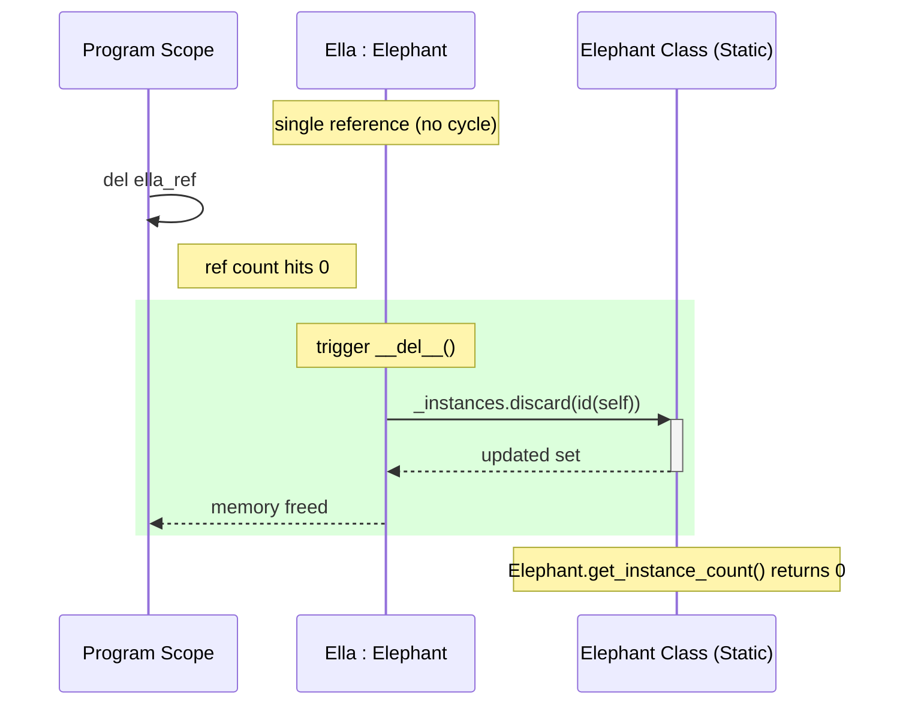
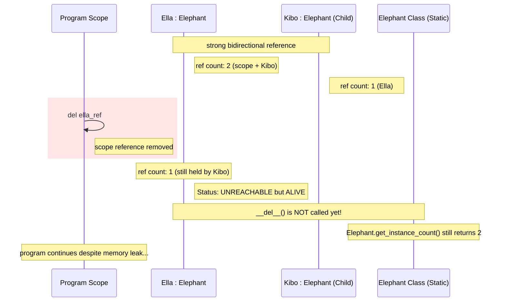
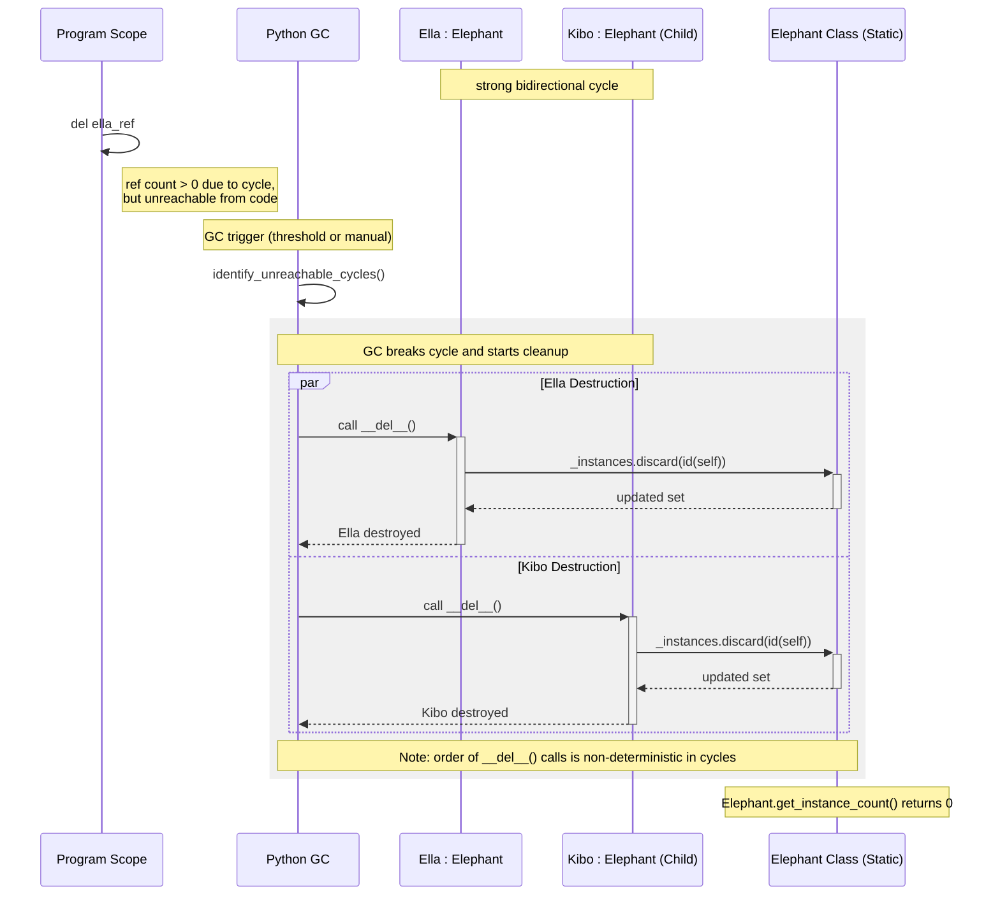
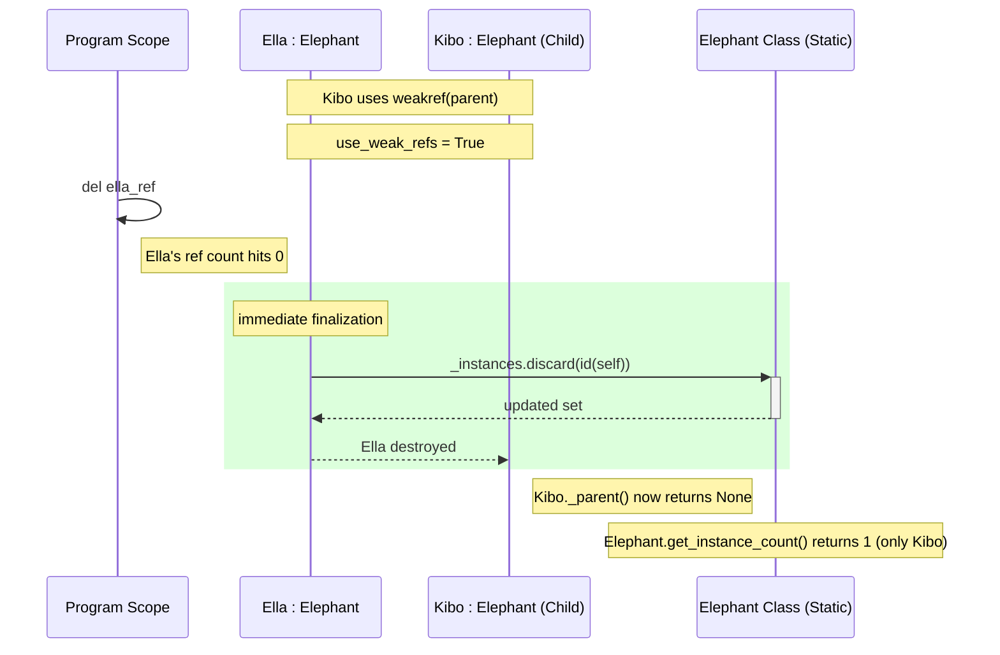

# 1. Sequence Diagram: Simple Reference Counting

This scenario demonstrates the ideal, deterministic cleanup of a single object.

### Mechanism:

* standard Python behavior where an object is destroyed as soon as its ref count drops to zero

### Key Takeaway:

* destruction is deterministic and immediate
* \_\_del__() is called the moment del is executed, promptly updating the class instance tracker

# 2. Sequence Diagram: Reference Counting (The Leak)

Visualization of hypothesis H1: Why circular references prevent memory reclamation.

### Mechanism:

* bidirectional strong reference creates a cycle

### Problem:

* deleting the scope variable only reduces the count from 2 to 1
* since count is not 0, the object remains "alive" in memory

### Key Takeaway:

* object becomes unreachable from the program code but is not destroyed
* demonstrates why reference counting alone cannot handle circular dependencies

# 3. Sequence Diagram: Garbage Collector Intervention

Visualization of hypothesis H2: The cyclic GC as a safety net.

### Mechanism:

* Python’s cyclic GC scans for "islands" of unreachable objects

### Cleanup:

* GC force-breaks the cycle
* because objects are part of a cycle, the order in which \_\_del__() is called on parent vs. child is non-deterministic (unpredictable)

### Key Takeaway:

* GC acts as a backup to prevent permanent memory leaks, but it operates asynchronously (not immediately)

# 4. Sequence Diagram: Resolution with Weakref

The proactive solution using `weakref` for deterministic cleanup.

### Mechanism:

* by using weakref, the child holds a reference to the parent that does not increase the ref count

### Benefit:

* cycle is broken by design
* when program scope deletes its reference, the parent's count hits 0 immediately

### Key Takeaway:

* combines the best of both worlds: immediate, deterministic memory cleanup without needing to wait for the GC