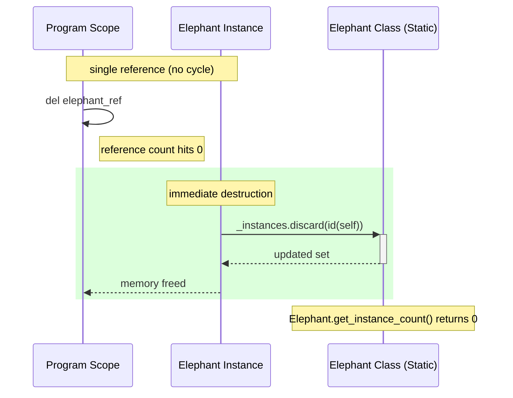
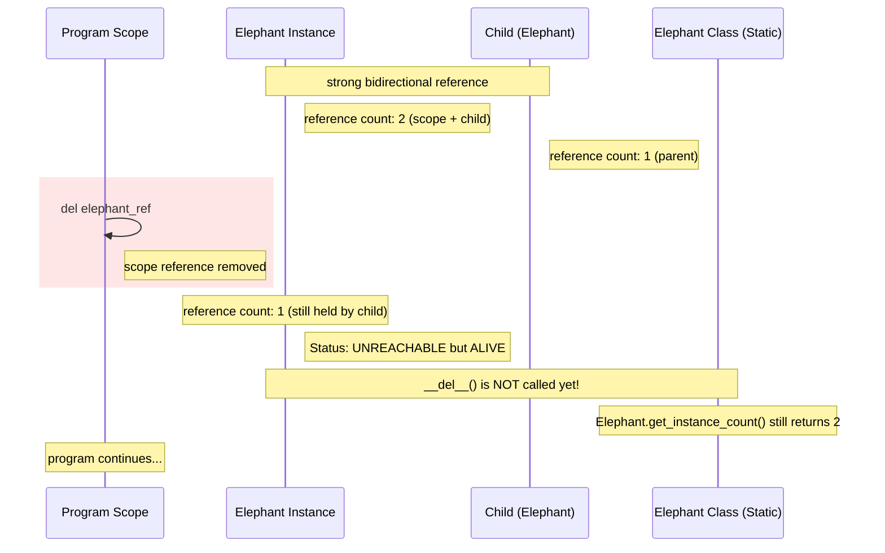
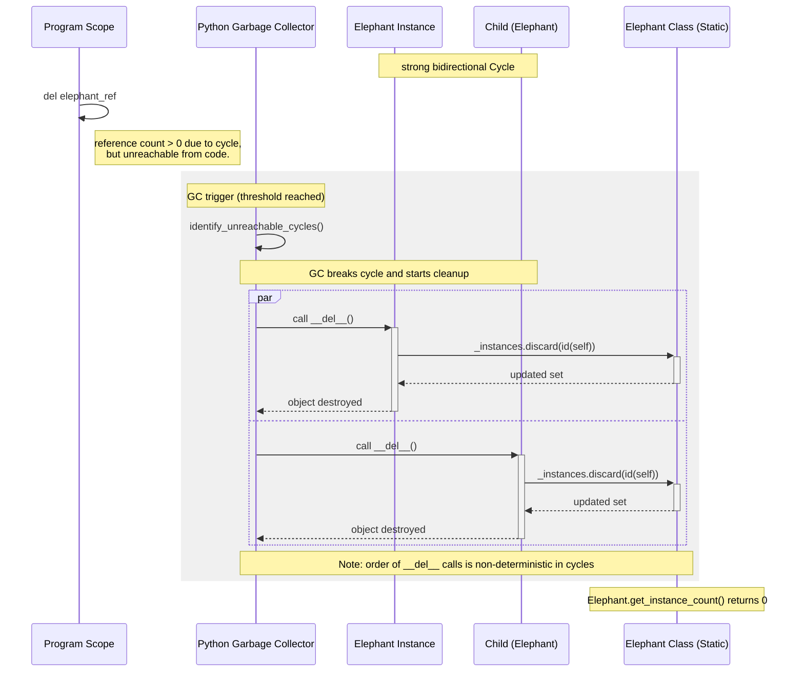
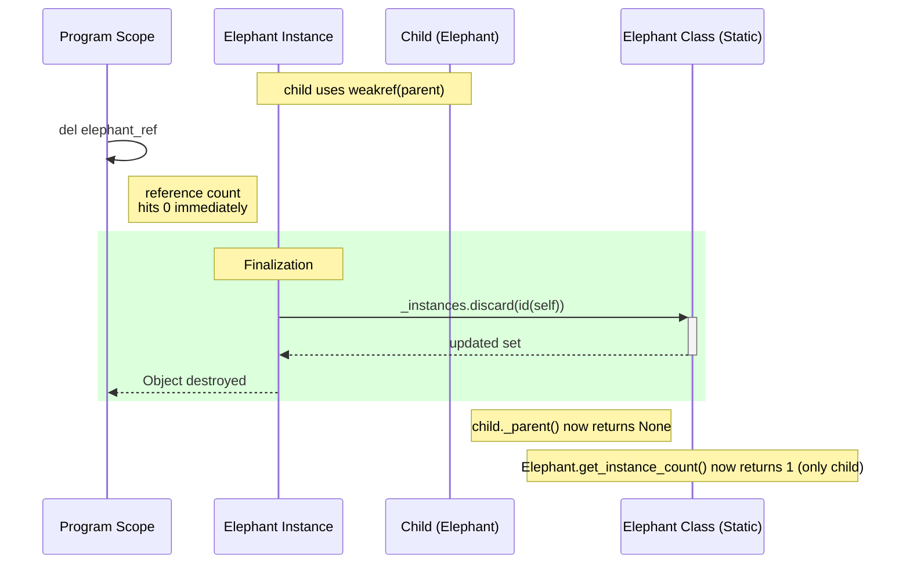

### Sequence Diagram: Simple Reference Counting

* **Mechanism:**
  * standard Python behavior where an object is destroyed as soon as its reference count drops to zero
* **Key Takeaway:**
  * destruction is deterministic and immediate
  * \_\_del__ method is called the moment del is executed, promptly updating the class instance tracker

### Sequence Diagram: Reference Counting

* **Mechanism:**
  * bidirectional strong reference creates a cycle
* **Problem:**
  * deleting the scope variable only reduces the count from 2 to 1
  * since count is not 0, the object remains "alive" in memory
* **Key Takeaway:**
  * object becomes unreachable from the program code but is not destroyed
  * demonstrates why reference counting alone cannot handle circular dependencies

### Sequence Diagram: Garbage Collector

* **Mechanism:**
  * Python’s Cyclic Garbage Collector (GC) scans for "islands" of unreachable objects
* **Cleanup:**
  * GC force-breaks the cycle
  * because objects are part of a cycle, the order in which \_\_del__ is called on Parent vs. Child is non-deterministic (unpredictable)
* **Key Takeaway:**
  * GC acts as a backup to prevent permanent memory leaks, but it operates asynchronously (not immediately)

### Sequence Diagram: Garbage Collector with Weakref

* **Mechanism:**
  * by using weakref, the child holds a reference to the parent that does not increase the reference count
* **Benefit:**
  * cycle is broken by design
  * when program scope deletes its reference, the parent's count hits 0 immediately
* **Key Takeaway:**
  * combines the best of both worlds: immediate, deterministic memory cleanup without needing to wait for the Garbage Collector