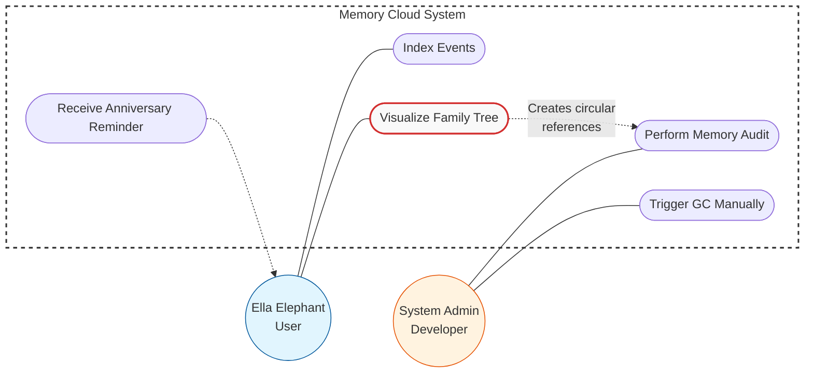

### Use Case Diagram: Elephant Memory Cloud

<u>**Primary Actors:**</u>
* **Ella Elephant** (End User): focuses on functional interaction with the savanna data
* **System Admin** (Developer/Analyst): focuses on technical stability and memory efficiency

<u>**Key Use Cases & Interactions:**</u>
* **Data Management:** Ella indexes events (water sources, herd migrations) to build the "Memory Cloud"
* **Family Tree Visualization:**
  * **Functional Goal:** querying kinships and ancestry
  * **Technical Impact:** process generates complex object graphs with circular references (Parent $\leftrightarrow$ Child)
* **Automated Reminders:** system pushes notifications to Ella for significant anniversaries
* **Memory Audit & GC Control:**
  * admin monitors system health under heavy data loads
  * manual Garbage Collection (GC) triggers allow for testing how the system handles the cleanup of unreachable cycles

<u>**System Logic:**</u>
* **The Dependency:**
  * direct link between "Visualize Family Tree" and "Memory Audit"
  * the deeper the ancestry data, the higher the risk of memory leaks, necessitating robust automated management