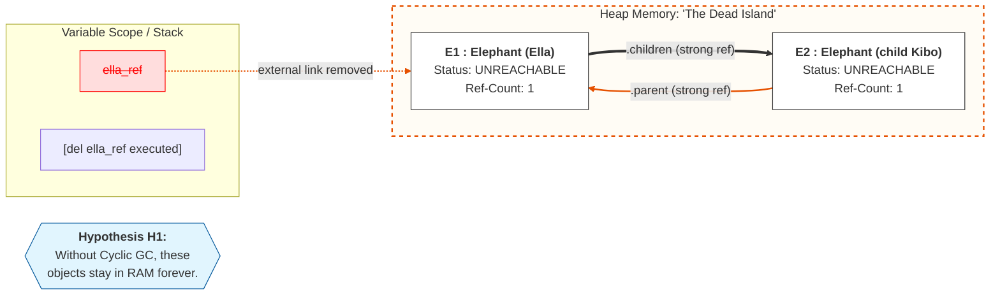
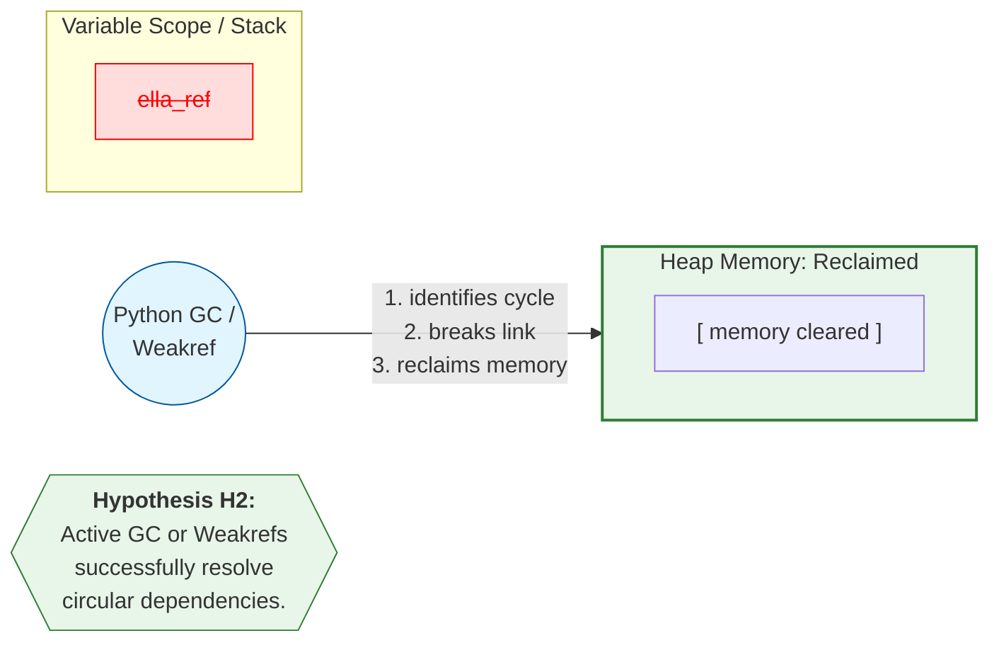

# Object Diagram: Hypothesis H1 - The Circular Reference Leak

This diagram visualizes the system state after a local reference is deleted, demonstrating why standard reference counting fails in cyclic structures.

### Memory Segmentation:

* **Stack:** variable `ella_ref` has been removed from the scope and the application can no longer access the objects
* **Heap:** instances `E1` and `E2` still occupy memory and form a "Dead Island"

### The Failure of Reference Counting:

* internal reference count is 1 for both objects because they point to each other via `.children` and `.parent` although no external variable points to the island
* Python's simple reference counter refuses to delete them, leading to a Memory Leak

### Scientific Context:

* state confirms Hypothesis H1 memory consumption increases with the size of the unreachable graph if the cyclic GC is inactive

# Object Diagram: Hypothesis H2 - Cycle Resolution

This diagram visualizes the state after the cyclic GC or a `weakref` implementation has successfully cleared the "Dead Island".

### The Resolution Process:

* **Cyclic GC:** GC identifies that the objects are only referencing each other and are unreachable from the stack $\rightarrow$ GC force-calls `__del__` and clears the heap
* **Weakref Alternative:** if `weakref` was used for the `.parent` attribute, the reference count of `E1` would have hit 0 immediately upon deleting `ella_ref`, triggering a deterministic cleanup without GC intervention

### Scientific Context:

* state confirms Hypothesis H2 circular references are successfully resolved once the external reference is removed and the GC is active

### Verification:

* `Elephant.get_instance_count()` now returns `0`, proving a clean memory state