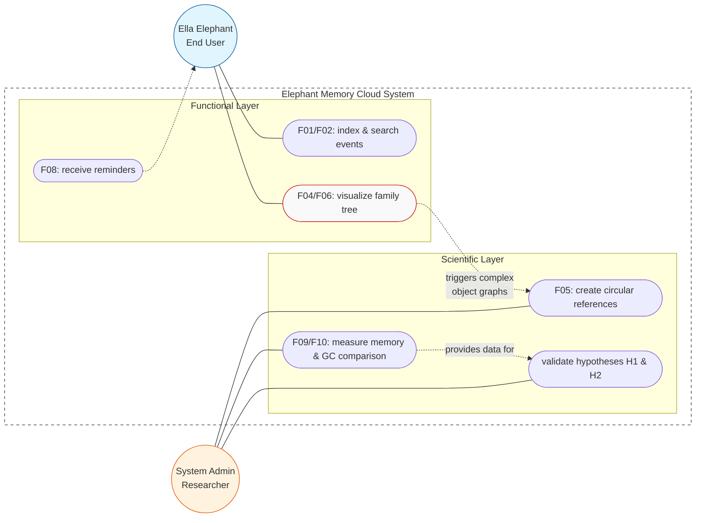

# Use Case Diagram: Elephant Memory Cloud

This diagram illustrates the functional and scientific requirements of the system, distinguishing between standard user interactions and technical research activities.

### Primary Actors

* **Ella Elephant (End User):**
  * interacts with the savanna data model
  * main goal: manage historical events and understand her ancestry
* **System Admin (Researcher/Analyst):**
  * uses the system as a laboratory
  * focus is on technical stability, performance monitoring, and memory auditing

### Key Use Cases

* **Event Management (F01, F02):** storing and retrieving historical data based on year and location
* **Family Tree Visualization (F04, F06):** mapping kinship relations, primary driver for creating deep object graphs
* **Memory Research (F05, F09, F10):**
  * **Cycle Injection:** purposefully creating circular references (e.g., Parent ↔ Child) to test memory limits
  * **GC Comparison:** running identical scenarios with and without Python's cyclic Garbage Collector
* **Hypothesis Validation:** testing H1 (leaking behavior without GC) and H2 (cycle resolution with GC) based on quantitative metrics

### Technical Logic & Dependencies

* **The Bridge:**
  * there is a direct link between the functional "Family Tree" and the scientific "Memory Audit"
  * complexity of biological ancestry data is used as a real-world proxy for the technical problem of circular references
* **Memory Profiling:** system provides specialized tools to observe unreachable objects in real-time