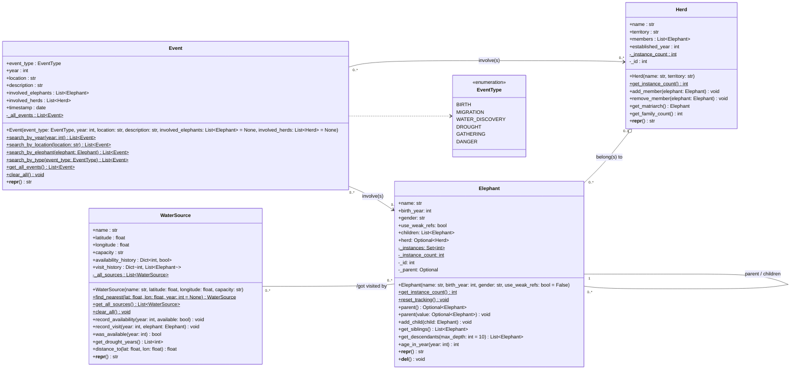

# Class Diagram: Elephant Memory Cloud

```mermaid
classDiagram    
    class Elephant {
        +name: str
        +birth_year: int
        +gender: str
        +use_weak_refs: bool
        +children: List~Elephant~
        +herd: Optional~Herd~
        
        -_instances: Set~int~$
        -_instance_count: int$
        
        -_id: int
        -_parent: Optional
        
        +Elephant(name: str, birth_year: int, gender: str, use_weak_refs: bool = False)
        
        +get_instance_count() int$
        +reset_tracking() void$
        
        +parent() Optional~Elephant~
        +parent(value: Optional~Elephant~) void
        +add_child(child: Elephant) void
        +get_siblings() List~Elephant~
        +get_descendants(max_depth: int = 10) List~Elephant~
        +age_in_year(year: int) int
        +__repr__() str
        +__del__() void
    }
    
    class EventType {
        <<enumeration>>
        BIRTH
        MIGRATION
        WATER_DISCOVERY
        DROUGHT
        GATHERING
        DANGER
    }

    class Event {        
        +event_type : EventType
        +year : int
        +location : str
        +description : str
        +involved_elephants : List~Elephant~
        +involved_herds : List~Herd~
        +timestamp : date
        
        -_all_events : List~Event~$
        
        +Event(event_type: EventType, year: int, location: str, description: str, involved_elephants: List~Elephant~ = None, involved_herds: List~Herd~ = None)
        
        +search_by_year(year: int) List~Event~$
        +search_by_location(location: str) List~Event~$
        +search_by_elephant(elephant: Elephant) List~Event~$
        +search_by_type(event_type: EventType) List~Event~$
        +get_all_events() List~Event~$
        +clear_all() void$
        
        +__repr__() str
    }
    
    class Herd {        
        +name : str
        +territory : str
        +members : List~Elephant~
        +established_year : int
        
        -_instance_count : int$
        
        -_id : int
        
        +Herd(name: str, territory: str)
        
        +get_instance_count() int$
        
        +add_member(elephant: Elephant) void
        +remove_member(elephant: Elephant) void
        +get_matriarch() Elephant
        +get_family_count() int
        
        +__repr__() str
    }
    
    class WaterSource {        
        +name : str
        +latitude : float
        +longitude : float
        +capacity : str
        +availability_history : Dict~int, bool~
        +visit_history : Dict~int, List~Elephant~~
        
        -_all_sources : List~WaterSource~$

        +WaterSource(name: str, latitude: float, longitude: float, capacity: str)
        
        +find_nearest(lat: float, lon: float, year: int = None) WaterSource$
        +get_all_sources() List~WaterSource~$
        +clear_all() void$
        
        +record_availability(year: int, available: bool) void
        +record_visit(year: int, elephant: Elephant) void
        +was_available(year: int) bool
        +get_drought_years() List~int~
        +distance_to(lat: float, lon: float) float
        
        +__repr__() str
    }

    direction LR

    %% relationships
    Event "0..*" --> "0..*" Elephant : involve(s)
    Event "0..*" --> "0..*" Herd : involve(s)
    Event ..> EventType
    Elephant "1" -- "0..*" Elephant : parent / children
    Elephant "0..*" --o "0..1" Herd : belong(s) to
    WaterSource "0..*" -- "0..*" Elephant : /got visited by
```