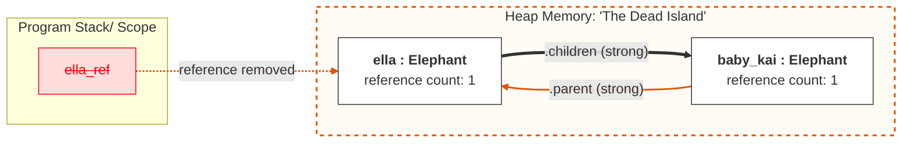

### Object Diagram

<u>**Memory Segmentation:**</u>
* **Program Stack:**
  * contains the local variable ella_ref
  * red styling indicates that the variable has been deleted (del ella_ref), meaning the application can no longer access this memory address
* **Heap Memory:**
  * contains the actual Elephant instances
  * orange dashed border represents the "Dead Island" — a group of objects that are isolated from the main program but still occupy memory

<u>**The Circular Reference Problem:**</u>
* even though the external reference is gone, ella and baby_kai maintain strong references to each other (.children and .parent)
* because each object still has an internal reference count of 1, Python's standard memory manager assumes they are still "in use" and refuses to delete them
* this state represents a memory leak (objects are unreachable from the code but stay alive in the heap)
* only the Cyclic Garbage Collector can detect this isolated island, recognize that it has no connection to the stack, and force-clear the cycle to free up memory