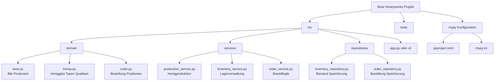

# Konzept – Bear Honeyworks 

## Leitfrage 

„Welchen Mehrwert bietet statische Typprüfung mit mypy in dynamisch typisierten Python-Anwendungen
am Beispiel eines domänenspezifischen Produktionssystems?“

## Erläuterung 

Ziel des Projekts „Bear Honeyworks“ ist die Entwicklung einer vereinfachten Software zur Modellierung einer fiktiven Honigfabrik eines Bären.

### Das System bildet typische fachliche Prozesse ab, darunter:
- Honigproduktion
- Lagerverwaltung
- Bestellverarbeitung

Im Fokus steht dabei nicht die Laufzeitoptimierung, sondern die Absicherung der fachlichen Logik durch statische Typprüfung.

### Mithilfe von mypy soll untersucht werden, inwiefern:
- Typfehler frühzeitig erkannt
- Laufzeitfehler reduziert
- Codeverständlichkeit und Wartbarkeit verbessert

werden können – trotz der dynamischen Natur von Python.

## Zielsetzung 

### Das Projekt verfolgt folgende Ziele:
- Demonstration statischer Typprüfung in Python
- Praxisnahe Modellierung einer Domäne (Honigfabrik)
- Aufzeigen typischer Fehlerquellen ohne Typprüfung
- Vergleich von Code mit und ohne mypy-Absicherung

Der Fokus liegt auf Softwarequalität, nicht auf Performance.

## Systemaufbau 

Konzeptionell besteht „Bear Honeyworks“ aus mehreren logisch getrennten Komponenten:
- einem Domänenmodul für zentrale Fachobjekte (z. B. Bär, Honigglas, Bestellung)
- einem Produktionsmodul zur Erzeugung von Honig
- einem Lagermodul zur Verwaltung des Bestands
- einer Validierungs- und Prüfkomponente durch mypy

Die Module sind bewusst stark typisiert, um klare Schnittstellen zwischen den Komponenten zu definieren.

## Methodik 

### Die Methodik des Projekts basiert auf einem vergleichenden Analyseansatz:
- Implementierung fachlicher Logik mit vollständigen Typannotationen
- Prüfung des Codes mit mypy
- gezielte Einbringung fehlerhafter Typverwendungen
- Analyse der von mypy erzeugten Fehlermeldungen

### Zusätzlich wird untersucht, wie sich Typannotationen auf:
- Lesbarkeit
- Entwicklungsunterstützung (IDE)
- Fehlersuche

Der Ansatz ist qualitativ-analytisch und nicht benchmark-orientiert.

## Typisierungskonzept 

### Zur Typabsicherung werden unter anderem eingesetzt:
- primitive Typen (int, float, str)
- zusammengesetzte Typen (List, Optional)
- Rückgabetypen von Funktionen
- Klassenattribute mit expliziten Typen

Alle fachlichen Objekte besitzen klar definierte Typverträge, die von mypy überprüft werden.

## Technologien & Entscheidungen 

Zur Umsetzung des Projekts wurden folgende Technologien gewählt:

### Programmiersprache
- Python
- Begründung: Python ist dynamisch typisiert und eignet sich daher besonders gut, um den Nutzen statischer Typprüfung sichtbar zu machen.

### Statische Typprüfung
- mypy
- Begründung: Etablierter De-facto-Standard für statische Typprüfung in Python, mit guter Tool- und IDE-Integration.

### Typannotationssystem
- typing (Standardbibliothek)
- Begründung: Ermöglicht präzise Typdefinitionen ohne zusätzliche Abhängigkeiten.

### Entwicklungsumgebung
- IDE mit mypy-Integration
- Begründung: Sofortige Rückmeldung über Typfehler erhöht Entwicklungsqualität und Produktivität.

## Was wird benötigt

Fuer die Umsetzung von Bear Honeyworks werden folgende Ressourcen benoetigt:

### Daten und Testfaelle
- Beispiel-Bestellungen und Beispiel-Lagerbestaende werden als kleine, feste Testdaten definiert (z. B. JSON Dateien oder Python Fixtures).
- Es werden typische Randfaelle abgedeckt, z. B. leeres Lager, Teilentnahme, falsche Sortenangabe, None Werte an Schnittstellen.

### Bibliotheken und Tools
- mypy: statische Typpruefung
- typing (Std Lib): Typannotationen wie List, Optional, Protocol
- Optional pytest: automatisierte Tests fuer Service Logik
- Optional rich oder simple print Ausgaben: fuer eine klare Demo in der Pruefung

### Ausfuehrung und Nachweis
- Die Anwendung wird ueber einen einfachen Einstiegspunkt gestartet (app.py oder cli), um Produktions, Lager und Bestellablaeufe vorzufuehren.
- Die Typpruefung wird ueber CLI nachweisbar gemacht, z. B. mit mypy src.

## Abgrenzung 

### Nicht Bestandteil des Projekts sind:
- Performance-Optimierungen
- Datenbankanbindungen
- Benutzeroberflächen
- Nebenläufigkeit oder Parallelisierung

Der Fokus liegt ausschließlich auf Typensicherheit und Softwarequalität.

## Projektstruktur & Architektur 

Um die Typprüfung mit mypy sinnvoll und wartbar einzusetzen, wird Bear Honeyworks modular aufgebaut.
Die fachliche Logik wird in klar getrennte Komponenten aufgeteilt, sodass jede Schicht eindeutige Typverträge besitzt.

Ordnerstruktur (geplant)

### Warum so?
- domain/ bleibt möglichst „clean“ (keine IO, keine Nebenwirkungen)
- services/ kapseln Logik und validieren Typen/Schnittstellen
- repositories/ machen späteres Erweitern leicht (Datei/DB), ohne Logik umzubauen

## Klassendesign & Typverträge 

### Das Modell wird objektorientiert mit klaren Verantwortlichkeiten umgesetzt:
- Bear: produziert Honig (liefert typisierte HoneyJar zurück)
- HoneyJar: enthält feste Attribute wie Gewicht, Sorte, Qualitätsstufe
- Inventory / InventoryRepository: verwaltet Bestand als typisierte Sammlung
- Order: beschreibt Bestellanforderungen (Menge, Sorte, max. Preis etc.)
- Services übernehmen die Abläufe (Produktion → Lager → Bestellung)

mypy-Ziel dabei:
Jede Service-Methode hat eindeutige Parameter- und Rückgabetypen, sodass Fehler wie „falsche Einheit“, „falsches Objekt“, „None statt Objekt“ früh erkannt werden.

## Konfigurationsansatz für mypy 

Die Typprüfung wird so konfiguriert, dass sie für die Prüfung klar nachweisbar ist:
- striktere Einstellungen (z. B. disallow_untyped_defs)
- klare Trennung: Domain strikt typisiert, Demo-Code ebenfalls
- demonstrierbare Fehlerfälle (absichtlich falscher Typ) als Prüfbeispiel

## Wissenschaftlicher Hintergrund

Python ist eine dynamisch typisierte Programmiersprache. Datentypen werden erst zur Laufzeit geprüft, was eine schnelle Entwicklung ermöglicht, jedoch auch dazu führt, dass bestimmte Fehlerklassen erst spät erkannt werden. Insbesondere bei wachsenden Codebasen kann dies die Wartbarkeit erschweren und zu schwer nachvollziehbaren Laufzeitfehlern führen.

Ein etablierter Ansatz zur Verbesserung der Codequalität in dynamischen Sprachen ist die graduelle Typisierung (gradual typing). Dieser Ansatz kombiniert die Flexibilität dynamischer Typisierung mit den Vorteilen statischer Typprüfung. Typannotationen können schrittweise ergänzt werden, ohne das Laufzeitverhalten der Anwendung zu verändern (Siek & Taha, 2006).

Für Python wurde dieser Ansatz formal mit PEP 484 eingeführt, welches ein standardisiertes System für optionale Typannotationen definiert (van Rossum et al., 2014). Die eigentliche Typprüfung erfolgt dabei nicht zur Laufzeit, sondern durch externe Werkzeuge wie mypy, die den Code statisch analysieren.

Untersuchungen und praktische Erfahrungen zeigen, dass statische Typprüfung in dynamischen Sprachen insbesondere folgende Vorteile bietet:
- frühzeitige Erkennung von Typfehlern,
- klarere Schnittstellen zwischen Modulen,
- verbesserte Wartbarkeit und Lesbarkeit des Codes,
- bessere Unterstützung durch Entwicklungsumgebungen.

Gleichzeitig bleibt die Flexibilität der Sprache erhalten, da Typannotationen optional sind und schrittweise eingeführt werden können.

### Bezug zu Bear Honeyworks

Im Projekt Bear Honeyworks wird dieser Ansatz gezielt angewendet:
- Das Domänenmodell (z. B. Bär, Honigglas, Bestellung) wird vollständig typisiert.
- Geschäftslogik wird über klar definierte, typisierte Service-Schnittstellen umgesetzt.
- Mit mypy werden Typverträge zwischen den Modulen überprüft, sodass Fehler wie falsche Rückgabetypen, inkonsistente Datentypen oder fehlerhafte None-Verwendung bereits vor der Programmausführung erkannt werden.

Damit dient Bear Honeyworks als praxisnahes Beispiel dafür, wie statische Typprüfung die Softwarequalität in dynamisch typisierten Python-Anwendungen verbessern kann.

## Literatur (APA)

van Rossum, G., Lehtosalo, J., & Langa, Ł. (2014).  
PEP 484 – Type hints. Python Software Foundation.  
https://peps.python.org/pep-0484/

Siek, J. G., & Taha, W. (2006).  
Gradual typing for functional languages.  
In Scheme and Functional Programming Workshop (pp. 81–92).