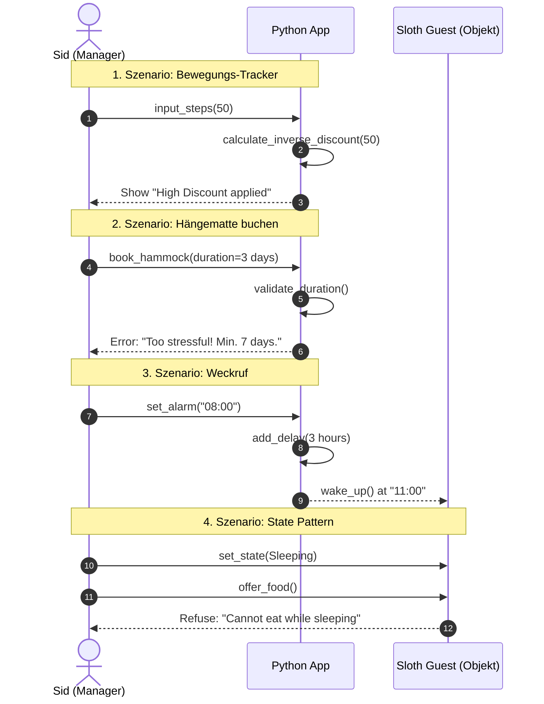

```mermaid
sequenceDiagram
    autonumber
    actor Sid as Sid (Manager)
    participant App as Python App
    participant Guest as Sloth Guest (Objekt)

    note over Sid, App: 1. Szenario: Bewegungs-Tracker
    Sid->>App: input_steps(50)
    App->>App: calculate_inverse_discount(50)
    App-->>Sid: Show "High Discount applied"

    note over Sid, App: 2. Szenario: Hängematte buchen
    Sid->>App: book_hammock(duration=3 days)
    App->>App: validate_duration()
    App-->>Sid: Error: "Too stressful! Min. 7 days."

    note over Sid, App: 3. Szenario: Weckruf
    Sid->>App: set_alarm("08:00")
    App->>App: add_delay(3 hours)
    App-->>Guest: wake_up() at "11:00"

    note over Sid, Guest: 4. Szenario: State Pattern
    Sid->>Guest: set_state(Sleeping)
    Sid->>Guest: offer_food()
    Guest-->>Sid: Refuse: "Cannot eat while sleeping"

```
