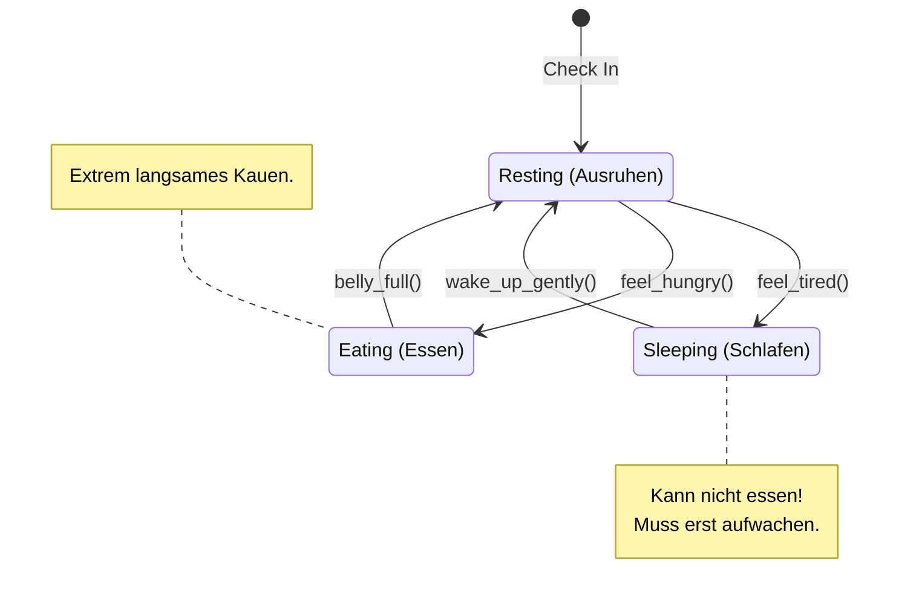

```mermaid
stateDiagram-v2
    [*] --> Resting : Check In

    state "Resting (Ausruhen)" as Resting
    state "Sleeping (Schlafen)" as Sleeping
    state "Eating (Essen)" as Eating
    
    %% Transitionen
    Resting --> Sleeping : feel_tired()
    Sleeping --> Resting : wake_up_gently()
    
    Resting --> Eating : feel_hungry()
    Eating --> Resting : belly_full()

    %% Logische Blockaden visualisieren (optional als Notiz)
    note right of Sleeping
        Kann nicht essen!
        Muss erst aufwachen.
    end note

    note left of Eating
        Extrem langsames Kauen.
    end note
```
