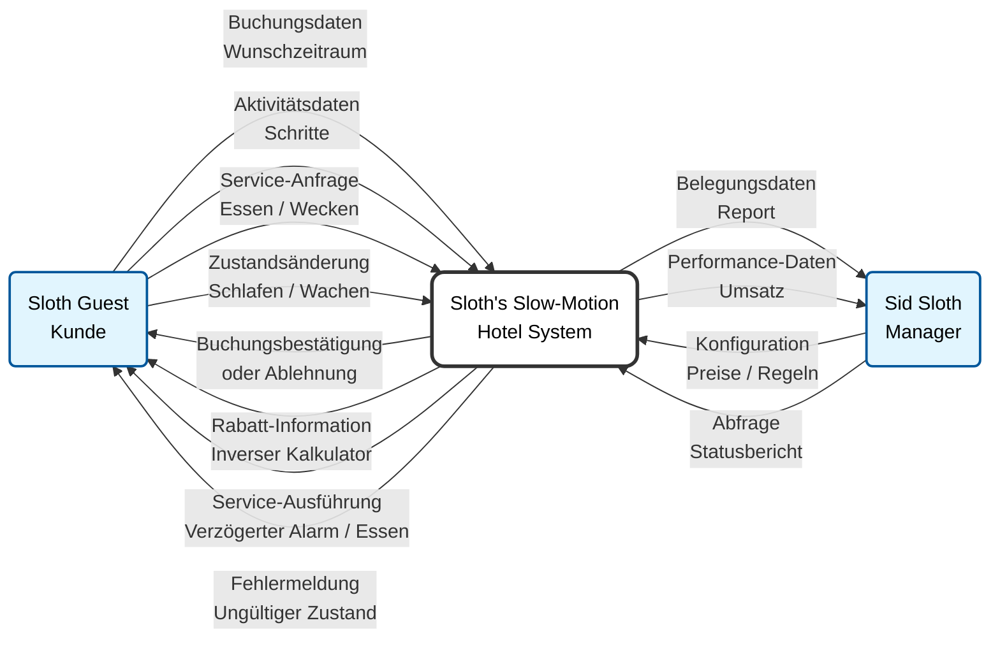
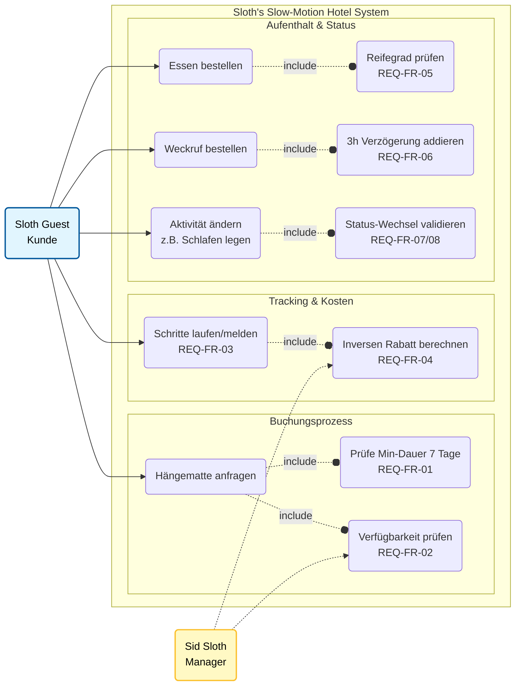

```mermaid
graph LR
    %% --- STYLING ---
    classDef actorStyle fill:#e1f5fe,stroke:#01579b,stroke-width:2px,color:black;
    classDef systemStyle fill:#fff,stroke:#333,stroke-width:3px,rx:10,ry:10,color:black;

    %% --- ENTITIES ---
    Guest(Sloth Guest<br>Kunde):::actorStyle
    Sid(Sid Sloth<br>Manager):::actorStyle
    System(Sloth's Slow-Motion<br>Hotel System):::systemStyle

    %% --- DATA FLOWS: GUEST -> SYSTEM ---
    Guest -- "Buchungsdaten<br>Wunschzeitraum" --> System
    Guest -- "Aktivitätsdaten<br>Schritte" --> System
    Guest -- "Service-Anfrage<br>Essen / Wecken" --> System
    Guest -- "Zustandsänderung<br>Schlafen / Wachen" --> System

    %% --- DATA FLOWS: SYSTEM -> GUEST ---
    System -- "Buchungsbestätigung<br>oder Ablehnung" --> Guest
    System -- "Rabatt-Information<br>Inverser Kalkulator" --> Guest
    System -- "Service-Ausführung<br>Verzögerter Alarm / Essen" --> Guest
    System -- "Fehlermeldung<br>Ungültiger Zustand" --> Guest

    %% --- DATA FLOWS: SID -> SYSTEM ---
    Sid -- "Konfiguration<br>Preise / Regeln" --> System
    Sid -- "Abfrage<br>Statusbericht" --> System

    %% --- DATA FLOWS: SYSTEM -> SID ---
    System -- "Belegungsdaten<br>Report" --> Sid
    System -- "Performance-Daten<br>Umsatz" --> Sid

```

```mermaid
graph LR
    %% --- STYLING ---
    classDef actorGuest fill:#e1f5fe,stroke:#01579b,stroke-width:2px,color:black;
    classDef actorManager fill:#fff9c4,stroke:#fbc02d,stroke-width:2px,color:black;
    classDef ucStyle fill:#fff,stroke:#333,stroke-width:1px,rx:5,ry:5,color:black;

    %% --- ACTORS ---
    Guest(Sloth Guest<br>Kunde):::actorGuest
    Sid(Sid Sloth<br>Manager):::actorManager

    %% --- SYSTEM BOUNDARY ---
    subgraph "Sloth's Slow-Motion Hotel System"
        direction TB

        %% --- 1. BUCHUNG ---
        subgraph "Buchungsprozess"
            UC_Book(Hängematte anfragen)
            UC_Rule_Days(Prüfe Min-Dauer 7 Tage<br>REQ-FR-01)
            UC_Check_Avail(Verfügbarkeit prüfen<br>REQ-FR-02)
        end

        %% --- 2. AKTIVITÄT & RABATT ---
        subgraph "Tracking & Kosten"
            UC_Walk(Schritte laufen/melden<br>REQ-FR-03)
            UC_Calc_Disc(Inversen Rabatt berechnen<br>REQ-FR-04)
        end

        %% --- 3. LEBEN IM HOTEL ---
        subgraph "Aufenthalt & Status"
            UC_Eat(Essen bestellen)
            UC_Rule_Leaf(Reifegrad prüfen<br>REQ-FR-05)
            
            UC_Wake(Weckruf bestellen)
            UC_Rule_Delay(3h Verzögerung addieren<br>REQ-FR-06)

            UC_State(Aktivität ändern<br>z.B. Schlafen legen)
            UC_Rule_State(Status-Wechsel validieren<br>REQ-FR-07/08)
        end
    end

    %% --- BEZIEHUNGEN (Wer initiiert was?) ---
    
    %% Der Gast will buchen
    Guest --> UC_Book
    
    %% Der Gast bewegt sich (oder meldet Schritte)
    Guest --> UC_Walk
    
    %% Der Gast will Services
    Guest --> UC_Eat
    Guest --> UC_Wake
    Guest --> UC_State

    %% Der Manager überwacht oder bestätigt (optional)
    Sid -.-> UC_Check_Avail
    Sid -.-> UC_Calc_Disc

    %% --- AUTOMATISCHE REGELN (Include) ---
    %% Wenn Gast bucht, MUSS System Regel prüfen
    UC_Book -.-o|include| UC_Rule_Days
    UC_Book -.-o|include| UC_Check_Avail
    
    %% Wenn Gast Schritte meldet, MUSS Rabatt berechnet werden
    UC_Walk -.-o|include| UC_Calc_Disc
    
    %% Wenn Gast isst, MUSS Reife geprüft werden
    UC_Eat -.-o|include| UC_Rule_Leaf
    
    %% Wenn Gast Weckruf will, MUSS verzögert werden
    UC_Wake -.-o|include| UC_Rule_Delay

    %% Wenn Gast Status ändert, MUSS validiert werden
    UC_State -.-o|include| UC_Rule_State
```
