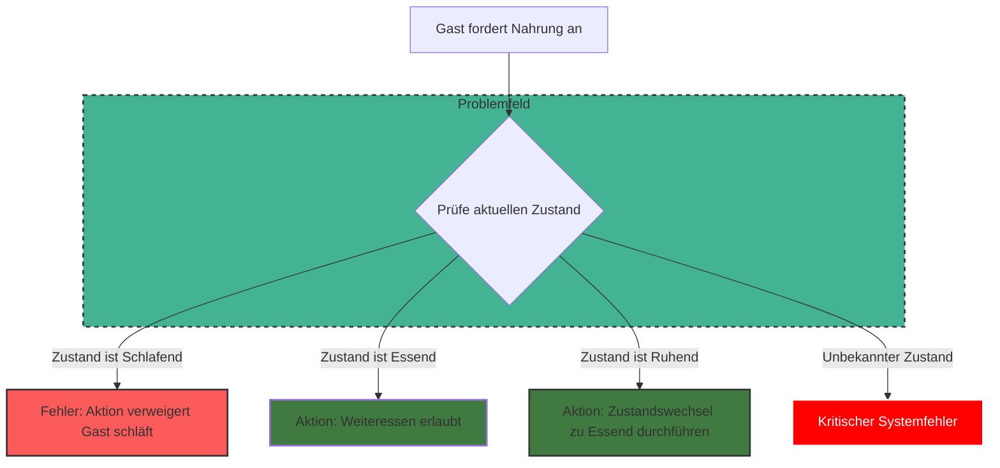
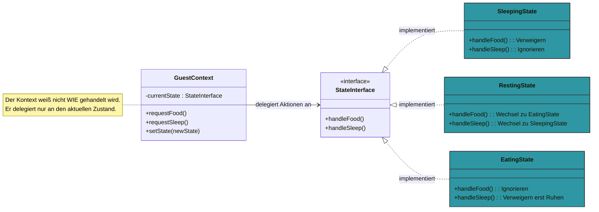
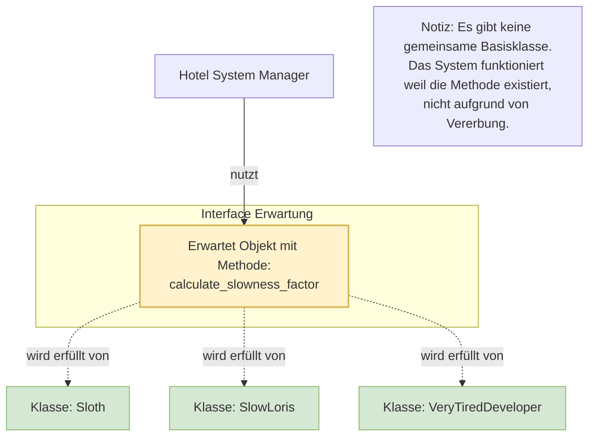

# Projektkonzeption: Sloth’s Slow-Motion Hotel

## 1. Management Summary
Dieses Dokument beschreibt die Anforderungen und die technische Architektur für das "Sloth’s Slow-Motion Hotel". Die Software hilft Hotelmanager Sid Sloth dabei sein spezielles Resort für Faultiere zu verwalten.

Anders als normale Hotel-Programme bei denen alles schnell gehen muss steht hier **Langsamkeit** im Mittelpunkt. Alle Funktionen – von der Buchung bis zum Service – sollen Hektik vermeiden und entspanntes Verhalten belohnen.

## 2. Technischer Fokus und Architektur
Das Projekt ist Teil des Moduls *DLBDSIPWP01* und zeigt beispielhaft moderne Software-Architektur. Wichtig sind hier nicht möglichst viele Funktionen sondern ein sauberer und gut strukturierter Code.

### Theoretische Fundierung
Die Architektur folgt den Prinzipien der etablierten Entwurfsmuster wie sie von Sean Bradley beschrieben werden. Entwurfsmuster bieten ein nützliches und gemeinsames Vokabular für den Entwurf die Dokumentation und die Analyse von Softwareprojekten.

* **Structural Design Patterns:**
    Strukturelle Muster konzentrieren sich darauf, wie Klassen und Objekte zusammengesetzt werden. Ziel ist es Strukturen mit erhöhter oder veränderter Flexibilität zu bilden. Im Kontext unseres Hotels ermöglicht dies eine lose Kopplung zwischen den Komponenten wie dem Buchungssystem und der Hardware-Peripherie. Bradley hebt hervor dass diese Muster helfen, Beziehungen zwischen Entitäten zu realisieren die über einfache Vererbung hinausgehen.

* **State Pattern:**
    Das State Pattern wird als Verhaltensmuster klassifiziert und ermöglicht es einem Objekt, sein Verhalten zu ändern wenn sich sein interner Zustand ändert. Technisch wird dies erreicht indem der Zugriff auf eine Methode dynamisch auf eine der Unterklassen umgeleitet wird um den neuen internen Zustand widerzuspiegeln. Für unser Hotelprojekt bedeutet dies dass die Zustandslogik der Gäste - Sleeping, Resting, Eating - sauber in eigenen Klassen gekapselt wird. Dies verhindert invalide Zustandsübergänge und entspricht der wissenschaftlichen Definition nach der das Verhalten eines Objekts innerhalb der Unterklassen gekapselt ist die dynamisch zur Behandlung zugewiesen werden.

* **Duck Typing und Flexibilität:**
    In Python können Entwurfsmuster durch Duck Typing besonders elegant umgesetzt werden. Obwohl Bradley in seinen Beispielen oft Abstract Base Classes - ABCMeta - zur expliziten Definition von Schnittstellen verwendet profitiert die Architektur von Pythons dynamischer Natur. Dies erlaubt eine flexible Umsetzung von Mustern. Duck Typing gewährleistet hier die lose Kopplung zwischen den Systemkomponenten da Objekte lediglich die erwarteten Methoden implementieren müssen ohne von einer spezifischen Schnittstelle erben zu müssen.

* **Literaturverzeichnis:**
* **Bradley Sean:** Design Patterns in Python Common GoF Gang of Four Design Patterns Implemented In Python. 2019-2021.
    * Verfügbar unter: https://softwaredesignpatterns.azurewebsites.net/eBooks/Design%20Patterns%20in%20Python.pdf

### Kernkonzepte der Implementierung
* **Structural Design Patterns:** Einsatz von Mustern zur Erhöhung der Flexibilität.
* **State Pattern:** Die Zustandslogik der Gäste - Sleeping, Resting, Eating - wird über das State Pattern abgebildet. Dies verhindert invalide Zustandsübergänge und kapselt das Verhalten sauber.
* **Duck Typing:** Nutzung der dynamischen Typisierung von Python um lose Kopplung zwischen den Systemkomponenten zu gewährleisten.

* **native Implementierung:**

* **State Pattern Architektur:**

* **Duck-Typing-Visualisierung:**

## 3. Funktionale Anforderungen
Alle Anforderungen haben IDs um sie im Code wiederzufinden. Da der Code auf Englisch geschrieben wird sind auch die IDs englisch. Die Klassifizierung nach Priorität erfolgt durch die MoSCoW-Methode:
M - Must
S - Should
C - Could
W - Won't

### 3.1 Buchungsverwaltung
Das System kümmert sich um die Langzeit-Buchung von Hängematten passend zum Hotel-Konzept.

* **REQ-FR-01 - M - Min Duration:** Buchungen müssen eine Mindestdauer von 7 Tagen aufweisen. Anfragen für kürzere Zeiträume werden systemseitig abgelehnt.
* **REQ-FR-02 - C - Availability:** Prüfung der Verfügbarkeit von Hängematten für den angefragten Zeitraum.

### 3.2 Inzentivierung & Tracking
Ein Belohnungssystem motiviert die Gäste durch Rabatte wenn sie sich wenig bewegen.

* **REQ-FR-03 - M - Step Input:** Erfassungsschnittstelle für tägliche Schrittdaten der Gäste.
* **REQ-FR-04 - M - Inverse Discount:** Berechnung eines dynamischen Rabatts basierend auf der Inaktivität.
    * *Logik:* Geringere Schrittzahl führt zu höherem Rabatt. Hektische Aktivität reduziert den Nachlass auf Null.

### 3.3 Verpflegungslogistik
Essen wird erst freigegeben wenn die Zeit reif ist.

* **REQ-FR-05 - M - Maturity Calc:** Algorithmus zur Berechnung der Blattreife. Nahrungsmittel dürfen erst nach Erreichen des optimalen Reifegrads ausgegeben werden.

### 3.4 Zeitmanagement
* **REQ-FR-06 - M - Delayed Alarm:** Der Wecker löst mit einer Verzögerung von 3h aus.

### 3.5 Zustandsmodellierung
* **REQ-FR-07 - M - Guest States:** Jeder Gast befindet sich zu jedem Zeitpunkt in einem exklusiven Zustand - `Sleeping`, `Resting`, `Eating`.
* **REQ-FR-08 - M - State Transition:** Validierung von Zustandswechseln. Ungültige Transitionen werden durch die Architektur unterbunden.

## 4. Qualitätsanforderungen
Allgemeine technische Vorgaben für das Projekt.

* **REQ-NFR-01 - M - Language:** Codebasis Kommentare und interne Dokumentation sind in **Englisch** zu halten.
* **REQ-NFR-02 - S - Documentation:** Durchgängige Dokumentation mittels Python-Docstrings und zentraler README.
* **REQ-NFR-03 - S - Testing:** Testabdeckung durch Unit-Tests sowie mind. 3 Integrationstests.
* **REQ-NFR-04 - C - CI/CD:** Definition eines reproduzierbaren Build- und Testprozesses - z.B. via Skript oder Pipeline-Config.
* **REQ-NFR-05 - M - Architecture:** Konsequente Anwendung objektorientierter Prinzipien - OOP - und Separation of Concerns.

## 5. Akteure
* **Sid Sloth - Hotel Manager:** Interagiert mit dem System zur Verwaltung von Buchungen Eingabe von Metriken und Steuerung der operativen Abläufe.
* **Sloth Guest - System Entity:** Repräsentiert den Gast im System inkl. Zustandsverwaltung und Abrechnungsdaten.
