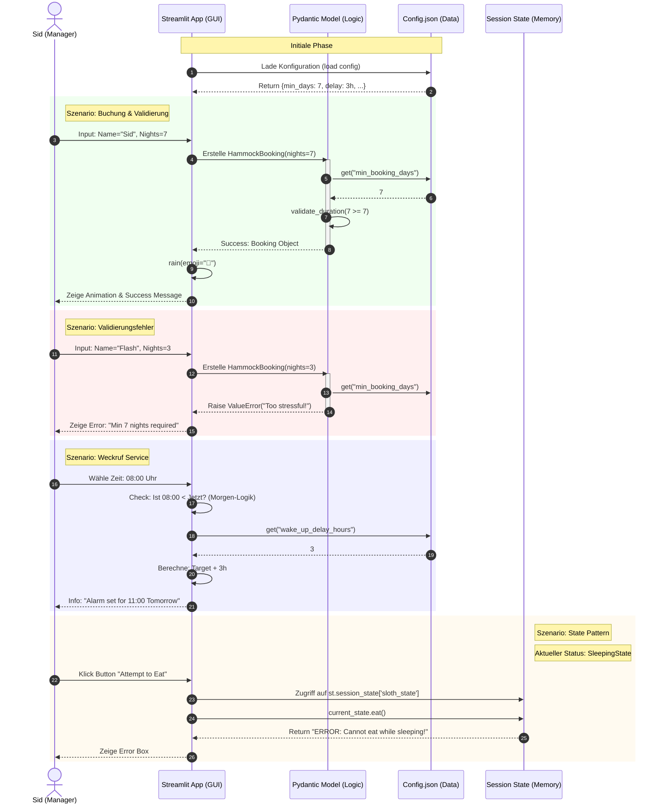

```mermaid
sequenceDiagram
    autonumber
    actor Sid as Sid (Manager)
    participant GUI as Streamlit App (GUI)
    participant Model as Pydantic Model (Logic)
    participant Config as Config.json (Data)
    participant State as Session State (Memory)

    %% Initialisierung
    note over GUI, Config: Initiale Phase
    GUI->>Config: Lade Konfiguration (load config)
    Config-->>GUI: Return {min_days: 7, delay: 3h, ...}

    %% Szenario 1: Hängematte buchen (Mit Config & Regen)
    rect rgb(240, 255, 240)
    note right of Sid: Szenario: Buchung & Validierung
    Sid->>GUI: Input: Name="Sid", Nights=7
    GUI->>Model: Erstelle HammockBooking(nights=7)

    activate Model
    Model->>Config: get("min_booking_days")
    Config-->>Model: 7
    Model->>Model: validate_duration(7 >= 7)
    Model-->>GUI: Success: Booking Object
    deactivate Model

    GUI->>GUI: rain(emoji="🦥");
    GUI-->>Sid: Zeige Animation & Success Message
    end

    %% Szenario 2: Hängematte Fehlerfall
    rect rgb(255, 240, 240)
    note right of Sid: Szenario: Validierungsfehler
    Sid->>GUI: Input: Name="Flash", Nights=3
    GUI->>Model: Erstelle HammockBooking(nights=3)

    activate Model
    Model->>Config: get("min_booking_days")
    Model-->>GUI: Raise ValueError("Too stressful!")
    deactivate Model

    GUI-->>Sid: Zeige Error: "Min 7 nights required"
    end

    %% Szenario 3: Weckruf (Gehärtete Logik)
    rect rgb(240, 240, 255)
    note right of Sid: Szenario: Weckruf Service
    Sid->>GUI: Wähle Zeit: 08:00 Uhr

    GUI->>GUI: Check: Ist 08:00 < Jetzt? (Morgen-Logik)
    GUI->>Config: get("wake_up_delay_hours")
    Config-->>GUI: 3
    GUI->>GUI: Berechne: Target + 3h
    GUI-->>Sid: Info: "Alarm set for 11:00 Tomorrow"
    end

    %% Szenario 4: State Pattern Interaktion
    rect rgb(255, 250, 240)
    note right of State: Szenario: State Pattern
    note right of State: Aktueller Status: SleepingState
    Sid->>GUI: Klick Button "Attempt to Eat"
    GUI->>State: Zugriff auf st.session_state['sloth_state']

    GUI->>State: current_state.eat()
    State-->>GUI: Return "ERROR: Cannot eat while sleeping!"
    GUI-->>Sid: Zeige Error Box
    end
```
