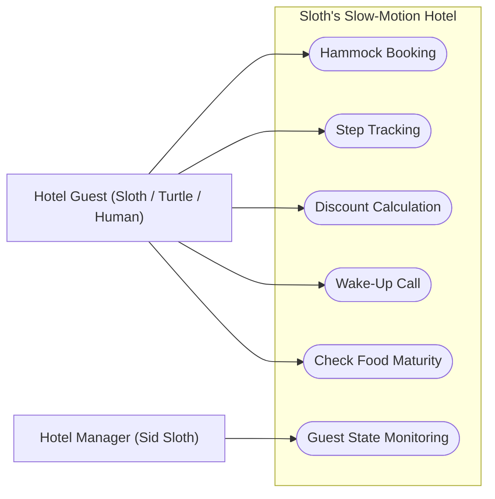
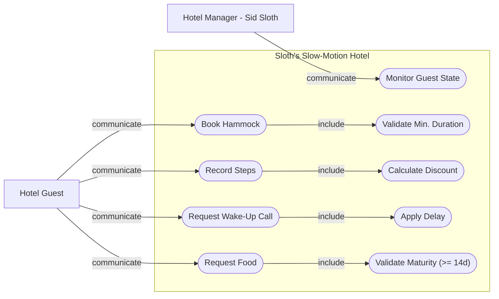
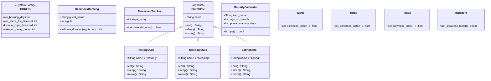
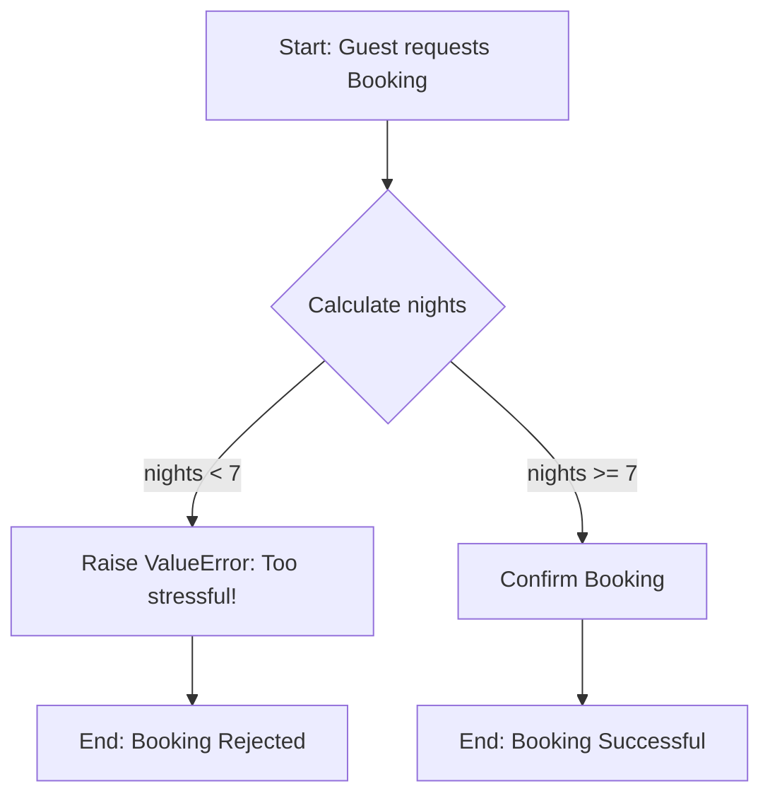
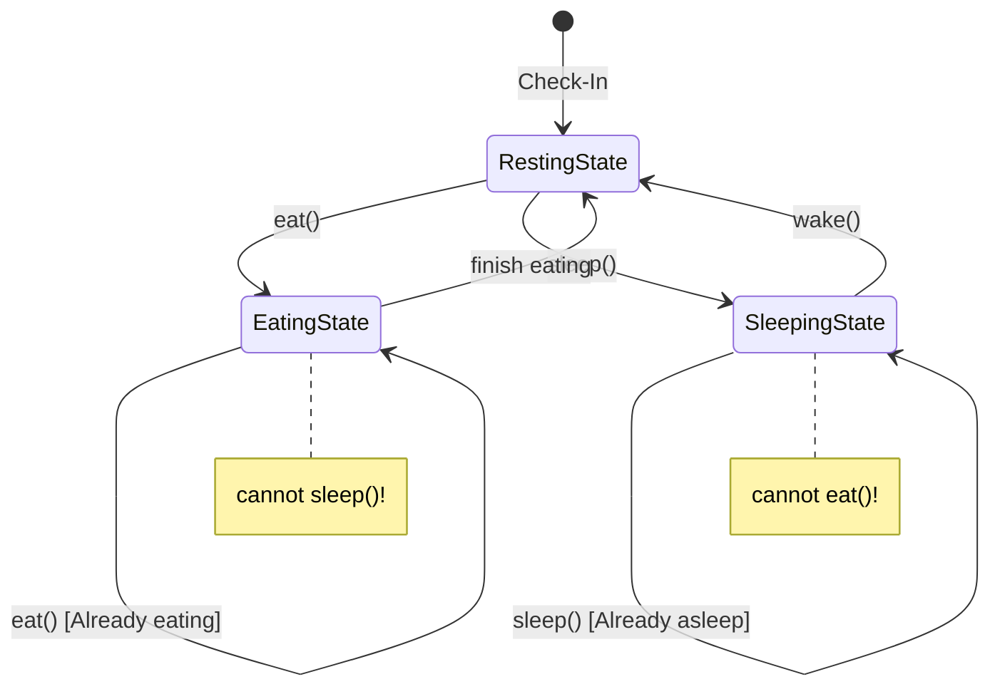
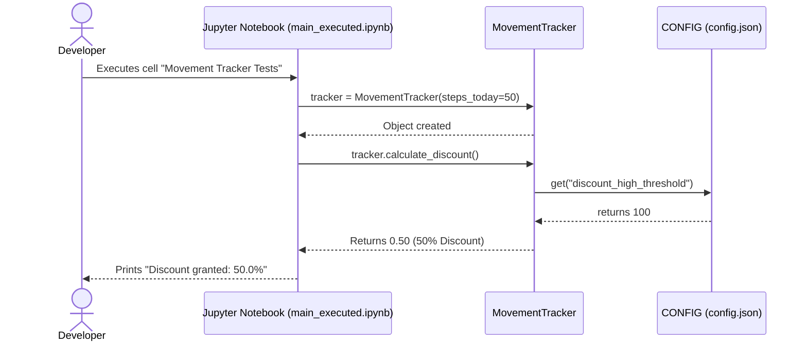

# Projekt Abschlussbericht: Sloth's Slow-Motion Hotel

> DLBDSIPWP01 - Einführung in die Programmierung mit Python

## 1. Einleitung und Vision

### 1.1 Projektvision und Ziele

Die Kernidee von "Sloth's Slow-Motion Hotel" ist die Entwicklung einer Hotelmanagement-Software, die das herkömmliche Paradigma der Effizienz und Geschwindigkeit umkehrt.
In diesem System ist Langsamkeit kein Hindernis, sondern das primäre Qualitätsmerkmal und Betriebsziel.
Die App dient dazu, den gesamten Hotelbetrieb – von der Buchung bis zur Verpflegung – radikal zu entschleunigen und an den natürlichen Rhythmus von Faultieren anzupassen.

Das System löst spezifische Probleme für zwei Hauptgruppen:

* **Für den Hotelmanager:**
  Herkömmliche Software ist nicht für Buchungszeiträume ausgelegt, die erst bei einer Woche beginnen, oder für Prozesse, die bewusste Verzögerungen erfordern. Die App automatisiert die Einhaltung dieser Standards.

* **Für die Hotelgäste:**
  Bei weniger Bewegung dürfen sich die Gäste über exklusive Rabatte freuen.
  Die Software verhindert Stress durch zu schnelle Prozesse. Ein Weckruf, der erst drei Stunden später erfolgt, löst das Problem der "Hektik am Morgen" und respektiert die physiologischen Ruhephasen der Gäste.

### 1.2 Wissenschaftliche Herausforderung / Python-Spezifischer Aspekt

Der technische Fokus dieses Projekts liegt auf der Zusammenarbeit von Structural Design Patterns und dem für Python charakteristischen Duck Typing.
Während andere, bereits in anderen Modulen thematisierte Sprachen Entwurfsmuster oft über strikte Vererbungshierarchien und explizite Interfaces erzwingen, erlaubt Python einen flexibleren, protokollbasierten Ansatz.

* **Relevanz für Python-Entwickler**
  Für Python-Entwickler ist dieses Thema von zentraler Bedeutung, da die missbräuchliche Verwendung von tiefen Vererbungshierarchien oft zu „Boilerplate-Code“ und starrer Software führt.
  Die Nutzung von Duck Typing ermöglicht es, das Verhalten eines Objekts in den Vordergrund zu stellen statt dessen Klasse.
  Dies fördert die Einhaltung des Interface Segregation Principles und des Dependency Inversion Principles, was insbesondere bei der Integration von Drittanbieter-Modulen die Wartbarkeit massiv erhöht.

* **Analogie und Geschichte im Projekt**
  Innerhalb des Projekts wird die Analogie des „Universal-Gastes“ verwendet.

In einem Hotel lang vor unserer Zeit steht Hotelmanager Sid Sloth stehts an der Rezeption. In einem herkömmlichen Hotel müsste jeder Gast einen „offiziellen Ausweis“ (eine Basisklasse `HotelGuest`) vorzeigen,
um eine Hängematte zu bekommen. Im Sloth’s Slow-Motion Hotel ist Sid jedoch viel entspannter: Ihn interessiert nicht, wer der Gast ist oder woher er kommt (die Klasse).
Er prüft lediglich, ob der Gast die Methode `get_slowness_factor()` beherrscht.

Die Geschichte handelt von Sid, der zunehmend mit einer Vielfalt an Gästen konfrontiert wird: Neben Faultieren checken plötzlich auch extrem langsame Schildkröten, meditierende Pandas und völlig überarbeitete IU-Dozenten ein.
Anstatt für jede neue Spezies das System umzubauen, nutzt Sid die Python-spezifische Flexibilität. Solange ein Objekt – egal ob Tier oder Mensch – die „Sprache der Langsamkeit“ spricht und die erwarteten Methoden für
den Bewegungs-Tracker und das State-Management bereitstellt, wird es nahtlos in die Hotelabläufe integriert.
Das Projekt illustriert die technische Umsetzung einer losen Kopplung durch strukturelle Muster, bei der die Funktionalität über die Identität triumphiert.

### 1.3 Arbeitshypothese

In der vorliegenden Arbeit wird untersucht, inwiefern die Implementierung des State Patterns die Codequalität in der Hotelmanagement-Software Sloth's Slow-Motion Hotel beeinflusst.
Dabei wird die Codequalität anhand der Kennzahlen des Analysetools Radon bewertet.
Die Hypothese lautet, dass die Anwendung des State Patterns zu einer signifikanten Verbesserung der Codequalität führen wird, da es zu einer besseren Strukturierung, leichteren Wartbarkeit und Reduzierung von Komplexität beiträgt.
Diese Hypothese soll durch empirische Analysen der Codebasis und deren Radon-Metriken überprüft werden.

## 2. Requirements Engineering

### 2.1 Kontextdiagramm

Das Kontextdiagramm zeigt die zwei Akteure des Systems und ihre Interaktionen mit den Kernfunktionen des Hotels.
Der Hotel Guest ist der zentrale Nutzer des Systems. Er bucht Hängematten über Hammock Booking, erfasst seine täglichen Schritte über Step Tracking, prüft seinen Inaktivitätsrabatt über Discount Calculation und kann einen Weckruf anfordern über Wake-Up Call.
Der Hotel Manager Sid Sloth interagiert ausschließlich lesend mit dem System, indem er den aktuellen Zustand seiner Gäste über Guest State Monitoring überwacht, um sicherzustellen, dass niemand in stressige Aktivität verfällt.



### 2.2 Funktionale Anforderungen

Alle Anforderungen haben IDs, um sie im Code wiederzufinden. Da der Code auf Englisch geschrieben wird, sind auch die IDs englisch. Die Klassifizierung nach Priorität erfolgt durch die MoSCoW-Methode.
**M** - Must | **S** - Should | **C** - Could | **W** - Won't

**Buchungsverwaltung**
Das System kümmert sich um die Langzeit-Buchung von Hängematten passend zum Hotel-Konzept.

* **REQ-FR-01 - M - Min Duration [100%]:** Buchungen müssen eine Mindestdauer von 7 Tagen aufweisen. Anfragen für kürzere Zeiträume werden systemseitig abgelehnt. *(Notiz: Vollständig implementiert via Pydantic Validierung in `models.py`)*

* **REQ-FR-02 - C - Availability [0%]:** Prüfung der Verfügbarkeit von Hängematten für den angefragten Zeitraum. *(Notiz: Bisher nicht umgesetzt, da als Konzept für spätere Datenbankintegration geplant)*

**Inzentivierung & Tracking**
Ein Belohnungssystem motiviert die Gäste durch Rabatte, wenn sie sich wenig bewegen.

* **REQ-FR-03 - M - Step Input [100%]:** Erfassungsschnittstelle für tägliche Schrittdaten der Gäste. *(Notiz: Gesichert über das `steps_today` Feld im `MovementTracker`)*

* **REQ-FR-04 - M - Inverse Discount [100%]:** Berechnung eines dynamischen Rabatts basierend auf der Inaktivität. *(Notiz: Logik in `calculate_discount()` mit Duck-Typing kombiniert)*

  * *Logik:* Geringere Schrittzahl führt zu höherem Rabatt. Hektische Aktivität reduziert den Nachlass auf Null.

**Verpflegungslogistik**
Essen wird erst freigegeben, wenn die Zeit reif ist.

* **REQ-FR-05 - M - Maturity Calc [100%]:** Algorithmus zur Berechnung der Blattreife. Nahrungsmittel dürfen erst nach Erreichen des optimalen Reifegrads ausgegeben werden. *(Notiz: Vollständig abgedeckt durch `MaturityCalculator` und `config.json`)*

**Zeitmanagement**

* **REQ-FR-06 - M - Delayed Alarm [100%]:** Der Wecker löst mit einer Verzögerung von 3h aus. *(Notiz: Die "Sloth-Tax" ist modular über die Config steuerbar)*

**Zustandsmodellierung**

* **REQ-FR-07 - M - Guest States [100%]:** Jeder Gast befindet sich zu jedem Zeitpunkt in einem exklusiven Zustand (`Sleeping`, `Resting`, `Eating`). *(Notiz: Über das polymorphe State Pattern robust gekapselt)*

* **REQ-FR-08 - M - State Transition [100%]:** Validierung von Zustandswechseln. Ungültige Transitionen werden durch die Architektur unterbunden. *(Notiz: Unzulässige Methodenaufrufe erzeugen verlässliche Warnungen)*

### 2.3 Nicht-funktionale Anforderungen (Qualitätsanforderungen)

Allgemeine technische Vorgaben für das Projekt.

* **REQ-NFR-01 - M - Language [100%]:** Codebasis, Kommentare und interne Dokumentation sind in **Englisch** zu halten. *(Notiz: Strikt umgesetzt, nur Endnutzer-Dokus/Notebooks in Deutsch)*

* **REQ-NFR-02 - S - Documentation [100%]:** Durchgängige Dokumentation mittels Python-Docstrings und zentraler README. *(Notiz: Relevante Klassen und Methoden im Codebus sind professionell dokumentiert)*

* **REQ-NFR-03 - S - Testing [100%]:** Testabdeckung durch Unit-Tests sowie mind. 3 Integrationstests. *(Notiz: Mit `pytest` wurden insgesamt 14 belastbare Tests aufgebaut)*

* **REQ-NFR-04 - C - CI/CD [100%]:** Definition eines reproduzierbaren Build- und Testprozesses (z.B. via Skript oder Pipeline-Config). *(Notiz: GitHub Actions Workflow `./g09_ci.yml` fuehrt Formatting, Linting, Type-Check und Tests automatisiert aus)*

* **REQ-NFR-05 - M - Architecture [100%]:** Konsequente Anwendung objektorientierter Prinzipien (OOP) und Separation of Concerns. *(Notiz: Demonstriert durch Trennung von Models, States und Config)*

### 2.4 Use-Case Modellierung

Das Use-Case-Diagramm zeigt die vollständige Interaktionsstruktur des Systems und unterscheidet dabei zwei Arten von Beziehungen.
Die "communicate"-Beziehungen beschreiben, welcher Akteur welche Funktion des Systems direkt anstoßen kann.
Der Hotel Guest initiiert drei zentrale Aktionen: das Buchen einer Hängematte, das Erfassen seiner Schritte sowie das Anfordern eines Weckrufs.
Der Hotel Manager Sid Sloth greift ausschließlich auf die Zustandsüberwachung seiner Gäste zu.
Die "include"-Beziehungen stellen technische Abhängigkeiten dar, die automatisch und ohne Ausnahme ausgelöst werden.
Eine Hammock-Buchung schließt zwingend die Validierung der Mindestbuchungsdauer ein.
Die Schritterfassung triggert unmittelbar die Rabattberechnung.
Ein angeforderter Weckruf beinhaltet systemseitig immer die vorgeschriebene Verzögerung.



## 3. Architektur und Tech-Stack

### 3.1 Auswahl der Plattform

**Jupyter Notebook**
Für die finale Einreichung und die wissenschaftliche Dokumentation nutzen wir Jupyter Notebooks.

**Begründung gegen Alternativen**

* **Klassische Desktop-GUI:** Diese wurden ausgeschlossen, da sie eine hohe Menge an „Boilerplate-Code“ für das Event-Handling und Layout-Management erfordern
Dies hätte den Fokus von der eigentlichen Aufgabe - der Implementierung von Design Patterns - abgelenkt und die Code-Struktur unnötig aufgebläht.

* **CLI:** Ein CLI ist zwar architektonisch sauber, bietet jedoch nicht die notwendigen Möglichkeiten zur anschaulichen Visualisierung der Gast-Zustände und der wissenschaftlichen Ergebnisse.

### 3.2 Modularer Kern und Open-Closed Principle

Die Kernarchitektur der Anwendung folgt streng dem Prinzip der Inversion of Control sowie den SOLID-Prinzipien. Die Domänenlogik (Buchung, Rabattierung) ist vollständig entkoppelt von der Präsentationsschicht.
* **Modelle (`models.py`):** Beinhaltet reine Datenstrukturen (`HammockBooking`, `MovementTracker`).
* **Verhalten (`states.py`,`states_anti_pattern.py`):** Kapselt das State Pattern (`SlothState`), welches offene Erweiterungen ohne Änderungen am bestehenden Code zulässt (Open-Closed Principle).
  Neue Faultier-Verhaltensweisen können durch Hinzufügen einer neuen State-Klasse integriert werden.
* **Applikationsgrenze:** Das Jupyter Notebook importiert lediglich die Modelle und führt die Methoden aus, ohne die zugrundeliegenden Regeln (abgesehen von der `config.json`) zu kennen.

### 3.3 Technologie-Stack

Der Technologie-Stack wurde minimalistisch und auf reinen Mehrwert ausgerichtet gewählt:

* **Python 3.10+:** Basis-Entwicklungsumgebung. Nutzt Type Hinting für verbesserte Entwickler-Erfahrung.
* **Pydantic:** Übernimmt die Datenserialisierung und -validierung. Garantiert, dass fehlerhafte Inputs (z.B. < 7 Nächte) niemals ins tiefe System dringen.
* **Radon:** Tool zur statischen Codeanalyse (Cyclomatic Complexity), um die wissenschaftliche Hypothese der Komplexitätsreduktion messbar zu machen.
* **Jupyter Notebook:** Plattform zur Ausführung wissenschaftlicher Code-Zellen, um Theorie und ausführbaren Code zu vereinen.
* **Pytest:** Framework für automatisierte Unit- und Integrationstests.
* (**Streamlit:** Framework für simple Weboberflächen, wurde für die Modellierung des Prototyps verwendet.)

## 4. Design und Modellierung (Die "Story")

### 4.1 Domänenmodell und UML-Klassendiagramm

Das Domänenmodell zeigt die Kernkomponenten des Systems. Durch die Nutzung von **Pydantic Models** (`HammockBooking`, `MovementTracker`) und dem **State Pattern** (`SlothState`) wird die Geschäftslogik sauber gekapselt und validiert.



### 4.2 Verhaltensdiagramme: Activity- & State-Diagram

Das Activity-Diagramm zeigt den Ablauf einer Buchungsprüfung (Hammock Booking). Das State-Diagramm verdeutlicht die Lebenszyklen des Faultier-Gastes.

**Activity Diagram: Hammock Booking**


**State Diagram: Guest states**


### 4.3 Interaktionsdiagramm: Sequence-Diagram

Das Sequenzdiagramm illustriert die Interaktion zwischen dem ausführbaren Jupyter Notebook (`main_executed.ipynb`), der Logik (`MovementTracker`) und der Konfiguration, wenn die Testzelle für die Rabatt-Berechnung ausgeführt wird.



### 4.4 Design Patterns und Prinzipien

Welche Muster (z. B. Factory, Strategy, MVC) wurden implementiert? Begründen Sie den Einsatz von SOLID, DRY und KISS, ... Verwenden Sie UML-Diagramme, um die Umsetzung zu verdeutlichen.

## 5. Wissenschaftliche Problemstellung (im Jupyter Notebook)

### 5.1 Methodik der Untersuchung

Die Arbeitshypothese lautet: *"Wie verändert sich die Codequalität gemessen am Tool Radon bei der Verwendung von State Pattern in der Architektur im Vergleich zu einem traditionellen Kontrollfluss?"*

Um diese Frage zu beantworten, wurde ein A/B-Szenario aufgebaut:
1. **Design Pattern (states.py):** Das implementierte `State Pattern`, bei dem das Verhalten dezentral in eigene Klassen (`RestingState`, `EatingState`, `SleepingState`) ausgelagert ist.
2. **Anti-Pattern (states_anti_pattern.py):** Ein Kontrollskript, welches denselben fachlichen Ablauf über eine einzelne Variable (`self.state`) und tief verschachtelte `if/elif/else`-Blöcke pro Methode abhandelt.

Das Python-Metriken-Tool `radon cc` wird genutzt, um die **zyklomatische Komplexität (Cyclomatic Complexity, CC)** für beide Ansätze auszurechnen. Die Auswertung erfolgt direkt im ausführbaren Jupyter Notebook (`main_executed.ipynb`).

| CC score | Rank | Risk |
|----------|------|------|
| 1 - 5 | A | low - simple block |
| 6 - 10 | B | low - well structured and stable block |
| 11 - 20 | C | moderate - slightly complex block |
| 21 - 30 | D | more than moderate - more complex block |
| 31 - 40 | E | high - complex block, alarming |
| 41+ | F | very high - error-prone, unstable block |

### 5.2 Analyse und Demonstration

Die Ausführung von Radon im Jupyter Notebook bestätigt die Hypothese signifikant.

**Ergebnis Anti-Pattern (`states_anti_pattern.py`):**
Jede Methode (`eat`, `sleep`, `move`) muss den Status evaluieren, weshalb jede Methode eine **Komplexität (CC) von 4** (Bewertung: A, aber am oberen Rand) aufweist. Sobald weitere Zustände oder Faultier-Aktivitäten hinzukommen, steigt dieser Wert unweigerlich proportional durch weitere `elif`-Branches an, was die Wartbarkeit langfristig zerstört.

**Ergebnis State Pattern (`states.py`):**
Das Auslagern in dedizierte State-Klassen reduziert die Komplexität jeder einzelnen Funktion (`eat`, `sleep`, `move`) auf **1 (A-Grade)**, da keine logischen Verzweigungen (`if/else`) mehr nötig sind. Jede Klasse ist hochgradig kohäsiv und nur für ihr spezifisches Verhalten verantwortlich.

**Fazit:** Der Einsatz des State Patterns führt laut Radon nachweislich zu einer flachen, leichtgewichtigen Kontrollstruktur auf Methoden-Ebene, die das Open-Closed Principle unterstützt und überflüssigen Code im Gegensatz zur Antipattern-Klasse verhindert.

## 6. Implementierung und Qualitätssicherung

### 6.1 Code-Struktur und Dokumentation

Hinweise zur englischsprachigen Programmierung, Docstrings und der modularen Aufteilung.

### 6.2 Test-Konzept: Unit-Tests

Für die automatisierte Qualitätssicherung nutzen wir `pytest`. Das Test-Skript (`test_sloth.py`) enthält isolierte Unit-Tests für alle kritischen Komponenten:
* `test_hammock_booking_valid` & `invalid`: Prüft die Pydantic ValidationBoundary (Minimum 7 Nächte).
* `test_movement_tracker_*`: Deckt die drei Rabattstufen (Gold, Silver, None) basierend auf der Schrittzahl und dem jeweiligen `slowness_factor` des Gastes ab (Duck Typing).
* `test_resting_state_transitions`: Sichert ab, dass das Verhalten im Ruhezustand (`eat`, `sleep`) korrekt getriggert wird.
* `test_maturity_calculator_*`: Validiert die Reifegrad-Berechnung für Eukalyptus-Blätter (`REQ-FR-05`).

### 6.3 Integration-Tests und Traceability

Zusätzlich wurden 3 Integrationstests geschrieben, die das Zusammenspiel mehrerer Komponenten im System abbilden und direkt referenziert sind:

1. **`test_integration_full_guest_lifecycle`**: Simuliert einen echten Faultier-Tag.
   * Der Gast bucht erfolgreich (`REQ-FR-01`).
   * Er macht sehr wenige Schritte und sichert sich entspannt seinen 50% Rabatt (`REQ-FR-03`, `REQ-FR-04`).
   * Er schläft ein und das System blockiert zuverlässig den Versuch, im Schlaf zu essen (`REQ-FR-07`, `REQ-FR-08`).

2. **`test_integration_active_guest_rejection`**: Simuliert einen ungeeigneten, hektischen Gast (z.B. einen Igel).
   * Die Buchung über 3 Tage schlägt direkt durch Pydantic fehl (`REQ-FR-01`).
   * Der Versuch, mit 10.000 Schritten einen Rabatt zu ergattern, resultiert in 0% (`REQ-FR-04`).

3. **`test_integration_state_machine_flow`**: Testet den Ablauf der Zustände hintereinander.
   * Ablauf: `RestingState` $\rightarrow$ `EatingState` $\rightarrow$ `SleepingState` $\rightarrow$ System weist Essen ab (`REQ-FR-08`).

### 6.4 CI-Pipeline

Beschreiben Sie die (mögliche) Automatisierung (GitHub Actions, Befehlsreihenfolge, Prüfung der `requirements.txt`, project.toml).

## 7. Software-Qualität nach [ISO 25010](https://iso25000.com/index.php/en/iso-25000-standards/iso-25010)

Die Qualitätsmerkmale wurden fokussiert nach der ISO 25010 Norm bewertet:

1. **Wartbarkeit:** *Exzellent*
   Wie durch den Radon-Test bewiesen, drückt das State-Pattern die zyklomatische Komplexität der Methoden auf den niedrigstmöglichen Wert (1). Neue Gast-Aktivitäten lassen sich gefahrlos anbauen, ohne unnötig viele Codezeilen iterieren zu müssen.
2. **Zuverlässigkeit:** *Hoch*
   Die Nutzung von `pydantic` sorgt für eine strikte Input-Validierung direkt an den Rändern des Systems. Eine fehlerhafte Buchung oder invalide Eingaben führen zu deterministischen, sofort abfangbaren `ValueErrors`. Abgesichert ist dies durch umfassende Pytest-Tests.
3. **Übertragbarkeit:** *Sehr Hoch*
   Alle Konfigurationen wie das Minimum an Buchungstagen oder Schwellenwerte für den Faultier-Rabatt sind asynchron vom Code in der `data/config.json` gekapselt. Das Hotel kann Regeln on-the-fly anpassen, ohne den Code anfassen zu müssen.

**Maßnahmen zur Verbesserung:**
Zu Beginn war die Software gerade im Blick auf den Prototypen noch stark an ein UI-Framework, in dem Falle Streamlit, gekoppelt. Während dies fürs Prototyping sinnvolle Vorteile mit sich führte, haben wir durch Refactoring die Geschäftslogik hart in `models.py` und `states.py` separiert, um Wiederverwendbarkeit zu gewährleisten.

**Examples:**

* <https://dl.acm.org/doi/10.1145/3411764.3445651>

* <https://dl.acm.org/doi/10.1145/2992154.2992174>

## 8. Projektabschluss und Reflexion

### 8.1 Methodik und Anpassungen

Das Projekt startete testgetrieben über ein UI-Prototyping Framework (Streamlit). Der Paradigmenwechsel vom herkömmlichen OOP hin zum flexiblen Duck Typing erforderte anfangs mehr abstraktes Denken. Um wissenschaftlichen Standards und der formellen Prüfung der Codekomplexität (durch `radon`) gerecht zu werden, wurde im Endstadium auf ein Jupyter-Notebook migriert, um Theorie und nachweisbaren Code logisch zu verzahnen.

### 8.2 Selbstreflexion

Die Entwicklung des "Sloth’s Slow-Motion Hotels" war ein sinnvolles Learning mit Fokus auf die behandelten Themen. Oftmals baut man Softwaresysteme, in denen Performance etc. optimiert werden, um an moderne Standards anzuknüpfen. Hier bewusst Ineffizienz und Pausenarchitekturen (wie den `wake_up_delay` oder das `State Pattern` für gebundene Zustände) zu designen, stellt die bisher bekannte Architektur auf den Kopf und führt bewusst dazu, das sonst als Standards umgesetzte Aufgaben neu durchdacht werden. Die Metriken durch das Tool Radon bestätigten eindrucksvoll unsere Hypothese: Die anfängliche Abstraktion (State Pattern anlegen) ist minimal teurer als ein schnelles `if/else`, rechnet sich jedoch sofort bei der Wartbarkeit und der geringen Codekomplexität.

**Einsatz von KI (gem. IU Richtlinie zur Nutzung von KI im Studium)**

Im Rahmen dieses Projekts wurde KI-gestützte Unterstützung gezielt und verantwortungsvoll eingesetzt. Die Nutzung erfolgte dabei stets im Einklang mit der IU-Richtlinie zur Nutzung KI-gestützter Systeme im Studium. Im Folgenden wird dokumentiert, wo und wie KI zum Einsatz kam und welcher Lernfortschritt daraus resultierte.

**Eingesetzte Tools:**

| Tool | Einsatzbereich |
|---|---|
| GitHub Copilot / KI-Coding-Assistent | Code-Generierung, Refactoring, Docstrings, Type Hints |
| KI-Chatbot | Brainstorming zur Analogie, Strukturierung des Reports, Formulierungshilfe |


**Lernfortschritt und Reflexion:**

Der Einsatz von KI hat den Entwicklungsprozess beschleunigt, insbesondere bei repetitiven Aufgaben wie Docstring-Erstellung und Code-Formatierung. Auch beim Prototyping können entstandene Ideen einfach visualisiert werden, um eine finale Architektur zu designen und die Anforderungen zu durchdenken und visualisieren. Gleichzeitig erforderte jede KI-Ausgabe eine kritische Prüfung, da wir feststellten, dass eine Umsetzung unserer genauen Vorstellungen mithilfe von KI nicht erfolgte. Der größte persönliche Lerneffekt lag im bewussten Umgang mit Design Patterns und Duck Typing, da die KI zwar Implementierungsvorschläge lieferte, das tiefere Verständnis der Architekturentscheidungen jedoch nur durch eigenständige Reflexion entstand. Die Verantwortung für Korrektheit, Qualität und wissenschaftliche Integrität lag zu jedem Zeitpunkt vollständig beim Studierenden.

### 8.3 Nutzungsanweisung

**Voraussetzungen:** Python >= 3.10, `pip`

**1. Abhängigkeiten installieren:**

```bash
cd src/student_projects/g09
pip install -r requirements.txt
```

**2. Tests ausführen:**

```bash
# Vom g09-Projektverzeichnis aus:
set PYTHONPATH=src        # Windows (CMD)
$env:PYTHONPATH="src"     # Windows (PowerShell)
export PYTHONPATH=src     # Linux / macOS

pytest tests/ -v
```

**3. Code-Qualität prüfen:**

```bash
ruff format --check .     # Formatierung prüfen
ruff check .              # Linting
mypy src/ --ignore-missing-imports   # Statische Typprüfung
```

**4. Streamlit-App starten:**

```bash
cd src
streamlit run app.py
```

Die App öffnet sich im Browser und bietet vier Bereiche:

| Seite | Funktion |
|---|---|
| **Dashboard & State** | Zeigt den aktuellen Gastzustand (Resting / Sleeping / Eating) und erlaubt Zustandswechsel per Knopfdruck. Ungültige Transitionen werden blockiert. |
| **Hammock Booking** | Buchungsformular mit Mindestdauer-Validierung (REQ-FR-01). Buchungen unter 7 Nächten werden abgelehnt. |
| **Movement Tracker** | Slider für die tägliche Schrittzahl. Berechnet den dynamischen Faultier-Rabatt in Echtzeit (REQ-FR-04). |
| **Wake-Up Service** | Wecker mit automatischer Sloth-Verzögerung von 3 Stunden (REQ-FR-06). |

**5. CLI-Schnelltest (ohne Streamlit):**

```bash
cd src
python main.py
```

Führt eine kompakte Konsolenausgabe der wichtigsten Features (Booking + Discount) durch.

**6. Jupyter Notebook (wissenschaftliche Analyse):**

```bash
cd src
jupyter notebook Jupiter_NB_Python_G09.ipynb
```

Das Notebook `Jupiter_NB_Python_G09.ipynb` ist das zentrale Dokument für die wissenschaftliche Auswertung des Projekts. Es verbindet lauffähigen Code mit erklärendem Text und beinhaltet:

* **Demonstration aller Features:** Buchung, Rabattberechnung, Zustandsmodellierung, Blattreife und Duck Typing werden Schritt für Schritt vorgeführt.
* **Komplexitätsanalyse mit Radon:** Vergleich der zyklomatischen Komplexität zwischen dem State Pattern und dem Anti-Pattern (`if/else`-Kette), um die Forschungshypothese zur Wartbarkeit zu belegen.
* **Reproduzierbarkeit:** Alle Zellen können sequenziell ausgeführt werden (`Kernel → Restart & Run All`), um die Ergebnisse vollständig zu reproduzieren.
